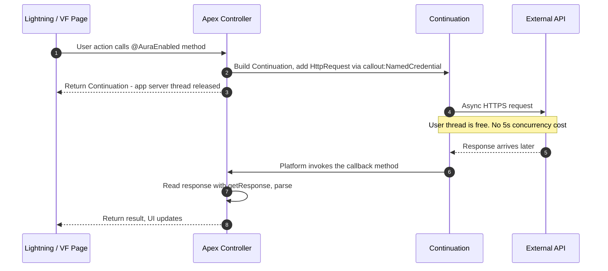

# 06 - Continuation Pattern

> **One-liner**: Fire a **long-running callout from a Lightning or Visualforce screen** without holding an app server thread, then process the answer in a **callback**.
> **Direction**: Salesforce → External (outbound). **Timing**: Asynchronous from the UI, but the user still gets a result on the same page.
> **Use when**: A Lightning page (Aura/LWC) or Visualforce page calls a **slow** external API and you do not want to freeze a server thread.

This is Module 05, outbound callouts. For the plain callout, see [01-http-callouts.md](01-http-callouts.md). For background callouts not tied to a screen, see [05-asynchronous-callouts.md](05-asynchronous-callouts.md). Auth is [Module 03](../03-Authentication/14-named-credentials-and-external-credentials.md).

---

## 1. The idea in plain English

Imagine a receptionist who can only handle a fixed number of calls at once. If one caller is put on hold for two minutes waiting on a slow supplier, that receptionist is **stuck** and cannot help anyone else. A few of those and the whole front desk jams.

A **Continuation** is the receptionist saying: "Let me take your request, **hang up the internal line**, and the supplier will ring us back when they are done. Then I will pick the answer up and finish your request." The slow wait happens **off** the Salesforce app server thread.

Technically: a synchronous callout from the UI holds a Salesforce **application server thread** for its whole duration. Salesforce limits how many requests can run longer than **5 seconds** at once (the **concurrent long-running request limit**). A Continuation lets the action return the thread to the pool while the external system works, so a slow API does not eat your concurrency budget. When the response arrives, a **callback method** runs to process it and update the UI.

---

## 2. When to use it (and when not)

| ✅ Use it when | ❌ Avoid / use something else |
|---|---|
| A **Lightning** or **Visualforce** page calls a **slow** external API. | The call is **fast** - just use a normal callout [01-http-callouts.md](01-http-callouts.md). |
| You want to **protect the concurrent long-running request limit**. | The work is not tied to a screen → [05-asynchronous-callouts.md](05-asynchronous-callouts.md). |
| The user is **waiting on the page** for the result. | You need to call out **after DML** in a backend flow → async. |
| You can live with **max 3** parallel callouts per Continuation. | You need many parallel callouts or a huge response. |

**Real-world examples**: a Lightning component pulling a slow shipping-rate quote, a Visualforce page calling a sluggish legacy pricing service, an agent console widget fetching an external account 360 view that takes several seconds.

---

## 3. How it works (sequence diagram)



**Walkthrough**

1. The user triggers an `@AuraEnabled` (or VF action) method.
2. The controller creates a `Continuation`, sets the **callback method name**, and adds one to three `HttpRequest` objects whose endpoint is `callout:NamedCredential/...`.
3. The method **returns the Continuation object**. Salesforce releases the app server thread back to the pool.
4-5. The platform sends the request asynchronously. The user's thread is not blocked, so it does not count against the concurrent long-running limit.
6-7. When the response returns, Salesforce calls the **callback** you named.
8. The callback reads the response via `Continuation.getResponse(requestLabel)`, parses it, and returns the result to the UI.

---

## 4. The actual code

**Aura/LWC controller with a Continuation and callback**

```apex
public with sharing class RateController {

    // 1) Action method: returns an Object (the Continuation)
    @AuraEnabled(continuation=true, cacheable=false)
    public static Object startRequest() {
        Continuation con = new Continuation(120); // timeout in seconds, max 120
        con.continuationMethod = 'processResponse'; // name of the callback

        HttpRequest req = new HttpRequest();
        req.setEndpoint('callout:Shipping_API/rates'); // URL + auth from Named Credential
        req.setMethod('GET');

        // addHttpRequest returns a label you use to fetch the matching response
        con.addHttpRequest(req);
        return con; // app server thread is released here
    }

    // 2) Callback: runs when the external response arrives
    @AuraEnabled(cacheable=false)
    public static Object processResponse(List<String> labels, Object state) {
        HttpResponse res = Continuation.getResponse(labels[0]);
        if (res.getStatusCode() == 200) {
            return res.getBody(); // hand the result back to the UI
        }
        return null; // handle non-200 in the UI
    }
}
```

**Adding multiple parallel callouts (up to 3)**

```apex
Continuation con = new Continuation(120);
con.continuationMethod = 'processResponses';
con.addHttpRequest(reqA);
con.addHttpRequest(reqB);
con.addHttpRequest(reqC); // a 4th would exceed the per-Continuation limit
```

> **Auth**: Continuations support **Named Credentials**. If the endpoint is a `callout:` named credential, you do not need a Remote Site Setting. See [Module 03](../03-Authentication/14-named-credentials-and-external-credentials.md).

---

## 5. Design considerations and gotchas

| Consideration | Why it matters | What to do |
|---|---|---|
| **Max 3 parallel callouts** | A single Continuation can hold at most **3** requests. | Batch what you need, or chain Continuations. |
| **120 s per callout** | Each callout in the Continuation can run up to **120 seconds**. | Set the Continuation timeout sensibly. Parallel calls finish in the time of the slowest. |
| **Chaining limit** | You can chain up to **3** Continuations in one request, giving up to ~360 s total. | Use chaining only if one round trip is not enough. |
| **Response size cap** | The Continuation response is capped, commonly documented at **1 MB**. | Keep responses small. Page or filter on the external side. |
| **Supported contexts only** | Works from **Aura, LWC, and Visualforce**, not from generic backend Apex. | For non-UI background callouts use [async](05-asynchronous-callouts.md). |
| **Callback is a separate execution** | State is passed via the Continuation `state`, not instance variables. | Stash anything the callback needs in `con.state`. |
| **Testing** | Use `Test.setContinuationResponse` plus `Test.invokeContinuationMethod`. | Mock the response, then assert the callback output. |

---

## 6. Interview Q&A

**Q: What problem does a Continuation solve?**
A: A synchronous callout from the UI holds a Salesforce application server thread for its whole duration, and there is a limit on how many requests can run longer than 5 seconds at once. A Continuation releases the thread while the external system works and resumes in a callback when the response arrives, so a slow API does not consume your concurrency budget or freeze the page.

**Q: How many callouts can one Continuation make, and for how long?**
A: Up to **3 parallel callouts** per Continuation, each up to **120 seconds**. Because they run in parallel, total time is the slowest call. You can chain up to **3** Continuations for longer multi-step work.

**Q: Where can you use Continuations?**
A: From supported UI contexts only - **Aura components, Lightning Web Components, and Visualforce**. They are not for generic backend Apex; for that you use `@future`, Queueable, or Batch.

**Q: Do Continuations support Named Credentials?**
A: Yes. If the request endpoint is a `callout:` Named Credential, the URL and auth are injected and you do not need a Remote Site Setting.

**Q: How is the response handled?**
A: Not inline. You name a callback method on the Continuation. When the response returns, the platform invokes that callback, which reads the response with `Continuation.getResponse(label)` and returns the result to the UI.

**Talking point to explain it to anyone**: "The receptionist takes your request, hangs up the internal line so they can help others, and the slow supplier rings back when ready. Salesforce frees the thread during the wait, then picks up the answer to finish your page."

---

## 7. Key terms

Continuation, callback, concurrent long-running request limit, app server thread, parallel callouts, Named Credential - defined in [Module 01 vocabulary](../01-Fundamentals/02-core-vocabulary.md) and the [README](README.md).

---

## Sources (Verified June 2026)

- [Make Long-Running Callouts with Continuations - Apex Developer Guide (v66.0)](https://developer.salesforce.com/docs/atlas.en-us.apexcode.meta/apexcode/apex_continuation_overview.htm)
- [Asynchronous Callout Limits - Apex Developer Guide](https://developer.salesforce.com/docs/atlas.en-us.apexcode.meta/apexcode/apex_continuation_limits.htm)
- [Making Multiple Asynchronous Callouts - Apex Developer Guide](https://developer.salesforce.com/docs/atlas.en-us.apexcode.meta/apexcode/apex_continuation_multiple_callouts.htm)
- [Continuations - Lightning Web Components Developer Guide](https://developer.salesforce.com/docs/platform/lwc/guide/apex-continuations.html)

---

*Next: [07-callout-limits-and-testing.md](07-callout-limits-and-testing.md) - the full limits reference and how to test callouts.*
