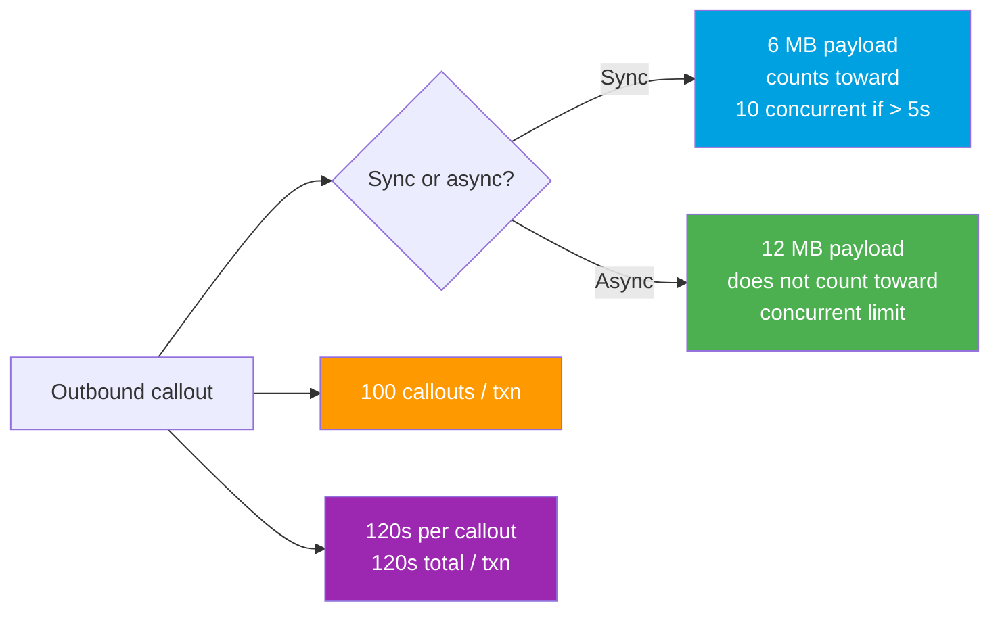

# 07 - Callout Limits and Testing

> **One-liner**: The **limits** that govern every outbound callout, and how to **test** callouts when real network calls are not allowed.
> **Direction**: Salesforce → External (outbound). **Scope**: Reference + reliability + testing.
> **Use when**: You are designing for scale, debugging a limit error, or writing test coverage for callout code.

This is the final outbound file in Module 05. It ties together [01-http-callouts.md](01-http-callouts.md), [05-asynchronous-callouts.md](05-asynchronous-callouts.md), and [06-continuation-pattern.md](06-continuation-pattern.md). Auth lives in [Module 03](../03-Authentication/14-named-credentials-and-external-credentials.md).

---

## 1. The idea in plain English

Every callout runs inside a **speed limit and a weight limit**. Salesforce caps **how many** calls you make, **how big** the payload is, **how long** each call may take, and **how many slow calls** the whole org runs at once. Cross a line and you get a runtime exception, not a slow response.

And there is a second rule that trips everyone: **you cannot make a real network call inside an Apex test.** Tests must run fast and deterministically with no external dependency, so the platform forces you to supply a **fake response** with a mock. Knowing both - the limits and the mocks - is what separates an integration that survives production from one that fails on the first busy Monday.

---

## 2. The limits (the table to memorize)

| Limit | Value | Notes |
|---|---|---|
| **Callouts per transaction** | **100** | Across all callouts (HTTP and web service) in one Apex transaction. Bulkify, do not loop. |
| **Max request or response size (sync)** | **6 MB** | Synchronous transaction heap context. |
| **Max request or response size (async)** | **12 MB** | Higher ceiling in async (Queueable, Batch, `@future`). |
| **Timeout per callout** | **120 s** | Default is **10 s**. Set with `req.setTimeout(ms)`, max `120000`. |
| **Total callout time per transaction** | **120 s** | Sum of all callout time in the transaction. |
| **Concurrent long-running requests** | **10** | Synchronous requests running **> 5 s** count; org-wide. Newer orgs scale higher by license, minimum 10. |
| **No callout after uncommitted DML** | rule | A pending DML in the same transaction blocks the callout. |
| **Continuation parallel callouts** | **3** | Per Continuation, each up to 120 s. Up to 3 Continuations chained. See [06](06-continuation-pattern.md). |



**The no-callout-after-DML rule.** Once your transaction issues DML and has not committed, a callout throws `You have uncommitted work pending`. Fix it by calling out **before** any DML, or by moving the callout to [async](05-asynchronous-callouts.md) so it runs in its own transaction. This is the single most common callout error in interviews and in real code.

**The concurrent long-running request limit.** Any **synchronous** request that runs longer than **5 seconds** counts against an org-wide pool of (historically) **10**. Batch Apex, `@future`, scheduled jobs, and Bulk API do **not** count. This is exactly why slow UI callouts should use a [Continuation](06-continuation-pattern.md), which releases the thread.

---

## 3. Testing callouts (mocks are mandatory)

Real callouts are **blocked in tests**. A test that calls a live endpoint fails with "Methods defined as TestMethod do not support Web service callouts." You must inject a fake response.

| Tool | For | What it does |
|---|---|---|
| **`HttpCalloutMock`** | HTTP/REST callouts | Interface you implement to return a fake `HttpResponse`. |
| **`WebServiceMock`** | SOAP callouts | Interface for mocking generated WSDL stub responses. |
| **`StaticResourceCalloutMock`** | HTTP from a file | Built-in class that returns a static resource as the response body. |
| **`Test.setMock`** | wiring | Registers your mock so the platform uses it during the test. |
| **`Test.startTest()` / `Test.stopTest()`** | async | Forces queued async work (Queueable, `@future`, Batch) to run, so async callouts execute. |

**HttpCalloutMock example**

```apex
@isTest
private class OrderSyncTest {

    // 1) The mock returns a canned response
    private class MockResponse implements HttpCalloutMock {
        public HttpResponse respond(HttpRequest req) {
            HttpResponse res = new HttpResponse();
            res.setHeader('Content-Type', 'application/json');
            res.setBody('{"status":"ok","id":"A-100"}');
            res.setStatusCode(200);
            return res;
        }
    }

    @isTest
    static void testQueueableCallout() {
        Test.setMock(HttpCalloutMock.class, new MockResponse()); // register mock

        Test.startTest();
        System.enqueueJob(new OrderSyncQueueable(/* test orders */ null));
        Test.stopTest(); // async callout runs here, using the mock

        // assert the side effects (records flagged, fields set, etc.)
    }
}
```

For SOAP, implement `WebServiceMock` and register it the same way with `Test.setMock(WebServiceMock.class, ...)`. For Continuations, use `Test.setContinuationResponse` and `Test.invokeContinuationMethod` instead.

---

## 4. Reliability: error handling, retries, idempotency, logging

A callout can return a bad status, time out, or hit a down service. Production code plans for all of it.

| Concern | What can go wrong | What to do |
|---|---|---|
| **4xx errors** | Bad request, auth failure, not found. | Do **not** blindly retry. Log, surface, fix the request. 401 may mean rotate/refresh the credential. |
| **5xx errors** | The external service failed. | Retry with **backoff**, capped attempts. These are often transient. |
| **Timeouts** | Service too slow or hung. | Catch `CalloutException`. Retry async or fail gracefully. Consider a shorter `setTimeout`. |
| **Retries** | A naive retry storm worsens an outage. | Limit attempts, add exponential backoff, ideally route through a calling-out Queueable. |
| **Idempotency** | A retry double-creates or double-charges. | Send an **idempotency key** or check-before-create so repeats are safe. |
| **Logging** | Silent failures are invisible. | Persist request/response metadata to a custom object or platform event. Never log secrets. |

```apex
try {
    HttpResponse res = new Http().send(req);
    Integer code = res.getStatusCode();
    if (code == 200) {
        // success
    } else if (code >= 500) {
        // transient: enqueue a bounded retry
    } else {
        // 4xx: log and stop, do not retry blindly
    }
} catch (System.CalloutException e) {
    // timeout or connection failure: log and retry async or fail gracefully
}
```

---

## 5. Design considerations and gotchas

| Consideration | Why it matters | What to do |
|---|---|---|
| **Bulkification** | A trigger calling out per record blows the 100/txn cap fast. | Aggregate, then call out once per batch. Move to Queueable/Batch. |
| **Sync vs async size** | A 9 MB payload fails sync but works async. | Choose the context that fits the payload (6 MB sync, 12 MB async). |
| **Slow calls and concurrency** | Sync calls > 5 s eat the org-wide pool of 10. | Use a [Continuation](06-continuation-pattern.md) or push to async. |
| **DML ordering** | Callout after DML throws. | Call out first, or async. See [05](05-asynchronous-callouts.md). |
| **No live calls in tests** | Tests fail or are non-deterministic. | Always mock with `HttpCalloutMock` / `WebServiceMock`. |
| **Async runs at stopTest** | Forgetting `startTest/stopTest` means async never executes. | Wrap enqueue/batch between `Test.startTest()` and `Test.stopTest()`. |

---

## 6. Interview Q&A

**Q: What are the core callout limits?**
A: **100** callouts per transaction. Request/response max **6 MB synchronous, 12 MB asynchronous**. **120 s** max per callout and **120 s** total per transaction (default per-callout timeout is 10 s). Plus the org-wide concurrent long-running request limit.

**Q: What is the concurrent long-running request limit?**
A: Synchronous Apex requests running longer than **5 seconds** count against an org-wide pool (historically **10**). Exceeding it throws a runtime exception on new sync requests. Async work - Batch, `@future`, scheduled, Bulk API - does not count, which is why slow UI callouts use a Continuation.

**Q: How do you test a callout if live calls are blocked?**
A: Implement **`HttpCalloutMock`** (or `WebServiceMock` for SOAP), register it with **`Test.setMock`**, and have it return a canned `HttpResponse`. You can also use `StaticResourceCalloutMock` to serve a response from a static resource. Then assert on the result.

**Q: How do you test an asynchronous callout specifically?**
A: Same mock, but wrap the enqueue or batch call between **`Test.startTest()`** and **`Test.stopTest()`**. The async job runs synchronously at `stopTest`, executing the callout against the mock so you can assert side effects.

**Q: How do you make callouts reliable?**
A: Handle 4xx (log and fix, do not retry blindly) and 5xx/timeouts (bounded retry with backoff). Make requests **idempotent** with a key so retries are safe. Log request/response metadata - never secrets - for traceability.

**Talking point to explain it to anyone**: "Every call has a speed limit, a weight limit, and a rule that you cannot call out after you have started changing data. And you can never make a real call in a test, so you hand the code a pretend answer and check it does the right thing with it."

---

## 7. Key terms

Governor limit, callout limit, concurrent long-running request limit, uncommitted DML, `HttpCalloutMock`, `WebServiceMock`, `StaticResourceCalloutMock`, `Test.setMock`, idempotency, backoff - defined in [Module 01 vocabulary](../01-Fundamentals/02-core-vocabulary.md) and the [README](README.md).

---

## Sources (Verified June 2026)

- [Callout Limits and Limitations - Apex Developer Guide (v66.0)](https://developer.salesforce.com/docs/atlas.en-us.apexcode.meta/apexcode/apex_callouts_timeouts.htm)
- [Execution Governors and Limits - Apex Developer Guide](https://developer.salesforce.com/docs/atlas.en-us.apexcode.meta/apexcode/apex_gov_limits.htm)
- [Testing HTTP Callouts - Apex Developer Guide](https://developer.salesforce.com/docs/atlas.en-us.apexcode.meta/apexcode/apex_classes_restful_http_testing.htm)
- [Testing HTTP Callouts by Implementing HttpCalloutMock - Apex Developer Guide](https://developer.salesforce.com/docs/atlas.en-us.apexcode.meta/apexcode/apex_classes_restful_http_testing_httpcalloutmock.htm)
- [Avoiding the Concurrent Request Limit - Salesforce Developers Blog](https://developer.salesforce.com/blogs/engineering/2015/11/avoiding-the-concurrent-request-limit-via-synchronous-callout-optimization)

---

*Next: back to the [README.md](README.md) for the module map. From here, Module 06 (Event-Driven) covers Platform Events and Change Data Capture, and Module 07 (Bulk and Async) goes deeper on Batch, Queueable chaining, and high-volume processing - the natural continuation of outbound integration.*
