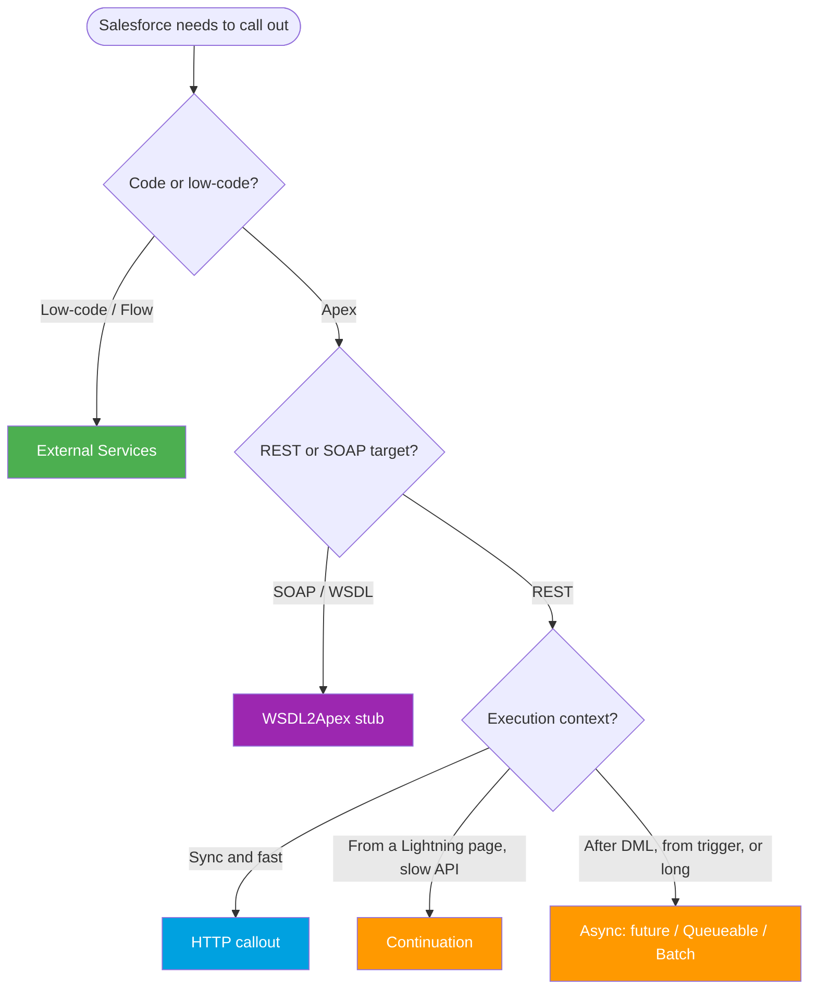

# Module 05 - Outbound Callouts (Salesforce → External)

> **Goal**: Make Salesforce talk OUT to other systems, securely and within limits.
> **API version**: v66.0 (Spring '26). **The one rule**: authenticate every callout with a **Named Credential**. Never hardcode a URL or secret.

Outbound means **Salesforce initiates** the call. This is the [Request and Reply](../02-Integration-Patterns/01-request-and-reply.md) (and sometimes Fire and Forget) pattern in practice. This module covers how to make the call, secure it, do it from low-code, handle SOAP, go asynchronous, and stay inside the governor limits.

---

## How to use this module

1. Start with **[01-http-callouts.md](01-http-callouts.md)**, the core Apex callout.
2. Lock in **[02-named-credentials-for-callouts.md](02-named-credentials-for-callouts.md)**, the secure way to authenticate.
3. Learn when to go **async** ([05](05-asynchronous-callouts.md)) or use a **Continuation** ([06](06-continuation-pattern.md)).
4. Keep **[07-callout-limits-and-testing.md](07-callout-limits-and-testing.md)** open as your reference.

---

## Map of this module

| # | File | What it covers |
|---|---|---|
| 01 | [http-callouts](01-http-callouts.md) | `Http` / `HttpRequest` / `HttpResponse` in Apex |
| 02 | [named-credentials-for-callouts](02-named-credentials-for-callouts.md) | Secure auth, no hardcoding, vs Remote Site Settings |
| 03 | [external-services](03-external-services.md) | Low-code callouts from Flow via OpenAPI |
| 04 | [soap-callouts-wsdl2apex](04-soap-callouts-wsdl2apex.md) | Outbound SOAP from generated Apex stubs |
| 05 | [asynchronous-callouts](05-asynchronous-callouts.md) | `@future`, Queueable, Batch Apex |
| 06 | [continuation-pattern](06-continuation-pattern.md) | Long-running callouts from the UI, non-blocking |
| 07 | [callout-limits-and-testing](07-callout-limits-and-testing.md) | Limits + `HttpCalloutMock` testing |

---

## Which callout approach? (decision tree)

> **Always** route auth through a **Named Credential** (`callout:Name/path`), whichever approach you pick.

---

## Callout limits cheat sheet (memorize)

| Limit | Value |
|---|---|
| Callouts per transaction | **100** |
| Request + response size | **6 MB** sync, **12 MB** async |
| Timeout per callout | default 10s, **max 120s** |
| Total callout time per transaction | **120s** |
| Callout after uncommitted DML | **Not allowed** (move async or call out first) |
| Continuation | up to **3** parallel callouts, **120s** each |
| Concurrent long-running sync requests (>5s) | **10** |

---

## Interview rapid-fire

**Q: How do you authenticate an outbound callout?**
→ A **Named Credential** (with an External Credential). The endpoint is `callout:Name/path`, and Salesforce injects the auth header. No hardcoded secrets, no Remote Site Setting needed.

**Q: "You have uncommitted work pending" — why?**
→ A callout after a DML in the same transaction. Call out **before** DML, or move it to an async context.

**Q: @future vs Queueable?**
→ Queueable (`Database.AllowsCallouts`) is preferred: it accepts objects/sObjects, is chainable, and is monitorable. `@future(callout=true)` is the simpler fire-and-forget (primitives only, no return).

**Q: A Lightning page calls a slow API. How to avoid blocking?**
→ The **Continuation** pattern: the callout runs async, the server thread is released, and a callback handles the response. Up to 3 parallel callouts, 120s each.

**Q: How do you test callouts?**
→ Implement **`HttpCalloutMock`** (or `WebServiceMock`), register with `Test.setMock`, and wrap async in `Test.startTest()/stopTest()`. Live callouts aren't allowed in tests.

---

## Sources (Verified June 2026)

- [Invoking Callouts Using Apex — Apex Developer Guide](https://developer.salesforce.com/docs/atlas.en-us.apexcode.meta/apexcode/apex_callouts.htm)
- [Callout Limits and Limitations — Apex Developer Guide](https://developer.salesforce.com/docs/atlas.en-us.apexcode.meta/apexcode/apex_callouts_timeouts.htm)
- [Named Credentials — Salesforce Help](https://help.salesforce.com/s/articleView?id=xcloud.nc_named_credentials.htm&type=5)
- [Continuations — Apex Developer Guide](https://developer.salesforce.com/docs/atlas.en-us.apexcode.meta/apexcode/apex_continuations.htm)

*Each file has its own Sources section with the specific official doc.*
