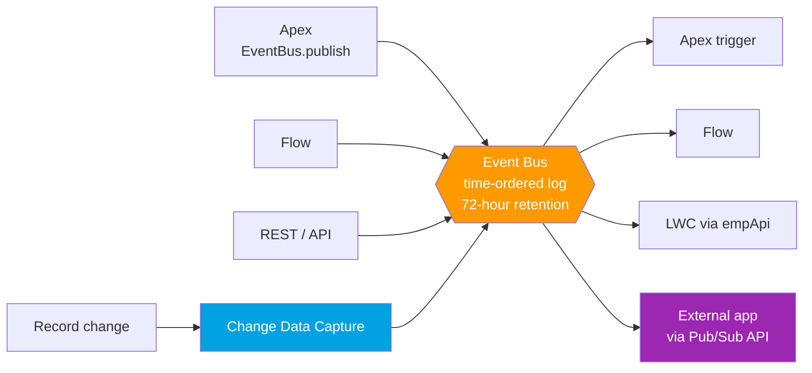

# 01 - Event-Driven Basics

> **One-liner**: Instead of one system constantly asking "anything new yet?", the producer **broadcasts an event** the moment something happens, and any interested system just listens.
> **Why it matters**: This is the modern, efficient alternative to polling. It decouples systems and enables real-time integration.
> **Goal of this file**: Understand the **event bus**, the **publish/subscribe** model, and **replay**, so every other file in this module clicks.

This is Module 06. New to push vs pull? See [Module 01 - push, pull, and webhooks](../01-Fundamentals/07-push-pull-and-webhooks.md). For where this sits among patterns, see [Module 02 - UI Update / Fire and Forget](../02-Integration-Patterns/README.md).

---

## 1. The idea in plain English

Event-driven integration is a **radio station**. The station (publisher) broadcasts a show (event) without knowing or caring who is listening. Anyone with a radio (subscriber) can tune to that frequency (channel) and hear it. The station does not call each listener; it broadcasts once, and the infrastructure delivers to everyone tuned in.

Contrast that with **polling**, which is calling the radio station every 30 seconds to ask "are you broadcasting anything?" Polling wastes calls, adds lag, and tightly couples the two sides. Events flip it around: **publish once, many subscribers react, nobody waits on anybody.** That decoupling is the whole point.

---

## 2. Polling (pull) vs event-driven (push)

| | Polling (pull) | Event-driven (push) |
|---|---|---|
| Who initiates | Consumer asks repeatedly | Producer broadcasts on change |
| Freshness | Laggy (next poll cycle) | Near real-time |
| Efficiency | Wasteful (most polls find nothing) | Efficient (only fires on real change) |
| Coupling | Tight (consumer knows the source) | Loose (publisher and subscriber independent) |
| Salesforce example | A job querying every 5 min for new Cases | A **Platform Event** fired when a Case is escalated |

**Rule of thumb**: if you find yourself scheduling a job to "check for changes," an event is almost always the better design.

---

## 3. The event bus and the pub/sub model

At the center sits the **event bus**: a multitenant, time-ordered event log. Publishers write to it, subscribers read from it, and the two never talk directly.

**Key properties of the bus**

- **Time-ordered**: events are stored and delivered in the order Salesforce received them.
- **Durable with replay**: each event gets a **Replay ID** marking its position. Subscribers store the last Replay ID they processed and can resubscribe from there to catch up.
- **Retention window**: high-volume platform events and Change Data Capture events are retained for **72 hours (3 days)**. After that they age out of the bus.
- **At-least-once delivery**: a subscriber may occasionally receive an event more than once, so handlers should be **idempotent**.

---

## 4. The Salesforce event family (what's in this module)

| Mechanism | Who creates it | File |
|---|---|---|
| **Platform Events** | You define and publish a custom event | [02-platform-events.md](02-platform-events.md) |
| **Change Data Capture (CDC)** | Salesforce auto-fires on record create/update/delete/undelete | [03-change-data-capture.md](03-change-data-capture.md) |
| **Pub/Sub API** | The modern gRPC API to publish and subscribe (incl. external apps) | [04-pub-sub-api.md](04-pub-sub-api.md) |
| **Streaming API + Outbound Messages** | Legacy push (PushTopic, generic, declarative SOAP) | [05-streaming-api-and-outbound-messages.md](05-streaming-api-and-outbound-messages.md) |
| **Publishing & subscribing & replay** | The how-to across all of the above | [06-publishing-subscribing-and-replay.md](06-publishing-subscribing-and-replay.md) |

---

## 5. Key concepts to carry forward

- **Channel / topic**: the named stream a subscriber listens to (e.g. `/event/Order_Shipped__e`, `/data/AccountChangeEvent`).
- **Replay ID**: the cursor into the event stream. `-1` = only new events, `-2` = all retained events from the start of the window, or a specific ID to resume.
- **Retention = 72 hours** for high-volume events and CDC. (Legacy **standard-volume** platform events retained only 24 hours and can no longer be created. They are being retired.)
- **Decoupling**: publishers and subscribers deploy, scale, and fail independently.
- **Idempotency**: design subscribers to tolerate duplicate or replayed events.

---

## 6. Common confusions and interview traps

| Confusion | The clarification |
|---|---|
| "Events are guaranteed exactly once." | Delivery is **at-least-once**. Handle possible duplicates. |
| "Platform Events and CDC are the same." | **You** design Platform Events for business signals. **Salesforce** auto-generates CDC from record changes. See [02](02-platform-events.md) vs [03](03-change-data-capture.md). |
| "Retention is 96 hours." | It is **72 hours** for high-volume events and CDC. (A common myth.) |
| "Streaming API is the way to subscribe." | For new builds use the **Pub/Sub API**. Streaming API (PushTopic/generic) is legacy. |
| "Events replace all integration." | Events suit notifications and real-time sync, not request/reply or bulk loads. |

---

## 7. Interview Q&A

**Q: What is event-driven integration and why use it over polling?**
A: A publisher broadcasts an event to an event bus and subscribers react, with no direct coupling. It beats polling because it is real-time, avoids wasted "anything new?" calls, and lets both sides evolve independently.

**Q: What is the event bus?**
A: A multitenant, time-ordered log where Salesforce stores published events and delivers them to subscribers in order, with a 72-hour retention window and Replay IDs for catch-up.

**Q: What is a Replay ID?**
A: An opaque marker of an event's position in the stream. Subscribers persist the last one they processed and resubscribe from it to recover missed events within the 72-hour window. `-1` means new-only, `-2` means everything retained.

**Q: Is delivery guaranteed exactly once?**
A: No. It is at-least-once, so subscribers must be idempotent to handle occasional duplicates or replays.

**Q: Platform Events vs Change Data Capture?**
A: Platform Events are custom business events you define and publish intentionally. CDC is automatic, fixed-schema events Salesforce fires whenever records change, ideal for replicating data to an external store.

**Talking point to explain it to anyone**: "It's a radio broadcast. Salesforce announces 'this happened' once, and any system tuned in reacts, instead of everyone phoning in to ask every few seconds."

---

## 8. Key terms

Event bus, publish/subscribe, channel, Replay ID, retention, at-least-once, idempotency, CDC - defined here and in the [Module 01 vocabulary](../01-Fundamentals/02-core-vocabulary.md) and the [README](README.md).

---

## Sources (Verified June 2026)

- [Event Message Durability — Pub/Sub API Developer Guide](https://developer.salesforce.com/docs/platform/pub-sub-api/guide/event-message-durability.html)
- [Platform Events Developer Guide — Event Bus](https://developer.salesforce.com/docs/atlas.en-us.platform_events.meta/platform_events/platform_events_intro.htm)
- [Platform Event Allocations](https://developer.salesforce.com/docs/atlas.en-us.platform_events.meta/platform_events/platform_event_limits.htm)

---

*Next: [02-platform-events.md](02-platform-events.md) - the custom events you define and publish.*
