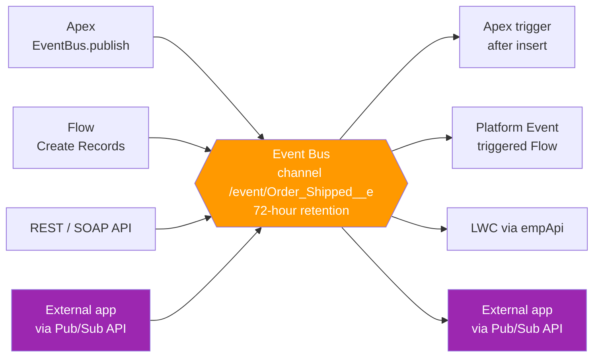

# 02 - Platform Events

> **One-liner**: You **define a custom event** (like `Order_Shipped__e`), publish it when something meaningful happens, and any number of subscribers react.
> **Why it matters**: This is the purpose-built way to broadcast **intentional business signals** inside and outside Salesforce, decoupled and near real-time.
> **Use when**: You want to announce "this business thing just happened" and let other systems decide what to do about it.

This is Module 06. New to the event bus, channels, and replay? Start with [01-event-driven-basics.md](01-event-driven-basics.md). For the auto-generated cousin, see [03-change-data-capture.md](03-change-data-capture.md).

---

## 1. The idea in plain English

A Platform Event is a **press release**. You decide exactly what it says (the fields), you decide when to issue it (publish), and you send it to the wire (the event bus). You do not phone each reporter. Anyone subscribed to that wire picks it up and acts: one team writes a story, another files it, a third ignores it. You, the publisher, never know or care who is listening.

Contrast this with [Change Data Capture](03-change-data-capture.md), where Salesforce auto-issues a "this record changed" bulletin for you. With Platform Events **you** design the message and **you** choose the moment. That is the whole distinction: Platform Events are **you-defined business signals**, CDC is **Salesforce-defined data changes**.

In Salesforce terms: you create a Platform Event object with the **`__e`** suffix, add custom fields, then publish instances via Apex `EventBus.publish()`, Flow, or the REST/SOAP API. Subscribers react via Apex triggers, Flow, LWC, or external apps.

---

## 2. When to use it (and when not)

| ✅ Use it when | ❌ Avoid / use something else |
|---|---|
| You want to broadcast a **business signal** you control, like `Order_Shipped__e`. | You just need to mirror **record changes** to an external store → [03-change-data-capture.md](03-change-data-capture.md). |
| Multiple **decoupled** subscribers should react independently. | You need a synchronous **answer back** → [Request and Reply](../02-Integration-Patterns/01-request-and-reply.md). |
| You want **fire-and-forget** notifications that survive load spikes. | You are doing a **bulk data load** → [Batch sync](../02-Integration-Patterns/03-batch-data-synchronization.md). |
| You need internal **process-to-process** decoupling (publish in one transaction, handle in another). | You need **guaranteed exactly-once**. Delivery is at-least-once, so subscribers must be idempotent. |

**Real-world examples**: `Order_Shipped__e` notifying a fulfillment portal, `Payment_Received__e` triggering downstream provisioning, `Print_Job__e` fanning a request to an on-prem printer service, a microservice publishing `Inventory_Low__e` back into Salesforce.

---

## 3. How it works (Mermaid + walkthrough)



**Walkthrough**

1. You publish an event instance to its channel, `/event/Order_Shipped__e`.
2. Salesforce persists it to the **event bus** (time-ordered, **72-hour** retention for high-volume events).
3. Each event gets a **Replay ID** marking its position in the stream.
4. All subscribers receive the event independently and asynchronously.
5. Apex triggers and Flows run server-side; LWC and external apps stream it down.
6. A slow or failed subscriber does not block the publisher or other subscribers.

---

## 4. The actual code and config

### Define the event object

In **Setup → Platform Events → New Platform Event**. The object gets the **`__e`** suffix automatically (for example `Order_Shipped__e`). Add custom fields like `Order_Number__c` (Text) and `Tracking__c` (Text). You also pick a **Publish Behavior**:

| Publish Behavior | When the event is published | Use when |
|---|---|---|
| **Publish After Commit** | Only **after** the current transaction commits successfully. If the transaction rolls back, the event is **not** published. | You need the event to reflect data that actually committed (the common, safe default). |
| **Publish Immediately** | At the moment of the `publish` call, **outside** the database transaction, even if the transaction later fails. | You want a signal regardless of outcome, for example logging or audit, fully decoupled from the DML result. |

### Publish via Apex

```apex
List<Order_Shipped__e> events = new List<Order_Shipped__e>();
events.add(new Order_Shipped__e(
    Order_Number__c = 'SO-1001',
    Tracking__c     = '1Z999AA10123456784'
));

List<Database.SaveResult> results = EventBus.publish(events);

for (Database.SaveResult sr : results) {
    if (!sr.isSuccess()) {
        for (Database.Error err : sr.getErrors()) {
            System.debug('Publish failed: ' + err.getMessage());
        }
    }
}
```

> A successful `SaveResult` means the event was **accepted** for publishing, not yet delivered. For confirmed final results, use a **publish callback** (`EventBus.publish(events, callback)`).

### Publish via Flow

Use a **Create Records** element and pick the Platform Event as the record type, or a dedicated platform-event action. No Apex needed.

### Publish via REST API

`POST` to the sObject endpoint, same shape as any record:

```http
POST /services/data/v66.0/sobjects/Order_Shipped__e/
{ "Order_Number__c": "SO-1001", "Tracking__c": "1Z999AA10123456784" }
```

### Subscribe four ways

| Subscriber | How | Notes |
|---|---|---|
| **Apex trigger** | `trigger OnOrderShipped on Order_Shipped__e (after insert)` | Only **`after insert`** is valid. Runs async; up to **2,000** events per execution. Use `EventBus.TriggerContext` + `setResumeCheckpoint(replayId)` to resume after an error. |
| **Flow** | Platform Event-Triggered Flow | Low-code subscriber, one event per run. |
| **LWC** | `empApi` (`subscribe`) on `/event/Order_Shipped__e` | In-browser, uses CometD under the hood. |
| **External app** | **Pub/Sub API** (gRPC) | The modern path for microservices. See [04-pub-sub-api.md](04-pub-sub-api.md). |

```apex
trigger OnOrderShipped on Order_Shipped__e (after insert) {
    for (Order_Shipped__e evt : Trigger.New) {
        // idempotent handler: safe if this event arrives twice
        System.debug('Shipped order ' + evt.Order_Number__c);
    }
}
```

### High-volume vs standard-volume

**High-volume** platform events are the **modern default** and are retained **72 hours**. **Standard-volume** platform events (24-hour retention) **can no longer be created and are being retired**. Always design on high-volume.

---

## 5. Design considerations and gotchas

| Consideration | Why it matters | What to do |
|---|---|---|
| **Publish Behavior choice** | After Commit ties the event to a successful transaction; Immediately decouples it entirely. | Default to **After Commit** unless you truly want the signal even on rollback. |
| **At-least-once delivery** | A subscriber may receive the same event twice. | Make handlers **idempotent** (dedupe on a key). |
| **Trigger is `after insert` only** | Events are immutable; there is no update/delete trigger. | Put all logic in `after insert`. |
| **2,000 events per trigger run** | A burst is chunked. An uncaught error can re-fire the whole chunk. | Use `setResumeCheckpoint(replayId)` to resume past processed events. |
| **Publish and delivery allocations** | Orgs have limits on **events published per hour** and **event deliveries per 24 hours** (delivery to CometD/empApi). | Monitor `PlatformEventUsageMetric`; see the [allocations page](https://developer.salesforce.com/docs/atlas.en-us.platform_events.meta/platform_events/platform_event_limits.htm). |
| **No SOQL on event objects** | You cannot query past events with SOQL. | Replay from the bus via Replay ID within 72h, or persist to a record if you need history. |
| **Field types are limited** | Not every field type is allowed on a `__e` object. | Use supported types (Text, Number, Checkbox, Date/Time, etc.). |

---

## 6. Interview Q&A

**Q: What is a Platform Event and how is it different from CDC?**
A: A Platform Event is a custom event you define (`__e` object) and publish intentionally to signal a business occurrence. CDC is auto-fired by Salesforce on record create/update/delete/undelete with a fixed schema. Platform Events are you-defined signals; CDC is data replication.

**Q: Publish After Commit vs Publish Immediately?**
A: After Commit publishes the event only if the transaction commits, so subscribers can trust the committed data. Immediately publishes outside the transaction, even if it later rolls back, fully decoupling publish from the DML result. After Commit is the safe default.

**Q: How do you publish and subscribe in Apex?**
A: Publish with `EventBus.publish(listOfEvents)`. Subscribe with an `after insert` trigger on the event object. The trigger is asynchronous and processes up to 2,000 events per run.

**Q: Delivery is occasionally duplicated. How do you handle it?**
A: Delivery is at-least-once, so handlers must be idempotent, for example by checking a dedupe key or external ID before acting, so a replayed event causes no double effect.

**Q: A burst of events causes a trigger error midway. How do you avoid reprocessing everything?**
A: Use `EventBus.TriggerContext` and `setResumeCheckpoint(replayId)` to checkpoint the last good Replay ID, so the retry resumes after the processed events instead of from the start of the chunk.

**Talking point to explain it to anyone**: "It's a press release. I write the message, I choose when to send it to the wire, and anyone subscribed reacts on their own. I never call them directly."

---

## 7. Key terms

Platform Event, `__e` object, Publish After Commit, Publish Immediately, `EventBus.publish`, `empApi`, high-volume vs standard-volume, Replay ID, idempotency - defined here and in [01-event-driven-basics.md](01-event-driven-basics.md) and the [README](README.md).

---

## Sources (Verified June 2026)

- [Platform Events Developer Guide - Intro (v66.0)](https://developer.salesforce.com/docs/atlas.en-us.platform_events.meta/platform_events/platform_events_intro.htm)
- [Publish Event Messages with Apex](https://developer.salesforce.com/docs/atlas.en-us.platform_events.meta/platform_events/platform_events_publish_apex.htm)
- [Subscribe to Platform Event Notifications with Apex Triggers](https://developer.salesforce.com/docs/atlas.en-us.platform_events.meta/platform_events/platform_events_subscribe_apex.htm)
- [Platform Event Allocations](https://developer.salesforce.com/docs/atlas.en-us.platform_events.meta/platform_events/platform_event_limits.htm)
- [Standard-Volume Platform Events Retirement](https://help.salesforce.com/s/articleView?id=002280033&language=en_US&type=1)
- [Event Message Durability - Pub/Sub API Developer Guide](https://developer.salesforce.com/docs/platform/pub-sub-api/guide/event-message-durability.html)

---

*Next: [03-change-data-capture.md](03-change-data-capture.md) - the events Salesforce fires automatically when records change.*
