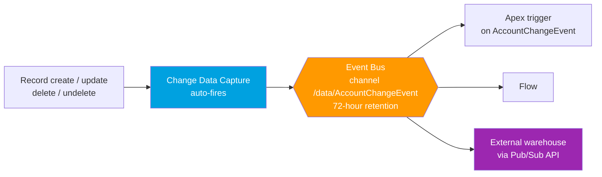

# 03 - Change Data Capture

> **One-liner**: Turn it on for an object and Salesforce **automatically fires an event every time a record changes**, so you never write publish code.
> **Why it matters**: This is the purpose-built way to **mirror Salesforce data** into an external store or warehouse in near real-time.
> **Use when**: You need an external system to stay in sync with Salesforce record changes without polling.

This is Module 06. New to the event bus and replay? See [01-event-driven-basics.md](01-event-driven-basics.md). For events **you** design and publish, see [02-platform-events.md](02-platform-events.md).

---

## 1. The idea in plain English

Change Data Capture (CDC) is a **security camera** on your data. Once you point it at an object, it records every change automatically: a record is created, updated, deleted, or undeleted, and CDC quietly fires an event describing what happened. You did not press record each time; the camera just runs.

Contrast this with [Platform Events](02-platform-events.md), where you write the message and choose the moment, like issuing a press release. CDC is the opposite: **Salesforce decides the schema and the timing for you.** The payload is fixed, you cannot add custom fields to it, and it fires on the database change itself.

The killer use case is **replication**. You stand up an external database or data warehouse, subscribe to CDC, and apply each change as it arrives. The external copy stays current without a single scheduled query.

---

## 2. When to use it (and when not)

| ✅ Use it when | ❌ Avoid / use something else |
|---|---|
| You want to **replicate / mirror** Salesforce records to an external store or warehouse. | You want a **custom business signal** with your own fields → [02-platform-events.md](02-platform-events.md). |
| You need to react to **any** create/update/delete/undelete on an object. | You only care about one specific business moment, not raw record churn. |
| You want **no publish code**: enable per object and you are done. | You need to **customize the payload**. CDC schema is fixed. |
| You need the **before/after-style** change detail (which fields changed). | You need a synchronous **answer back** → [Request and Reply](../02-Integration-Patterns/01-request-and-reply.md). |

**Real-world examples**: keeping a reporting **data warehouse** in sync, feeding an **external search index**, mirroring Accounts and Contacts into a **customer data platform**, driving an audit/replication pipeline in a microservice.

---

## 3. How it works (Mermaid + walkthrough)



**Walkthrough**

1. A record changes (create, update, delete, or undelete).
2. CDC **automatically** generates a change event, no publish code from you.
3. The event lands on the object channel, for example `/data/AccountChangeEvent`.
4. It carries a **ChangeEventHeader** plus the changed record fields.
5. Subscribers (Apex, Flow, or external apps via Pub/Sub API) apply the change.
6. Events are retained **72 hours**; a subscriber can replay within that window.

---

## 4. The actual config and channels

### Enable CDC

In **Setup → Change Data Capture**, move objects from **Available Entities** into **Selected Entities**. (You can also enable it via Metadata API with a `PlatformEventChannelMember`.) When you select an object, Salesforce creates its change event behind the scenes, for example `Account` → `AccountChangeEvent`, custom `Shipment__c` → `Shipment__ChangeEvent`.

### Channels

| Channel | Listens to | Format |
|---|---|---|
| **Single standard object** | One standard object | `/data/AccountChangeEvent` |
| **Single custom object** | One custom object | `/data/Shipment__ChangeEvent` |
| **All changes** | Every CDC-enabled object | `/data/ChangeEvents` |
| **Custom channel** | A curated set of objects you group | `/data/MyChannel__chn` |

Use a **custom channel** when different subscribers need different subsets of objects, or to scope event enrichment.

### The ChangeEventHeader

Every change event includes a `ChangeEventHeader`. Key fields:

| Field | What it tells you |
|---|---|
| **`changeType`** | `CREATE`, `UPDATE`, `DELETE`, or `UNDELETE`. |
| **`entityName`** | The object, for example `Account`. |
| **`recordIds`** | The record IDs affected (a list; one event can cover several records in a transaction). |
| **`changedFields`** | The fields that changed (for updates), so you apply only deltas. |
| **`commitNumber`** | The system change number of the commit, for ordering. |
| **`commitTimestamp`** | When the change was committed. |
| **`commitUser`** | The user ID that made the change. |
| **`transactionKey`** / **`sequenceNumber`** | Group and order changes within the same transaction. |

Sample change event payload (conceptual):

```json
{
  "ChangeEventHeader": {
    "entityName": "Account",
    "changeType": "UPDATE",
    "recordIds": ["001xx000003DGb2AAG"],
    "changedFields": ["Phone", "Website"],
    "commitNumber": 10282948327,
    "commitTimestamp": 1718700000000,
    "commitUser": "005xx000001Sv6BAAS"
  },
  "Phone": "+1-415-555-0100",
  "Website": "https://example.com"
}
```

### Subscribe

Same four ways as Platform Events: **Apex trigger** on the change event object (`after insert`), **Flow**, **LWC empApi**, and **external apps via Pub/Sub API** (the usual choice for replication). See [04-pub-sub-api.md](04-pub-sub-api.md).

### Gap events and overflow

- **Gap event**: when Salesforce **cannot** generate a normal change event (for example certain errors or field conversions), it sends a **gap event** with a header but no field values. Its `changeType` is suffixed, like `GAP_UPDATE`. Subscribers should query the record to resync.
- **Overflow event**: when a **single transaction** changes more records than a threshold, CDC sends an **overflow event** instead of one event per record. Treat it as a signal to reload the affected scope.

Both exist so your replica can self-heal instead of silently drifting.

---

## 5. Design considerations and gotchas

| Consideration | Why it matters | What to do |
|---|---|---|
| **Fixed schema** | You cannot add custom fields to the change event payload. | If you need extra context, use event **enrichment** on a custom channel, or switch to a [Platform Event](02-platform-events.md). |
| **72-hour retention** | Events older than 72h are purged from the bus. | Keep subscribers healthy; replay within the window or do a full reload. |
| **Gap events** | A gap means data could be out of sync. | On a gap, **re-query** the affected records to resync the replica. |
| **Overflow events** | A bulk transaction collapses into one overflow event. | Reload the affected object set rather than expecting per-record events. |
| **At-least-once + ordering** | Duplicates are possible; ordering is per `commitNumber`/`commitTimestamp`. | Make the apply step **idempotent** and order by commit metadata. |
| **Allocations** | CDC shares event delivery allocations and has its own limits. | See [CDC Allocations](https://developer.salesforce.com/docs/atlas.en-us.change_data_capture.meta/change_data_capture/cdc_allocations.htm). |
| **Deletes carry few fields** | A DELETE event mostly has the header and ID. | Use `recordIds` + `changeType` to remove the row in the replica. |

---

## 6. Interview Q&A

**Q: What is Change Data Capture?**
A: An event feature where Salesforce automatically fires a change event whenever a record is created, updated, deleted, or undeleted on an enabled object. The payload has a fixed schema with a ChangeEventHeader plus changed fields. It is built for replicating Salesforce data to external stores.

**Q: How is CDC different from Platform Events?**
A: CDC is auto-generated by Salesforce on record changes with a fixed schema, you write no publish code. Platform Events are custom events you define and publish intentionally. CDC = data replication; Platform Events = you-defined business signals.

**Q: What is in the ChangeEventHeader?**
A: It identifies the change: `changeType` (create/update/delete/undelete), `entityName`, `recordIds`, `changedFields`, and commit metadata like `commitNumber`, `commitTimestamp`, and `commitUser`. The `changedFields` list lets you apply only the delta.

**Q: What are gap and overflow events?**
A: A gap event fires when Salesforce cannot produce a normal change event, signaling the subscriber to re-query and resync. An overflow event fires when one transaction changes more records than a threshold, replacing per-record events; the subscriber reloads the affected scope.

**Q: How long are CDC events retained, and how do you catch up after downtime?**
A: 72 hours. A subscriber stores the last Replay ID it processed and resubscribes from it within that window. If it falls outside 72 hours, do a full reload of the data.

**Talking point to explain it to anyone**: "It's a security camera on your records. Flip it on for an object and Salesforce automatically broadcasts every change, so an outside system can mirror your data without ever asking 'what's new?'"

---

## 7. Key terms

Change Data Capture, change event, `ChangeEventHeader`, `changeType`, `changedFields`, gap event, overflow event, `/data/AccountChangeEvent`, `/data/ChangeEvents`, custom channel - defined here and in [01-event-driven-basics.md](01-event-driven-basics.md) and the [README](README.md).

---

## Sources (Verified June 2026)

- [Change Data Capture Developer Guide - Intro (v66.0)](https://developer.salesforce.com/docs/atlas.en-us.change_data_capture.meta/change_data_capture/cdc_intro.htm)
- [ChangeEventHeader Fields](https://developer.salesforce.com/docs/atlas.en-us.change_data_capture.meta/change_data_capture/cdc_event_fields_header.htm)
- [Subscription Channels](https://developer.salesforce.com/docs/atlas.en-us.change_data_capture.meta/change_data_capture/cdc_subscribe_channels.htm)
- [Gap Events](https://developer.salesforce.com/docs/atlas.en-us.change_data_capture.meta/change_data_capture/cdc_other_events_gap.htm)
- [Overflow Events](https://developer.salesforce.com/docs/atlas.en-us.change_data_capture.meta/change_data_capture/cdc_other_events_overflow.htm)
- [Change Data Capture Allocations](https://developer.salesforce.com/docs/atlas.en-us.change_data_capture.meta/change_data_capture/cdc_allocations.htm)

---

*Next: [04-pub-sub-api.md](04-pub-sub-api.md) - the modern gRPC API for publishing and subscribing at scale.*
