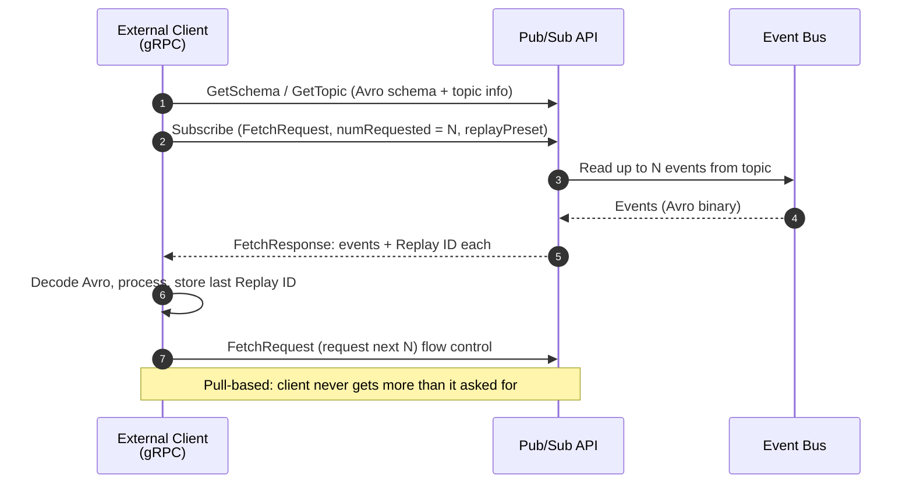

# 04 - Pub/Sub API

> **One-liner**: One modern **gRPC** API to publish, subscribe, and fetch schemas for **every** Salesforce event type, built for external systems at scale.
> **Why it matters**: It is the **modern replacement for the CometD Streaming API** for new builds, with flow control and efficient binary streaming.
> **Use when**: An external system (a microservice, a data pipeline) needs to publish or subscribe to Salesforce events efficiently and at volume.

This is Module 06. New to channels, Replay IDs, and retention? See [01-event-driven-basics.md](01-event-driven-basics.md). For the event types it carries, see [02-platform-events.md](02-platform-events.md) and [03-change-data-capture.md](03-change-data-capture.md).

---

## 1. The idea in plain English

The Pub/Sub API is a **universal remote** for Salesforce events. Before it, you reached for different tools for different jobs: one API to publish, another (CometD Streaming API) to subscribe, a third to fetch schemas. The Pub/Sub API is **one device** that does all of it, for Platform Events, Change Data Capture, and real-time event monitoring events alike.

It speaks **gRPC over HTTP/2** and ships event payloads as **Apache Avro** binary, so it is compact and fast. And it is **pull-based**: the subscriber tells Salesforce "send me N events" and only gets what it asked for. That is **flow control**, and it stops a downstream service from being flooded during a publish spike.

If you are building anything **external** today, this is the API. The older CometD Streaming API still works but is legacy for new integrations.

---

## 2. When to use it (and when not)

| ✅ Use it when | ❌ Avoid / use something else |
|---|---|
| An **external** system publishes or subscribes to Salesforce events. | The subscriber lives **inside** Salesforce → use an Apex trigger or [Flow](02-platform-events.md). |
| You need **high throughput** with backpressure (flow control). | You need a quick **in-browser** stream in a component → LWC `empApi`. |
| You want **one API** across Platform Events, CDC, and event monitoring. | You are committed to **legacy CometD** clients already → [05-streaming-api-and-outbound-messages.md](05-streaming-api-and-outbound-messages.md). |
| You want to **replay** missed events within the 72-hour window. | You need a synchronous request/reply → [Request and Reply](../02-Integration-Patterns/01-request-and-reply.md). |

**Real-world examples**: a Node microservice subscribing to `Order_Shipped__e`, a Python data pipeline consuming `/data/AccountChangeEvent` into a warehouse, an inventory service publishing `Inventory_Low__e` back into Salesforce, a cross-cloud integration reacting to real-time event monitoring.

---

## 3. How it works (sequence diagram + walkthrough)

**Walkthrough**

1. The client fetches the **Avro schema** (`GetSchema`) and topic info (`GetTopic`) so it can decode payloads.
2. It calls **`Subscribe`**, passing a `FetchRequest` with **`numRequested`** (how many events it can handle, max **100**) and a **`replayPreset`** (new-only, earliest retained, or a specific Replay ID).
3. Salesforce returns up to that many events in one or more `FetchResponse` messages.
4. Each event carries a **Replay ID**. The client **persists the last one** it processed.
5. To keep receiving, the client sends another `FetchRequest`. It is never sent more than it asked for. That is **flow control**.
6. After downtime, it resubscribes from its stored Replay ID to catch up within **72 hours**.

---

## 4. The actual API and config

### gRPC and Avro

The service is defined in a **`.proto`** file using Protocol Buffers as the IDL. The event payload inside each message is **Apache Avro** binary, so before you publish you Avro-encode, and when you receive you Avro-decode. Clients exist in 11 gRPC languages (Python, Java, Node, C++, Go, etc.).

### The RPC methods

| RPC method | What it does |
|---|---|
| **`Publish`** | Publish a batch of events in one request. |
| **`PublishStream`** | Publish via a bidirectional stream for sustained high-volume publishing. |
| **`Subscribe`** | Subscribe with client-driven **flow control** (you request N events at a time). |
| **`ManagedSubscribe` (Beta)** | Like Subscribe, but Salesforce **tracks your Replay ID server-side** so you do not manage it yourself. Backed by a `ManagedEventSubscription` (Tooling/Metadata API). |
| **`GetSchema`** | Fetch the Avro schema for a topic by schema ID. |
| **`GetTopic`** | Fetch topic info (the channel and its schema ID). |

### Replay and the replay window

Set the starting point in the subscribe call via **`replayPreset`**:

| `replayPreset` | Starts from |
|---|---|
| `LATEST` | Only **new** events from now (like Replay ID `-1`). |
| `EARLIEST` | The **earliest retained** event in the window (like `-2`). |
| `CUSTOM` | A specific stored **Replay ID** you provide. |

Stored events are available for the **72-hour** retention window, so a client can resume up to three days back.

### Flow control in practice

`numRequested` caps how many events Salesforce delivers per request (max **100**). The `FetchResponse` reports `pendingNumRequested`, how many of your requested events are still pending. The client requests the next batch only when ready, so a publish spike cannot overwhelm it.

### Managed Subscribe (Beta) vs manual replay

With plain `Subscribe`, **you** store the last Replay ID and pass it back on reconnect. With **`ManagedSubscribe`**, you commit the Replay ID to the server and Salesforce remembers it for you, simplifying recovery. It is in **Beta**.

---

## 5. Design considerations and gotchas

| Consideration | Why it matters | What to do |
|---|---|---|
| **Avro is mandatory** | Payloads are binary Avro, not JSON. | Always decode with the schema from `GetSchema`; cache schemas by ID. |
| **`numRequested` max 100** | You cannot pull unlimited events in one request. | Loop: request, process, request again. Tune batch size to your throughput. |
| **Replay within 72h only** | A stored Replay ID outside the window is invalid. | If you fall behind 72h, do a full reload, then resume with `LATEST`. |
| **At-least-once delivery** | The same event can arrive twice. | Make processing **idempotent** (dedupe on a key). |
| **Schema can evolve** | A new field changes the schema ID. | Look up schema by the ID on each event, do not hardcode. |
| **ManagedSubscribe is Beta** | Beta features can change. | For production replay control, manual Replay ID handling is the stable path. |
| **HTTP/2 + long-lived streams** | gRPC streams are persistent connections. | Handle reconnects and resume from the last Replay ID. |

---

## 6. Interview Q&A

**Q: What is the Pub/Sub API and why use it over the Streaming API?**
A: It is a single gRPC-over-HTTP/2 API to publish, subscribe, and fetch schemas across Platform Events, CDC, and event monitoring, using compact Avro binary. It is the modern replacement for the CometD Streaming API for new builds, adding flow control and efficient streaming.

**Q: What does flow control mean here?**
A: The API is pull-based. The subscriber requests a number of events (`numRequested`, max 100) and only receives that many. It asks for more when ready, so a publish spike cannot overwhelm a slow consumer.

**Q: How does replay work?**
A: Every event carries a Replay ID. On subscribe you set `replayPreset` to `LATEST` (new only), `EARLIEST` (earliest retained), or `CUSTOM` with a stored Replay ID. You can resume within the 72-hour retention window.

**Q: What is ManagedSubscribe and how does it differ from Subscribe?**
A: With `Subscribe` you track and resend the Replay ID yourself. With `ManagedSubscribe` (Beta) you commit the Replay ID to the server and Salesforce remembers your position, so recovery is simpler. It is currently in Beta.

**Q: Which event types does the Pub/Sub API support?**
A: Platform Events, Change Data Capture events, real-time event monitoring events, and standard platform events, all through the same interface.

**Talking point to explain it to anyone**: "It's a universal remote for Salesforce events. One modern API to publish, subscribe, and read schemas, and the subscriber controls the pace so it never gets flooded."

---

## 7. Key terms

Pub/Sub API, gRPC, HTTP/2, Apache Avro, `Subscribe`, `ManagedSubscribe`, `GetSchema`, `GetTopic`, `numRequested`, flow control, `replayPreset`, Replay ID - defined here and in [01-event-driven-basics.md](01-event-driven-basics.md) and the [README](README.md).

---

## Sources (Verified June 2026)

- [Pub/Sub API Developer Guide - Get Started](https://developer.salesforce.com/docs/platform/pub-sub-api/guide/intro.html)
- [Pub/Sub API as a gRPC API](https://developer.salesforce.com/docs/platform/pub-sub-api/guide/grpc-api.html)
- [Event Data Serialization with Apache Avro](https://developer.salesforce.com/docs/platform/pub-sub-api/guide/event-avro-serialization.html)
- [Pull Subscription and Flow Control](https://developer.salesforce.com/docs/platform/pub-sub-api/guide/flow-control.html)
- [Managed Event Subscriptions (Beta)](https://developer.salesforce.com/docs/platform/pub-sub-api/guide/managed-sub.html)
- [Subscribe RPC Method Reference](https://developer.salesforce.com/docs/platform/pub-sub-api/references/methods/subscribe-rpc.html)
- [Event Message Durability](https://developer.salesforce.com/docs/platform/pub-sub-api/guide/event-message-durability.html)

---

*Next: [05-streaming-api-and-outbound-messages.md](05-streaming-api-and-outbound-messages.md) - the legacy push mechanisms (PushTopic, generic streaming, and declarative outbound messages).*
