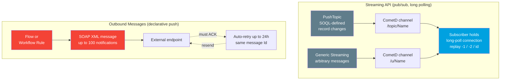

# 05 - Streaming API and Outbound Messages

> **One-liner**: Two **legacy** ways Salesforce pushed change notifications out before the modern event bus existed. **Streaming API** is a long-polling pub/sub channel. **Outbound Messages** is a declarative SOAP push to one endpoint.
> **Status**: Both are **legacy**. For new builds use [Platform Events](02-platform-events.md), [Change Data Capture](03-change-data-capture.md), and the [Pub/Sub API](04-pub-sub-api.md). You still meet these in older orgs and managed packages.
> **Goal of this file**: Recognize them, explain how they work, and know **why and when to migrate**.

This is Module 06. New to the event bus and replay? Start with [01-event-driven-basics.md](01-event-driven-basics.md). For the modern replacement, see [04-pub-sub-api.md](04-pub-sub-api.md).

---

## 1. The idea in plain English

Imagine an old office with two ways to tell the outside world that something changed.

**Streaming API** is the **building intercom**. A clerk announces "Order 12 shipped" over a channel. Anyone holding a handset tuned to that channel hears it live. Nobody phones in to ask; they just keep the line open and listen. That open line is **long polling** over **CometD**.

**Outbound Messages** is the **registered letter**. When a record meets a rule, the org **mails a single SOAP envelope** to one fixed address. The post office keeps **redelivering** until the recipient signs a receipt. No signature, it tries again for up to a day.

Both predate the modern event bus. They work, but they carry old plumbing (SOAP, CometD, no gRPC) and weaker tooling. Treat them as **brownfield knowledge**: understand them, then steer new work to Platform Events and the Pub/Sub API.

---

## 2. When to use it (and when not)

| You will encounter it when | Prefer the modern path when |
|---|---|
| Maintaining an **older org** already wired to PushTopics or generic streaming. | Building anything **new** that pushes events → [Platform Events](02-platform-events.md) + [Pub/Sub API](04-pub-sub-api.md). |
| A **declarative** team wants a no-code push to one endpoint and SOAP is acceptable. | You need **high throughput**, replay, or many subscribers → event bus. |
| Integrating a vendor or **managed package** that still ships Outbound Messages. | You want **gRPC / Avro** efficiency or external-app subscribe → [Pub/Sub API](04-pub-sub-api.md). |
| Replicating record changes to an external store on legacy tooling. | You want change events with schema → [Change Data Capture](03-change-data-capture.md). |

**Real-world examples**: a 10-year-old org notifying an on-prem ERP via Outbound Message SOAP. A legacy Visualforce dashboard listening to a PushTopic for live Case updates. A partner package that fires generic streaming messages to a companion app.

**Why migrate**: the Pub/Sub API gives you one efficient gRPC channel for publish and subscribe, **Avro** binary payloads, server-side replay tracking, and first-class external-app support. Streaming API and Outbound Messages get no new investment.

---

## 3. How it works (two legacy mechanisms)



**Streaming API walkthrough**

1. You define a **PushTopic** (a named record holding a **SOQL query**) or a **Generic Streaming** channel (for arbitrary user-defined payloads).
2. Salesforce delivers messages over **CometD**, an implementation of the **Bayeux** protocol, using **long polling** (the client holds an open HTTP connection and the server pushes when something arrives).
3. The subscriber chooses a **replay option**: `-1` to receive **only new** events, `-2` to receive **all retained** events from the start of the window, or a specific **Replay ID** to resume from where it left off.
4. **PushTopic events are retained for 24 hours** (note: shorter than the 72-hour window for high-volume Platform Events and CDC).

**Outbound Messages walkthrough**

1. A **declarative** action (a **Flow** Action element, or a legacy **Workflow Rule**) triggers when a record meets criteria.
2. Salesforce assembles a **SOAP XML** message containing a **configured set of fields**, sends it to one **configured endpoint URL**, and can bundle **up to 100 notifications** in a single message.
3. The endpoint must return a **positive acknowledgment** (an `Ack` of `true`). If it does not, Salesforce **retries automatically** with backoff for up to **24 hours** (extendable to 7 days via Support); the **message Id stays the same** across retries so the receiver can deduplicate.

---

## 4. The actual code and config

**PushTopic** (created in Apex, then subscribed over CometD):

```apex
PushTopic pt = new PushTopic();
pt.Name = 'OrderUpdates';
pt.Query = 'SELECT Id, Name, Status__c FROM Order__c WHERE Status__c = \'Shipped\'';
pt.ApiVersion = 66.0;
pt.NotifyForOperationCreate = true;
pt.NotifyForOperationUpdate = true;
pt.NotifyForFields = 'Referenced'; // only when referenced fields change
insert pt;
// Subscribers then listen on channel:  /topic/OrderUpdates
```

**Generic Streaming** uses a `StreamingChannel` record (channel `/u/MyChannel`) and a REST call to push an arbitrary message. The subscribe side is the same CometD long-poll model with the same replay options.

**Subscribing with a replay option** (CometD extension, conceptual):

```javascript
// -1 = new events only, -2 = all retained events, or a specific Replay Id
cometd.subscribe('/topic/OrderUpdates', callback, { replay: -1 });
```

**Outbound Message** is configured, not coded:

- **Setup**: define an **Outbound Message** action (endpoint URL, fields to send, user to run as), then attach it to a **Flow** (Action element) or legacy **Workflow Rule**.
- Salesforce provides a **WSDL** for the message. You generate a listener on the external side that returns the `Ack`.

> **Migration note**: **Workflow Rules and Process Builder are no longer supported** as of December 31, 2025. Existing rules keep running, but build new automation in **Flow**, which supports the **Outbound Message** as an Action element. Better still, publish a **Platform Event** and let any subscriber react.

---

## 5. Design considerations and gotchas

| Consideration | Why it matters | What to do |
|---|---|---|
| **PushTopic retention is 24h** | Shorter than the 72h window for Platform Events and CDC. Long outages lose events. | Track Replay IDs. For durability prefer the event bus. |
| **CometD is fragile** | Long polling drops on network blips. No gRPC efficiency. | Reconnect with the last Replay ID. For new work use [Pub/Sub API](04-pub-sub-api.md). |
| **Outbound Message needs an ACK** | No `Ack=true` means endless retries for 24h. | Make the listener return the ack fast, even before heavy processing. |
| **At-least-once, duplicates happen** | Retries reuse the same **message Id**. | Deduplicate on that Id. Make the handler **idempotent**. |
| **100 notifications per message** | Bulk changes batch into one SOAP envelope. | Parse the full notification list, not just the first. |
| **One fixed endpoint** | Outbound Messages target a single URL. | No fan-out. If you need many listeners, use the event bus. |
| **SOAP only** | XML envelope, WSDL listener, heavier than JSON/Avro. | Accept it for legacy, avoid for greenfield. |
| **No new investment** | Both are legacy; tooling and features are frozen. | Plan a migration to Platform Events / Pub/Sub API. |

---

## 6. Interview Q&A

**Q: What is the Streaming API and how does it deliver events?**
A: A legacy pub/sub channel that pushes messages over **CometD**, an implementation of the **Bayeux** protocol, using **long polling**. It supports **PushTopic** events (SOQL-based record-change notifications) and **Generic Streaming** (arbitrary user-defined messages). Subscribers pick a replay option: `-1` new only, `-2` all retained, or a specific Replay ID.

**Q: What are Outbound Messages?**
A: A **declarative** action (from a Flow Action element or legacy Workflow Rule) that sends a **SOAP XML** message with a configured field set to one external endpoint. It batches up to **100 notifications**, **retries automatically for up to 24 hours**, and requires the endpoint to return a positive **acknowledgment**.

**Q: How do Outbound Messages handle reliability and duplicates?**
A: Delivery is at-least-once. If no `Ack=true` arrives, Salesforce retries with backoff for up to 24 hours. The **message Id stays the same** across retries, so the receiver deduplicates on it. The listener should ack quickly and process idempotently.

**Q: Why are these legacy, and what replaces them?**
A: They predate the modern event bus and carry old plumbing (SOAP, CometD). New builds should use **Platform Events** and **Change Data Capture** published and consumed through the **Pub/Sub API** (gRPC, HTTP/2, Avro), which is more efficient, supports replay, and serves external apps natively.

**Q: A legacy org loses PushTopic events during a long outage. Why, and what do you do?**
A: **PushTopic retention is only 24 hours**, so events older than that age out. Track and resubscribe from the last **Replay ID** to recover what is still in the window. For durability beyond that, migrate the use case to the event bus, which retains high-volume events for **72 hours** and offers managed replay.

**Talking point to explain it to anyone**: "Streaming API is an office intercom you keep listening to. Outbound Messages is a registered letter that keeps getting redelivered until someone signs for it. Both are the old way; the new way is a shared digital bus."

---

## 7. Key terms

PushTopic, Generic Streaming, CometD, Bayeux, long polling, Replay ID, Outbound Message, SOAP, acknowledgment, retry, idempotency - defined here and in [01-event-driven-basics.md](01-event-driven-basics.md) and the [README](README.md).

---

## Sources (Verified June 2026)

- [Bayeux Protocol, CometD, and Long Polling - Streaming API Developer Guide](https://developer.salesforce.com/docs/atlas.en-us.api_streaming.meta/api_streaming/BayeauxProtocolAndCometD.htm)
- [Replay PushTopic Streaming Events - Streaming API Developer Guide](https://developer.salesforce.com/docs/atlas.en-us.api_streaming.meta/api_streaming/replay_pushtopic_events.htm)
- [Message Durability - Streaming API Developer Guide](https://developer.salesforce.com/docs/atlas.en-us.api_streaming.meta/api_streaming/using_streaming_api_durability.htm)
- [Understanding Outbound Messaging - SOAP API Developer Guide](https://developer.salesforce.com/docs/atlas.en-us.api.meta/api/sforce_api_om_outboundmessaging_understanding.htm)
- [Understanding Notifications - SOAP API Developer Guide](https://developer.salesforce.com/docs/atlas.en-us.api.meta/api/sforce_api_om_outboundmessaging_notifications.htm)
- [Considerations for Outbound Messages - Salesforce Help](https://help.salesforce.com/s/articleView?id=sf.workflow_om_considerations.htm&type=5)
- [Transition to Flow: Workflow and Process Builder Retirement - Salesforce Help](https://help.salesforce.com/s/articleView?id=000389396&type=1)

---

*Next: [06-publishing-subscribing-and-replay.md](06-publishing-subscribing-and-replay.md) - the how-to for publishing, subscribing, and replay across every event type.*
