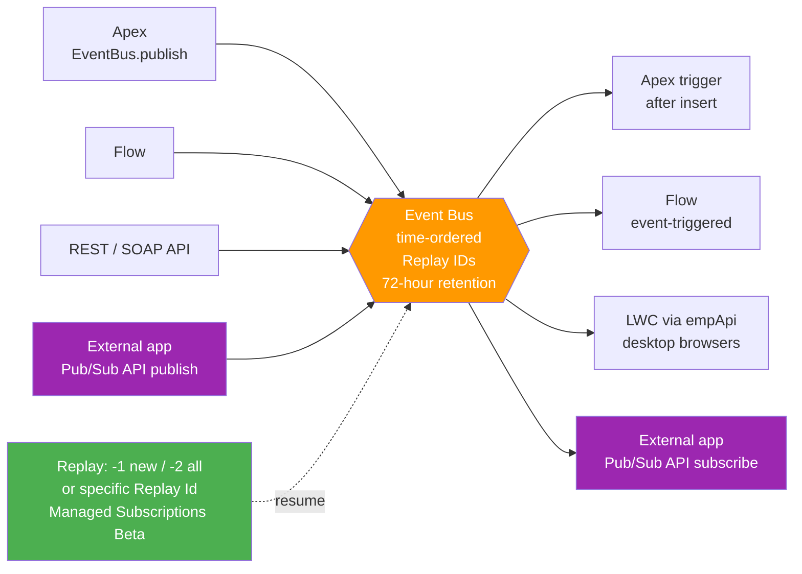

# 06 - Publishing, Subscribing, and Replay

> **One-liner**: The practical how-to that ties the module together. **Who can publish**, **who can subscribe**, and **how replay** keeps subscribers from missing or duplicating events.
> **Scope**: Applies across [Platform Events](02-platform-events.md), [Change Data Capture](03-change-data-capture.md), and the [Pub/Sub API](04-pub-sub-api.md). The legacy mechanisms live in [05](05-streaming-api-and-outbound-messages.md).
> **Goal of this file**: Be able to wire up a publisher, a subscriber, and a resilient replay strategy, and defend the design in an interview.

This is Module 06. If "event bus", "Replay ID", and "at-least-once" are not yet automatic, read [01-event-driven-basics.md](01-event-driven-basics.md) first.

---

## 1. The idea in plain English

Think of the event bus as a **conveyor belt** running through a warehouse. **Publishers** drop labeled boxes onto the belt. **Subscribers** stand alongside and grab the boxes meant for them. Nobody hands a box directly to anyone; the belt is the only contact point. That is the whole decoupling story.

Every box gets a **position number** as it lands. That number is the **Replay ID**. If a worker steps away and comes back, they do not start over and they do not miss boxes. They say "I last handled position 4012, continue from there." As long as the box is still on the belt (within the **72-hour** retention window), they catch up cleanly.

So three questions drive every design: **how do I put a box on the belt** (publish), **how do I pick boxes off** (subscribe), and **how do I never lose my place** (replay). The rest is detail.

---

## 2. Publishers and subscribers at a glance

| Role | Option | Best for |
|---|---|---|
| **Publish** | Apex `EventBus.publish()` | Custom logic, bulk publishing, callbacks |
| **Publish** | Flow (Create Records on the event object) | Low-code, admin-built signals |
| **Publish** | REST / SOAP API (insert the event sObject) | External systems publishing in |
| **Publish** | **Pub/Sub API** (gRPC `Publish`) | Efficient external publishing, Avro payloads |
| **Subscribe** | **Apex trigger** (`after insert`) | Server-side reaction, DML, callouts (async) |
| **Subscribe** | Flow (event-triggered) | Low-code reaction inside Salesforce |
| **Subscribe** | **LWC via `lightning/empApi`** | Live UI updates in desktop browsers |
| **Subscribe** | **External app via Pub/Sub API** | Off-platform consumers, microservices |

**Rule of thumb**: inside Salesforce, publish with Apex or Flow and subscribe with a trigger or Flow. For anything **off-platform**, reach for the **Pub/Sub API** on both sides.

---

## 3. How it works (publishers to bus to subscribers, with replay)



**Walkthrough**

1. A publisher writes an event to the bus. With **"Publish Immediately"** behavior the event is sent **outside the database transaction**, so subscribers must not assume the publishing transaction's DML is committed.
2. The bus assigns a **Replay ID** and stores the event in **time order** for **72 hours**.
3. Each subscriber receives the event. **Apex triggers** fire `after insert` on the event object, in **batches of up to 2,000** event messages.
4. A subscriber that disconnects resumes by passing a **replay option**: `-1` (new only), `-2` (all retained), or a **specific Replay ID** it persisted.
5. With **Managed Event Subscriptions (Beta)** the server tracks the committed Replay ID for you, so the client does not have to store it.

---

## 4. The actual code

**Publish with Apex** (`EventBus.publish` returns a `Database.SaveResult` per event):

```apex
List<Order_Shipped__e> evts = new List<Order_Shipped__e>{
    new Order_Shipped__e(Order_Id__c = '801xx', Carrier__c = 'DHL')
};
List<Database.SaveResult> results = EventBus.publish(evts);
for (Database.SaveResult sr : results) {
    if (!sr.isSuccess()) {
        for (Database.Error err : sr.getErrors()) {
            System.debug('Publish enqueue failed: ' + err.getMessage());
        }
    }
}
// Note: SaveResult is the ENQUEUE result, not the final publish result.
// For the final outcome, pass an EventBus.EventPublishSuccessCallback /
// EventPublishFailureCallback as the second argument.
```

**Subscribe with an Apex trigger** (idempotent, with retry):

```apex
trigger OrderShippedTrigger on Order_Shipped__e (after insert) {
    Set<String> uuids = new Set<String>();
    for (Order_Shipped__e e : Trigger.new) uuids.add(e.EventUuid);

    // Idempotency: skip events already processed (EventUuid, API 52.0+)
    Set<String> done = new Set<String>(...); // query your processed-log

    List<Task> toCreate = new List<Task>();
    for (Order_Shipped__e e : Trigger.new) {
        if (done.contains(e.EventUuid)) continue;
        try {
            toCreate.add(new Task(Subject = 'Notify ' + e.Order_Id__c));
        } catch (CalloutException ex) {
            // Transient failure: retry the whole batch later
            throw new EventBus.RetryableException('Transient error, retrying');
        }
    }
    insert toCreate; // also persist EventUuids to your processed-log
}
```

**Subscribe in an LWC** with `lightning/empApi` (desktop browsers, API 44.0+):

```javascript
import { subscribe, onError } from 'lightning/empApi';
// channel '/event/Order_Shipped__e', replayId -1 = new events only
subscribe('/event/Order_Shipped__e', -1, (msg) => {
    // react in the UI
}).then((sub) => { this.subscription = sub; });
onError((err) => console.error('empApi error', err));
```

**External apps** subscribe through the **Pub/Sub API** (gRPC over HTTP/2, **Avro** payloads) using a `ReplayPreset` of `LATEST`, `EARLIEST`, or `CUSTOM` with a saved Replay ID. See [04-pub-sub-api.md](04-pub-sub-api.md).

---

## 5. Replay, resilience, and error handling

| Topic | What to know | What to do |
|---|---|---|
| **Replay options** | `-1` new only, `-2` all retained, or a specific **Replay ID** to resume. | Persist the last processed Replay ID after each batch. |
| **Retention window** | High-volume events and CDC live **72 hours**. PushTopics only 24h. | Recover within the window; design for catch-up after outages. |
| **Managed Subscriptions (Beta)** | Server tracks the committed Replay ID via `ManagedEventSubscription`. | Use it to drop client-side replay-store bookkeeping. |
| **At-least-once delivery** | Subscribers can see an event more than once. | Make handlers **idempotent**, keyed on **`EventUuid`**. |
| **Apex retry** | Throw **`EventBus.RetryableException`** to reprocess the batch on transient errors. | Keep retries to **fewer than 9**; beyond the limit the trigger hits an error state. |
| **Decoupled commit** | "Publish Immediately" runs outside the publisher's transaction. | Do not assume publisher DML is committed when the event arrives. |
| **Publish result** | `EventBus.publish` returns an **enqueue** `SaveResult`, not the final result. | Use **publish callbacks** for the real success/failure. |
| **empApi limits** | Works in **desktop browsers** only, not the Salesforce mobile app. | For mobile or off-platform, use the Pub/Sub API. |

---

## 6. Interview Q&A

**Q: What are the ways to publish an event in Salesforce?**
A: Apex `EventBus.publish()`, Flow (create a record on the event object), the REST or SOAP API (insert the event sObject), and the **Pub/Sub API** for efficient external publishing. Inside the platform Apex and Flow are typical; off-platform publishers use Pub/Sub API.

**Q: What are the ways to subscribe?**
A: **Apex triggers** (`after insert` on the event or CDC object), **Flow** (event-triggered), **LWC via `lightning/empApi`** for live desktop UI, and **external apps via the Pub/Sub API**. Server-side logic uses triggers; UIs use empApi; off-platform consumers use Pub/Sub API.

**Q: How does replay work and why does it matter?**
A: Every event gets a **Replay ID** marking its position. A subscriber resumes with `-1` (new only), `-2` (all retained), or a specific Replay ID it stored. Because retention is **72 hours**, a subscriber that drops off can catch up by replaying from its last position within that window.

**Q: How do you make an Apex subscriber resilient?**
A: Make it **idempotent**, keyed on the **`EventUuid`** field, so duplicates are harmless. Wrap transient failures and throw **`EventBus.RetryableException`** to reprocess the batch, keeping retries to **fewer than nine** so the trigger does not hit its error state. Persist the last Replay ID for recovery.

**Q: What is the trap with `EventBus.publish` and "Publish Immediately"?**
A: The returned `Database.SaveResult` is only the **enqueue** result, not the final publish outcome; use **publish callbacks** for that. And with "Publish Immediately" the event fires **outside the transaction**, so a subscriber must not assume the publisher's DML committed.

**Q: What are Managed Event Subscriptions?**
A: A **Beta** capability where Salesforce tracks the committed **Replay ID server-side** (configured via `ManagedEventSubscription`), so the client resumes seamlessly after a disconnect without maintaining its own replay store.

**Talking point to explain it to anyone**: "Publishers drop labeled boxes on a conveyor belt, subscribers pick off the ones they want, and every box has a position number so anyone who steps away can come back and continue from exactly where they left off."

---

## 7. Key terms

Publish, subscribe, `EventBus.publish`, publish callback, Apex trigger subscriber, `lightning/empApi`, Pub/Sub API, Replay ID, retention, Managed Event Subscriptions, `EventBus.RetryableException`, `EventUuid`, idempotency - defined here and in [01-event-driven-basics.md](01-event-driven-basics.md) and the [README](README.md).

---

## Sources (Verified June 2026)

- [Publish Event Messages with Apex - Platform Events Developer Guide](https://developer.salesforce.com/docs/atlas.en-us.platform_events.meta/platform_events/platform_events_publish_apex.htm)
- [Get the Result of Async Publishing with Apex Publish Callbacks - Platform Events Developer Guide](https://developer.salesforce.com/docs/atlas.en-us.platform_events.meta/platform_events/platform_events_publish_callbacks.htm)
- [Subscribe to Platform Event Notifications with Apex Triggers - Platform Events Developer Guide](https://developer.salesforce.com/docs/atlas.en-us.platform_events.meta/platform_events/platform_events_subscribe_apex.htm)
- [Retry Event Triggers with EventBus.RetryableException - Platform Events Developer Guide](https://developer.salesforce.com/docs/atlas.en-us.platform_events.meta/platform_events/platform_events_subscribe_apex_refire.htm)
- [Subscribe to Platform Event Notifications in a Lightning Component (empApi) - Platform Events Developer Guide](https://developer.salesforce.com/docs/atlas.en-us.platform_events.meta/platform_events/platform_events_subscribe_lc.htm)
- [Managed Event Subscriptions (Beta) - Pub/Sub API](https://developer.salesforce.com/docs/platform/pub-sub-api/guide/managed-sub.html)
- [Subscribe RPC Method (ReplayPreset) - Pub/Sub API](https://developer.salesforce.com/docs/platform/pub-sub-api/references/methods/subscribe-rpc.html)

---

*Next: back to the [README](README.md) for the module map, or revisit [04-pub-sub-api.md](04-pub-sub-api.md) for the modern transport in depth.*
