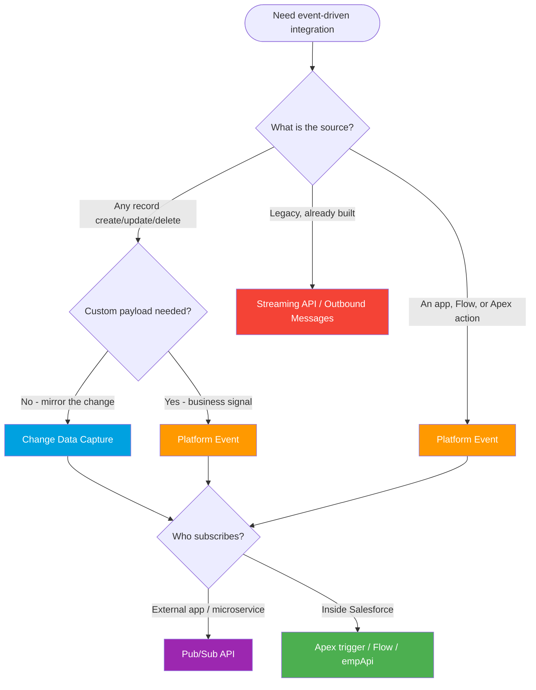

# Module 06 - Event-Driven Integration

> **Goal**: Stop polling. Use events. This is the modern way to integrate in real time.
> **API version**: v66.0 (Spring '26). **Retention**: high-volume Platform Events and CDC are kept on the event bus for **72 hours** (not 96). Standard-volume events (24h) are retired.

Event-driven means a publisher **broadcasts a change** and subscribers react, with no direct coupling and no polling. Start with **[01-event-driven-basics.md](01-event-driven-basics.md)** for the event bus and pub/sub model. New to push vs pull? See [Module 01](../01-Fundamentals/07-push-pull-and-webhooks.md).

---

## How to use this module

1. Read **[01-event-driven-basics.md](01-event-driven-basics.md)** (event bus, replay, retention).
2. Learn the two event sources: **[Platform Events](02-platform-events.md)** (you define) and **[CDC](03-change-data-capture.md)** (automatic).
3. Learn the modern subscriber API: **[Pub/Sub API](04-pub-sub-api.md)**.
4. Know the **[legacy](05-streaming-api-and-outbound-messages.md)** mechanisms and the **[how-to of publishing/subscribing/replay](06-publishing-subscribing-and-replay.md)**.

---

## Map of this module

| # | File | What it covers |
|---|---|---|
| 01 | [event-driven-basics](01-event-driven-basics.md) | Event bus, pub/sub, replay, 72h retention |
| 02 | [platform-events](02-platform-events.md) | Custom events you define and publish (`__e`) |
| 03 | [change-data-capture](03-change-data-capture.md) | Automatic events on record changes |
| 04 | [pub-sub-api](04-pub-sub-api.md) | Modern gRPC + Avro publish/subscribe |
| 05 | [streaming-api-and-outbound-messages](05-streaming-api-and-outbound-messages.md) | Legacy push (PushTopic, generic, SOAP) |
| 06 | [publishing-subscribing-and-replay](06-publishing-subscribing-and-replay.md) | The how-to across all event types |

---

## Which event mechanism? (decision tree)

---

## Comparison table

| Mechanism | Who creates the event | Schema | Subscribers | When to use |
|---|---|---|---|---|
| **Platform Events** (02) | You (intentional business event) | Custom fields you define | Apex, Flow, empApi, Pub/Sub | "OrderShipped", "PaymentReceived" |
| **Change Data Capture** (03) | Salesforce (auto on record change) | Fixed: header + changed fields | Apex, Flow, empApi, Pub/Sub | Mirror data to an external store |
| **Pub/Sub API** (04) | n/a (transport for PE + CDC) | Avro per topic | External apps, microservices | Efficient external publish/subscribe |
| **Streaming API** (05) | PushTopic (SOQL) / generic | JSON | CometD clients | ⚠️ Legacy. Avoid for new builds |
| **Outbound Messages** (05) | Workflow / Flow (declarative) | Configured field set | A SOAP endpoint | ⚠️ Legacy declarative push |

---

## Platform Events vs Change Data Capture (the classic question)

| Question | Platform Events | CDC |
|---|---|---|
| Who creates the event? | **You** (a deliberate signal) | Salesforce (automatic) |
| Schema | You define the fields | Fixed: `ChangeEventHeader` + changed fields |
| Best for | Business events | Replicating record changes |
| Customizable payload? | Yes | No |

---

## What changed worth knowing (2025-2026)

- **Retention is 72 hours** for high-volume Platform Events and CDC. The "96 hours" figure is a myth. (Legacy standard-volume events were 24h and are retired.)
- **Pub/Sub API** (gRPC + Avro) is the modern subscriber API. The **Streaming API** (CometD) is legacy for new builds.
- **Managed Event Subscriptions (Beta)** let the Pub/Sub API track Replay IDs server-side.
- **Outbound Messages** remain, but Workflow Rules / Process Builder are no longer enhanced; build new declarative push in **Flow**.

---

## Interview rapid-fire

**Q: Platform Events vs CDC?**
→ Platform Events are custom business signals you publish on purpose. CDC is automatic, fixed-schema events on record changes, ideal for data replication.

**Q: How do subscribers recover missed events?**
→ Store the **Replay ID** and resubscribe from it within the **72-hour** window (`-1` new-only, `-2` all retained).

**Q: How should an external microservice subscribe today?**
→ The **Pub/Sub API** (gRPC + Avro), not the legacy CometD Streaming API.

**Q: Is delivery exactly-once?**
→ No, at-least-once. Subscribers must be **idempotent**.

---

## Sources (Verified June 2026)

- [Platform Events Developer Guide](https://developer.salesforce.com/docs/atlas.en-us.platform_events.meta/platform_events/platform_events_intro.htm)
- [Change Data Capture Developer Guide](https://developer.salesforce.com/docs/atlas.en-us.change_data_capture.meta/change_data_capture/cdc_intro.htm)
- [Pub/Sub API — Event Message Durability](https://developer.salesforce.com/docs/platform/pub-sub-api/guide/event-message-durability.html)
- [Platform Event Allocations](https://developer.salesforce.com/docs/atlas.en-us.platform_events.meta/platform_events/platform_event_limits.htm)

*Each file has its own Sources section with the specific official doc.*
