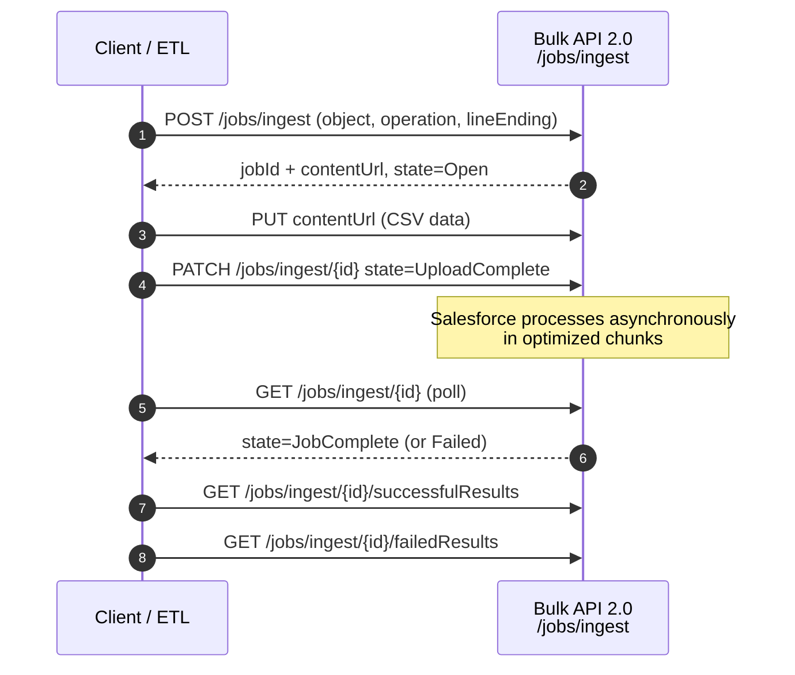

# 01 - Bulk API 2.0

> **One-liner**: A REST-based, **asynchronous** API for loading or extracting **large data sets** (think 2,000 to millions of records) without hitting synchronous limits.
> **Direction**: usually External → Salesforce (load) or Salesforce → External (extract). **Timing**: asynchronous, job-based. **Format**: CSV.
> **Use when**: You need to insert, update, upsert, delete, or query **lots** of records efficiently.

This is Module 07, bulk and async. This is the [Batch Data Synchronization pattern](../02-Integration-Patterns/03-batch-data-synchronization.md) in practice. For auth, see [Module 03](../03-Authentication/README.md).

---

## 1. The idea in plain English

Bulk API 2.0 is **freight shipping**, not mailing envelopes. If you have two letters, you use the post office (the [REST API](../04-Inbound-APIs/01-standard-rest-api.md), one record per call). If you have two million, you load a shipping container, hand it to the freight company, and they process it in the background while you go do other things. You come back later and pick up two receipts: what shipped successfully and what failed.

That "hand it off and check back" rhythm is the whole API. You **create a job**, **upload a CSV**, tell Salesforce you're **done uploading**, and Salesforce processes the records **asynchronously** in optimized chunks. You then **poll** for completion and download success and failure results. You never hold a synchronous connection open while millions of rows process.

---

## 2. When to use it (and when not)

| ✅ Use it when | ❌ Avoid / use something else |
|---|---|
| **2,000+ records** to load or extract. | A handful of records → [Standard REST API](../04-Inbound-APIs/01-standard-rest-api.md). |
| You want Salesforce to **optimize and parallelize** processing. | A few related records atomically → [Composite API](../04-Inbound-APIs/05-composite-api.md). |
| Nightly / scheduled large syncs (ETL). | Salesforce processing **its own** data → [Batch Apex](03-batch-apex.md). |
| Exporting a **huge query** result. | Real-time, per-record reaction → [events](../06-Event-Driven/README.md). |

**Real-world examples**: an ETL tool loads 2M Accounts from SAP nightly, a migration upserts 500K Contacts by External Id, a warehouse exports all Opportunities via a bulk query.

---

## 3. How it works (the job lifecycle)



**Walkthrough**

1-2. Create the job (object + operation like `insert`/`upsert`/`update`/`delete`/`hardDelete`); Salesforce returns a `jobId` and a `contentUrl`.
3. Upload the record data as **CSV** to the content URL.
4. PATCH the job to `UploadComplete` to signal you're done.
5-6. Salesforce processes in the background; you **poll** the job status.
7-8. Once `JobComplete`, download **successfulResults** and **failedResults** (and optionally **unprocessedrecords**).

---

## 4. The actual requests

Base: `https://MyDomainName.my.salesforce.com/services/data/v66.0/jobs/`

**Create an ingest job**

```
POST /services/data/v66.0/jobs/ingest
Authorization: Bearer 00D...!AQ...
Content-Type: application/json

{ "object": "Account", "operation": "upsert", "externalIdFieldName": "External_Id__c", "lineEnding": "LF" }
```

**Upload the CSV** (to the returned `contentUrl`)

```
PUT /services/data/v66.0/jobs/ingest/{jobId}/batches
Content-Type: text/csv

Name,External_Id__c
Acme Corp,EXT-001
Globex,EXT-002
```

**Close the job for processing**

```
PATCH /services/data/v66.0/jobs/ingest/{jobId}
{ "state": "UploadComplete" }
```

Then `GET /jobs/ingest/{jobId}` to poll, and `GET .../successfulResults` and `.../failedResults` to retrieve outcomes. **Bulk query** works the same way via `/jobs/query` with a SOQL `query`, then download the result stream.

> **Upsert by External Id** is the safe, idempotent way to load: a retried job updates rather than duplicating. This is the backbone of reliable data syncs.

---

## 5. Design considerations and limits

| Consideration | Detail | What to do |
|---|---|---|
| **Data per job** | Up to **150 MB** of CSV per job. | Split very large loads across jobs. |
| **Daily allocation** | Up to **100 million records per rolling 24 hours** (Bulk API 2.0). | Plan large migrations within the window. |
| **Jobs in any state** | Up to **100,000** at once. | Clean up old jobs. |
| **Query threshold** | Bulk query is designed for **2,000+** record results. | Below that, a normal SOQL/REST query is simpler. |
| **Idempotency** | Retries can duplicate inserts. | Use **upsert by External Id**. |
| **Record locking** | Parallel processing can cause lock contention (e.g. many children to one parent). | Order/group data, or process serially if needed. |
| **Errors** | Failures come back in a **failedResults** CSV. | Inspect, fix, and re-load only the failures. |
| **Huge queries** | Very large extracts use **PK Chunking**. | See [02-bulk-api-1-and-pk-chunking.md](02-bulk-api-1-and-pk-chunking.md). |

---

## 6. Interview Q&A

**Q: What is Bulk API 2.0 and when do you use it?**
A: A REST-based, asynchronous, CSV job API for large data operations (roughly 2,000+ records). You create a job, upload data, mark it complete, and Salesforce processes it in the background while you poll and then download success/failure results.

**Q: Bulk API 2.0 vs the standard REST API?**
A: REST is synchronous and per-record (great for small operations). Bulk 2.0 is asynchronous and built for volume, with Salesforce optimizing and parallelizing the processing.

**Q: Bulk API 2.0 vs Batch Apex?**
A: Bulk API is for an **external** client moving large data in or out. Batch Apex is **Apex** processing Salesforce's own data in chunks server-side. Different initiators, different tools.

**Q: How do you avoid duplicates and handle failures in a bulk load?**
A: Upsert by **External Id** for idempotency, then read the **failedResults** CSV, fix those rows, and re-load only the failures.

**Q: Key Bulk API 2.0 limits?**
A: About 150 MB per job, up to 100 million records per rolling 24 hours, and up to 100,000 jobs in any state. Bulk query targets result sets of 2,000+ records.

**Talking point to explain it to anyone**: "It's freight shipping for data. You load a container, hand it off, Salesforce processes it in the background, and you come back for the receipts."

---

## 7. Key terms

Bulk job, ingest, query job, CSV, upsert, External Id, asynchronous, PK chunking - defined in [Module 01 vocabulary](../01-Fundamentals/02-core-vocabulary.md) and the [README](README.md).

---

## Sources (Verified June 2026)

- [Bulk API 2.0 — Bulk API 2.0 and Bulk API Developer Guide](https://developer.salesforce.com/docs/atlas.en-us.api_asynch.meta/api_asynch/bulk_api_2_0.htm)
- [Bulk API 2.0 Ingest — Developer Guide](https://developer.salesforce.com/docs/atlas.en-us.api_asynch.meta/api_asynch/bulk_api_2_0_ingest.htm)
- [Bulk API and Bulk API 2.0 Limits and Allocations](https://developer.salesforce.com/docs/atlas.en-us.salesforce_app_limits_cheatsheet.meta/salesforce_app_limits_cheatsheet/salesforce_app_limits_platform_bulkapi.htm)

---

*Next: [02-bulk-api-1-and-pk-chunking.md](02-bulk-api-1-and-pk-chunking.md) - the legacy batch-based API and chunking huge queries.*
