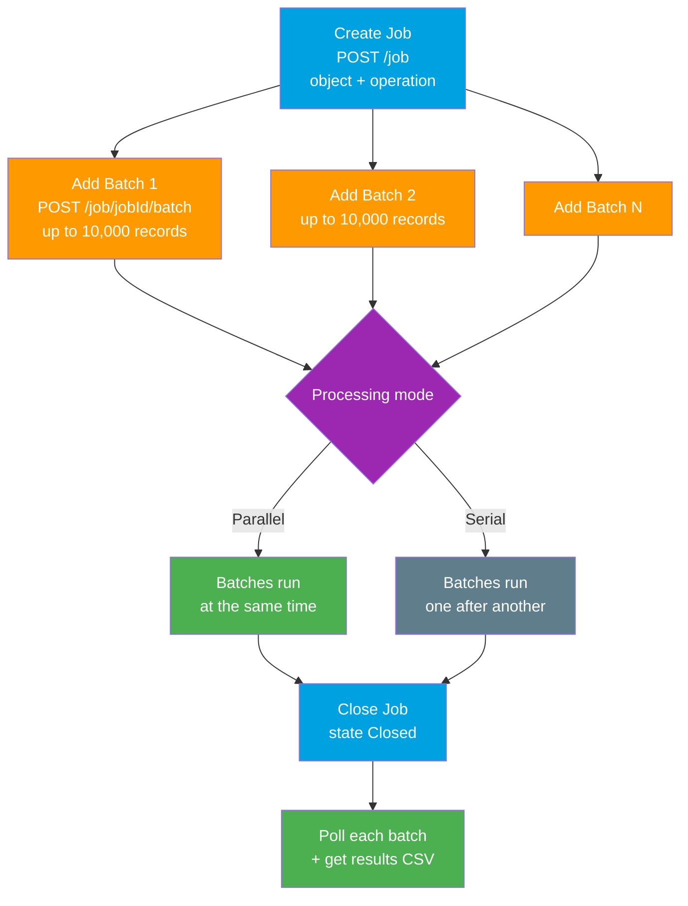

# 02 - Bulk API 1.0 and PK Chunking

> **One-liner**: The **legacy** batch-based bulk API where **you** create and manage the batches yourself, plus **PK Chunking**, the trick for extracting enormous tables in Id-range slices.
> **Direction**: External ↔ Salesforce, large volumes. **Timing**: asynchronous, job + batch based. **Format**: CSV, XML, or JSON.
> **Use when**: You need fine-grained batch control, a tool that only speaks Bulk 1.0, or you are extracting a multi-million-row object via PK Chunking.

This is Module 07, bulk and async. Bulk API 1.0 is the predecessor to [Bulk API 2.0](01-bulk-api-2.md). For the [Batch Data Synchronization pattern](../02-Integration-Patterns/03-batch-data-synchronization.md) and auth, see [Module 03](../03-Authentication/README.md).

---

## 1. The idea in plain English

If [Bulk API 2.0](01-bulk-api-2.md) is handing a freight company one big shipping container and letting **them** decide how to pack the trucks, **Bulk API 1.0** is renting the trucks yourself. You open a job, then you personally load each truck (a **batch**), tell the depot how many trucks you sent, and track each one. More work, but you control exactly how the cargo is split.

That is the core difference. In **Bulk 1.0 you create batches explicitly**. In Bulk 2.0 you just upload one CSV and Salesforce auto-creates the batches for you. Bulk 1.0 is older, SOAP-flavored, and more verbose, but it still wins in two cases: when you need **manual batch control**, and when you turn on **PK Chunking** to extract a giant table.

**PK Chunking** is a separate idea you bolt onto a bulk **query**. Imagine photographing every page of a 50-million-page book. You cannot do it in one shot. So you say "pages 1 to 100,000, then 100,001 to 200,000..." PK Chunking does exactly that automatically, slicing one huge query into chunks by the record's primary key (**Id**) ranges.

---

## 2. When to use it (and when not)

| ✅ Use Bulk 1.0 / PK Chunking when | ❌ Use something else when |
|---|---|
| You need **manual control** over batch boundaries. | A normal large load → [Bulk API 2.0](01-bulk-api-2.md) (auto-batches, simpler). |
| A tool or middleware **only supports Bulk 1.0**. | A handful of records → [Standard REST API](../04-Inbound-APIs/01-standard-rest-api.md). |
| You want **XML or JSON** ingest, not just CSV. | Salesforce processing **its own** data → [Batch Apex](03-batch-apex.md). |
| Extracting **millions of rows** from one big object → **PK Chunking**. | Small query results → plain SOQL / REST query. |

**Real-world examples**: a legacy ETL job that was built on Bulk 1.0 and still runs nightly, a data-warehouse export of a **40M-row** Task object using PK Chunking, a migration tool that needs to retry one specific failed batch without re-sending the rest.

---

## 3. How it works



**Walkthrough**

1. **Create a job** specifying the object, the operation (`insert`, `update`, `upsert`, `delete`, `hardDelete`, `query`), and the content type.
2. **Add one or more batches** to that job. Each batch is a file of records you upload yourself, up to **10,000 records per batch**.
3. Salesforce processes batches in either **parallel** (default, fastest) or **serial** mode, set by `concurrencyMode` on the job.
4. **Close the job** so no more batches can be added.
5. **Poll each batch** for status and download per-batch result files (success, error).

The contrast with [Bulk API 2.0](01-bulk-api-2.md): there you never touch batches. You upload one CSV, PATCH the job to `UploadComplete`, and Salesforce chunks and parallelizes it internally.

---

## 4. The actual requests

Base: `https://MyDomainName.my.salesforce.com/services/async/66.0/`

**Create a job** (note the older `/async/` path and XML body)

```
POST /services/async/66.0/job
X-SFDC-Session: 00D...!AQ...
Content-Type: application/xml

<jobInfo xmlns="http://www.force.com/2009/06/asyncapi/dataload">
  <operation>upsert</operation>
  <object>Account</object>
  <externalIdFieldName>External_Id__c</externalIdFieldName>
  <concurrencyMode>Parallel</concurrencyMode>
  <contentType>CSV</contentType>
</jobInfo>
```

**Add a batch** (you do this per chunk of up to 10,000 records)

```
POST /services/async/66.0/job/{jobId}/batch
Content-Type: text/csv

Name,External_Id__c
Acme Corp,EXT-001
Globex,EXT-002
```

**Close the job**, then `GET /job/{jobId}/batch/{batchId}` to poll and `GET /job/{jobId}/batch/{batchId}/result` to retrieve outcomes.

**PK Chunking** for a huge extract is just a header on a **query** job:

```
POST /services/async/66.0/job
Sforce-Enable-PKChunking: chunkSize=100000
Content-Type: application/xml

<jobInfo xmlns="http://www.force.com/2009/06/asyncapi/dataload">
  <operation>query</operation>
  <object>Task</object>
  <contentType>CSV</contentType>
</jobInfo>
```

Salesforce then **auto-creates batches**, each covering one Id range, and you download each batch's result file. The **default chunk size is 100,000** records and is configurable up to **250,000** via the `chunkSize` field.

---

## 5. Bulk 1.0 vs 2.0, and design limits

**Bulk API 1.0 vs Bulk API 2.0**

| Aspect | Bulk API 1.0 | Bulk API 2.0 |
|---|---|---|
| Protocol | SOAP-style `/async/` endpoints | **REST** `/jobs/` endpoints |
| Batch management | **You create batches manually** | **Auto-created** by Salesforce |
| Records per batch | Up to **10,000** (you control) | Salesforce decides internally |
| Formats | **CSV, XML, JSON** | CSV only |
| Processing mode | **Parallel or serial** (`concurrencyMode`) | Salesforce optimizes automatically |
| Complexity | Higher, more moving parts | Lower, simpler workflow |
| Recommendation | Legacy / special cases | **Default, recommended** |

**Key limits and considerations**

| Consideration | Detail | What to do |
|---|---|---|
| **Records per batch** | Max **10,000** records per batch. | Split large loads into 10K batches yourself. |
| **Batch processing mode** | **Parallel** (default) is fastest; **serial** avoids lock contention. | Use serial when many children point to the same parent. |
| **PK Chunking default** | Chunk size defaults to **100,000**, up to **250,000**. | Larger chunks = fewer batches but slower each. |
| **PK Chunking target** | Splits by record **Id** ranges, ideal for big extracts. | Use on multi-million-row objects only. |
| **Record locking** | Parallel batches can deadlock on shared parents. | Group/order data or switch to serial. |
| **Errors** | Results come back **per batch** as CSV. | Re-submit only the failed batch. |

---

## 6. Interview Q&A

**Q: What is the difference between Bulk API 1.0 and 2.0?**
A: Bulk 1.0 is the older SOAP-style API where **you create and manage batches yourself** (up to 10,000 records each) and choose parallel or serial processing. Bulk 2.0 is REST-based, **auto-creates the batches**, supports CSV only, and is simpler. 2.0 is the recommended default; 1.0 is for legacy tools or when you need manual batch control.

**Q: How many records can a Bulk API 1.0 batch hold?**
A: Up to **10,000 records** per batch, and Bulk 1.0 also accepts XML and JSON, not just CSV.

**Q: What is PK Chunking and when do you use it?**
A: It is a request header, `Sforce-Enable-PKChunking`, on a bulk **query** that splits one enormous query into chunks by record **Id** range. Default chunk size is **100,000** (configurable up to 250,000). You use it to extract very large objects, think tens of millions of rows.

**Q: Parallel vs serial mode in Bulk 1.0?**
A: Parallel runs batches simultaneously for maximum throughput. Serial runs them one at a time, which you choose when parallel processing causes record-lock contention, like many child records updating the same parent.

**Q: Would you ever pick Bulk 1.0 over 2.0 today?**
A: Only for specific reasons: a middleware tool that only speaks Bulk 1.0, a need for XML/JSON ingest, or a requirement for fine-grained manual batch control. Otherwise Bulk 2.0 is simpler and recommended.

**Talking point to explain it to anyone**: "Bulk 2.0 hands the mover one big box and lets them pack the trucks. Bulk 1.0 means you pack each truck yourself. PK Chunking is how you photograph a giant book one hundred-thousand-page chunk at a time."

---

## 7. Key terms

Job, batch, parallel mode, serial mode, concurrencyMode, PK Chunking, chunkSize, primary key, Id range - defined in [Module 01 vocabulary](../01-Fundamentals/02-core-vocabulary.md) and the [README](README.md).

---

## Sources (Verified June 2026)

- [Bulk API (1.0) - Bulk API 2.0 and Bulk API Developer Guide](https://developer.salesforce.com/docs/atlas.en-us.api_asynch.meta/api_asynch/api_asynch_introduction_bulk_api.htm)
- [Work with Batches - Bulk API Developer Guide](https://developer.salesforce.com/docs/atlas.en-us.api_asynch.meta/api_asynch/asynch_api_batches_intro.htm)
- [PK Chunking Header - Bulk API Developer Guide](https://developer.salesforce.com/docs/atlas.en-us.api_asynch.meta/api_asynch/async_api_headers_enable_pk_chunking.htm)
- [Use PK Chunking to Extract Large Data Sets - Salesforce Developers Blog](https://developer.salesforce.com/blogs/engineering/2015/03/use-pk-chunking-extract-large-data-sets-salesforce)
- [Bulk API and Bulk API 2.0 Limits and Allocations](https://developer.salesforce.com/docs/atlas.en-us.salesforce_app_limits_cheatsheet.meta/salesforce_app_limits_cheatsheet/salesforce_app_limits_platform_bulkapi.htm)

---

*Next: [03-batch-apex.md](03-batch-apex.md) - processing the org's own large data sets server-side in chunks.*
