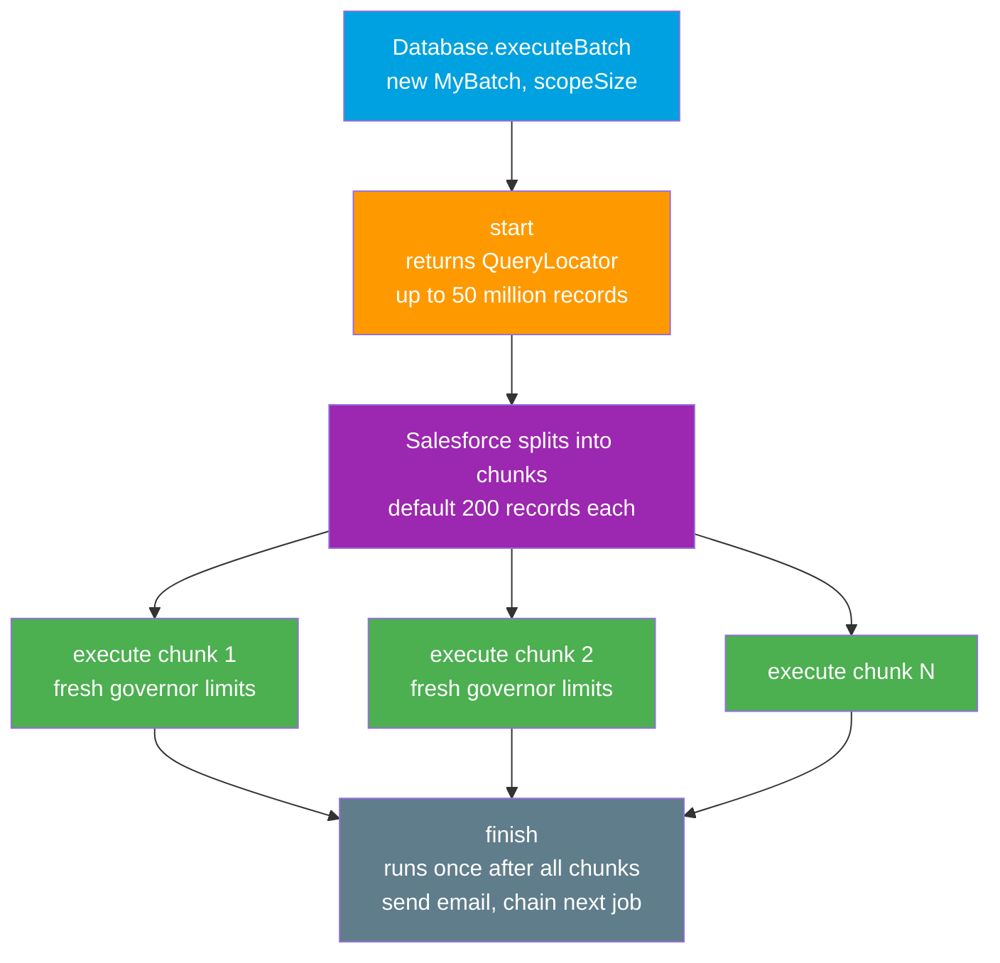

# 03 - Batch Apex

> **One-liner**: An Apex framework for processing **large data sets the org already owns**, split into chunks that each run with a **fresh set of governor limits**.
> **Direction**: Internal to Salesforce (Apex on its own data). **Timing**: asynchronous, job-based. **Scale**: up to **50 million** records.
> **Use when**: You must touch more records than a single synchronous transaction allows, like recalculating or cleaning millions of rows.

This is Module 07, bulk and async. Where [Bulk API 2.0](01-bulk-api-2.md) is an **external** client moving data, Batch Apex is **Salesforce processing its own data**. Compare with [Queueable Apex](04-queueable-apex.md) for chained jobs.

---

## 1. The idea in plain English

Imagine you must repaint every room in a 50-story hotel, but you can only carry enough paint for **one floor at a time**. So you do floor 1, refill your supplies completely, do floor 2, refill again, and so on. Each floor is a fresh start with a full bucket.

That is Batch Apex. Salesforce caps how much one transaction can do (the **governor limits**). If you need to update millions of records, you cannot do it in one go. Batch Apex slices the work into **chunks** (default **200 records** each) and runs each chunk as its **own transaction with its own limits reset**. So a job that would blow past limits in one shot quietly grinds through millions of records, chunk by chunk.

You write a class with three methods: **`start`** decides what to process, **`execute`** does the work on one chunk, and **`finish`** wraps up. Salesforce calls them in that order and manages the chunking for you.

---

## 2. When to use it (and when not)

| ✅ Use Batch Apex when | ❌ Use something else when |
|---|---|
| Processing **the org's own** large data set (thousands to millions). | Loading data **from outside** → [Bulk API 2.0](01-bulk-api-2.md). |
| The work exceeds a single transaction's governor limits. | Small async task, maybe one callout → [Queueable Apex](04-queueable-apex.md). |
| Nightly cleanup, recalculation, or mass update. | A quick fire-and-forget call → [@future](05-future-methods.md). |
| You need **scheduled** large jobs (pair with Scheduled Apex). | Real-time per-record reaction → [triggers / events](../06-Event-Driven/README.md). |

**Real-world examples**: recalculating a rollup on **5M** Opportunities nightly, anonymizing 2M old Leads for GDPR, reassigning ownership across the whole Account base, archiving stale records in chunks.

---

## 3. How it works (start, execute, finish)



**Walkthrough**

1. You kick off the job with `Database.executeBatch(new MyBatch(), scopeSize)`.
2. **`start()`** returns a `Database.QueryLocator` (a query that can stream up to **50 million** records) or an `Iterable`.
3. Salesforce splits those records into chunks, **default 200** per chunk (configurable **1 to 2,000** for a QueryLocator).
4. **`execute()`** runs once per chunk. Each run is a **separate transaction with governor limits reset**, so the job survives volume.
5. **`finish()`** runs once, after all chunks complete. Good for a summary email or chaining the next job.

Two add-on interfaces matter: **`Database.Stateful`** preserves instance variables across chunks (otherwise state resets each `execute`), and **`Database.AllowsCallouts`** lets `execute` make HTTP callouts.

---

## 4. The actual code

```apex
public class AccountCleanupBatch
        implements Database.Batchable<sObject>, Database.Stateful, Database.AllowsCallouts {

    // Database.Stateful keeps this value alive across all chunks.
    public Integer recordsProcessed = 0;

    // 1) start: define the scope. QueryLocator handles up to 50M records.
    public Database.QueryLocator start(Database.BatchableContext bc) {
        return Database.getQueryLocator(
            'SELECT Id, Name, Industry FROM Account WHERE Industry = null'
        );
    }

    // 2) execute: runs per chunk (default 200 records), fresh limits each time.
    public void execute(Database.BatchableContext bc, List<Account> scope) {
        for (Account a : scope) {
            a.Industry = 'Unspecified';
        }
        update scope;
        recordsProcessed += scope.size();
    }

    // 3) finish: runs once after all chunks finish.
    public void finish(Database.BatchableContext bc) {
        System.debug('Done. Total processed: ' + recordsProcessed);
        // Could send an email or chain another batch / Queueable here.
    }
}
```

**Invoke it** (second argument is the chunk size, here 200):

```apex
// Default scope of 200:
Database.executeBatch(new AccountCleanupBatch());

// Explicit smaller scope when execute does heavy work per record:
Database.executeBatch(new AccountCleanupBatch(), 200);
```

> **Tip**: Shrink the scope (e.g. 50) when each record triggers a lot of downstream automation or a callout, so each chunk stays under limits.

---

## 5. Design considerations and limits

| Consideration | Detail | What to do |
|---|---|---|
| **start() capacity** | A `QueryLocator` can return up to **50 million** records. | Use QueryLocator for large queries; it bypasses the SOQL row limit. |
| **Default scope** | `execute()` processes **200** records by default. | Override with the `scopeSize` argument when needed. |
| **Max scope (QueryLocator)** | Up to **2,000** records per chunk. | Higher values are chunked down to 2,000. |
| **Concurrent jobs** | Only **5** batch jobs can be **running or queued** at once. | Extra jobs go to the **Apex flex queue**. |
| **Flex queue** | Holds up to **100** queued (Holding) jobs. | Beyond that, `executeBatch` throws a `LimitException`. |
| **State across chunks** | Variables reset each `execute` unless **`Database.Stateful`**. | Implement `Database.Stateful` to accumulate totals. |
| **Callouts** | Not allowed unless **`Database.AllowsCallouts`**. | Implement the interface and keep callouts within limits. |
| **Limits reset per chunk** | Each `execute` is its own transaction. | This is the whole point. Lean on it for volume. |

---

## 6. Interview Q&A

**Q: What is Batch Apex and why use it?**
A: An Apex framework for processing large data sets the org already owns. It splits the work into chunks (default 200), and each chunk runs as a separate transaction with **fresh governor limits**, so you can process millions of records without hitting per-transaction limits.

**Q: Walk me through the three methods.**
A: **`start()`** returns a `QueryLocator` (or Iterable) defining the records, up to **50 million**. **`execute()`** runs once per chunk and does the work. **`finish()`** runs once at the end for cleanup, email, or chaining.

**Q: What are `Database.Stateful` and `Database.AllowsCallouts`?**
A: By default instance variables reset between chunks. `Database.Stateful` preserves them across `execute` calls so you can accumulate counts or results. `Database.AllowsCallouts` lets `execute` make HTTP callouts.

**Q: How many batch jobs can run at once, and what is the scope limit?**
A: Up to **5** batch jobs running or queued concurrently; extras wait in the **Apex flex queue** (up to **100**). Scope defaults to **200** and can be set **1 to 2,000** when `start` returns a QueryLocator.

**Q: Batch Apex vs Bulk API 2.0?**
A: Bulk API is an **external** client loading or extracting data. Batch Apex is **Apex processing the org's own data** in chunks. Different initiators, different tools.

**Talking point to explain it to anyone**: "It is repainting a 50-story hotel one floor at a time, refilling your paint completely on every floor. Each chunk starts fresh, so you never run out mid-job."

---

## 7. Key terms

Batchable, start, execute, finish, QueryLocator, scope, Database.Stateful, Database.AllowsCallouts, flex queue, governor limits - defined in [Module 01 vocabulary](../01-Fundamentals/02-core-vocabulary.md) and the [README](README.md).

---

## Sources (Verified June 2026)

- [Using Batch Apex - Apex Developer Guide](https://developer.salesforce.com/docs/atlas.en-us.apexcode.meta/apexcode/apex_batch_interface.htm)
- [Database.Batchable Interface - Apex Reference Guide](https://developer.salesforce.com/docs/atlas.en-us.apexref.meta/apexref/apex_interface_database_batchable.htm)
- [Execution Governors and Limits - Apex Developer Guide](https://developer.salesforce.com/docs/atlas.en-us.apexcode.meta/apexcode/apex_gov_limits.htm)
- [FlexQueue Class - Apex Reference Guide](https://developer.salesforce.com/docs/atlas.en-us.apexref.meta/apexref/apex_class_System_FlexQueue.htm)

---

*Next: [04-queueable-apex.md](04-queueable-apex.md) - flexible, chainable async jobs that accept objects and allow callouts.*
