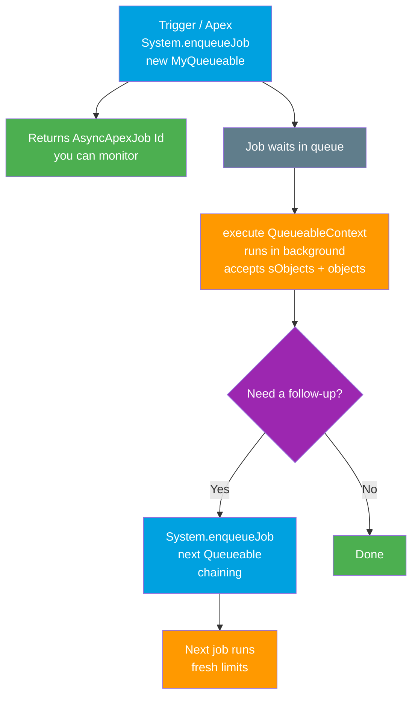

# 04 - Queueable Apex

> **One-liner**: A flexible asynchronous Apex job that accepts **real objects**, can be **chained**, can make **callouts**, and hands you a **job Id you can monitor**.
> **Direction**: Internal to Salesforce, async work. **Timing**: runs in the background after enqueue. **Returns**: an `AsyncApexJob` Id.
> **Use when**: You need async work that carries complex data, chains into follow-up jobs, or makes callouts.

This is Module 07, bulk and async. Queueable is the modern replacement for [@future methods](05-future-methods.md), and a lighter sibling of [Batch Apex](03-batch-apex.md) for non-bulk async work.

---

## 1. The idea in plain English

Think of Queueable as **dropping a task into your team's work queue with a tracking number**. You hand off the job, you get a **ticket number** so you can check its status later, and the job runs in the background. If that job needs to kick off a follow-up task when it finishes, it can simply **add the next ticket to the queue** itself. That hand-off-and-chain rhythm is the whole feature.

It exists because the old way, **`@future` methods**, was too limited. `@future` can only take **primitive arguments** (no sObjects, no objects), gives you **no job Id** to track, and **cannot chain**. Queueable fixes all three: it accepts **sObjects and complex objects**, returns a **monitorable Id**, and is **chainable**. Salesforce now recommends Queueable over `@future`.

You implement one method, **`execute(QueueableContext)`**, and submit the job with **`System.enqueueJob()`**.

---

## 2. When to use it (and when not)

| ✅ Use Queueable when | ❌ Use something else when |
|---|---|
| Async work that needs **sObjects or complex objects**. | You must process **millions** of records → [Batch Apex](03-batch-apex.md). |
| You want to **chain** a follow-up job. | Simple async with **only primitives** → [@future](05-future-methods.md) (but Queueable is still preferred). |
| The job makes a **callout** and you want to monitor it. | Loading data from **outside** Salesforce → [Bulk API 2.0](01-bulk-api-2.md). |
| You need the **job Id** to track status. | Real-time synchronous response → [Request and Reply](../02-Integration-Patterns/01-request-and-reply.md). |

**Real-world examples**: enrich an Account via a callout then chain a job to update related Contacts, process a complex in-memory object a trigger could not handle synchronously, run a moderate async update that you want to monitor in **Setup → Apex Jobs**.

---

## 3. How it works (enqueue, execute, chain)



**Walkthrough**

1. From a trigger or Apex, call `System.enqueueJob(new MyQueueable(...))`. You can pass it sObjects and other objects directly.
2. It returns an **`AsyncApexJob` Id**, which you can query or watch in Setup to monitor status.
3. The job sits in the queue, then **`execute(QueueableContext)`** runs in the background with a fresh set of governor limits.
4. Inside `execute`, you can **enqueue another Queueable** to chain follow-up work. The chained job runs after this one completes, with its own fresh limits.
5. For HTTP callouts, the class implements **`Database.AllowsCallouts`**.

---

## 4. The actual code

```apex
public class AccountEnrichJob
        implements Queueable, Database.AllowsCallouts {

    // Queueable accepts sObjects and complex objects (unlike @future).
    private List<Account> accounts;

    public AccountEnrichJob(List<Account> accounts) {
        this.accounts = accounts;
    }

    public void execute(QueueableContext ctx) {
        // Make a callout (allowed via Database.AllowsCallouts).
        for (Account a : accounts) {
            HttpRequest req = new HttpRequest();
            req.setEndpoint('callout:Enrichment_Service/lookup?name=' + a.Name);
            req.setMethod('GET');
            HttpResponse res = new Http().send(req);
            if (res.getStatusCode() == 200) {
                a.Description = res.getBody();
            }
        }
        update accounts;

        // Chaining: enqueue a follow-up job from inside execute.
        if (!Test.isRunningTest()) {
            System.enqueueJob(new ContactSyncJob(accounts));
        }
    }
}
```

**Enqueue it and capture the monitorable Id:**

```apex
List<Account> toEnrich = [SELECT Id, Name FROM Account WHERE Description = null LIMIT 100];
Id jobId = System.enqueueJob(new AccountEnrichJob(toEnrich));

// Monitor it:
AsyncApexJob job = [
    SELECT Id, Status, NumberOfErrors
    FROM AsyncApexJob
    WHERE Id = :jobId
];
```

> **Chaining caveat**: you can chain Queueables, but a job that makes callouts can only chain into a limited callout depth. Keep callout chains short.

---

## 5. Design considerations and limits

| Consideration | Detail | What to do |
|---|---|---|
| **Jobs per transaction** | Up to **50** jobs added via `enqueueJob` per **synchronous** transaction. | Batch your enqueues; do not loop one per record blindly. |
| **Enqueue from async** | From within an async job you can enqueue only **1** child (to chain). | Use chaining, one job hands off to the next. |
| **Chain depth (Dev/Trial)** | Max stack depth of **5** in Developer Edition and Trial orgs. | Production editions allow deeper chaining. |
| **Accepts** | **sObjects and complex objects** (member variables). | This is the big win over `@future`. |
| **Monitorable** | Returns an **`AsyncApexJob` Id**. | Query `AsyncApexJob` or watch Setup → Apex Jobs. |
| **Callouts** | Need **`Database.AllowsCallouts`**. | Implement it; keep callout chains short. |
| **Callout chain depth** | Only a limited number of chained jobs may make callouts. | Avoid long chains of callout jobs. |

---

## 6. Interview Q&A

**Q: What is Queueable Apex and how do you start one?**
A: A flexible async Apex job. You implement `execute(QueueableContext)` and submit it with `System.enqueueJob()`, which returns an **`AsyncApexJob` Id** you can monitor. The job runs in the background with fresh governor limits.

**Q: Why is Queueable preferred over `@future`?**
A: Three reasons. It accepts **sObjects and complex objects** (`@future` only takes primitives), it is **chainable** (you can enqueue a follow-up from inside `execute`), and it is **monitorable** via the returned job Id. Salesforce recommends Queueable over `@future`.

**Q: What is chaining and how deep can it go?**
A: From inside a running Queueable you can enqueue **one** more Queueable, which runs after the current one finishes with fresh limits. Production orgs allow deep chaining; **Developer Edition and Trial** orgs cap the stack depth at **5**.

**Q: How do you make a callout from a Queueable?**
A: Implement **`Database.AllowsCallouts`** on the class. Note that the number of chained jobs that make callouts is limited, so keep callout chains short.

**Q: What is the enqueue limit?**
A: Up to **50** jobs can be added with `System.enqueueJob` in a single **synchronous** transaction. From within an async context you can only enqueue **one** child job, which is what enables chaining.

**Talking point to explain it to anyone**: "It is dropping a task in the work queue with a tracking number. You hand it off, you can check its status, and when it finishes it can drop the next task in the queue itself."

---

## 7. Key terms

Queueable, QueueableContext, System.enqueueJob, AsyncApexJob, chaining, stack depth, Database.AllowsCallouts, @future - defined in [Module 01 vocabulary](../01-Fundamentals/02-core-vocabulary.md) and the [README](README.md).

---

## Sources (Verified June 2026)

- [Queueable Apex - Apex Developer Guide](https://developer.salesforce.com/docs/atlas.en-us.apexcode.meta/apexcode/apex_queueing_jobs.htm)
- [Queueable Interface - Apex Reference Guide](https://developer.salesforce.com/docs/atlas.en-us.apexref.meta/apexref/apex_class_System_Queueable.htm)
- [Future Methods - Apex Developer Guide](https://developer.salesforce.com/docs/atlas.en-us.apexcode.meta/apexcode/apex_invoking_future_methods.htm)
- [AsyncApexJob - Object Reference for the Salesforce Platform](https://developer.salesforce.com/docs/atlas.en-us.object_reference.meta/object_reference/sforce_api_objects_asyncapexjob.htm)

---

*Next: [05-future-methods.md](05-future-methods.md) - the original lightweight async annotation, and why Queueable usually wins.*
