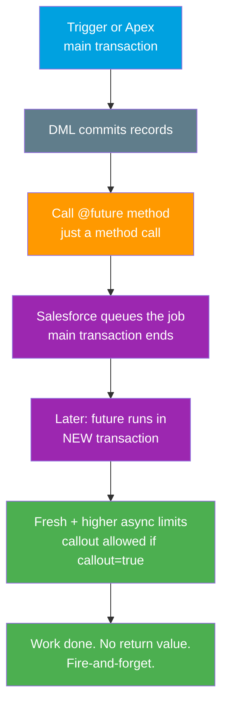

# 05 - Future Methods (@future)

> **One-liner**: The simplest form of asynchronous Apex. Annotate a **static void** method with **`@future`** and Salesforce runs it **later**, on its own, in a separate transaction with its own governor limits.
> **Direction**: internal Apex (Salesforce processing its own work off the main thread). **Timing**: asynchronous, fire-and-forget. **Trigger**: just call the method.
> **Use when**: You need a quick, primitive-only async job, or you must make a **callout after DML** from a trigger.

This is Module 07, bulk and async. Future methods are the entry-level async tool. For the richer, generally-preferred alternative, see [Queueable Apex](04-queueable-apex.md). For the full async reference, see [07-async-limits-monitoring-errors.md](07-async-limits-monitoring-errors.md).

---

## 1. The idea in plain English

A future method is **dropping a note in the office mailroom** instead of walking the message over yourself. You write down what you need done, hand it off, and immediately get back to your own work. Sometime soon, someone in the mailroom picks up the note and does the task. You do not wait. You do not get a reply. You just trust it gets done.

That "hand it off and walk away" behaviour is called **fire-and-forget**. When your Apex calls a `@future` method, Salesforce does not run it right then. It **queues** the work and finishes your current transaction first. The future method runs **later**, in its **own transaction**, with a **fresh set of governor limits** (and the higher *async* limits at that). The catch: because you walked away, you get **no return value**, you cannot easily **chain** another job after it, and it is **hard to monitor**.

---

## 2. When to use it (and when not)

| ✅ Use it when | ❌ Avoid / use something else |
|---|---|
| You need a **callout after DML** from a trigger. | You need to pass **sObjects** or complex types → [Queueable](04-queueable-apex.md). |
| The work is **quick and primitive-only** (Ids, Strings, numbers). | You need to **chain** jobs or **monitor** them → [Queueable](04-queueable-apex.md). |
| You want to move slow logic **off the main transaction**. | You need to process **large data volumes** in chunks → [Batch Apex](03-batch-apex.md). |
| Fire-and-forget is genuinely fine (no result needed). | You need it to run **on a schedule** → [Scheduled Apex](06-scheduled-apex.md). |

**The classic fix**: a trigger does DML, then needs to call an external API. A synchronous callout after DML throws **"You have uncommitted work pending."** Move the callout into a `@future(callout=true)` method and the problem disappears. The future method runs in a new transaction *after* the DML has committed.

**Rule of thumb**: **[Queueable](04-queueable-apex.md) is generally preferred.** It does everything `@future` does, plus accepts objects, supports chaining, and returns a job Id you can monitor. Reach for `@future` only when the job is simple, quick, primitive-only, or when you are patching the trigger-callout case quickly.

---

## 3. How it works (the hand-off)



**Walkthrough**

1. Your main transaction (often a trigger) runs and commits its DML.
2. You call the `@future` method. To Apex this looks like an ordinary method call, but nothing executes yet.
3. Salesforce **queues** the request and lets your original transaction finish.
4. Sometime soon, the platform runs the future method in a **separate transaction** with a **fresh, higher (async) set of limits**.
5. If declared `@future(callout=true)`, it may make HTTP callouts. When it finishes, there is no callback and no return value.

---

## 4. The actual code

A future method must be **`static`**, return **`void`**, and accept **only primitives** (and arrays/collections of primitives). You **cannot pass sObjects** — pass record **Ids** instead and re-query inside.

```apex
public class AccountSyncService {

    @future(callout=true)               // callout=true allows HTTP callouts
    public static void syncAccounts(Set<Id> accountIds) {
        // Re-query: we received Ids, not sObjects (primitives only)
        List<Account> accounts = [
            SELECT Id, Name, Industry FROM Account WHERE Id IN :accountIds
        ];

        for (Account a : accounts) {
            HttpRequest req = new HttpRequest();
            req.setEndpoint('callout:ERP_System/accounts'); // Named Credential
            req.setMethod('POST');
            req.setHeader('Content-Type', 'application/json');
            req.setBody(JSON.serialize(a));
            try {
                HttpResponse res = new Http().send(req);
                // log/handle res.getStatusCode()
            } catch (Exception e) {
                // no caller to bubble up to: log it (see Module 07 error handling)
                System.debug(LoggingLevel.ERROR, e.getMessage());
            }
        }
    }
}
```

**Calling it from a trigger** (the after-DML callout fix):

```apex
trigger AccountTrigger on Account (after insert, after update) {
    // DML has happened; a synchronous callout here would throw
    // "You have uncommitted work pending." So hand off to @future:
    AccountSyncService.syncAccounts(Trigger.newMap.keySet());
}
```

> **Why a `Set<Id>`, not one Id?** Triggers fire in **bulk**. Pass the whole set so the future method runs **once** for all records, not once per record. Calling `@future` inside a `for` loop over records will blow the per-transaction cap fast.

---

## 5. Design considerations and limits

| Consideration | Detail | What to do |
|---|---|---|
| **Invocations per transaction** | Up to **50** `@future` calls per Apex transaction. | Pass a collection and call **once**, never in a loop. |
| **No sObjects** | Parameters must be **primitives**, arrays of primitives, or collections of primitives. | Pass **Ids** and re-query inside the method. |
| **No return value** | Methods are **`void`**. You cannot read a result. | If you need a result or callback, use [Queueable](04-queueable-apex.md). |
| **Hard to chain** | A future method **cannot reliably call another future** method. | Use [Queueable chaining](04-queueable-apex.md) for sequences. |
| **Hard to monitor** | You get **no job Id** back from the call itself. | Query [AsyncApexJob](07-async-limits-monitoring-errors.md) by method name, or use Queueable. |
| **Callouts** | Only allowed with **`@future(callout=true)`**. | Annotate explicitly when calling external services. |
| **Counts toward daily async** | Shares the org's daily async execution limit. | See [07-async-limits-monitoring-errors.md](07-async-limits-monitoring-errors.md). |
| **No guaranteed order/timing** | Runs "soon," not instantly, and not in any set order. | Never depend on timing or ordering between future calls. |

---

## 6. Interview Q&A

**Q: What is a future method and how do you declare one?**
A: It is the simplest async Apex. Annotate a method with `@future`; it must be `static`, return `void`, and take only primitives (or collections of primitives). Calling it queues the work to run later in its own transaction with fresh, higher async limits. Add `@future(callout=true)` to allow HTTP callouts.

**Q: Why can't a future method take sObjects?**
A: The record could change between when you queue the job and when it runs, so Salesforce only allows primitives. The pattern is to pass record **Ids** and re-query the latest data inside the method.

**Q: How do future methods fix the "uncommitted work pending" error?**
A: A synchronous callout after DML in the same transaction throws that error. Moving the callout into `@future(callout=true)` runs it in a **new** transaction after the DML commits, so there is no pending work.

**Q: When would you choose @future over Queueable?**
A: Rarely. Queueable is generally preferred because it accepts objects, supports chaining, and returns a monitorable job Id. Use `@future` only for simple, quick, primitive-only work, or as a fast patch for the trigger-callout case.

**Q: What is the limit on future invocations?**
A: Up to **50** `@future` calls per Apex transaction. Because of that, you bulkify: pass a collection of Ids and invoke the method once rather than once per record.

**Talking point to explain it to anyone**: "It is dropping a note in the mailroom. You hand off the task and walk away — no waiting, no reply. The platform does it later on its own."

---

## 7. Key terms

Future method, asynchronous, fire-and-forget, callout=true, primitive, governor limits, AsyncApexJob - defined in [Module 01 vocabulary](../01-Fundamentals/02-core-vocabulary.md) and the [README](README.md).

---

## Sources (Verified June 2026)

- [Future Methods — Apex Developer Guide](https://developer.salesforce.com/docs/atlas.en-us.apexcode.meta/apexcode/apex_invoking_future_methods.htm)
- [Apex Governor Limits — Limits and Allocations Quick Reference](https://developer.salesforce.com/docs/atlas.en-us.salesforce_app_limits_cheatsheet.meta/salesforce_app_limits_cheatsheet/salesforce_app_limits_platform_apexgov.htm)
- [Execution Governors and Limits — Apex Developer Guide](https://developer.salesforce.com/docs/atlas.en-us.apexcode.meta/apexcode/apex_gov_limits.htm)

---

*Next: [06-scheduled-apex.md](06-scheduled-apex.md) - running Apex automatically on a schedule with the Schedulable interface and CRON.*
