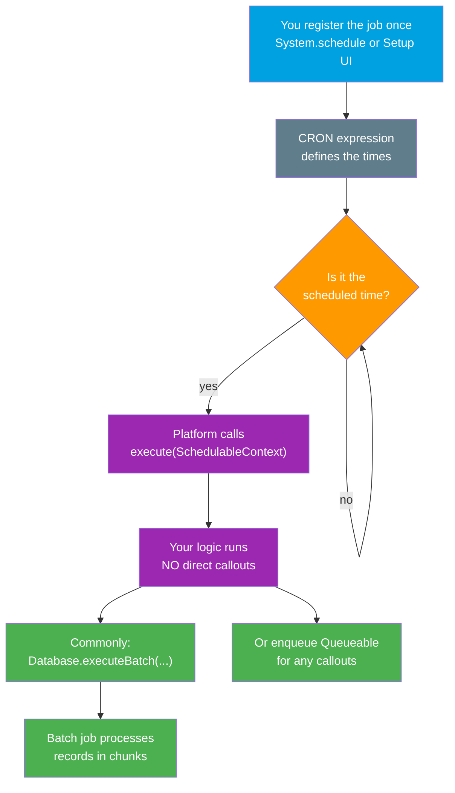

# 06 - Scheduled Apex

> **One-liner**: Apex that runs **automatically on a schedule** (e.g. nightly at 2 AM). You implement the **`Schedulable`** interface and register the class with a **CRON expression**.
> **Direction**: internal Apex, time-triggered. **Timing**: asynchronous, on a recurring clock. **Trigger**: the platform scheduler, not user code.
> **Use when**: A job must run at set times — nightly syncs, weekly cleanups, periodic kick-offs of [Batch Apex](03-batch-apex.md).

This is Module 07, bulk and async. Scheduled Apex is the "alarm clock" of the async family. It often **kicks off a Batch Apex** job. For the full async reference and monitoring, see [07-async-limits-monitoring-errors.md](07-async-limits-monitoring-errors.md).

---

## 1. The idea in plain English

Scheduled Apex is an **alarm clock for your code**. You set the time once, and from then on Salesforce wakes your class up and runs it — at 2 AM every day, every Monday morning, the first of every month, whatever you specify. You are not standing there pressing a button; the platform's scheduler does it for you, forever, until you cancel it.

The clock itself is a **CRON expression**: a compact string that says "at these seconds, minutes, hours, on these days." You write a class that implements the **`Schedulable`** interface — which just means it has one method, **`execute`** — and then you **register** it with a name and a CRON string. After that it is hands-off.

One important boundary: a scheduled job is a quiet alarm, not a phone. It **cannot make callouts directly**. If the scheduled work needs to call an external system, it hands that part off to a [Queueable](04-queueable-apex.md) or [@future](05-future-methods.md) method.

---

## 2. When to use it (and when not)

| ✅ Use it when | ❌ Avoid / use something else |
|---|---|
| Work must run at **specific times** (nightly, weekly). | Work should run **immediately** after an event → [Queueable](04-queueable-apex.md) / [@future](05-future-methods.md). |
| You want to **kick off a Batch Apex** job on a clock. | You just need a one-off async task now → [Queueable](04-queueable-apex.md). |
| Recurring maintenance: cleanup, recalculation, reminders. | The scheduled code itself must **call out** → delegate to async. |
| Periodic data sync windows (ETL-style). | High-frequency, sub-minute triggers → not what the scheduler is for. |

**Real-world examples**: every night at 2 AM, start a batch that recalculates account health scores; every Monday at 6 AM, expire stale leads; on the 1st of each month, roll up invoices and enqueue a Queueable to push totals to an ERP.

---

## 3. How it works (the scheduler clock)



**Walkthrough**

1. You register the class **once** — via `System.schedule()` in Apex or through the Setup UI.
2. The **CRON expression** tells the scheduler exactly when to fire.
3. The platform watches the clock and does nothing until the scheduled moment arrives.
4. At that moment it calls your **`execute(SchedulableContext sc)`** method.
5. Your logic runs. It **cannot make a callout directly**. Most often it calls **`Database.executeBatch()`** to start a [Batch Apex](03-batch-apex.md) job, or enqueues a [Queueable](04-queueable-apex.md) for any external calls.

---

## 4. The actual code

Implement **`Schedulable`** and its single **`execute`** method. The usual job is to start a batch.

```apex
public class NightlyAccountScoreScheduler implements Schedulable {

    public void execute(SchedulableContext sc) {
        // Scheduled Apex cannot call out directly.
        // Typical pattern: kick off a Batch Apex job.
        AccountScoreBatch batch = new AccountScoreBatch();
        Database.executeBatch(batch, 200);   // 200 = scope (records per chunk)

        // If you needed a callout instead, you would enqueue a Queueable:
        // System.enqueueJob(new SyncQueueable());
    }
}
```

**Schedule it from Anonymous Apex** with a CRON string:

```apex
// CRON: Seconds Minutes Hours Day-of-month Month Day-of-week [Year]
// Every day at 2:00:00 AM:
String cron = '0 0 2 * * ?';
String jobId = System.schedule(
    'Nightly Account Score',   // unique job name
    cron,                      // CRON expression
    new NightlyAccountScoreScheduler()  // an instance of the class
);
```

**Reading the CRON expression** `0 0 2 * * ?`:

| Field | Value | Meaning |
|---|---|---|
| Seconds | `0` | at second 0 |
| Minutes | `0` | at minute 0 |
| Hours | `2` | at 2 AM (24-hour) |
| Day-of-month | `*` | every day of the month |
| Month | `*` | every month |
| Day-of-week | `?` | no specific day (use `?` when day-of-month is set) |

More examples: `0 0 6 ? * MON` = every Monday at 6 AM. `0 0 0 1 * ?` = midnight on the 1st of each month. `0 30 13 * * ?` = every day at 1:30 PM.

> **`?` vs `*` gotcha**: day-of-month and day-of-week conflict, so you specify one and put **`?`** ("no value") in the other. Salesforce requires this; using `*` in both is invalid.

You can also schedule **without code**: Setup → **Apex Classes** → **Schedule Apex**, pick the class, set frequency and time. That UI is convenient but offers only preset frequencies; `System.schedule()` with CRON gives full control.

---

## 5. Design considerations and limits

| Consideration | Detail | What to do |
|---|---|---|
| **Scheduled jobs at once** | Up to **100** scheduled Apex jobs can be active at one time. | Consolidate jobs; cancel ones you no longer need. |
| **No direct callouts** | Scheduled Apex **cannot** make HTTP callouts directly. | Delegate to a [Queueable](04-queueable-apex.md) or [@future(callout=true)](05-future-methods.md). |
| **Unique job name** | `System.schedule` name must be unique among active jobs. | Use clear, descriptive names; you cannot reschedule a duplicate name. |
| **Kicks off batch** | A common, recommended pattern is scheduler → `Database.executeBatch`. | Keep `execute()` thin; do the heavy lifting in the [batch](03-batch-apex.md). |
| **Editing a scheduled class** | You cannot save changes to a class that is currently scheduled. | Cancel the job in **Scheduled Jobs**, deploy, then reschedule. |
| **CRON format** | `Seconds Minutes Hours Day-of-month Month Day-of-week [Year]`. | Put `?` in whichever of day-of-month / day-of-week you are not using. |
| **Counts toward daily async** | Each run consumes the org's daily async execution allowance. | See [07-async-limits-monitoring-errors.md](07-async-limits-monitoring-errors.md). |
| **Timing is approximate** | Jobs start at or shortly after the scheduled time, resources permitting. | Do not assume to-the-second precision. |

---

## 6. Interview Q&A

**Q: How do you make Apex run on a schedule?**
A: Implement the `Schedulable` interface (one method, `execute(SchedulableContext sc)`), then register the class with `System.schedule(name, cronExpression, instance)` or through Setup → Schedule Apex. The platform's scheduler calls `execute` at the times the CRON expression defines.

**Q: What does a CRON expression look like in Salesforce?**
A: Seven fields: Seconds Minutes Hours Day-of-month Month Day-of-week and an optional Year. For example `0 0 2 * * ?` runs every day at 2 AM. You put `?` in either day-of-month or day-of-week (you cannot constrain both).

**Q: Can scheduled Apex make a callout?**
A: Not directly. If the scheduled work needs an external call, it delegates to a Queueable or an `@future(callout=true)` method, which run in a context where callouts are allowed.

**Q: What is the most common pattern with scheduled Apex?**
A: Scheduler kicks off Batch Apex. The `execute` method stays thin and just calls `Database.executeBatch(...)`, letting the batch do the heavy, chunked processing.

**Q: How many scheduled jobs can you have, and what trips people up when editing?**
A: Up to **100** active scheduled Apex jobs. A frequent gotcha: you cannot save changes to a class while it is scheduled — you must cancel the scheduled job, deploy the change, then reschedule.

**Talking point to explain it to anyone**: "It is an alarm clock for code. You set the time once, and Salesforce wakes the job up and runs it automatically, again and again."

---

## 7. Key terms

Schedulable, execute, SchedulableContext, System.schedule, CRON expression, Scheduled Jobs, Batch Apex - defined in [Module 01 vocabulary](../01-Fundamentals/02-core-vocabulary.md) and the [README](README.md).

---

## Sources (Verified June 2026)

- [Apex Scheduler — Apex Developer Guide](https://developer.salesforce.com/docs/atlas.en-us.apexcode.meta/apexcode/apex_scheduler.htm)
- [Schedulable Interface — Apex Reference Guide](https://developer.salesforce.com/docs/atlas.en-us.apexref.meta/apexref/apex_interface_system_schedulable.htm)
- [Apex Governor Limits — Limits and Allocations Quick Reference](https://developer.salesforce.com/docs/atlas.en-us.salesforce_app_limits_cheatsheet.meta/salesforce_app_limits_cheatsheet/salesforce_app_limits_platform_apexgov.htm)

---

*Next: [07-async-limits-monitoring-errors.md](07-async-limits-monitoring-errors.md) - the async reference table, limits, monitoring, and error handling.*
