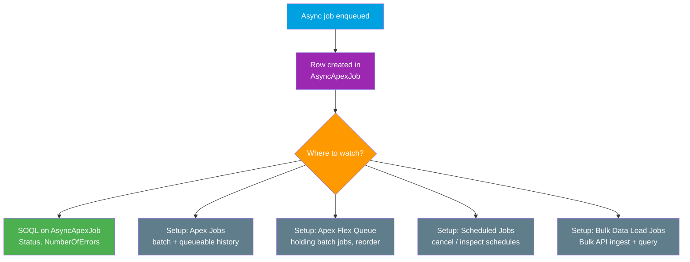

# 07 - Async Limits, Monitoring & Error Handling

> **One-liner**: The reference page for the whole async family. Which tool to pick, the **limits** they share, how to **monitor** running jobs, and how to make them **reliable** with retries and idempotency.
> **Direction**: internal Apex (off-thread processing). **Timing**: asynchronous. **Scope**: @future, Queueable, Batch, Scheduled, plus Bulk API job monitoring.
> **Use when**: You are choosing an async tool, watching a job in production, or designing for failure.

This is Module 07, bulk and async, and the **final file** in the module. It ties together [@future](05-future-methods.md), [Queueable](04-queueable-apex.md), [Batch Apex](03-batch-apex.md), [Scheduled Apex](06-scheduled-apex.md), and [Bulk API 2.0](01-bulk-api-2.md).

---

## 1. The idea in plain English

Async Apex is a **back-office team** working behind the storefront. The customer-facing transaction (the user clicking Save) stays fast because the slow work is handed to the back office to finish later. But a back office needs three things to be trustworthy: the **right worker for the job**, **rules so no one team hogs the building**, and a **way to check whether the work actually got done**.

This page covers all three. First a **comparison table** so you pick the right async worker. Then the **limits** that keep one tenant from starving the others (you are on shared infrastructure, so async gets *higher* governor limits but a *daily cap* on how much you can run). Then **monitoring** — the `AsyncApexJob` object and the Setup pages that show you what is queued, running, or failed. Finally **error handling**, because a fire-and-forget job that silently fails is worse than no job at all.

---

## 2. Choosing the tool: the async comparison

| | **@future** | **Queueable** | **Batch Apex** | **Scheduled Apex** |
|---|---|---|---|---|
| **Interface / syntax** | `@future` annotation | `Queueable` interface | `Database.Batchable` | `Schedulable` interface |
| **Input types** | **Primitives only** | **Any** (objects, sObjects) | Query/iterable scope | None (clock-driven) |
| **Chaining** | No (cannot chain) | **Yes** (enqueue from `execute`) | Yes (chain in `finish`) | Indirect (starts batch) |
| **Callouts** | Yes, with `callout=true` | **Yes** (implement `Database.AllowsCallouts`) | Yes (`Database.AllowsCallouts`) | **No** (delegate to async) |
| **Returns a job Id** | No | **Yes** (`System.enqueueJob`) | **Yes** (`Database.executeBatch`) | Yes (`System.schedule`) |
| **Monitoring** | Hard (no Id from call) | Easy (job Id) | Easy (job Id + Apex Jobs) | Easy (Scheduled Jobs) |
| **Processes in chunks** | No | No | **Yes** (200 default) | No (but starts a batch) |
| **Typical use** | Quick primitive task; callout after DML | Most async work; chained callouts | **Large data volumes** | Run on a clock; kick off batch |

**The short version**: default to **Queueable** for general async work. Use **Batch** when the data set is too big for one transaction. Use **Scheduled** to run on a clock (usually to start a batch). Use **@future** only for simple primitive-only cases or the trigger-callout patch.

---

## 3. The shared limits

All four tools draw from the **same async governor pool** and a **shared daily allowance**. The good news: async transactions get **higher** limits than synchronous ones.

| Limit | Synchronous | **Asynchronous** | Note |
|---|---|---|---|
| **Heap size** | 6 MB | **12 MB** | Async doubles your in-memory budget. |
| **CPU time** | 10,000 ms | **60,000 ms** | Async gets 6× the CPU per transaction. |
| **SOQL queries** | 100 | 100 | Same per-transaction query limit. |
| **Daily async executions** | — | **greater of 250,000 or 200 × user licenses** | Shared across @future, Queueable, Batch, Scheduled per rolling 24h. |
| **Concurrent batch jobs** | — | **5** | Active/processing batch jobs at once. |
| **Batch holding queue** | — | **100** | Flex Queue holds up to 100 jobs waiting to run. |
| **Scheduled jobs** | — | **100** | Active scheduled Apex jobs at once. |
| **@future per transaction** | — | **50** | Invocations allowed in one Apex transaction. |
| **Queueable depth** | — | chainable | One job enqueued per `execute` (chaining); platform guards runaway loops. |

**The daily async formula in plain terms**: take **200 × (number of user licenses in the org)**, compare it to **250,000**, and your daily ceiling is **whichever is larger**. A small org gets the 250,000 floor; a large org gets more. This pool is consumed by *all* async Apex combined.

> **Why async gets more room**: it runs off the user's thread, so a longer or heavier job does not freeze anyone's screen. That is exactly why you move slow callouts and big data jobs to async in the first place.

---

## 4. Monitoring async jobs



**`AsyncApexJob`** is the object that backs nearly every async job — a `@future` call, a Queueable, a Batch, or a Scheduled job. Query it to check status programmatically:

```apex
List<AsyncApexJob> jobs = [
    SELECT Id, JobType, Status, NumberOfErrors,
           JobItemsProcessed, TotalJobItems, MethodName, CreatedDate
    FROM AsyncApexJob
    WHERE Status IN ('Queued', 'Processing', 'Failed')
    ORDER BY CreatedDate DESC
];
```

| Where | What it shows | Covers |
|---|---|---|
| **`AsyncApexJob`** (SOQL) | Status, error count, items processed vs total. | All async Apex. |
| **Setup → Apex Jobs** | History and status of batch and queueable jobs. | Batch, Queueable, @future. |
| **Setup → Apex Flex Queue** | Batch jobs **holding** (beyond the 5 running); reorder them. | Batch Apex. |
| **Setup → Scheduled Jobs** | Active schedules; cancel or inspect. | Scheduled Apex. |
| **Setup → Bulk Data Load Jobs** | Bulk API **ingest** and **query** job progress. | [Bulk API 2.0](01-bulk-api-2.md). |

> **Key distinction**: Apex async jobs show under **Apex Jobs / Flex Queue / Scheduled Jobs**. The external **Bulk API** has its own page, **Bulk Data Load Jobs**. Different engines, different monitors.

---

## 5. Error handling and reliability

Async work has **no user watching the screen**, so failures are silent unless you design for them. Four patterns:

| Pattern | What it means | How to apply |
|---|---|---|
| **Idempotency** | Running the job twice produces the same result, not duplicates. | **Upsert by External Id**; check state before acting; design for safe re-runs. |
| **Retry** | Transient failures (a 503, a lock) get tried again. | Re-enqueue with a bounded **attempt counter**; **stop after N** so you do not loop forever. |
| **Catch and log** | Errors are recorded, not swallowed. | `try/catch`, write a custom **error log object** or Platform Event with the record Id and message. |
| **Dead-letter** | Records that keep failing are parked, not lost. | After max retries, write the failed payload to a **dead-letter** record/object for manual review. |

**A Queueable with bounded retry and logging**:

```apex
public class SyncQueueable implements Queueable, Database.AllowsCallouts {
    private Set<Id> recordIds;
    private Integer attempt;

    public SyncQueueable(Set<Id> recordIds, Integer attempt) {
        this.recordIds = recordIds;
        this.attempt = attempt;
    }

    public void execute(QueueableContext qc) {
        try {
            // ... do the callout / DML work (idempotent: upsert by External Id) ...
        } catch (Exception e) {
            if (attempt < 3) {
                // Retry: re-enqueue with a higher attempt count
                System.enqueueJob(new SyncQueueable(recordIds, attempt + 1));
            } else {
                // Dead-letter: park the failure for review (don't lose it)
                insert new Integration_Error__c(
                    Payload__c = String.join(new List<Id>(recordIds), ','),
                    Message__c = e.getMessage(),
                    Source__c  = 'SyncQueueable'
                );
            }
        }
    }
}
```

**For Batch Apex**, errors are per-chunk: a failing scope rolls back only that chunk, and you can implement `Database.RaisesPlatformEvents` (or capture errors in `execute`) and summarise in `finish`. **For Bulk API**, failures come back in a **failedResults** CSV you re-load after fixing — see [Bulk API 2.0](01-bulk-api-2.md).

> **Golden rule**: assume any async job can run **twice** (retries, replays). If a double-run would corrupt data, you have an idempotency bug, not a retry strategy.

---

## 6. Interview Q&A

**Q: How do you choose between @future, Queueable, Batch, and Scheduled Apex?**
A: Default to **Queueable** for general async (objects, chaining, callouts, a job Id). Use **Batch** for large data volumes that need chunking. Use **Scheduled** to run on a clock, usually to kick off a batch. Use **@future** only for simple primitive-only work or the callout-after-DML trigger fix.

**Q: What is the daily limit on asynchronous Apex executions?**
A: The greater of **250,000** or **200 × the number of user licenses** in the org, per rolling 24 hours. It is shared across all async Apex — @future, Queueable, Batch, and Scheduled combined.

**Q: How do async governor limits differ from synchronous?**
A: Async transactions get more room: **12 MB heap** (vs 6 MB sync) and **60,000 ms CPU** (vs 10,000 ms sync). That is the whole point of going async — heavier work without freezing the user.

**Q: How do you monitor async jobs?**
A: Query the **`AsyncApexJob`** object for status and error counts, and use Setup pages: **Apex Jobs** (batch/queueable history), **Apex Flex Queue** (holding batch jobs), **Scheduled Jobs** (schedules), and **Bulk Data Load Jobs** for the Bulk API.

**Q: How do you make async jobs reliable?**
A: Design for **idempotency** (upsert by External Id, safe re-runs), add **bounded retries** with an attempt counter, **catch and log** errors to a custom object or Platform Event, and **dead-letter** records that exhaust retries so nothing is silently lost. Assume every job can run twice.

**Talking point to explain it to anyone**: "Async is the back office behind the counter. It gets more room to work, but there is a daily limit on how much it can do, dashboards to watch it, and a rule that any task might get done twice — so it must be safe to repeat."

---

## 7. Key terms

AsyncApexJob, async governor limits, daily async limit, Apex Flex Queue, Scheduled Jobs, Bulk Data Load Jobs, idempotency, retry, dead-letter - defined in [Module 01 vocabulary](../01-Fundamentals/02-core-vocabulary.md) and the [README](README.md).

---

## Sources (Verified June 2026)

- [Execution Governors and Limits — Apex Developer Guide](https://developer.salesforce.com/docs/atlas.en-us.apexcode.meta/apexcode/apex_gov_limits.htm)
- [Apex Governor Limits — Limits and Allocations Quick Reference](https://developer.salesforce.com/docs/atlas.en-us.salesforce_app_limits_cheatsheet.meta/salesforce_app_limits_cheatsheet/salesforce_app_limits_platform_apexgov.htm)
- [AsyncApexJob — Object Reference for the Salesforce Platform](https://developer.salesforce.com/docs/atlas.en-us.object_reference.meta/object_reference/sforce_api_objects_asyncapexjob.htm)
- [Asynchronous Apex — Apex Developer Guide](https://developer.salesforce.com/docs/atlas.en-us.apexcode.meta/apexcode/apex_async_overview.htm)

---

*Next: back to the [Module 07 README](README.md) for the full bulk-and-async map. Then continue to **Module 08 - Modern APIs** (GraphQL, Connect, UI APIs) and **Module 09 - Security & Limits** for governance across every integration.*
