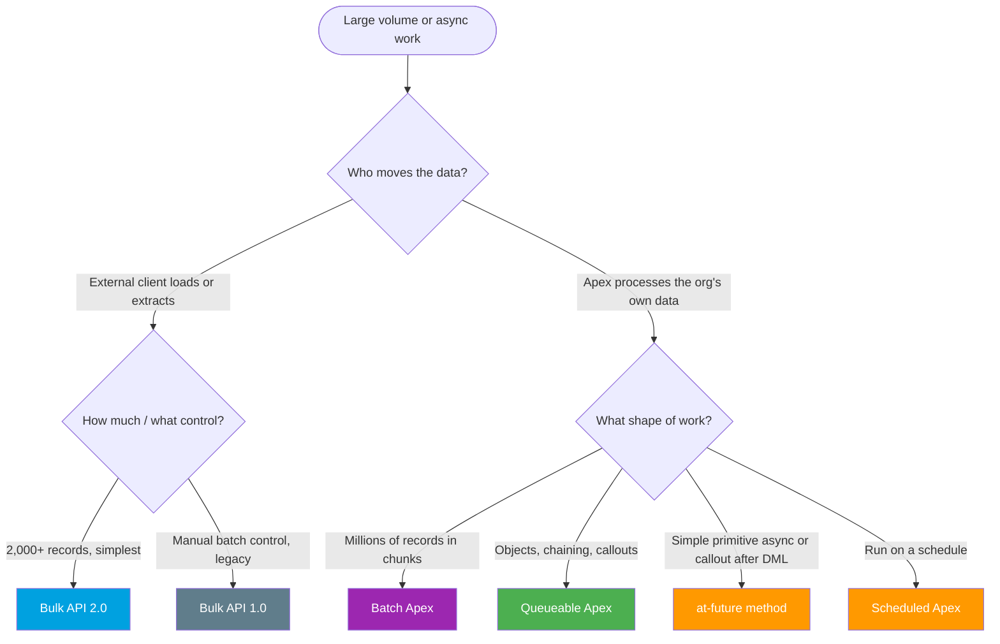

# Module 07 - Bulk & Async Integration

> **Goal**: Move millions of records and run heavy work without hitting governor limits.
> **API version**: v66.0 (Spring '26). **The principle**: large or slow work goes **asynchronous**, in chunks, off the user's thread.

Two related ideas: **Bulk** (large data in/out via the Bulk API) and **Async Apex** (server-side work in the background: Batch, Queueable, `@future`, Scheduled). Start with **[01-bulk-api-2.md](01-bulk-api-2.md)**. This module realizes the [Batch Data Synchronization pattern](../02-Integration-Patterns/03-batch-data-synchronization.md).

---

## How to use this module

1. **[01-bulk-api-2.md](01-bulk-api-2.md)** for external large-data loads/extracts.
2. **[02](02-bulk-api-1-and-pk-chunking.md)** for the legacy batch API and chunking huge queries.
3. The async Apex tools: **[Batch](03-batch-apex.md)**, **[Queueable](04-queueable-apex.md)**, **[@future](05-future-methods.md)**, **[Scheduled](06-scheduled-apex.md)**.
4. **[07](07-async-limits-monitoring-errors.md)** for limits, monitoring, and error handling.

---

## Map of this module

| # | File | What it covers |
|---|---|---|
| 01 | [bulk-api-2](01-bulk-api-2.md) | REST async jobs for large data (the default) |
| 02 | [bulk-api-1-and-pk-chunking](02-bulk-api-1-and-pk-chunking.md) | Legacy batch API + PK Chunking for huge queries |
| 03 | [batch-apex](03-batch-apex.md) | Process SF's own data in chunks (start/execute/finish) |
| 04 | [queueable-apex](04-queueable-apex.md) | Chainable async jobs, objects, callouts |
| 05 | [future-methods](05-future-methods.md) | Simple primitive-only async (`@future`) |
| 06 | [scheduled-apex](06-scheduled-apex.md) | Cron-scheduled Apex |
| 07 | [async-limits-monitoring-errors](07-async-limits-monitoring-errors.md) | Limits, `AsyncApexJob`, retries |

---

## Which tool? (decision tree)

---

## Async Apex at a glance

| Tool | Initiator | Inputs | Callouts | Chaining / monitor | Best for |
|---|---|---|:--:|---|---|
| **Bulk API 2.0** | External client | CSV | n/a | Job status API | Large data in/out |
| **Batch Apex** | Apex/Schedule | QueryLocator/Iterable | Yes (`AllowsCallouts`) | `AsyncApexJob` | Millions of records in chunks |
| **Queueable** | Apex | sObjects/objects | Yes | Chainable, `AsyncApexJob` | Flexible async + chaining |
| **@future** | Apex | **primitives only** | Yes (`callout=true`) | No | Simple fire-and-forget |
| **Scheduled** | Schedule (cron) | n/a | No (delegate) | `CronTrigger` | Time-based runs |

---

## Limits cheat sheet (memorize)

| Limit | Value |
|---|---|
| Bulk API 2.0 data per job | **150 MB** |
| Bulk API 2.0 daily records (24h rolling) | **100 million** |
| Bulk API 1.0 records per batch | **10,000** |
| Batch Apex `execute` scope | default **200** (max 2,000 for QueryLocator) |
| Concurrent batch jobs | **5** running/queued (Flex Queue holds 100) |
| `@future` calls per transaction | **50** |
| Queueable jobs added per sync transaction | **50** |
| Scheduled Apex jobs | **100** active |
| Daily async executions | greater of **250,000** or **200 × user licenses** |
| Async heap / CPU | **12 MB** heap, **60,000 ms** CPU |

---

## Interview rapid-fire

**Q: Bulk API vs Batch Apex?**
→ Bulk API = an **external** client moving large data in/out. Batch Apex = **Apex** processing the org's own data in chunks. Different initiator.

**Q: @future vs Queueable?**
→ Queueable is preferred: it accepts **sObjects/objects**, is **chainable**, and is **monitorable** via `AsyncApexJob`. `@future` is primitives-only, no return, no chaining.

**Q: How many @future calls per transaction?**
→ **50**. (The old "10" figure is outdated.)

**Q: Run a heavy job every night at 2 AM?**
→ **Scheduled Apex** (cron) that enqueues a **Batch Apex** job. Scheduled Apex can't call out directly.

**Q: Avoid duplicates in a bulk load?**
→ **Upsert by External Id** (idempotent), then re-load only the `failedResults`.

---

## Sources (Verified June 2026)

- [Bulk API 2.0 and Bulk API Developer Guide](https://developer.salesforce.com/docs/atlas.en-us.api_asynch.meta/api_asynch/asynch_api_intro.htm)
- [Asynchronous Apex — Apex Developer Guide](https://developer.salesforce.com/docs/atlas.en-us.apexcode.meta/apexcode/apex_async_overview.htm)
- [Execution Governors and Limits — Apex Developer Guide](https://developer.salesforce.com/docs/atlas.en-us.apexcode.meta/apexcode/apex_gov_limits.htm)
- [Limits and Allocations Quick Reference](https://developer.salesforce.com/docs/atlas.en-us.salesforce_app_limits_cheatsheet.meta/salesforce_app_limits_cheatsheet/salesforce_app_limits_platform_bulkapi.htm)

*Each file has its own Sources section with the specific official doc.*
