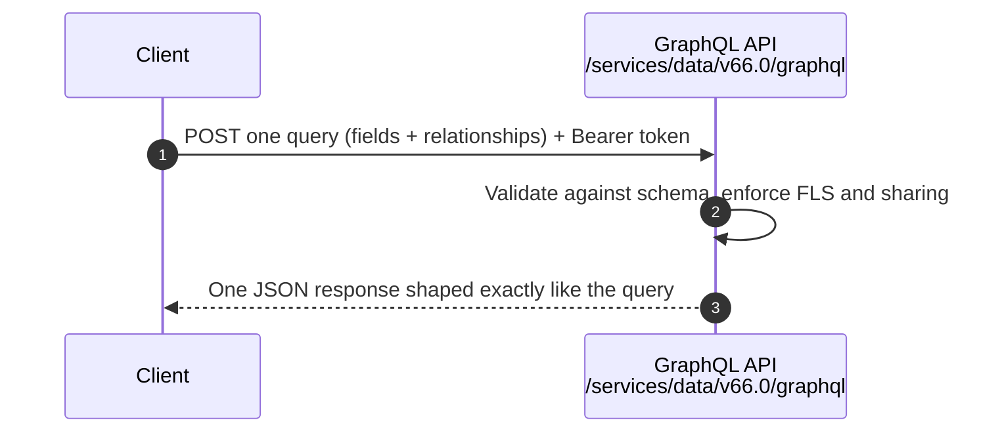

# 01 - GraphQL API

> **One-liner**: Ask for **exactly the fields you want**, across **related objects**, in **one round-trip**, and get back exactly that shape, nothing more.
> **Direction**: External → Salesforce (inbound). **Format**: JSON over HTTP POST. **Auth**: OAuth 2.0 Bearer.
> **Use when**: A client needs specific fields from nested objects and you want to avoid over-fetching and multiple REST calls.

This is Module 08, the modern APIs. New to REST? See [Module 04](../04-Inbound-APIs/01-standard-rest-api.md). For the full "which API" picture, see [04-modern-api-landscape.md](04-modern-api-landscape.md).

---

## 1. The idea in plain English

REST is a **fixed-menu restaurant**: each endpoint serves a set plate. Want the Account, its Contacts, and its Opportunities? That's three trips to three counters, and each plate comes with side dishes (fields) you didn't ask for. **GraphQL is à la carte**: you hand over one order that says exactly which dishes and which related items you want, and the kitchen returns one tray with precisely that.

Two problems disappear. **Over-fetching** (getting fields you don't need) is gone because you list the fields. **Under-fetching** (having to make follow-up calls for related data) is gone because you traverse relationships in the same query. One request, one response, shaped to your screen.

---

## 2. When to use it (and when not)

| ✅ Use it when | ❌ Avoid / use something else |
|---|---|
| You need **specific fields** across **nested/related** objects. | Simple single-object CRUD → [REST API](../04-Inbound-APIs/01-standard-rest-api.md). |
| **Bandwidth matters** (mobile, low-power clients). | Bulk loads of 2,000+ records → [Bulk API 2.0](../07-Bulk-Async/01-bulk-api-2.md). |
| Dashboards that **aggregate** and combine data. | Multiple unrelated writes in one call → [Composite](../04-Inbound-APIs/05-composite-api.md). |
| You want **field-level versioning** and a typed schema. | Heavy HTTP caching needs (REST caches better). |

**Real-world examples**: a mobile app rendering an Account page with its Contacts and recent Opportunities in one call; a dashboard pulling counts and sums by Stage; a custom UI that wants only `Name` and `Phone`.

---

## 3. How it works (sequence diagram)



The client sends a **single POST** containing a query document. Salesforce validates it against the **typed schema**, runs it (respecting the user's field-level security and sharing), and returns one JSON response whose shape mirrors the query.

---

## 4. The actual request

Salesforce's GraphQL schema is rooted at **`uiapi`** (it builds on the UI API), uses a **connection model** (`edges` then `node`), and each field is an object exposing **`.value`** (and often `.displayValue`). This shape surprises people who expect "vanilla" GraphQL.

**Endpoint**: `POST https://MyDomainName.my.salesforce.com/services/data/v66.0/graphql`

**Query** (Accounts in Technology, with their Contacts):

```graphql
query AccountsWithContacts {
  uiapi {
    query {
      Account(first: 10, where: { Industry: { eq: "Technology" } }) {
        edges {
          node {
            Id
            Name { value }
            Contacts {
              edges { node { LastName { value } Email { value } } }
            }
          }
        }
      }
    }
  }
}
```

**Response** (same shape as the query):

```json
{
  "data": {
    "uiapi": {
      "query": {
        "Account": {
          "edges": [
            { "node": { "Id": "001...", "Name": { "value": "Acme Corp" },
              "Contacts": { "edges": [ { "node": { "LastName": { "value": "Khan" }, "Email": { "value": "k@acme.com" } } } ] } } }
          ]
        }
      }
    }
  }
}
```

> **Aggregates**: GraphQL also supports **aggregate queries** (group by, count, sum, avg on numeric/currency fields) via an `aggregate` root, returning summarized results in one call, which is great for dashboards.

---

## 5. Design considerations and gotchas

| Consideration | Why it matters | What to do |
|---|---|---|
| **Salesforce shape** | It's `uiapi` + `edges`/`node` + `field.value`, not plain GraphQL. | Read fields as `node.Field.value`. |
| **Security still applies** | GraphQL respects FLS and sharing. | A field the user can't see won't return. |
| **Query complexity** | Deep nesting and large `first:` are costly. | Page with `first`/`after`; keep depth sane. |
| **Not for bulk** | It's for shaping reads, not mass loads. | Use Bulk API 2.0 for volume. |
| **Caching** | GraphQL POSTs cache worse than REST GETs. | Use REST where HTTP caching matters. |
| **Versioning** | Field-level versioning is a strength. | Pin the API version in the URL. |

---

## 6. Interview Q&A

**Q: What problem does GraphQL solve over REST?**
A: Over-fetching and under-fetching. You request exactly the fields you need across related objects in one round-trip, instead of multiple REST calls each returning fixed, often excessive, payloads.

**Q: How is Salesforce's GraphQL different from standard GraphQL?**
A: It's rooted at `uiapi`, uses a connection model (`edges` → `node`), and each field is an object with `.value` / `.displayValue`. It's built on the UI API, so it returns UI-aware, FLS-respecting data.

**Q: When would you still pick REST over GraphQL?**
A: Simple single-object CRUD, when HTTP caching matters, or for public/simple integrations. GraphQL shines for nested, field-selective reads and dashboards.

**Q: Does GraphQL bypass field-level security or sharing?**
A: No. It enforces the running user's FLS and sharing, so restricted fields and records won't appear.

**Q: Can GraphQL do aggregations?**
A: Yes, group-by and functions like count/sum/avg on numeric and currency fields, returned in a single response, ideal for dashboards.

**Talking point to explain it to anyone**: "REST is a fixed-menu meal; GraphQL is à la carte. You ask for exactly the fields you want, including related records, and get one tidy response, no extra trips."

---

## 7. Key terms

GraphQL, over-fetching, under-fetching, field selection, `uiapi`, edges/node, aggregate query - defined here and in the [Module 01 vocabulary](../01-Fundamentals/02-core-vocabulary.md) and the [README](README.md).

---

## Sources (Verified June 2026)

- [GraphQL API — Salesforce Developers](https://developer.salesforce.com/docs/platform/graphql/overview)
- [What is GraphQL API? — Get Started](https://developer.salesforce.com/docs/platform/graphql/guide/intro-graphql-api.html)
- [Aggregate Queries — GraphQL API](https://developer.salesforce.com/docs/platform/graphql/guide/aggregate.html)

---

*Next: [02-sobject-collections.md](02-sobject-collections.md) - work on up to 200 records in a single REST call.*
