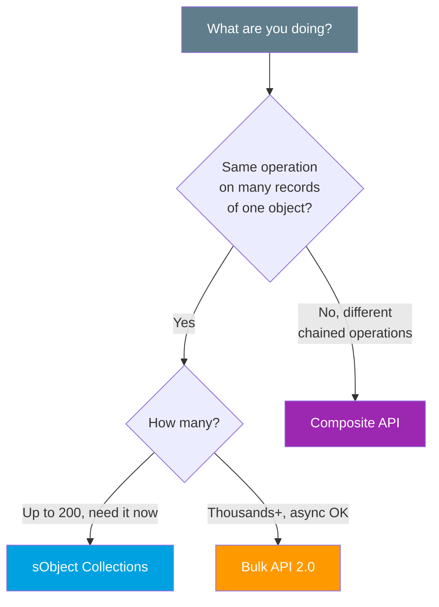
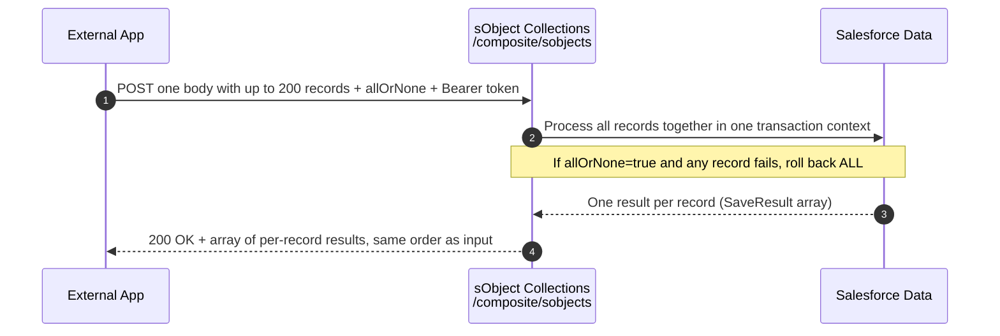

# 02 - sObject Collections

> **One-liner**: Create, update, upsert, delete, or retrieve **up to 200 records of one object type** in a **single synchronous** REST call, with an optional **all-or-none** rollback.
> **Direction**: External → Salesforce (inbound). **Format**: JSON over HTTP. **Auth**: OAuth 2.0 Bearer token.
> **Use when**: You have **dozens to ~200 records** to write or read in one round-trip and you want the answer **now**, not on an async job.

This is Module 08, the modern APIs. New to REST? See [Module 04](../04-Inbound-APIs/01-standard-rest-api.md). For the full "which API" picture, see [04-modern-api-landscape.md](04-modern-api-landscape.md). The previous page covered [01-graphql-api.md](01-graphql-api.md).

---

## 1. The idea in plain English

Imagine posting letters. The **Standard REST API** is one envelope per letter: 200 records means 200 trips to the post box, 200 stamps (API calls), 200 round-trips. **sObject Collections is a single mail sack**: you drop in up to 200 letters at once, hand it over in one trip, and the post office processes them together and hands you back one receipt sheet listing the outcome of each letter.

The catch the analogy hides: every letter in the sack must be addressed to the **same object type**. One sack for **Accounts**, another for **Contacts**. And the whole thing happens **synchronously**, you wait on the line and get all 200 results back in the same response. That immediacy is the whole point, and also the reason for the 200 cap.

---

## 2. When to use it (and when not)

| ✅ Use it when | ❌ Avoid / use something else |
|---|---|
| You have **50-200 records** of **one object** to write in one trip. | A single record → [Standard REST API](../04-Inbound-APIs/01-standard-rest-api.md) sObject Rows. |
| You need the result **synchronously**, right now. | **Thousands+** records, async is fine → [Bulk API 2.0](../07-Bulk-Async/01-bulk-api-2.md). |
| You want **fewer API calls** and fewer round-trips. | **Different** operations chained together → [Composite API](../04-Inbound-APIs/05-composite-api.md). |
| You want optional **all-or-none** rollback across the batch. | Parent **and** its children in one payload → [sObject Tree](../04-Inbound-APIs/05-composite-api.md). |

**Real-world examples**: a nightly micro-sync pushing 180 changed Contacts; an order page submitting 200 line items at once; a dedupe job retrieving 150 Accounts by Id with two fields each; deleting a batch of 200 stale Leads after a campaign.

---

## 3. How it differs from its cousins

These three get confused constantly in interviews. The distinction is the headline.

| Feature | **sObject Collections** | **Composite API** | **Bulk API 2.0** |
|---|---|---|---|
| What it batches | **Same** operation on **many records, one object** | **Different** operations chained in order | One operation on **huge** volumes |
| Sync or async | **Synchronous** | **Synchronous** | **Asynchronous** (job + polling) |
| Volume per call | **Up to 200 records** | Up to 25 subrequests | **Thousands to millions** |
| Chaining results | ❌ No, records are independent | ✅ Yes, `@{refId.field}` | ❌ No |
| Home file | this page | [05-composite-api.md](../04-Inbound-APIs/05-composite-api.md) | [01-bulk-api-2.md](../07-Bulk-Async/01-bulk-api-2.md) |

**The one-liner that nails it**: sObject Collections is for **many records, same job, now**. Composite is for **different jobs that depend on each other**. Bulk is for **volume you can wait on**.



---

## 4. How it works (sequence diagram)



**Walkthrough**

1. One `POST` (or `PATCH`/`DELETE`/`GET`) carries the batch. For writes, the body has an `allOrNone` flag and a `records` array.
2. Salesforce processes every record. Each carries its `attributes.type` so the platform knows the object.
3. With `allOrNone:true`, a single failure rolls back the **entire** batch. With `false` (the default), good records commit and only the bad ones report errors, **partial success**.
4. You get back **one array**, one entry per input record, in the **same order**. Each entry has `success`, the new `id` (on create), and any `errors`.

---

## 5. The actual request

Base: `https://MyDomainName.my.salesforce.com/services/data/v66.0/composite/sobjects`

| Operation | Method + path | Returns |
|---|---|---|
| **Create** | `POST /composite/sobjects` | `SaveResult[]` |
| **Update** | `PATCH /composite/sobjects` | `SaveResult[]` |
| **Upsert** | `PATCH /composite/sobjects/{SObject}/{externalIdField}` | `UpsertResult[]` |
| **Delete** | `DELETE /composite/sobjects?ids=id1,id2&allOrNone=true` | `DeleteResult[]` |
| **Retrieve** | `GET /composite/sobjects/{SObject}?ids=id1,id2&fields=Name,Phone` | `sObject[]` |
| **Retrieve (body)** | `POST /composite/sobjects/{SObject}` (ids + fields in body) | `sObject[]` |

> **Each record needs its type.** In the body, every record carries `"attributes": { "type": "Account" }`. That is how one collection can technically mix object types, though most teams keep one type per call.

**Create up to 200 records (POST)**

```
POST /services/data/v66.0/composite/sobjects
Authorization: Bearer 00D...!AQ...
Content-Type: application/json

{
  "allOrNone": false,
  "records": [
    { "attributes": { "type": "Account" }, "Name": "Acme Corp", "Industry": "Technology" },
    { "attributes": { "type": "Account" }, "Name": "Globex Inc", "Industry": "Manufacturing" }
  ]
}
```

**Response** (one entry per record, same order):

```json
[
  { "id": "001RO0000035frYYAQ", "success": true, "errors": [] },
  { "success": false, "errors": [
      { "statusCode": "REQUIRED_FIELD_MISSING", "message": "Required fields are missing: [Name]", "fields": ["Name"] }
  ] }
]
```

With `allOrNone:false` above, record 1 commits even though record 2 fails. Flip to `allOrNone:true` and **neither** would commit.

**Update (PATCH)** — same shape, but each record must include its `Id`:

```
PATCH /services/data/v66.0/composite/sobjects
{
  "allOrNone": true,
  "records": [
    { "attributes": { "type": "Contact" }, "id": "003...AAA", "Title": "VP Sales" },
    { "attributes": { "type": "Contact" }, "id": "003...BBB", "Title": "Director" }
  ]
}
```

**Delete (DELETE)** — Ids go in the query string:

```
DELETE /services/data/v66.0/composite/sobjects?ids=001...AAA,001...BBB&allOrNone=true
```

---

## 6. Design considerations and gotchas

| Consideration | Why it matters | What to do |
|---|---|---|
| **200-record hard cap** | All operations top out at **200** records per call. | For more, page into multiple calls or switch to [Bulk API 2.0](../07-Bulk-Async/01-bulk-api-2.md). |
| **allOrNone default is false** | Without it, you get **partial success**, some commit, some fail silently to your code. | Always read every result entry. Set `allOrNone:true` when the batch must be atomic. |
| **One API call, many records** | The whole batch counts as **one** request against the daily API limit. | Use it to collapse chatty per-record loops and save limits. |
| **Synchronous timeout** | It runs inline and is subject to normal sync limits. | Keep batches sane. Do not stuff 200 heavy records with deep automation. |
| **Triggers fire per batch** | Your Apex triggers run on these records like any DML. | Bulkify triggers. 200 records can hit governor limits if logic is sloppy. |
| **Read the result array** | Results map **positionally** to input. Index 3 in equals index 3 out. | Match errors back to source records by order, not by guessing. |
| **Nested allOrNone** | Inside a [Composite](../04-Inbound-APIs/05-composite-api.md) request, the outer call and each Collections subrequest each have their own `allOrNone`. | Set both deliberately. They interact. |

---

## 7. Interview Q&A

**Q: What does sObject Collections do that the Standard REST API does not?**
A: It performs CRUD on **up to 200 records in a single synchronous call**, returning one result per record. The Standard REST API (sObject Rows) is one record per call, so 200 records would be 200 round-trips and 200 API calls. Collections is one round-trip and one API call.

**Q: sObject Collections vs Composite API, what is the real difference?**
A: Collections runs the **same** operation across **many records of one object** and they are independent. Composite chains **different** operations in order and lets later steps reference earlier results with `@{refId.field}`. Use Collections for "200 Contacts, update them all"; use Composite for "create an Account, then a Contact that links to it."

**Q: sObject Collections vs Bulk API 2.0?**
A: **Synchronous vs asynchronous**, and **200 vs thousands+**. Collections is the right pick for 50-200 records when you need the answer immediately. Bulk 2.0 is for large volumes you can submit as a job and poll for later.

**Q: What is the allOrNone flag and what is its default?**
A: It controls rollback. Default is **false**, meaning partial success, valid records commit and only the failures report errors. Set it to **true** and any single failure rolls back the entire batch. You must inspect the result array either way.

**Q: How do you create a parent and its children with Collections?**
A: You do not, directly, because records in a collection are independent and Collections does not chain. Use **sObject Tree** or **Composite** with chaining instead. Collections is for flat batches of one object type.

**Talking point to explain it to anyone**: "Instead of mailing 200 letters one at a time, you drop all 200 into one mail sack, hand it over once, and get back one sheet telling you which letters made it and which bounced."

---

## 8. Key terms

sObject Collections, `/composite/sobjects`, SaveResult, UpsertResult, DeleteResult, allOrNone, partial success, synchronous, 200-record limit, external Id (upsert) - defined here and in the [Module 01 vocabulary](../01-Fundamentals/02-core-vocabulary.md) and the [README](README.md).

---

## Sources (Verified June 2026)

- [sObject Collections (v66.0) — REST API Developer Guide](https://developer.salesforce.com/docs/atlas.en-us.api_rest.meta/api_rest/resources_composite_sobjects_collections.htm)
- [Create Records Using sObject Collections — REST API Developer Guide](https://developer.salesforce.com/docs/atlas.en-us.api_rest.meta/api_rest/resources_composite_sobjects_collections_create.htm)
- [Update Records Using sObject Collections — REST API Developer Guide](https://developer.salesforce.com/docs/atlas.en-us.api_rest.meta/api_rest/resources_composite_sobjects_collections_update.htm)
- [Upsert Records Using sObject Collections — REST API Developer Guide](https://developer.salesforce.com/docs/atlas.en-us.api_rest.meta/api_rest/resources_composite_sobjects_collections_upsert.htm)
- [Delete Records Using sObject Collections — REST API Developer Guide](https://developer.salesforce.com/docs/atlas.en-us.api_rest.meta/api_rest/resources_composite_sobjects_collections_delete.htm)
- [Get Records Using sObject Collections — REST API Developer Guide](https://developer.salesforce.com/docs/atlas.en-us.api_rest.meta/api_rest/resources_composite_sobjects_collections_retrieve.htm)
- [allOrNone Parameters in Composite and Collections Requests — REST API Developer Guide](https://developer.salesforce.com/docs/atlas.en-us.api_rest.meta/api_rest/resources_composite_allornone.htm)

---

*Next: [03-data-cloud-apis.md](03-data-cloud-apis.md) - the APIs for ingesting and querying Salesforce Data Cloud.*
