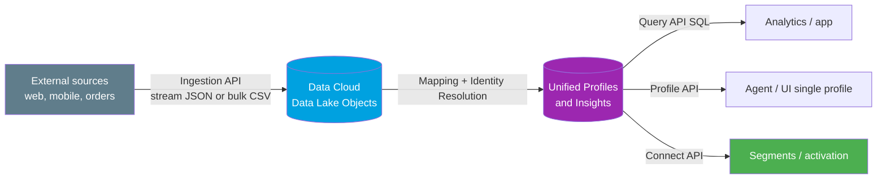
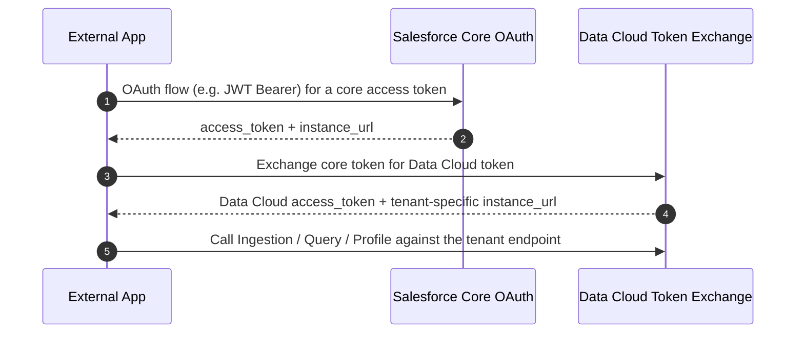

# 03 - Data Cloud APIs

> **One-liner**: A separate family of APIs to **stream or bulk-load** external data into **Data Cloud**, then **query**, **profile**, and **act on** the unified result at scale.
> **Direction**: Mostly External → Data Cloud (ingest) and External → Data Cloud (query). **Format**: JSON and CSV over HTTPS. **Auth**: OAuth 2.0, then a **token exchange** for a Data Cloud token.
> **Use when**: Your org **licenses Data Cloud** and you need to unify, query, or activate large external data sets that do not belong in core CRM objects.

This is Module 08, the modern APIs. For the full "which API" picture, see [04-modern-api-landscape.md](04-modern-api-landscape.md). The previous page covered [02-sobject-collections.md](02-sobject-collections.md).

> **Naming note (read this first).** Salesforce is rebranding **Data Cloud** to **Data 360** across its docs in 2025-2026. You will see both names, and they mean the same product. This page uses "Data Cloud" for the concept and flags "Data 360" where the current docs do. These APIs evolve fast, so treat exact endpoints as a snapshot and confirm against the live docs linked at the bottom.

---

## 1. The idea in plain English

Core Salesforce (Sales Cloud, Service Cloud) is your **office filing cabinet**: tidy, governed, but sized for CRM-scale data. **Data Cloud is a giant warehouse next door** built to absorb billions of rows from everywhere, web clicks, mobile events, order systems, data lakes, and stitch them into **one unified profile per person**.

The Data Cloud APIs are the **loading docks and the search desk** of that warehouse:

- The **Ingestion API** is the loading dock: trucks back up and drop off data, either a **steady trickle** (streaming) or **pallets of CSV** (bulk).
- The **Query API** is the search desk: ask SQL-style questions across everything in the warehouse.
- The **Profile API** is the "pull this one customer's full file" window.
- The **Connect API** is the back office: manage the warehouse itself, its segments, insights, and metadata.

Critically, this warehouse is a **separately licensed product**. These APIs sit **alongside** the core platform APIs (REST, Bulk, GraphQL), not inside them, and they use a slightly different auth handshake.

---

## 2. When to use it (and when not)

| ✅ Use it when | ❌ Avoid / use something else |
|---|---|
| Your org **licenses Data Cloud / Data 360**. | No Data Cloud license → use core APIs. There is nothing to call. |
| You ingest **large external data sets** (events, web, IoT). | A handful of CRM records → [sObject Collections](02-sobject-collections.md) or [REST](../04-Inbound-APIs/01-standard-rest-api.md). |
| You query a **unified profile** across many sources. | Querying standard CRM objects → SOQL / [GraphQL](01-graphql-api.md). |
| You build **segments, insights, activation**. | Streaming CRM change events → [Pub/Sub API](../06-Event-Driven/04-pub-sub-api.md). |

**Real-world examples**: streaming clickstream events from a website into Data Cloud every few seconds; nightly bulk upload of a 120 MB orders CSV; running a SQL query across unified profiles to build an audience segment; pulling one customer's full unified profile for a service agent screen.

---

## 3. The four APIs at a glance

| API | Job | Pattern | Typical resource root |
|---|---|---|---|
| **Ingestion API** | Push external data **in** | **Streaming** (JSON) + **Bulk** (CSV) | Tenant-specific object endpoints |
| **Query API** | Run **SQL** over Data Cloud objects | Sync first batch + async pagination | `/api/v2/query` or Connect `/ssot/query-sql` |
| **Profile API** | Read a **unified individual** profile | Synchronous read | Connect `/ssot/...` profile resources |
| **Connect API** | Manage **metadata, segments, insights, actions** | Connect REST resources | `/services/data/vXX/ssot/...` and `/connect/...` |

> **Two SQL query flavors exist.** The older **Query API V1/V2** and the newer **Query Connect API** (`/ssot/query-sql`, introduced around 2025) coexist. The Connect variant is the direction of travel and has no row-count limit with row-based pagination. Confirm which your org and tooling target before building.

---

## 4. How it works (ingest then query)



**Walkthrough**

1. **Ingest.** External systems call the Ingestion API. **Streaming** sends small JSON payloads as changes happen. **Bulk** uploads large CSV files via a job. Data lands in **Data Lake Objects**.
2. **Harmonize.** Inside Data Cloud, mapping and **identity resolution** stitch records into **unified profiles** and calculate insights. This is platform work, not an API call.
3. **Consume.** Query the result with the **Query API** (SQL), pull one person with the **Profile API**, or manage segments and metadata with the **Connect API**.

> **Eventual consistency.** Ingested data is processed asynchronously. The docs say to allow roughly **30 seconds minimum** before streamed data is queryable, and streaming is processed about **every 3 minutes**. Do not expect read-your-write immediacy.

---

## 5. The actual requests

### Authentication: a two-step token exchange

Data Cloud does **not** use your normal Salesforce session token directly. You authenticate to Salesforce, then **exchange** that token for a **Data Cloud access token** scoped to a **tenant-specific endpoint**.



Relevant OAuth scopes: **`cdp_ingest_api`** (Ingestion), **`cdp_query_api`** (Query), **`cdp_profile_api`** (Profile), plus the base **`api`** and **`refresh_token`** scopes.

### Ingestion API — streaming (small JSON, near real time)

```
POST https://<tenant>.c360a.salesforce.com/api/v1/ingest/sources/{sourceName}/{objectName}
Authorization: Bearer <DataCloudToken>
Content-Type: application/json

{ "data": [
    { "id": "c-001", "email": "jo@example.com", "event": "page_view", "ts": "2026-06-18T10:00:00Z" }
] }
```

Streaming limits worth knowing: **max ~200 KB per request**, up to **200 records deletable** per call, processed asynchronously roughly every few minutes.

### Ingestion API — bulk (large CSV, periodic)

A bulk load is a **job lifecycle**: create a job, upload one or more CSV files (max **100 files** per job, each up to **150 MB**), then close the job to start processing.

```
POST .../api/v1/ingest/jobs            # create job (object + operation: upsert/delete)
PUT  .../api/v1/ingest/jobs/{id}/batches  # upload CSV
PATCH .../api/v1/ingest/jobs/{id}      # { "state": "UploadComplete" } to start
```

### Query API — SQL over Data Cloud

```
POST https://<tenant>.c360a.salesforce.com/api/v2/query
Authorization: Bearer <DataCloudToken>
Content-Type: application/json

{ "sql": "SELECT FirstName__c, City__c FROM UnifiedIndividual__dlm WHERE City__c = 'Berlin' LIMIT 100" }
```

The newer **Query Connect API** uses `POST /services/data/v66.0/ssot/query-sql` to submit, `GET .../ssot/query-sql/{queryId}` to check status, `GET .../ssot/query-sql/{queryId}/rows` to page through results, and `DELETE` to cancel.

> **Object suffixes.** Data Cloud objects use suffixes like **`__dlm`** (Data Model Object) and **`__dll`** (Data Lake Object), not the CRM **`__c`**. Field names and suffixes depend on your data model.

---

## 6. Design considerations and gotchas

| Consideration | Why it matters | What to do |
|---|---|---|
| **Separate license** | Data Cloud is a **paid add-on**. No license, no endpoints. | Confirm provisioning before designing anything against it. |
| **Two-step auth** | The core token alone will not work. You need the **exchanged Data Cloud token** and tenant endpoint. | Implement the token exchange. Cache the tenant `instance_url`. |
| **Eventual consistency** | Ingested data is **not instantly** queryable (allow ~30s+). | Do not build read-after-write flows. Design for async. |
| **Streaming vs bulk** | Streaming is **small and frequent**; bulk is **large and periodic**. | Match the pattern to the data shape. Same stream can take both. |
| **Volume limits** | Streaming ~200 KB/request, bulk CSV 150 MB/file, 100 files/job, rate caps apply. | Chunk uploads. Honor **HTTP 429** with back-off. |
| **Rebrand churn** | Docs are mid-rename to **Data 360**; some endpoints and version paths shift. | Pin the API version. Re-verify endpoints against live docs. |
| **Not for core CRM** | These do not replace REST/Bulk for Accounts and Contacts. | Use core APIs for CRM objects; Data Cloud for the unified lake. |

---

## 7. Interview Q&A

**Q: What is Data Cloud and why does it have its own APIs?**
A: Data Cloud (now branded Data 360) is a separately licensed platform for ingesting, unifying, and activating **massive external data sets** into one profile per individual. It has dedicated APIs because it is a different data engine from core CRM, with its own objects (`__dlm`, `__dll`), its own scale, and its own auth.

**Q: What are the main Data Cloud APIs?**
A: The **Ingestion API** (stream or bulk-load data in), the **Query API** (SQL over Data Cloud objects), the **Profile API** (read a unified individual), and the **Connect API** (manage metadata, segments, insights, and actions).

**Q: Streaming vs bulk ingestion, when do you use each?**
A: **Streaming** for small, frequent JSON payloads in near real time, like clickstream events. **Bulk** for large CSV files loaded periodically, like a nightly orders export. The same data stream can accept both.

**Q: How is authentication different from core APIs?**
A: It is a **two-step exchange**. You authenticate to Salesforce normally (often JWT Bearer), then exchange that token for a **Data Cloud access token** tied to a **tenant-specific endpoint**, using scopes like `cdp_ingest_api`, `cdp_query_api`, and `cdp_profile_api`.

**Q: Can you read data back the instant you ingest it?**
A: No. Ingestion is **eventually consistent**, processed asynchronously. The docs advise allowing at least ~30 seconds before ingested data is queryable, so design for async rather than read-after-write.

**Talking point to explain it to anyone**: "Core Salesforce is the filing cabinet; Data Cloud is the huge warehouse next door. The Ingestion API is its loading dock, the Query and Profile APIs are its search desk, and you need a special pass (a separate token) to get in."

---

## 8. Key terms

Data Cloud / Data 360, Ingestion API, Query API, Profile API, Connect API, Data Lake Object (`__dll`), Data Model Object (`__dlm`), unified profile, identity resolution, streaming vs bulk ingestion, token exchange, tenant-specific endpoint, eventual consistency - defined here and in the [Module 01 vocabulary](../01-Fundamentals/02-core-vocabulary.md) and the [README](README.md).

---

## Sources (Verified June 2026)

- [Ingestion API — Data 360 Integration Guide](https://developer.salesforce.com/docs/data/data-cloud-int/guide/c360-a-ingestion-api.html)
- [Get Started with Ingestion API (auth, scopes, limits) — Data 360 Ingestion API Reference](https://developer.salesforce.com/docs/data/data-cloud-int/references/data-cloud-ingestionapi-ref/c360-a-api-get-started.html)
- [Query Data using Query API — Data 360 Query Guide](https://developer.salesforce.com/docs/data/data-cloud-query-guide/references/data-cloud-query-api-reference/c360a-api-queryservices-overview.html)
- [Boost Data Cloud Integrations with the New Query Connect API — Salesforce Developers Blog](https://developer.salesforce.com/blogs/2025/08/boost-data-cloud-integrations-with-the-new-query-connect-api)
- [Query Customer Profile Information with Profile API — Data 360 Query Guide](https://developer.salesforce.com/docs/atlas.en-us.c360a_api.meta/c360a_api/c360a_api_profile_call_overview.htm)
- [Data 360 Connect API References](https://developer.salesforce.com/docs/data/connectapi/references)
- [Quick Start — Data 360 Developer Guide](https://developer.salesforce.com/docs/data/data-cloud-dev/guide/dc-quick-start.html)

---

*Next: [04-modern-api-landscape.md](04-modern-api-landscape.md) - the capstone "which API do I use?" decision guide.*
