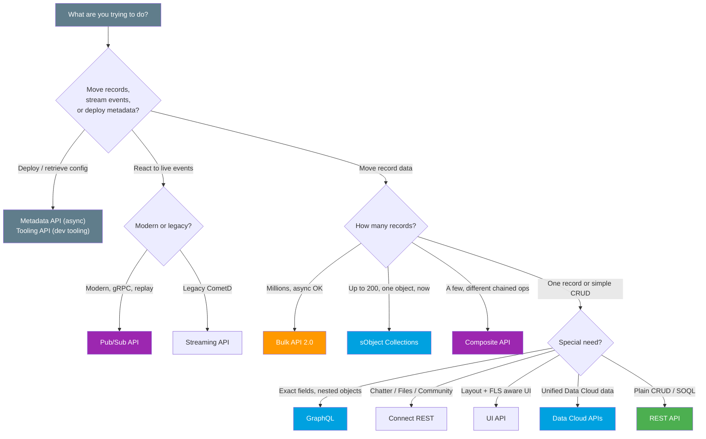

# 04 - The Modern API Landscape

> **One-liner**: One page to pick the **right Salesforce API** for any integration, by purpose, sync vs async, format, and volume.
> **Direction**: Both. **Format**: Mixed. **Auth**: OAuth 2.0 (mostly).
> **Use when**: You are designing an integration and need to choose, or an interviewer asks "which API would you use and why?"

This is the **capstone** of Module 08 and a synthesis of the whole vault. Each API below links to its home page across Modules 04, 06, 07, and 08.

---

## 1. The idea in plain English

Salesforce gives you a **toolbox**, not a single tool. Reaching for REST when you should use Bulk is like digging a foundation with a teaspoon. Reaching for Bulk to fetch one record is like swinging a backhoe to plant a seed. The skill is **matching the tool to the job**.

Three questions settle almost every choice:

1. **How much data?** One record, a couple hundred, or millions?
2. **Sync or async?** Do you need the answer **now**, or can you submit a job and collect results later?
3. **What shape?** Simple CRUD, a precise field selection, chained operations, or a live event stream?

Answer those three and the API picks itself. The rest of this page is the lookup table and a decision tree.

---

## 2. The full comparison table

| API | Purpose | Sync / Async | Format | Volume | When to use | Home |
|---|---|---|---|---|---|---|
| **REST API** | General CRUD + SOQL, the workhorse | Sync | JSON / XML | 1 record per call | Default for most app integrations | [04 · 01](../04-Inbound-APIs/01-standard-rest-api.md) |
| **SOAP API** | Legacy, strongly typed, WSDL contract | Sync | XML | 1-200 per call | Old/enterprise clients needing a WSDL | [04 · 02](../04-Inbound-APIs/02-standard-soap-api.md) |
| **GraphQL** | Pick exact fields across related objects | Sync | JSON | Read-shaped, paged | Avoid over/under-fetching; dashboards | [08 · 01](01-graphql-api.md) |
| **Composite** | Chain several **different** ops in one trip | Sync | JSON | Up to 25 subrequests | Dependent calls, all-or-none | [04 · 05](../04-Inbound-APIs/05-composite-api.md) |
| **sObject Collections** | Same op on **many records, one object** | Sync | JSON | **Up to 200 records** | 50-200 records, need it now | [08 · 02](02-sobject-collections.md) |
| **Bulk API 2.0** | Mass load/extract, job-based | **Async** | CSV / JSON | **Thousands to millions** | Large data loads you can poll | [07 · 01](../07-Bulk-Async/01-bulk-api-2.md) |
| **Pub/Sub API** | Publish + subscribe to events over gRPC | Async stream | Avro / gRPC | Event stream | Modern event-driven, CDC, replay | [06 · 04](../06-Event-Driven/04-pub-sub-api.md) |
| **Streaming API** | Legacy CometD push (PushTopic, generic) | Async stream | JSON | Event stream | Older event subscribers; being superseded | [06 · 05](../06-Event-Driven/05-streaming-api-and-outbound-messages.md) |
| **Connect REST API** | Chatter, Experience Cloud, Files, feeds | Sync | JSON | Feature-scoped | Social, communities, files, programmatically | [04 · 06](../04-Inbound-APIs/06-connect-rest-api.md) |
| **UI API** | Build Salesforce-like UIs (FLS + layout aware) | Sync | JSON | UI-scoped | Custom UIs needing layout/FLS metadata | [04 · 07](../04-Inbound-APIs/07-ui-api.md) |
| **Metadata API** | Deploy/retrieve **config and metadata** | **Async** | XML | Org metadata | CI/CD, deployments, org setup | [README](README.md) |
| **Tooling API** | Developer tooling, fine-grained metadata | Sync | JSON / XML | Dev artifacts | IDEs, code analysis, debug logs | [README](README.md) |
| **Data Cloud APIs** | Ingest, query, profile unified data | Both | JSON / CSV | **Massive** | Data Cloud-licensed orgs only | [08 · 03](03-data-cloud-apis.md) |

> **The two axes that matter most**: **volume** (1 → 200 → millions) and **timing** (sync now vs async job). REST → sObject Collections → Bulk 2.0 is the same axis at three scales. Everything else is about **shape**: GraphQL for field selection, Composite for chaining, Pub/Sub for events, Metadata/Tooling for config.

---

## 3. Decision tree — what are you trying to do?

---

## 4. The three-scale spine (memorize this)

For plain record movement, picture **one axis** of growing volume. This single line answers most integration questions.

| Scale | Records | API | Why |
|---|---|---|---|
| **One** | 1 at a time | [REST API](../04-Inbound-APIs/01-standard-rest-api.md) | Simple, synchronous, one call per record |
| **Some** | up to **200**, one object, sync | [sObject Collections](02-sobject-collections.md) | One round-trip, one API call, immediate |
| **Many** | **thousands to millions**, async | [Bulk API 2.0](../07-Bulk-Async/01-bulk-api-2.md) | Job-based, parallelized, poll for results |

Then layer the **shape** exceptions on top:

- Need **specific fields** across related objects? → [GraphQL](01-graphql-api.md).
- Need **different operations chained** with all-or-none? → [Composite](../04-Inbound-APIs/05-composite-api.md).
- Need **parent + children** in one payload? → sObject Tree (in [Composite](../04-Inbound-APIs/05-composite-api.md)).
- Need to **react to changes**? → [Pub/Sub API](../06-Event-Driven/04-pub-sub-api.md) (modern) over [Streaming](../06-Event-Driven/05-streaming-api-and-outbound-messages.md) (legacy).

---

## 5. Design considerations and gotchas

| Consideration | Why it matters | What to do |
|---|---|---|
| **Sync vs async first** | It splits the whole toolbox in two. | Decide if you can wait. Async (Bulk, Metadata, Pub/Sub) unlocks scale. |
| **API limits** | Every sync call counts against the daily allocation. | Batch with Collections/Composite; offload volume to Bulk. See [Module 09](../09-Security-Limits/README.md). |
| **Legacy vs modern events** | Streaming API is superseded by Pub/Sub. | Choose **Pub/Sub** for new event work; know Streaming for old systems. |
| **GraphQL is read-shaped** | It is not a bulk loader. | Use it to shape reads, not to mass-write. |
| **Data Cloud is separate** | Different license, different token. | Only relevant if the org is provisioned. See [03](03-data-cloud-apis.md). |
| **Metadata vs data** | Metadata API moves **config**, not rows. | Never use it to move records, and never use data APIs for config. |
| **Pin the version** | Behavior and shape change by version. | Use **v66.0** consistently across the integration. |

---

## 6. Interview Q&A

**Q: Walk me through choosing an API for a 500,000-record nightly load.**
A: That is **volume + async**, so **Bulk API 2.0**. It is job-based, parallelized, and built for millions. sObject Collections caps at 200 and is synchronous; REST would be 500,000 calls. Bulk is the only sane fit.

**Q: A mobile app needs an Account with its Contacts and Opportunities in one call, only a few fields each. Which API?**
A: **GraphQL**. It selects exact fields across related objects in one round-trip, killing over-fetching and under-fetching. Composite could bundle the calls, but GraphQL is purpose-built for field-selective nested reads.

**Q: You must create an Account, then a Contact linked to it, atomically. Which API?**
A: **Composite** with chaining (`@{refId.field}`) and `allOrNone:true`, or **sObject Tree** for the nested parent-child payload. sObject Collections cannot chain because its records are independent.

**Q: REST vs sObject Collections vs Bulk, in one sentence each.**
A: REST is **one record, sync**. sObject Collections is **up to 200 records of one object, sync, one call**. Bulk 2.0 is **thousands to millions, async, job-based**. Same axis, three scales.

**Q: New project needs to react to record changes in near real time. Which event API?**
A: **Pub/Sub API**, gRPC-based, bi-directional, with replay and efficient Avro payloads. The older Streaming API still works but is being superseded, so pick Pub/Sub for anything new.

**Talking point to explain it to anyone**: "Salesforce hands you a toolbox. One record, use REST. A couple hundred at once, use sObject Collections. Millions, use Bulk. Want exact fields, use GraphQL. Want live events, use Pub/Sub. Match the tool to the job."

---

## 7. Key terms

API surface, synchronous, asynchronous, volume, field selection, chaining, event stream, metadata vs data, three-scale spine (REST → Collections → Bulk) - defined here and in the [Module 01 vocabulary](../01-Fundamentals/02-core-vocabulary.md) and the [README](README.md).

---

## Sources (Verified June 2026)

- [Which API Do I Use? — REST API Developer Guide](https://developer.salesforce.com/docs/atlas.en-us.api_rest.meta/api_rest/intro_which_api.htm)
- [REST API Developer Guide (v66.0)](https://developer.salesforce.com/docs/atlas.en-us.api_rest.meta/api_rest/intro_what_is_rest_api.htm)
- [Bulk API 2.0 and Bulk API Developer Guide](https://developer.salesforce.com/docs/atlas.en-us.api_asynch.meta/api_asynch/asynch_api_intro.htm)
- [Pub/Sub API Documentation](https://developer.salesforce.com/docs/platform/pub-sub-api/overview)
- [GraphQL API — Salesforce Developers](https://developer.salesforce.com/docs/platform/graphql/overview)
- [Metadata API Developer Guide](https://developer.salesforce.com/docs/atlas.en-us.api_meta.meta/api_meta/meta_intro.htm)
- [Tooling API](https://developer.salesforce.com/docs/atlas.en-us.api_tooling.meta/api_tooling/intro_api_tooling.htm)

---

*Next: back to the [README.md](README.md) - or jump to [Module 09 · Security and Limits](../09-Security-Limits/README.md) to see how these APIs are governed.*
