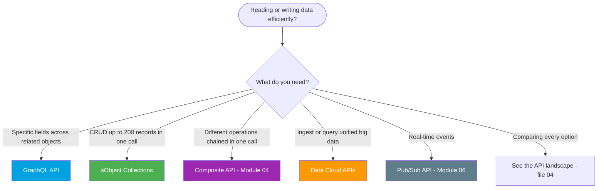

# Module 08 - Modern APIs

> **Goal**: Use the newer APIs that solve old pain points, and know how the whole API surface fits together.
> **API version**: v66.0 (Spring '26). **Theme**: stop making 5 calls when 1 will do.

Several "modern API" topics already have homes elsewhere in the vault: **Composite** and **UI API** in [Module 04](../04-Inbound-APIs/README.md), **Pub/Sub API** in [Module 06](../06-Event-Driven/README.md), **Salesforce Connect** and **External Services** in [Module 02/05](../05-Outbound-Callouts/README.md). This module covers what's left and ties it all together: **GraphQL**, **sObject Collections**, **Data Cloud APIs**, and the definitive **API landscape**.

---

## Map of this module

| # | File | What it covers |
|---|---|---|
| 01 | [graphql-api](01-graphql-api.md) | Field-selective, nested reads in one round-trip |
| 02 | [sobject-collections](02-sobject-collections.md) | CRUD up to 200 records in one call |
| 03 | [data-cloud-apis](03-data-cloud-apis.md) | Ingestion, Query, Profile APIs for Data Cloud |
| 04 | [modern-api-landscape](04-modern-api-landscape.md) | **The capstone:** which API for which job, across the whole platform |

---

## Which modern API? (decision tree)

---

## The pain points these solve

| Old pain | Modern fix |
|---|---|
| Multiple REST calls to get related data | **GraphQL** (one query, nested) |
| Looping single-record REST calls for 100 records | **sObject Collections** (200 in one call) |
| Chatty multi-step writes | **Composite API** ([Module 04](../04-Inbound-APIs/05-composite-api.md)) |
| Polling for changes | **Pub/Sub API** ([Module 06](../06-Event-Driven/04-pub-sub-api.md)) |
| Copying huge external datasets in | **Data Cloud** / **Salesforce Connect** |
| Writing Apex just to call a REST API from Flow | **External Services** ([Module 05](../05-Outbound-Callouts/03-external-services.md)) |

---

## Interview rapid-fire

**Q: GraphQL vs REST?**
→ GraphQL returns exactly the fields you ask for across related objects in one round-trip (no over/under-fetching). REST is simpler for single-object CRUD and caches better. See [01](01-graphql-api.md).

**Q: sObject Collections vs Composite vs Bulk?**
→ Collections = same CRUD on **up to 200** records, one **sync** call. Composite = **different** operations chained in one call. Bulk = **async**, thousands+. 

**Q: What's the modern way to subscribe to events?**
→ The **Pub/Sub API** (gRPC + Avro), not the legacy Streaming API. See [Module 06](../06-Event-Driven/04-pub-sub-api.md).

**Q: How do you decide which API to use?**
→ Match sync/async, volume, and shape to the job. The full matrix is in [04-modern-api-landscape.md](04-modern-api-landscape.md).

---

## Sources (Verified June 2026)

- [GraphQL API — Salesforce Developers](https://developer.salesforce.com/docs/platform/graphql/overview)
- [sObject Collections — REST API Developer Guide](https://developer.salesforce.com/docs/atlas.en-us.api_rest.meta/api_rest/resources_composite_sobjects_collections.htm)
- [Data Cloud — Salesforce Developers](https://developer.salesforce.com/docs/data/data-cloud-int/guide/c360-a-api.html)

*Each file has its own Sources section with the specific official doc.*
