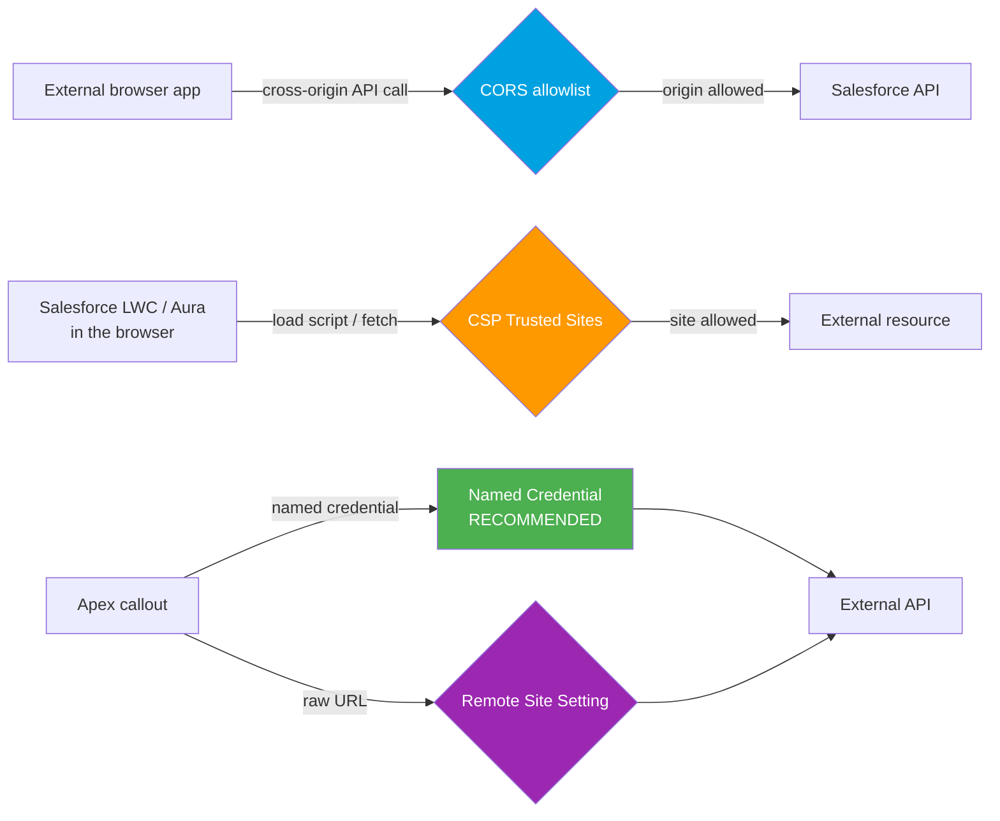

# 01 - Connection Security (CORS vs CSP Trusted Sites vs Remote Site Settings)

> **One-liner**: Three different "allowlists" decide who may reach Salesforce and where Salesforce may reach out. People constantly confuse them, so nail the distinction.
> **The three**: **CORS** (inbound browser → SF API), **CSP Trusted Sites** (SF's own LWC/Aura browser → external), **Remote Site Settings** (Apex callout → external, legacy).

This is Module 09, security and limits. For the OAuth that authenticates callers, see [Module 03](../03-Authentication/README.md). For outbound callouts, see [Module 05](../05-Outbound-Callouts/README.md).

---

## 1. The idea in plain English

Think of Salesforce as a **secured building**. Three different rules govern doors and errands, and mixing them up is the classic mistake:

- **CORS** is the **guest list at the front door**: which outside **browsers** (origins) are allowed to walk in and call the Salesforce API directly from JavaScript.
- **CSP Trusted Sites** is **where your in-house staff may go**: which external sites your own **Lightning (LWC/Aura) pages** are permitted to load scripts/images from or call from the browser.
- **Remote Site Settings** is the **approved address book for the butler**: which external URLs **Apex server-side callouts** may hit (largely **superseded by Named Credentials**).

The key axes are **direction** (into Salesforce vs out of Salesforce) and **who** is making the call (an external browser, a Salesforce browser page, or Apex on the server).

---

## 2. The three controls compared

| Control | Direction | Who it governs | When you need it |
|---|---|---|---|
| **CORS allowlist** | **Inbound** | An **external website's browser** calling the Salesforce REST/UI/etc. API cross-origin | A SPA on `app.example.com` calls Salesforce APIs from JavaScript |
| **CSP Trusted Sites** | **Outbound (browser)** | **Salesforce's own LWC/Aura** loading or calling external resources | An LWC pulls an image, script, or `fetch()`s an external API from the browser |
| **Remote Site Settings** | **Outbound (server)** | **Apex HTTP callouts** to a raw URL | Apex calls an external endpoint **without** a Named Credential |

> **The 10-second answer**: CORS = let outsiders' browsers **in**. CSP Trusted Sites = let **our** browser pages reach **out**. Remote Site Settings = let **Apex** reach out (use **Named Credentials** instead).

---

## 3. How they fit together

- **CORS** gates the **inbound** browser call. Note: CORS handles **origin**, not authentication. The caller still needs a valid **OAuth token**.
- **CSP Trusted Sites** gates what **Salesforce's own UI** may load or call from the browser.
- For **Apex callouts**, a **Named Credential** both authenticates and authorizes the endpoint, so you do **not** need a Remote Site Setting. Raw-URL callouts still require one.

---

## 4. Setup / configuration

- **CORS**: Setup → **CORS** → add the external **origin** (e.g. `https://app.example.com`) to the allowlist. Managed via the `CorsWhitelistOrigin` metadata.
- **CSP Trusted Sites**: Setup → **CSP Trusted Sites** → add the external site and choose the contexts (`connect-src`, `img-src`, `script-src`, etc.). Managed via `CspTrustedSite` metadata.
- **Remote Site Settings**: Setup → **Remote Site Settings** → add the URL. Prefer creating a **Named Credential** instead, which removes this need. ([Module 05](../05-Outbound-Callouts/02-named-credentials-for-callouts.md).)

---

## 5. Gotchas and interview traps

| Gotcha | Clarification |
|---|---|
| "CORS authenticates the caller." | No. CORS only allows the **origin**. The request still needs a valid OAuth token. |
| "Use Remote Site Settings for callouts." | Prefer **Named Credentials**, which authenticate and remove the Remote Site requirement. |
| "CSP Trusted Sites lets external apps call us." | No, that's CORS. CSP governs what **our** Lightning pages may reach **outbound** in the browser. |
| "CORS and CSP are the same." | Opposite directions. CORS = inbound to SF API; CSP Trusted Sites = outbound from SF's browser UI. |

---

## 6. Interview Q&A

**Q: CORS vs CSP Trusted Sites vs Remote Site Settings?**
A: CORS allowlists external **browser origins** calling Salesforce APIs (inbound). CSP Trusted Sites allowlists external resources that Salesforce's **own LWC/Aura** pages load or call (outbound from the browser). Remote Site Settings allowlists URLs for **Apex server-side callouts** (outbound, legacy, superseded by Named Credentials).

**Q: Does CORS replace authentication?**
A: No. CORS only permits the origin to make cross-origin calls. The caller still authenticates with OAuth.

**Q: When do you NOT need a Remote Site Setting?**
A: When you use a **Named Credential** for the callout. It registers and authenticates the endpoint, so no Remote Site Setting is required.

**Q: An LWC needs to call a third-party API directly from the browser. What do you configure?**
A: Add the API's domain to **CSP Trusted Sites** (with the right directive like `connect-src`). For server-side, you'd use Apex + a Named Credential instead.

**Talking point to explain it to anyone**: "Three guest lists: who may come in (CORS), where our staff may go (CSP Trusted Sites), and which addresses the butler may visit (Remote Site Settings, now usually replaced by Named Credentials)."

---

## 7. Key terms

CORS, origin, CSP, Trusted Site, Remote Site Setting, Named Credential, cross-origin - defined here and in the [Module 01 vocabulary](../01-Fundamentals/02-core-vocabulary.md) and the [README](README.md).

---

## Sources (Verified June 2026)

- [Configure Salesforce CORS Allowlist — Salesforce Help](https://help.salesforce.com/s/articleView?id=sf.extend_code_cors.htm&type=5)
- [Manage Trusted URLs (CSP) — Salesforce Help](https://help.salesforce.com/s/articleView?id=xcloud.security_trusted_urls_manage.htm&type=5)
- [CspTrustedSite — Metadata API Developer Guide](https://developer.salesforce.com/docs/atlas.en-us.api_meta.meta/api_meta/meta_csptrustedsite.htm)

---

*Next: [02-authentication-and-access-controls.md](02-authentication-and-access-controls.md) - who is allowed to call the API at all.*
