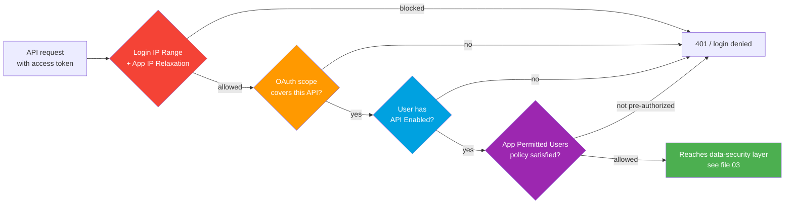

# 02 - Authentication and Access Controls (WHO Can Call the API)

> **One-liner**: Before a single byte of data is touched, Salesforce asks a chain of "are you even allowed in?" questions. This file is that chain: IP, OAuth scope, the **API Enabled** permission, and the app's own user policy.
> **API version**: v66.0 (Spring '26). For the OAuth flows and tokens that authenticate the caller, see [Module 03](../03-Authentication/README.md).

This is Module 09, security and limits. This file is **WHO** may call the API. The next file, [03-data-level-security.md](03-data-level-security.md), is **WHAT** that caller can then see and do.

---

## 1. The idea in plain English

Authentication answered *"who are you?"* ([Module 03](../03-Authentication/01-authentication-fundamentals.md)). Access control answers *"are you allowed to use this door at all?"* Two different questions.

Think of an office tower with an integration vendor arriving to do work:

- **Login IP Ranges** are the **parking gate**: if you did not come from an approved address, the gate never lifts. You never even reach the lobby.
- **OAuth scope** is what your **building pass is encoded to open**: a token granted only the `api` scope can call data APIs but cannot, say, manage users.
- **API Enabled** is the **"this badge works for the service entrance, not just the front door"** flag. Without it, the human can log in to the UI but the API turns them away.
- **Connected App / External Client App policy** is the **vendor contract**: even with a valid badge, the building owner decides *which vendors* (apps) are pre-approved to operate.

Miss any one link and the call fails before a record is ever read. Each layer is independent, so the request must satisfy all of them.

---

## 2. The access-control layers and when each applies

| Layer | Question it answers | Set where | Applies to |
|---|---|---|---|
| **Login IP Ranges** (profile) | Did the request come from an allowed network? | Profile → Login IP Ranges | The **user** behind the token |
| **Connected App IP Relaxation** | Should this app bypass or enforce org IP rules? | The app's OAuth policy | The **app** |
| **OAuth scopes** | What categories of API is this token allowed to hit? | App definition + requested at token time | The **token** |
| **API Enabled** permission | May this user touch any API at all? | Profile or permission set | The **user** |
| **Apex REST Services** permission | May this user invoke custom Apex REST endpoints? | Profile or permission set | The **user** (notably guest/site users) |
| **Permitted Users** policy | Is this app pre-authorized for this user? | App's OAuth policy | The **app + user** pairing |

> **The 10-second answer**: IP gates the **network**, scopes gate the **token**, **API Enabled** gates the **user**, and the **Connected App policy** gates the **app**. All four must pass.

---

## 3. How a request flows through the gauntlet

Walkthrough:

1. **IP check first.** If the user's profile has **Login IP Ranges**, a request from any other address is denied. With **Enforce login IP ranges on every request** turned on (Session Settings), this is checked on *every* API call, not just at login.
2. **Scope check.** The token only works against APIs covered by the scopes it was issued. A token without `api` cannot call the REST data API no matter who the user is.
3. **API Enabled check.** The running user must have the **API Enabled** user permission, or the platform rejects all API access with an error.
4. **App policy check.** If the Connected App / External Client App is set to **Admin approved users are pre-authorized**, the user must be authorized via a profile or permission set, or access is refused.

Only after all four pass does the request reach the **data-security** funnel in [file 03](03-data-level-security.md).

---

## 4. Setup, configuration, and least-privilege

### 4.1 The user permissions that unlock the API

| Permission | What it unlocks | Where granted |
|---|---|---|
| **API Enabled** | Any API access (REST, SOAP, Bulk, etc.). Without it, **no** API call works. | Profile or permission set |
| **API Only User** | User can use the API but **cannot** log in to the UI. Ideal for integration identities. | Profile or permission set |
| **Apex REST Services** | Invoke custom `@RestResource` Apex endpoints. Needed for **guest/site users** calling Apex REST. | Profile or permission set |
| **Author Apex** | Write and deploy Apex (and run `executeAnonymous`). A *build-time* permission, not a runtime API gate. | Profile or permission set |

> **Trap**: "Apex REST Services" and "Author Apex" are different. **Author Apex** lets a developer *create* the class. **Apex REST Services** lets a user *call* a custom Apex REST endpoint (most relevant for unauthenticated guest users on Experience Cloud sites).

### 4.2 Least-privilege for integration users (the modern pattern)

Do not reuse an admin login for integrations. The recommended build:

1. Create a dedicated user per integration on the **Minimum Access - API Only Integrations** profile (built on Minimum Access - Salesforce, grants **API Enabled** + **API Only**, and these cannot be edited on the profile).
2. Layer on exactly the object, field, and feature permissions the integration needs via **permission sets** (assigned with the **Salesforce API Integration** permission set license).
3. Authenticate via the **Client Credentials flow**, choosing that user as the **Run As** execution user. The token inherits *that user's* permissions, so a tightly scoped user yields a tightly scoped token.

This is least privilege in practice: a Minimum Access base plus a narrow permission set, never a Modify All Data admin.

### 4.3 IP controls

- **Profile Login IP Ranges**: Setup → Profiles → (profile) → **Login IP Ranges** → add start/end addresses. Any login outside the range is denied. Winter '26 enforces a cap on how many ranges a profile may hold per IP type.
- **Org Trusted IP Ranges**: Setup → **Network Access**. Addresses here skip identity verification (no challenge), but are *not* a login restriction by themselves.
- **Connected App IP Relaxation**: in the app's OAuth policy, choose **Enforce IP restrictions** (default, honor org/profile IP rules), **Relax IP restrictions for activated devices**, or **Relax IP restrictions** (ignore org IP rules for this app).

### 4.4 Connected App / External Client App user policy

In **Manage** → OAuth Policies, set **Permitted Users**:

- **All users may self-authorize** (default): any user can approve the app on first use.
- **Admin approved users are pre-authorized**: only users granted the app via a profile or permission set may use it. This is the locked-down choice for production integrations.

> **Critical bypass**: a user with the **Use Any API Client** permission can use *any* connected app even when it is set to Admin-approved. Guard that permission carefully in a security review.

---

## 5. Gotchas and interview traps

| Gotcha | Clarification |
|---|---|
| "Valid OAuth token means the call works." | No. The user still needs **API Enabled**, the token needs the right **scope**, the IP must pass, and the app policy must allow it. |
| "Login IP Ranges only block interactive logins." | Only until you enable **Enforce login IP ranges on every request**, which then checks every API call too. |
| "Trusted IP Ranges restrict who can log in." | No. Org **Trusted IP Ranges** only skip the identity-verification challenge. **Profile Login IP Ranges** are the actual restriction. |
| "Admin-approved blocks everyone unauthorized." | Mostly, but **Use Any API Client** overrides it. |
| "Author Apex lets you call an Apex REST endpoint." | No. Calling needs **Apex REST Services** (and access to the class). Author Apex is for *building* Apex. |
| "Scope `full` includes a refresh token." | No, you must request `refresh_token` separately. (See [Module 03](../03-Authentication/01-authentication-fundamentals.md).) |

---

## 6. Interview Q&A

**Q: A partner has a valid access token but every API call returns an error. Where do you look?**
A: Walk the chain. Confirm the user has **API Enabled**, the token carries the **api** scope, the request's source **IP** is within the profile's Login IP Ranges (or relaxed on the app), and the Connected App's **Permitted Users** policy authorizes that user. Any one of these failing blocks the call before data access.

**Q: What is the modern least-privilege setup for a server-to-server integration?**
A: A dedicated user on the **Minimum Access - API Only Integrations** profile (API Enabled + API Only), narrow **permission sets** for exactly the needed objects/fields, authenticated via the **Client Credentials** flow with that user as the **Run As** user. The token then inherits only those minimal permissions.

**Q: Difference between profile Login IP Ranges and org Trusted IP Ranges?**
A: **Profile Login IP Ranges** *restrict* where a user may authenticate from (outside the range is denied). **Org Trusted IP Ranges** only let users *skip* the identity-verification challenge. One is a wall, the other is a fast lane.

**Q: What do OAuth scopes control, and how does that relate to access control?**
A: Scopes gate which **categories of API** a token may call (for example `api` for data APIs, `web` for browser sessions). They are AuthZ at the token level: even a powerful user gets a narrow token if the app requested narrow scopes. (Full scope table in [Module 03](../03-Authentication/01-authentication-fundamentals.md).)

**Q: How do you lock a Connected App so only specific integrations can use it?**
A: Set **Permitted Users** to **Admin approved users are pre-authorized** and grant the app only via specific profiles/permission sets. Then audit who holds **Use Any API Client**, since that permission bypasses the restriction.

**Talking point to explain it to anyone**: "Four gates before any data: the network you came from (IP), what your pass is coded to open (scope), whether your badge even works for the service door (API Enabled), and whether the building approved your vendor (the app policy)."

---

## 7. Key terms

API Enabled, API Only User, Apex REST Services, Author Apex, Login IP Ranges, Trusted IP Ranges, IP Relaxation, OAuth scope, Permitted Users, Admin approved users are pre-authorized, Use Any API Client, Minimum Access - API Only Integrations, Run As user - defined here and in the [Module 01 vocabulary](../01-Fundamentals/02-core-vocabulary.md) and the [README](README.md).

---

## Sources (Verified June 2026)

- [User Permissions (API Enabled, etc.) - Salesforce Security Guide](https://developer.salesforce.com/docs/atlas.en-us.securityImplGuide.meta/securityImplGuide/admin_userperms.htm)
- [Secure API Access with the New Least-Privilege User Profile - Release Notes](https://help.salesforce.com/s/articleView?id=release-notes.rn_api_new_user_profile.htm&type=5)
- [Give Integration Users API Only Access - Salesforce Help](https://help.salesforce.com/s/articleView?id=platform.integration_user.htm&type=5)
- [Restrict Login IP Addresses in Profiles - Salesforce Help](https://help.salesforce.com/s/articleView?id=platform.login_ip_ranges.htm&type=5)
- [Manage OAuth Access Policies for a Connected App - Salesforce Help](https://help.salesforce.com/s/articleView?id=xcloud.connected_app_manage_oauth.htm&type=5)
- [Connected App IP Relaxation and Continuous IP Enforcement - Salesforce Help](https://help.salesforce.com/s/articleView?id=xcloud.connected_app_continuous_ip.htm&type=5)
- [Restrict Access to APIs with Connected Apps - Salesforce Help](https://help.salesforce.com/s/articleView?id=xcloud.security_api_access_control_all_users.htm&type=5)
- [Invoke REST APIs with the Salesforce Integration User and OAuth Client Credentials - Developer Blog](https://developer.salesforce.com/blogs/2024/02/invoke-rest-apis-with-the-salesforce-integration-user-and-oauth-client-credentials)

---

*Next: [03-data-level-security.md](03-data-level-security.md) - once a caller is in, what records and fields can they actually see and change.*
