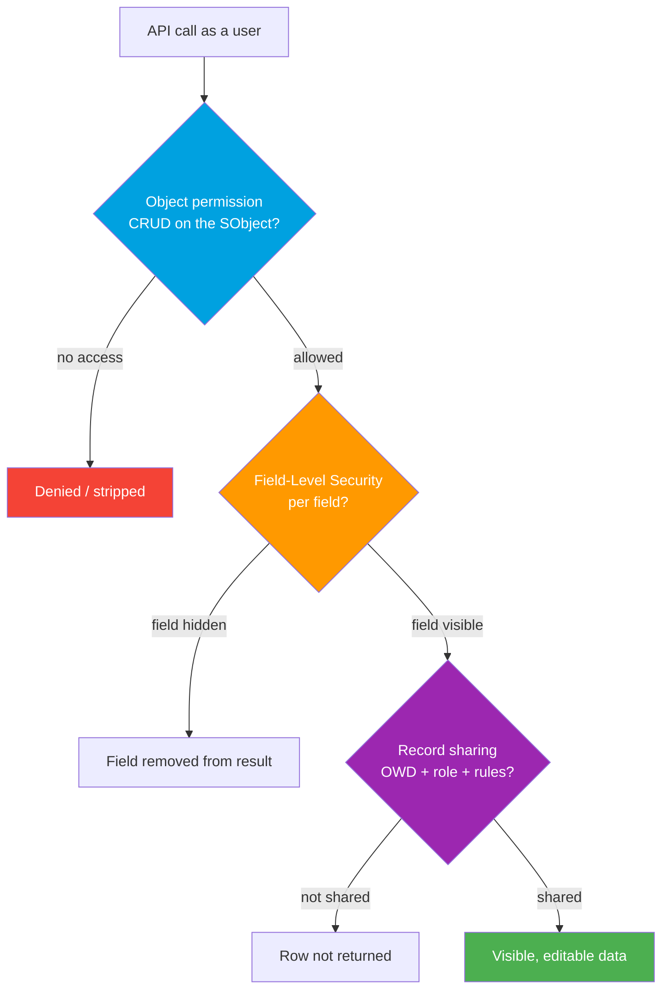

# 03 - Data-Level Security (WHAT a Caller Can See and Do)

> **One-liner**: Getting *in* (file 02) is not the same as seeing *everything*. Salesforce filters every call through object permissions, then field-level security, then record sharing. This file is that funnel, plus how to enforce it yourself in Apex.
> **API version**: v66.0 (Spring '26). Builds on [02-authentication-and-access-controls.md](02-authentication-and-access-controls.md) (who may call) and ties to [Apex REST](../04-Inbound-APIs/03-apex-rest.md).

This is Module 09, security and limits. File 02 answered **WHO** may call the API. This file answers **WHAT** they can read and write once inside.

---

## 1. The idea in plain English

Imagine a **library** with three nested rules:

- **Object permissions (CRUD)** decide **which rooms** you may enter at all: the Accounts room, the Cases room. No Read on Contacts means the Contacts room is locked.
- **Field-Level Security (FLS)** decides **which shelves** in a room you may touch: you are in the Accounts room, but the Revenue shelf is blacked out.
- **Record-level sharing** decides **which individual books** you may open: you can read Accounts, but only the *ones shared with you* by org-wide defaults, the role hierarchy, or sharing rules.

A call must clear all three. You can have full Read on Account (object), see every field (FLS), and still be handed zero records because none are shared with you.

The twist for integrations: **the Standard REST/SOAP API enforces all three automatically** as the running user. But **Apex REST runs in system context**, which bypasses them, so you must re-add the checks by hand.

---

## 2. The data-security layers and when each applies

| Layer | What it controls | Set where | Enforced automatically? |
|---|---|---|---|
| **Object permissions (CRUD)** | Can you Create / Read / Update / Delete this object type? | Profiles, permission sets | Yes, by Standard API and Apex in user mode |
| **Field-Level Security (FLS)** | Can you see/edit each individual field? | Permission sets (or profiles) | Yes, by Standard API and Apex in user mode |
| **Org-Wide Defaults (OWD)** | Baseline record visibility (Private / Public Read / Public Read-Write) | Sharing Settings | Yes |
| **Role hierarchy** | Managers inherit access to subordinates' records | Roles | Yes |
| **Sharing rules** | Exceptions that widen OWD for groups/roles | Sharing Settings | Yes |
| **Manual / Apex sharing** | One-off or programmatic record grants | Record share or Apex | Yes |

> **The 10-second answer**: **Object** says which tables, **FLS** says which columns, **sharing** says which rows. The Standard API applies all of them as the running user. Apex REST does not, so you enforce it.

---

## 3. How it works: the security funnel



Walkthrough:

1. **Object gate.** No Read on the object and the call returns an error or nothing for that type. No Create and an insert is rejected.
2. **Field gate.** Even with object access, fields hidden by FLS are **stripped from the response** (and cannot be written). The user simply never sees them.
3. **Record gate.** Of the records that survive, only those the user can see via **OWD + role hierarchy + sharing rules + manual/Apex shares** are returned. Private OWD with no sharing means an empty list.

The order matters for interviews: **object then field then record.** All three are AND-ed together.

---

## 4. Enforcing security in Apex

Apex runs in **system mode by default**, meaning it ignores object permissions and FLS, and its sharing behavior depends on the class keyword. For any code that touches data on behalf of a user, you opt back into the checks.

### 4.1 Sharing keywords (record-level)

| Keyword | Record (sharing) behavior | Default when... |
|---|---|---|
| `with sharing` | **Enforces** the running user's record sharing | What you should use for user-facing logic |
| `without sharing` | **Ignores** sharing, sees all records | Deliberate elevated operations only |
| `inherited sharing` | Runs in the **caller's** sharing mode | A reusable class that should adapt to its caller |

> **Sharp edge**: sharing keywords control **record sharing only**. They do **not** enforce object permissions or FLS. Also, if a class is the **entry point** of the transaction and omits a keyword, it defaults to **without sharing**, whereas `inherited sharing` at the entry point defaults to the safer **with sharing**. Never omit the clause.

### 4.2 Enforcing object + field security in SOQL

Two clauses, very different vintages:

| Mechanism | Enforces | Behavior on violation | Notes |
|---|---|---|---|
| `WITH USER_MODE` | Object perms, FLS, **and** sharing | Throws on access failure | Modern, recommended, faster, covers all three layers |
| `WITH SECURITY_ENFORCED` | Object perms and FLS (not sharing) | Throws `System.QueryException`, returns nothing | Older; less complete than USER_MODE |

```apex
// Modern: one clause enforces CRUD, FLS, and sharing as the running user.
List<Account> accts = [
    SELECT Id, Name, AnnualRevenue
    FROM Account
    WHERE Industry = 'Tech'
    WITH USER_MODE
];
```

You can also set the mode on DML with `Database` methods that accept `AccessLevel.USER_MODE` so inserts/updates honor the user's permissions too.

### 4.3 Graceful stripping with `Security.stripInaccessible()`

When you would rather **drop inaccessible fields** than throw, use `Security.stripInaccessible()`. It returns an `SObjectAccessDecision`; call `getRecords()` for the sanitized list.

```apex
SObjectAccessDecision decision = Security.stripInaccessible(
    AccessType.READABLE, accts
);
List<Account> safe = decision.getRecords(); // hidden fields removed
```

The `AccessType` enum is `CREATABLE`, `READABLE`, `UPDATABLE`, or `UPSERTABLE`. It also sanitizes objects deserialized from untrusted input before DML, avoiding exceptions.

### 4.4 Apex REST runs in system context, so enforce it yourself

This is the headline integration trap. **Invoking a custom Apex REST method always uses system context.** The caller's permissions, FLS, and sharing are **not** applied automatically. Any user with access to the endpoint wields its full power.

Therefore, in an `@RestResource` class you must:

- Declare `with sharing` (or `inherited sharing`) for record-level enforcement.
- Query with `WITH USER_MODE` and/or sanitize results with `stripInaccessible()`.
- Validate object/field access before DML.

By contrast, the **Standard REST and SOAP APIs run as the calling user automatically**, so object permissions, FLS, and sharing are all enforced with no extra code. That difference is exactly why hand-rolled Apex REST endpoints are a common source of data leaks. See [../04-Inbound-APIs/03-apex-rest.md](../04-Inbound-APIs/03-apex-rest.md).

---

## 5. Gotchas and interview traps

| Gotcha | Clarification |
|---|---|
| "`with sharing` secures everything." | No. It enforces **record sharing only**, not object permissions or FLS. Add `WITH USER_MODE` for those. |
| "Apex REST respects the caller's permissions." | No. Apex REST runs in **system context**. You must enforce CRUD, FLS, and sharing yourself. |
| "The Standard REST API needs manual FLS checks." | No. It runs as the **calling user** and enforces object, field, and record security automatically. |
| "Omitting a sharing clause is harmless." | At a transaction entry point, omission defaults to **without sharing**. Always declare it. |
| "WITH SECURITY_ENFORCED and WITH USER_MODE are the same." | USER_MODE also enforces **sharing** and performs better; SECURITY_ENFORCED only covers object + field. |
| "Object Read access means you see the records." | Only the **shared** ones. Private OWD with no sharing rule returns an empty list despite Read access. |

---

## 6. Interview Q&A

**Q: Name the three data-security layers Salesforce enforces on a data API call, in order.**
A: **Object permissions (CRUD)**, then **Field-Level Security (FLS)**, then **record-level sharing** (OWD, role hierarchy, sharing rules, manual/Apex shares). Object = which tables, field = which columns, sharing = which rows. All three are AND-ed.

**Q: Standard REST API vs Apex REST, from a security standpoint?**
A: The **Standard REST API runs as the calling user** and enforces object, field, and record security automatically. **Apex REST runs in system context**, bypassing all of it, so the developer must re-add `with sharing`, `WITH USER_MODE`, and access checks. Forgetting this is a classic data-exposure bug.

**Q: How do you enforce object, field, and record security inside a SOQL query?**
A: Add **`WITH USER_MODE`**, which enforces CRUD, FLS, and sharing as the running user and throws on a violation. It supersedes the older `WITH SECURITY_ENFORCED`, which covers only object and field security and not sharing.

**Q: When would you use `Security.stripInaccessible()` instead of `WITH USER_MODE`?**
A: When you want to **gracefully drop** fields the user cannot access rather than throw an exception, or to sanitize sObjects from untrusted input before DML. It returns an `SObjectAccessDecision`; `getRecords()` gives the cleaned list. `AccessType` picks READABLE, CREATABLE, UPDATABLE, or UPSERTABLE.

**Q: What does `with sharing` actually do, and what does it not do?**
A: It enforces the running user's **record-level sharing**. It does **not** enforce object permissions or FLS, and it is not a substitute for `WITH USER_MODE`. Use both for full coverage.

**Talking point to explain it to anyone**: "Three nested locks on every call: which rooms (object), which shelves (fields), which books (records). The normal API checks all three for you. Hand-written Apex endpoints run as a master key, so you must put the locks back yourself."

---

## 7. Key terms

Object permissions (CRUD), Field-Level Security (FLS), org-wide defaults (OWD), role hierarchy, sharing rules, manual sharing, Apex managed sharing, system mode, user mode, `with sharing`, `without sharing`, `inherited sharing`, `WITH USER_MODE`, `WITH SECURITY_ENFORCED`, `Security.stripInaccessible`, `SObjectAccessDecision`, `AccessType` - defined here and in the [Module 01 vocabulary](../01-Fundamentals/02-core-vocabulary.md) and the [README](README.md).

---

## Sources (Verified June 2026)

- [Securing Data Access - Salesforce Help](https://help.salesforce.com/s/articleView?id=sf.security_data_access.htm&type=5)
- [Use the with sharing, without sharing, and inherited sharing Keywords - Apex Developer Guide](https://developer.salesforce.com/docs/atlas.en-us.apexcode.meta/apexcode/apex_classes_keywords_sharing.htm)
- [Set an Access Mode for Database Operations (WITH USER_MODE) - Apex Developer Guide](https://developer.salesforce.com/docs/atlas.en-us.apexcode.meta/apexcode/apex_classes_enforce_usermode.htm)
- [Filter SOQL Queries Using WITH SECURITY_ENFORCED - Apex Developer Guide](https://developer.salesforce.com/docs/atlas.en-us.apexcode.meta/apexcode/apex_classes_with_security_enforced.htm)
- [Enforce Security with the stripInaccessible Method - Apex Developer Guide](https://developer.salesforce.com/docs/atlas.en-us.apexcode.meta/apexcode/apex_classes_with_security_stripInaccessible.htm)
- [SObjectAccessDecision Class - Apex Reference Guide](https://developer.salesforce.com/docs/atlas.en-us.apexref.meta/apexref/apex_class_System_SObjectAccessDecision.htm)
- [Exposing Data with Apex REST Web Service Methods (system context) - Apex Developer Guide](https://developer.salesforce.com/docs/atlas.en-us.apexcode.meta/apexcode/apex_rest_exposing_data.htm)
- [Enforce Object and Field Permissions - Apex Developer Guide](https://developer.salesforce.com/docs/atlas.en-us.apexcode.meta/apexcode/apex_classes_perms_enforcing.htm)

---

*Next: [04-mtls-and-shield-encryption.md](04-mtls-and-shield-encryption.md) - encrypting the connection and the data at rest.*
