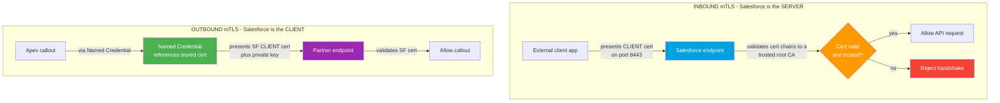
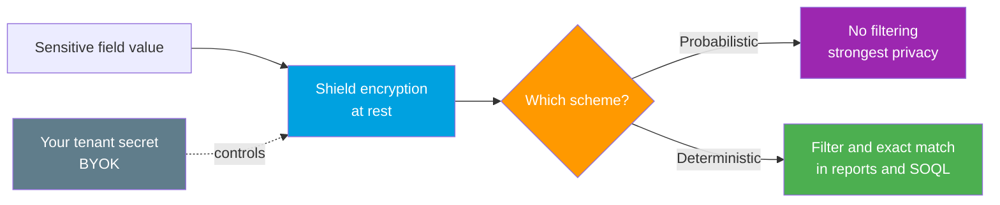

# 04 - mTLS and Shield Platform Encryption

> **One-liner**: Two high-security options that go beyond passwords and tokens. **mTLS** proves *who is on each end of the wire*. **Shield Platform Encryption** scrambles *the data sitting in the database*.
> **The split**: mTLS protects **data in transit** with certificates on both sides. Shield protects **data at rest** with org-managed keys.
> **Use when**: A bank, healthcare, or government integration demands certificate-based trust and field-level encryption that even Salesforce staff cannot read.

This is Module 09, security and limits. For the OAuth and Named Credentials that authenticate callers, see [Module 03](../03-Authentication/README.md). For the outbound callouts that carry the certificate, see [Module 05](../05-Outbound-Callouts/README.md). Sibling: [01-connection-security.md](01-connection-security.md).

---

## 1. The idea in plain English

Imagine a **secure courier service** moving a **locked safe** between two buildings.

- **mTLS (mutual TLS)** is the **two-way ID check at the door**. Normal TLS only checks the *server's* badge, like a website showing its padlock. **Mutual** TLS means **both** parties show a badge: the server presents its certificate **and** demands the client present one too. No valid client certificate, no connection. It secures the **road**, not the cargo.
- **Shield Platform Encryption** is the **locked safe itself**. Even after the data arrives and sits in the Salesforce database, the sensitive fields stay scrambled. The keys are controlled by **your org**, so the contents are unreadable at rest, even to someone with raw database access.

Two independent layers. mTLS answers "**can I trust who I am talking to?**" Shield answers "**if someone steals the disk, can they read it?**" Serious regulated integrations use both.

---

## 2. The mechanisms and when each applies

| Mechanism | Protects | Direction / scope | Reach for it when |
|---|---|---|---|
| **Inbound mTLS** | Data in transit | External client → Salesforce. SF is the **server** and demands a client cert | An external system calls the Salesforce API and you must prove the **caller's** identity by certificate |
| **Outbound mTLS** | Data in transit | Salesforce → external. SF is the **client** and presents its own cert | An Apex callout hits a partner endpoint that requires a **client certificate** to let you in |
| **Shield Platform Encryption** | Data at rest | Inside the Salesforce database, field and file level | You must encrypt sensitive fields with **org-controlled keys** and meet compliance like HIPAA, PCI, or GDPR |
| **Classic encrypted text field** | Data at rest (weakly) | A single masked text field | You only need a **masked input** with no real key management. Not a compliance control |

> **The 10-second answer**: mTLS = mutual certificate check on the **connection**. Shield = strong, key-managed encryption of the **stored data**. Inbound mTLS = SF checks the *caller's* cert. Outbound mTLS = SF *sends* its own cert.

---

## 3. How mTLS works: inbound vs outbound

The crucial mental model is **who acts as the server** and **who must present a client certificate**.

**Inbound mTLS walkthrough.** An external system connects to your org's API endpoint on **port 8443**. That endpoint sends a **client certificate request** during the TLS handshake. The client presents its certificate **chain**. Salesforce runs standard chain validation: the cert must chain up to a **root CA that Salesforce trusts**. Identity is actually enforced only when the API user has the **Enforce SSL/TLS Mutual Authentication** user permission. Here Salesforce is the **server**, checking the **caller's** badge.

**Outbound mTLS walkthrough.** Your Apex makes a callout. The partner endpoint demands a client certificate. Salesforce, now acting as the **client**, presents a certificate and **private key** stored in **Certificate and Key Management**, referenced through a **Named Credential**. The Named Credential is the clean, modern way to attach the cert so the secret never appears in code. See [Module 05 Named Credentials](../05-Outbound-Callouts/02-named-credentials-for-callouts.md).

**Hyperforce note.** On **Hyperforce**, outbound IP addresses are **dynamic** because the infrastructure runs on public cloud. Salesforce therefore **recommends mTLS over IP allowlists**. Pinning a partner firewall to Salesforce IP ranges is brittle when those ranges shift. A client certificate proves identity regardless of the source IP, so it is the durable control.

---

## 4. Shield Platform Encryption

Shield encrypts sensitive data **at rest** using keys your org manages. Unlike classic encrypted text fields, it is a real key-management and compliance control that preserves most platform functionality.

### Probabilistic vs deterministic

| Scheme | What it does | Filtering / SOQL | Trade-off |
|---|---|---|---|
| **Probabilistic** | Same input yields a **different** ciphertext each time | **Cannot** be used in filters, WHERE clauses, SOQL/SOSL functions | Strongest privacy, least usable |
| **Deterministic** | Same input yields the **same** ciphertext, so values are comparable | **Can** filter in reports, list views, and exact-match SOQL | Slightly weaker, far more usable |

Deterministic comes in **case-sensitive** and **exact-match case-insensitive** variants, chosen field by field. Use deterministic only on fields you must filter or match on, like an external ID. Otherwise prefer probabilistic.

### Key management and BYOK

Shield uses a **key derivation** model. A **tenant secret** plus a master secret derive the **data encryption key** that actually encrypts your fields. With **BYOK (Bring Your Own Key)** you generate and control your **own** tenant secret on your premises, then upload it via the Platform Encryption REST API, and **rotate** it on your schedule. This means Salesforce never holds the full key material on its own, which is often a hard compliance requirement.

### Integration impacts (the part that bites)

Encrypting a field is not free. On encrypted fields, several operations are **restricted**:

- **Probabilistic** fields cannot appear in **WHERE**, **ORDER BY**, **GROUP BY**, or SOQL/SOSL functions.
- **Sorting and filtering** in reports and list views work only with **deterministic** encryption.
- Some features, certain **formula** references, external lookups, and matching during lead import behave differently or are unsupported on encrypted fields.
- An integration that previously filtered on a now-encrypted field can **silently return wrong results or error** until you switch that field to deterministic or redesign the query.

### Shield vs classic encrypted text fields

| | **Classic Encrypted Text** | **Shield Platform Encryption** |
|---|---|---|
| Scope | One custom text field | Many standard/custom fields, files, attachments |
| Key management | None you control | Org-managed, rotatable, **BYOK** |
| Filtering | Not filterable | Deterministic option supports filtering |
| Visibility | Masked in UI by permission | Encrypted **at rest**, unreadable in storage |
| Compliance grade | No | Yes, designed for regulated data |

---

## 5. Gotchas and interview traps

| Gotcha | Clarification |
|---|---|
| "TLS and mTLS are the same." | Standard TLS checks only the **server** cert. **mTLS** also requires a valid **client** cert. Both ends prove identity. |
| "Inbound and outbound mTLS are configured the same way." | No. **Inbound**: SF is the server validating the caller's cert. **Outbound**: SF is the client presenting its own cert via a **Named Credential**. |
| "Use IP allowlists on Hyperforce." | Hyperforce IPs are **dynamic**. Salesforce recommends **mTLS over IP allowlists** for durable identity. |
| "Shield encrypts data in transit." | No. Shield encrypts data **at rest**. TLS/mTLS handles transit. Different layers. |
| "Just turn on Shield, nothing changes." | Encrypting a field can **break filtering, sorting, and SOQL**. Probabilistic blocks WHERE clauses. Plan deterministic for fields you query. |
| "Classic encrypted text fields are compliance-grade." | They are a **masked input**, not key-managed encryption. Use **Shield** for real compliance. |

---

## 6. Interview Q&A

**Q: What is mTLS and how does it differ from normal TLS?**
A: Mutual TLS requires **both** sides to present certificates. Normal TLS validates only the **server**. With mTLS the server also demands a valid **client** certificate during the handshake, so each party cryptographically proves its identity before any data flows.

**Q: Explain inbound vs outbound mTLS in Salesforce.**
A: **Inbound**, Salesforce is the **server**: an external client connects on **port 8443**, presents a client certificate, and Salesforce validates it chains to a **trusted root CA**, with the **Enforce SSL/TLS Mutual Authentication** permission enforcing it. **Outbound**, Salesforce is the **client**: during an Apex callout it presents its **own** client certificate and private key, stored in Certificate and Key Management and referenced by a **Named Credential**.

**Q: On Hyperforce, why prefer mTLS over IP allowlisting?**
A: Hyperforce runs on public cloud with **dynamic outbound IPs**, so allowlists need constant maintenance and can break. A **client certificate** proves identity independent of source IP, so Salesforce recommends **mTLS over IP allowlists**.

**Q: Probabilistic vs deterministic encryption in Shield?**
A: **Probabilistic** produces a different ciphertext each time, giving the strongest privacy but it **cannot** be filtered or used in SOQL WHERE clauses. **Deterministic** produces the same ciphertext for the same input, so values support **filtering, exact-match SOQL, reports, and list views**. Use deterministic only on fields you must query.

**Q: What changes for integrations once a field is Shield-encrypted?**
A: Operations on the field can be **restricted**. Probabilistic fields cannot appear in WHERE, ORDER BY, GROUP BY, or SOQL functions, and sorting/filtering needs deterministic encryption. Existing queries that filter on a now-encrypted field can break, so you switch the field to deterministic or redesign the query, and you manage key rotation via **BYOK**.

**Talking point to explain it to anyone**: "mTLS is a two-way ID check at the door, both sides show a badge before anyone talks. Shield is a locked safe for the data once it is inside, and only your org holds the key, even if someone steals the disk they cannot read it."

---

## 7. Key terms

mTLS, mutual TLS, client certificate, certificate chain, root CA, port 8443, Enforce SSL/TLS Mutual Authentication, Named Credential, Certificate and Key Management, Hyperforce, Shield Platform Encryption, probabilistic encryption, deterministic encryption, tenant secret, data encryption key, BYOK, encryption at rest, classic encrypted text field - defined here and in the [Module 01 vocabulary](../01-Fundamentals/02-core-vocabulary.md) and the [README](README.md).

---

## Sources (Verified June 2026)

- [Set Up a Mutual Authentication Certificate for API Login - Salesforce Help](https://help.salesforce.com/s/articleView?id=xcloud.security_keys_uploading_mutual_auth_cert.htm&type=5)
- [Configure Your API Client to Use Mutual Authentication - Salesforce Help](https://help.salesforce.com/s/articleView?id=xcloud.security_keys_uploading_mutual_auth_cert_api.htm&type=5)
- [Certificates in Mutual Authentication for Salesforce - Salesforce Help](https://help.salesforce.com/s/articleView?id=000383575&type=1)
- [Preferred Alternatives to IP Allowlisting on Hyperforce - Salesforce Help](https://help.salesforce.com/s/articleView?id=000394078&type=1)
- [Enhance Integration Security with mTLS for Salesforce and MuleSoft - Salesforce Developers Blog](https://developer.salesforce.com/blogs/2025/10/enhance-integration-security-with-mtls-for-salesforce-and-mulesoft)
- [Strengthen Your Data's Security with Shield Platform Encryption - Salesforce Help](https://help.salesforce.com/s/articleView?id=xcloud.security_pe_overview.htm&type=5)
- [Filter Encrypted Data with Deterministic Encryption - Salesforce Security Guide](https://developer.salesforce.com/docs/atlas.en-us.securityImplGuide.meta/securityImplGuide/security_pe_deterministic.htm)
- [General Shield Platform Encryption Considerations - Salesforce Help](https://help.salesforce.com/s/articleView?id=xcloud.security_pe_considerations_general.htm&type=5)
- [Introducing the Salesforce Shield Platform Encryption REST API - Platform Encryption REST API Developer Guide](https://developer.salesforce.com/docs/atlas.en-us.platform_encryption_rest_api_guide.meta/platform_encryption_rest_api_guide/api_rest_encryption.htm)

---

*Next: [05-governor-and-api-limits.md](05-governor-and-api-limits.md) - the definitive limits reference for the whole module.*
