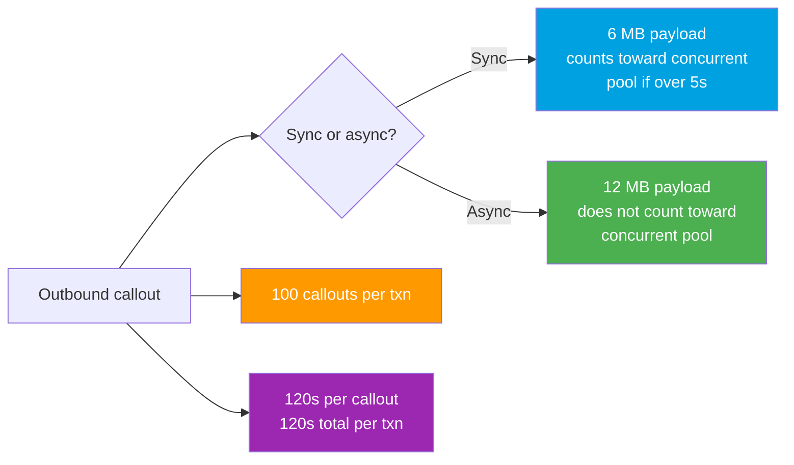
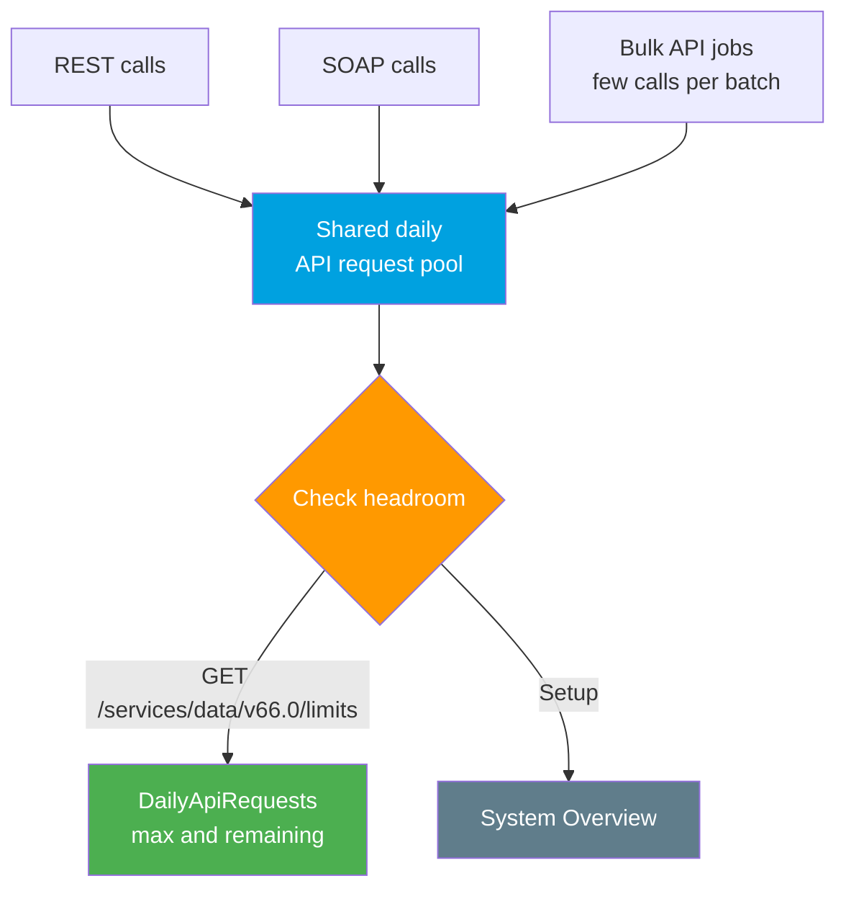

# 05 - Governor and API Limits

> **One-liner**: The definitive limits reference for Salesforce integrations. **Per-transaction** governor limits, **org-level** daily API allocations, and the **Bulk, Platform Event, and Async Apex** ceilings you design around.
> **Scope**: Reference + monitoring + design. The numbers an interviewer expects you to recall cold.
> **Use when**: Sizing an integration, debugging a `LimitException`, or proving you can architect within Salesforce's multitenant guardrails.

This is the **final file in Module 09**. It consolidates the callout limits from [Module 05](../05-Outbound-Callouts/07-callout-limits-and-testing.md) and adds the org-wide allocations. For event volume, see [Module 06](../06-Event-Driven/README.md). Sibling: [04-mtls-and-shield-encryption.md](04-mtls-and-shield-encryption.md).

---

## 1. The idea in plain English

Salesforce is a **multitenant apartment building**. Thousands of orgs share the same plumbing, so no single tenant may flood the pipes. The limits come in **two flavors**:

- **Governor limits** are the **per-visit rules**. They reset on **every transaction**. How many callouts, how big the payload, how long it may run. Cross one and you get an instant runtime exception, not a slow response.
- **Allocations** are the **monthly utility caps**. They are measured over a **rolling 24 hours** across the whole org. Daily API calls, Bulk records, platform event deliveries, async job runs. Burn through the day's budget and further requests are **throttled or rejected** until the window rolls.

A senior engineer designs so that **neither** ceiling is hit at peak. That means bulkifying, batching, going asynchronous, and monitoring usage **before** the org runs out of headroom on a busy Monday.

---

## 2. Callout governor limits (per transaction)

These match the outbound module exactly. Memorize them.

| Limit | Value | Notes |
|---|---|---|
| **Callouts per transaction** | **100** | All HTTP and web service callouts combined in one Apex transaction. Bulkify, never loop. |
| **Max request or response size (sync)** | **6 MB** | Synchronous transaction heap context. |
| **Max request or response size (async)** | **12 MB** | Higher ceiling in async: Queueable, Batch, `@future`. |
| **Timeout per callout** | **120 s** | Default is **10 s**. Set with `req.setTimeout(ms)`, max `120000`. |
| **Total callout time per transaction** | **120 s** | Cumulative across all callouts in the transaction. |
| **Concurrent long-running requests** | **10 minimum**, scales by license | **Synchronous** requests running **> 5 s** count, org-wide. See note below. |
| **No callout after uncommitted DML** | rule | Pending DML in the same transaction blocks the callout. |

> **Myth correction, read this twice.** The callout request/response maximum is **6 MB synchronous** and **12 MB asynchronous**. It is **NOT 10 MB**. The "10 MB" figure is a persistent myth. The real ceiling depends on the transaction's **heap** context: **6 MB sync, 12 MB async**.

**No callout after DML.** Once a transaction issues DML and has not committed, a callout throws `You have uncommitted work pending`. Call out **before** any DML, or move the callout to **async** so it runs in its own transaction.

**Concurrent long-running request limit.** Any **synchronous** Apex request running longer than **5 seconds** counts against an org-wide pool. The historical floor is **10**, and Salesforce now **scales** it by license count (roughly one slot per 100 licenses), up to a **maximum of 50**. Asynchronous work, Batch, `@future`, scheduled, and Bulk API, does **not** count. This is exactly why slow UI callouts use a [Continuation](../05-Outbound-Callouts/06-continuation-pattern.md).

---

## 3. Org-level API request allocations (daily, rolling 24 h)

A single shared daily budget covers **REST, SOAP, and Bulk** API requests. It is calculated from your **edition** plus a **per-user-license** amount.

| Edition | Daily API request allocation |
|---|---|
| **Enterprise** | **100,000** base + **1,000 per Salesforce license** |
| **Unlimited / Performance** | **100,000** base + **5,000 per Salesforce license** |
| **Developer Edition** | **15,000** per day (fixed) |
| **Add-on** | Purchasable in increments (e.g. **1,000 to 10,000** blocks) |

The total is **shared** across all integration users and tools. One runaway middleware job can starve every other integration. Each REST call typically costs **1** request. **Bulk API** is far more efficient per record because a whole batch or job counts as a small number of API calls, which is the entire reason it exists for high volume.

**How to check usage.**

- **REST resource**: `GET /services/data/v66.0/limits` returns the **maximum** and **remaining** allocation for many limits, including `DailyApiRequests`. Values are accurate within about **5 minutes**.
- **System Overview**: Setup → **System Overview** shows API usage against the daily cap at a glance.
- **API Usage notifications**: Setup lets you email an alert when usage crosses a percentage threshold of the daily limit.

---

## 4. Bulk API limits

Bulk is the high-volume path. The two versions count differently.

| Limit | Bulk API 1.0 | Bulk API 2.0 |
|---|---|---|
| **Daily ceiling** | **15,000 batches** per rolling 24 h | **100 million records** per rolling 24 h |
| **Job/batch model** | You create and manage batches yourself | Salesforce **chunks records into batches for you** |
| **Records per batch** | **10,000** records per batch | Managed internally |
| **Max file size per request** | 10 MB per batch (CSV) | **150 MB** per job (uploaded data) |
| **API cost** | A batch counts as a small number of API calls, not one per record | Counts toward daily API requests at the batch level |

> **Note**: Salesforce official docs state Bulk API 2.0's daily ingest limit as **100 million records** per 24 hours, not 150 million. Use **100 million**. The per-job **data** cap is **150 MB**.

**Why Bulk for integrations.** Loading 1 million records via the REST or SOAP API one row at a time would obliterate the daily request pool. Bulk processes them **asynchronously** in batches, costing only a handful of API calls. Always reach for Bulk above roughly **a few thousand records**, and prefer **Bulk API 2.0** for its simpler record-based model.

---

## 5. Platform Event and Async Apex allocations

### Platform Events (and Change Data Capture)

| Allocation | What it governs |
|---|---|
| **Daily event delivery** | Max event notifications **delivered** to subscribers (CometD/Pub-Sub, empApi, triggers) in 24 h. Set **by edition/license**, and **shared** across all CometD clients |
| **Hourly publishing** | Max events **published** per hour, also edition-based |
| **Add-on** | **High-Volume Platform Events** greatly expand both publish and delivery allocations |

Delivery, not publishing, is usually the binding constraint, because **one published event is delivered to every subscriber** and each delivery counts. Monitor with the `PlatformEventUsageMetric` data and design subscribers to be few and efficient. See [Module 06](../06-Event-Driven/README.md).

### Async Apex executions

| Limit | Value |
|---|---|
| **Async Apex executions per 24 h** | **Greater of 250,000** or **200 x number of user licenses** |

This pool covers **Batch Apex, Queueable, `@future`, and scheduled Apex** combined. A 1,000-license org gets `max(250000, 200000)` = **250,000**. A 2,000-license org gets `max(250000, 400000)` = **400,000**. Chained Queueables and recursive batches can burn this fast, so a runaway chain is a real outage risk.

| Quick reference | Value |
|---|---|
| Callouts per transaction | **100** |
| Callout payload | **6 MB sync / 12 MB async** |
| Callout timeout | **120 s** per call, **120 s** total |
| Enterprise daily API | **100,000 + 1,000/license** |
| Bulk API 1.0 | **15,000 batches / 24 h** |
| Bulk API 2.0 | **100M records / 24 h**, **150 MB/job** |
| Async Apex | **max(250,000, 200 x licenses) / 24 h** |

---

## 6. Gotchas and interview traps

| Gotcha | Clarification |
|---|---|
| "Callout payload max is 10 MB." | **Wrong.** It is **6 MB sync, 12 MB async**. The 10 MB figure is a myth. |
| "Each governor limit is org-wide." | No. **Governor** limits reset **per transaction**. **Allocations** (API, Bulk, events, async) are the org-wide, daily ones. |
| "REST and Bulk have separate daily pools." | They draw from the **same** shared daily API request allocation. Bulk is just far cheaper per record. |
| "Async raises the callout count." | No. Async raises the **payload** ceiling to 12 MB. The **100 callouts** per transaction still applies. |
| "Batch Apex counts toward concurrent long-running requests." | No. Only **synchronous** requests over 5 s count. Async is exempt. |
| "Publishing is the platform event bottleneck." | Usually **delivery** is, since one event is delivered to every subscriber and each delivery counts. |
| "Buy more licenses to lift any limit." | Only some scale with licenses (daily API, async Apex, concurrent requests). The **6 MB / 12 MB** payload cap does not. |

---

## 7. Interview Q&A

**Q: What are the core callout limits?**
A: **100** callouts per transaction. Request/response max **6 MB synchronous, 12 MB asynchronous** (not 10 MB). **120 s** per callout and **120 s** total per transaction, default per-callout timeout **10 s**. Plus the org-wide concurrent long-running request limit and the no-callout-after-uncommitted-DML rule.

**Q: How is the daily API request limit calculated, and how do you check it?**
A: It is a **shared** daily pool from **edition plus per-license**. Enterprise is **100,000 base + 1,000 per Salesforce license**, covering REST, SOAP, and Bulk together. Check it with `GET /services/data/v66.0/limits` (look at `DailyApiRequests` max and remaining) or via **System Overview**, and set **API Usage notifications** for thresholds.

**Q: Bulk API 1.0 vs 2.0 limits?**
A: **1.0**: you manage batches, **15,000 batches** per rolling 24 h, 10,000 records per batch. **2.0**: Salesforce batches for you, **100 million records** per rolling 24 h with up to **150 MB** of data per job. Both are asynchronous and cost only a few API calls per batch, which is why you use them above a few thousand records.

**Q: What is the async Apex daily limit and what counts against it?**
A: The **greater of 250,000** or **200 x user licenses** per 24 h, shared across **Batch, Queueable, `@future`, and scheduled** Apex. Chained Queueables and recursive batches can exhaust it, so bound your chains.

**Q: Governor limit vs allocation, what is the difference?**
A: A **governor limit** resets **per transaction** and throws immediately when crossed, like 100 callouts or 6 MB payload. An **allocation** is an org-wide budget over a **rolling 24 hours**, like daily API requests or Bulk records, and throttles further requests once spent. You design for both at peak load.

**Talking point to explain it to anyone**: "Think of two kinds of limits. Per-trip rules that reset every transaction, like how many calls and how big each one can be. And a daily utility budget for the whole org, like total API calls and records moved per day. Good design never hits either at peak, and you watch the meter before it runs out."

---

## 8. Key terms

Governor limit, allocation, callout limit, transaction, heap, concurrent long-running request, uncommitted DML, daily API request limit, `DailyApiRequests`, `/services/data/v66.0/limits`, System Overview, Bulk API 1.0, Bulk API 2.0, batch, Platform Event delivery allocation, High-Volume Platform Events, async Apex, Queueable, Batch Apex - defined here and in the [Module 01 vocabulary](../01-Fundamentals/02-core-vocabulary.md) and the [README](README.md).

---

## Sources (Verified June 2026)

- [Execution Governors and Limits - Apex Developer Guide (v66.0)](https://developer.salesforce.com/docs/atlas.en-us.apexcode.meta/apexcode/apex_gov_limits.htm)
- [Callout Limits and Limitations - Apex Developer Guide](https://developer.salesforce.com/docs/atlas.en-us.apexcode.meta/apexcode/apex_callouts_timeouts.htm)
- [API Request Limits and Allocations - Limits and Allocations Quick Reference](https://developer.salesforce.com/docs/atlas.en-us.salesforce_app_limits_cheatsheet.meta/salesforce_app_limits_cheatsheet/salesforce_app_limits_platform_api.htm)
- [Bulk API and Bulk API 2.0 Limits and Allocations - Limits and Allocations Quick Reference](https://developer.salesforce.com/docs/atlas.en-us.salesforce_app_limits_cheatsheet.meta/salesforce_app_limits_cheatsheet/salesforce_app_limits_platform_bulkapi.htm)
- [Platform Event Allocations - Platform Events Developer Guide](https://developer.salesforce.com/docs/atlas.en-us.platform_events.meta/platform_events/platform_event_limits.htm)
- [List Org Limits - REST API Developer Guide](https://developer.salesforce.com/docs/atlas.en-us.api_rest.meta/api_rest/dome_limits.htm)
- [Scale Your Concurrent Long-Running Apex Requests Limit - Salesforce Release Notes](https://help.salesforce.com/s/articleView?id=release-notes.rn_apex_limit.htm&type=5)
- [API Limits and Monitoring Your API Usage - Salesforce Developers Blog](https://developer.salesforce.com/blogs/2024/11/api-limits-and-monitoring-your-api-usage)

---

*Next: back to the [README.md](README.md) for the full Module 09 map. That completes the security and limits track. From here, **Module 10 (Tools & Middleware)** covers MuleSoft, ETL, and integration platforms that orchestrate these calls, and **Module 11 (Projects)** puts the whole curriculum to work in end-to-end build scenarios. Those two are the natural continuation.*
