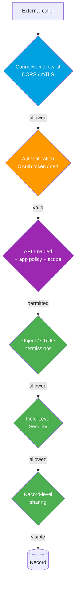

# Module 09 - Security & Limits

> **Goal**: Don't get hacked, and don't hit a limit in production.
> **API version**: v66.0 (Spring '26). Two halves: **secure** every integration end-to-end, and **know every limit** before go-live.

Security in Salesforce is layered: connection allowlists, authentication, access controls, data-level security, and encryption. Limits are the guardrails of the multitenant platform. Start with **[01-connection-security.md](01-connection-security.md)** (the CORS/CSP/Remote-Site confusion). For the OAuth underneath, see [Module 03](../03-Authentication/README.md).

---

## Map of this module

| # | File | What it covers |
|---|---|---|
| 01 | [connection-security](01-connection-security.md) | CORS vs CSP Trusted Sites vs Remote Site Settings |
| 02 | [authentication-and-access-controls](02-authentication-and-access-controls.md) | API Enabled, profiles/perm sets, IP ranges, scopes |
| 03 | [data-level-security](03-data-level-security.md) | CRUD, FLS, sharing, enforcing in Apex |
| 04 | [mtls-and-shield-encryption](04-mtls-and-shield-encryption.md) | Mutual TLS + Shield Platform Encryption |
| 05 | [governor-and-api-limits](05-governor-and-api-limits.md) | Callout, async, org, and bulk limits |

---

## The security layers an API call passes through

Every layer must pass. Miss one in design and you either leak data or get blocked in production.

---

## Limits cheat sheet (corrected and verified)

### Callout governor limits (per transaction)

| Limit | Value |
|---|---|
| Callouts per transaction | **100** |
| Request + response size | **6 MB** sync, **12 MB** async (not 10 MB) |
| Timeout per callout | default 10s, **max 120s** |
| Total callout time per transaction | **120s** |
| Callout after uncommitted DML | **Not allowed** |
| Concurrent long-running sync requests (>5s) | **10** (scales by license up to 50) |

### Org and async limits

| Limit | Value |
|---|---|
| Daily API requests | By edition + licenses (e.g. Enterprise base **100,000** + per-license) |
| Bulk API 1.0 | **15,000 batches** / 24h (10,000 records each) |
| Bulk API 2.0 | **100 million records** / 24h, **150 MB** per job |
| Async Apex executions / 24h | greater of **250,000** or **200 × user licenses** |
| Check live usage | `GET /services/data/v66.0/limits` |

---

## Interview rapid-fire

**Q: CORS vs CSP Trusted Sites?**
→ CORS lets external **browsers** call Salesforce (inbound). CSP Trusted Sites lets Salesforce's own **LWC/Aura** reach external resources (outbound from the browser). See [01](01-connection-security.md).

**Q: How do you secure a high-assurance B2B integration?**
→ **mTLS** (mutual certificate auth), least-privilege integration user, and **Shield** encryption for sensitive data at rest. On Hyperforce, prefer mTLS over IP allowlists. See [04](04-mtls-and-shield-encryption.md).

**Q: Apex REST runs as system context. What must you add?**
→ Enforce security yourself: `with sharing`, `WITH USER_MODE`, and `Security.stripInaccessible()`. See [03](03-data-level-security.md).

**Q: Max callout response size?**
→ **6 MB synchronous, 12 MB asynchronous.** (The "10 MB" figure is wrong.)

**Q: How do you check remaining API calls?**
→ The `/limits` REST resource or System Overview in Setup.

---

## Sources (Verified June 2026)

- [Execution Governors and Limits — Apex Developer Guide](https://developer.salesforce.com/docs/atlas.en-us.apexcode.meta/apexcode/apex_gov_limits.htm)
- [Configure Salesforce CORS Allowlist — Salesforce Help](https://help.salesforce.com/s/articleView?id=sf.extend_code_cors.htm&type=5)
- [Limits and Allocations Quick Reference](https://developer.salesforce.com/docs/atlas.en-us.salesforce_app_limits_cheatsheet.meta/salesforce_app_limits_cheatsheet/salesforce_app_limits_overview.htm)
- [Shield Platform Encryption — Salesforce Help](https://help.salesforce.com/s/articleView?id=sf.security_pe_overview.htm&type=5)

*Each file has its own Sources section with the specific official doc.*
