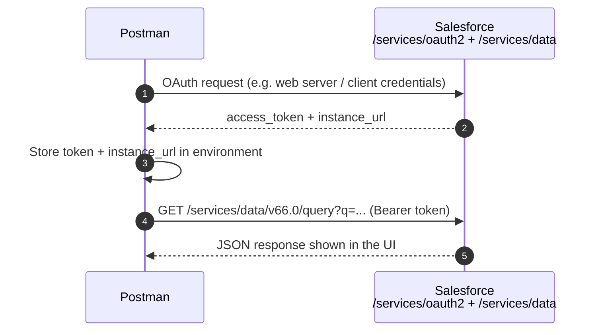

# 01 - Postman

> **One-liner**: The universal API client for **exploring, testing, and demonstrating** Salesforce APIs without writing code.
> **Use when**: You want to hit any Salesforce REST/Bulk/Composite endpoint by hand, prototype a call, or debug an integration.
> **Bonus**: Salesforce publishes an official **Salesforce Platform APIs** Postman collection (one of Postman's top-rated).

This is Module 10, the toolbox. For the APIs themselves, see [Module 04](../04-Inbound-APIs/README.md). For the auth Postman performs, see [Module 03](../03-Authentication/README.md).

---

## 1. The idea in plain English

Postman is a **workbench for API calls**. Instead of writing Apex or a script just to see what an endpoint returns, you fill in a URL, method, headers, and body in a UI, click **Send**, and read the response. It remembers your requests in **collections**, stores secrets and URLs in **environments**, and can run the **OAuth dance** for you so each call carries a fresh token.

For Salesforce specifically, you don't even start from scratch: you **fork the official Salesforce Platform APIs collection**, set a few environment variables, authenticate once, and every common request (query, create, composite, bulk) is ready to fire.

---

## 2. When to use it (and when not)

| ✅ Use it when | ❌ Use something else when |
|---|---|
| Exploring or testing any Salesforce API by hand. | You need quick SF-specific data/metadata ops → [Workbench](02-workbench.md). |
| Prototyping a request before coding it in Apex. | Scripting/automation in CI → [Salesforce CLI](03-salesforce-cli.md). |
| Demonstrating an API to a teammate. | Loading large CSVs → [Data Loader](04-data-loader.md). |
| Debugging OAuth flows and tokens. | Building real integration logic → Apex / middleware. |

---

## 3. How it works



Postman runs the OAuth flow, captures the **access token** and **instance URL** into environment variables, then sends API requests with `Authorization: Bearer {{access_token}}` against `{{instance_url}}`.

---

## 4. Setup steps

1. Install Postman (desktop or web) and sign in.
2. **Fork the official "Salesforce Platform APIs" collection** from the Salesforce Developers workspace on Postman.
3. Create/select an **environment** and set variables: your **My Domain login URL**, the Connected App / External Client App **consumer key** and **secret**, and (per flow) a username.
4. Choose an OAuth flow under the collection's **Authorization** tab. For a logged-in user use **OAuth 2.0 (Authorization Code)**; for server-to-server use **Client Credentials**. Click **Get New Access Token**.
5. Postman stores the token (and often the `instance_url`) as variables.
6. Run a request, e.g.:

```
GET {{instance_url}}/services/data/v66.0/query?q=SELECT+Id,Name+FROM+Account+LIMIT+5
Authorization: Bearer {{access_token}}
```

> **Tip**: Create a Connected App / External Client App with the right scopes (`api refresh_token`) and add Postman's callback (`https://oauth.pstmn.io/v1/callback`) as the callback URL for the Authorization Code flow.

---

## 5. Gotchas

| Gotcha | Fix |
|---|---|
| Token expired (`401 INVALID_SESSION_ID`) | Click **Get New Access Token** again, or use a refresh token. |
| Wrong host | Always use your **My Domain** / `instance_url`, not `login.salesforce.com` for data calls. |
| Callback mismatch | Set the Connected App callback to `https://oauth.pstmn.io/v1/callback`. |
| Username-Password flow fails | It's blocked/retiring. Use Authorization Code or Client Credentials. See [Module 03](../03-Authentication/07-username-password-flow.md). |
| Forgot the API version | Pin `v66.0` in the path. |

---

## 6. Interview Q&A

**Q: How do you test a Salesforce REST call without writing code?**
A: Postman. Fork the official Salesforce Platform APIs collection, set environment variables, run an OAuth flow to get a token, and send requests against the instance URL.

**Q: Postman vs Workbench?**
A: Postman is the general-purpose API client great for OAuth, collections, and any endpoint. Workbench is a Salesforce-specific web tool with quick REST Explorer, SOQL, data, and metadata operations. Salesforce nudges people toward Postman now.

**Q: How does Postman authenticate to Salesforce?**
A: Via OAuth. It runs a configured flow (Authorization Code, Client Credentials, etc.), stores the access token, and attaches it as a Bearer header. The Username-Password flow is avoided since it's retiring.

**Q: Why use the official collection?**
A: It ships ready-made requests for query, CRUD, composite, and bulk with variables wired up, so you test in minutes instead of building requests by hand.

**Talking point to explain it to anyone**: "Postman is a workbench where you type an API call into a form, click send, and read the answer, no code required."

---

## 7. Key terms

Collection, environment, Bearer token, OAuth flow, instance URL - defined in [Module 01 vocabulary](../01-Fundamentals/02-core-vocabulary.md) and the [README](README.md).

---

## Sources (Verified June 2026)

- [Salesforce Platform APIs — Postman Collection](https://www.postman.com/salesforce-developers/salesforce-developers/collection/b32utmu/salesforce-platform-apis)
- [Quick Start: Connected App for the REST API — Salesforce Developers](https://developer.salesforce.com/docs/atlas.en-us.api_rest.meta/api_rest/quickstart.htm)
- [REST API Developer Guide (v66.0)](https://developer.salesforce.com/docs/atlas.en-us.api_rest.meta/api_rest/intro_what_is_rest_api.htm)

---

*Next: [02-workbench.md](02-workbench.md) - the browser-based Salesforce power tool.*
