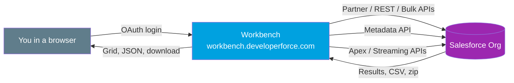

# 02 - Workbench

> **One-liner**: A free, browser-based Swiss Army knife for **Salesforce-specific** data and metadata operations, no install required.
> **Use when**: You want a quick, point-and-click way to run SOQL, fire a REST call, load a small CSV, or retrieve/deploy metadata in the browser.
> **Note**: Workbench is **community-maintained** (open source, BSD license, by Ryan Brainard) and is **NOT a supported Salesforce product**. Salesforce now nudges people toward [Postman](01-postman.md) for API exploration.

This is Module 10, the toolbox. Coming from [Postman](01-postman.md)? Workbench is the more **Salesforce-aware** cousin. For the APIs it wraps, see [Module 04](../04-Inbound-APIs/README.md).

---

## 1. The idea in plain English

Workbench is a **web dashboard that speaks fluent Salesforce**. Postman is a generic API client where you build every request by hand. Workbench already knows your org: it logs in with OAuth, reads your schema, and gives you **purpose-built screens** for the common jobs. Pick "Insert," choose an object, upload a CSV, and go. Type SOQL and see results in a grid. Click "Retrieve" and pull down metadata as a zip.

Think of it as the **mechanic's pit-stop tool**. Not the prettiest, not officially backed, but it gets a Salesforce-specific job done in seconds without writing code or installing anything. The current build is **Workbench 66.0.0**, matching API **v66.0 (Spring '26)**.

---

## 2. When to use it (and when not)

| Use it when | Use something else when |
|---|---|
| Quick browser-based SF data or metadata op, nothing to install. | You need OAuth collections, scripting, or non-SF APIs to [Postman](01-postman.md). |
| Ad hoc SOQL/SOSL and eyeballing results in a grid. | Automation, CI/CD, or repeatable scripts to [Salesforce CLI](03-salesforce-cli.md). |
| One-off CSV insert/update/upsert/delete of a few thousand rows. | Large or scheduled CSV loads (millions of rows) to [Data Loader](04-data-loader.md). |
| Exploring `describe`/schema or testing the REST Explorer fast. | Building real integration logic to Apex / middleware. |
| Retrieving or deploying a small metadata package by hand. | Production-grade releases to CLI + source control. |

> **Warning**: Workbench's own About page says "DO NOT USE WITH PRODUCTION DATA" without care. Treat it as a power tool, not a production pipeline.

---

## 3. How it works



Workbench authenticates with **OAuth** against your My Domain, then proxies your clicks into the right Salesforce API: **Partner** for data CRUD, **REST** for the REST Explorer, **Bulk** for big loads, **Metadata** for retrieve/deploy, plus **Apex** and **Streaming**. You pick the **environment** (Production or Sandbox) and **API version** on the login screen.

---

## 4. Key capabilities and how to use them

Log in at `https://workbench.developerforce.com/login.php`. Choose environment, accept the agreement, and authorize via OAuth. Then use the top menu:

| Menu | What it does | Typical use |
|---|---|---|
| **queries > SOQL Query** | Build or type SOQL, run, view in a grid, export to CSV. | Pull `SELECT Id, Name FROM Account` and inspect. |
| **queries > SOSL Search** | Run a text search across objects. | Find a record by free text. |
| **data > Insert / Update / Upsert / Delete** | Map a CSV to fields and run DML; choose Bulk if large. | Fix or load a few thousand rows. |
| **data > Export** | Export query results to CSV. | Quick data pull. |
| **migration > Retrieve / Deploy** | Pull a metadata package as zip, or deploy a zip. | Grab a profile or deploy a small change set. |
| **info > Standard & Custom Objects** | `describe` an object: fields, types, relationships. | Check API names and field metadata. |
| **utilities > REST Explorer** | Send `GET/POST/PATCH/DELETE` to any `/services/data` resource. | Hit `GET /services/data/v66.0/limits`. |
| **utilities > Apex Execute** | Run anonymous Apex. | Quick scripted fix. |

**Example data load (Insert):** pick **data > Insert**, choose the object (e.g. `Contact`), select your CSV, click **Next**, **map columns to fields**, then **Confirm Insert**. Workbench returns a **results table** with successes and errors you can download.

**Example REST Explorer call:**

```
GET /services/data/v66.0/query?q=SELECT+Id,Name+FROM+Account+LIMIT+5
```

No headers to set. Workbench attaches the session for you and renders the JSON response inline.

---

## 5. Gotchas

| Gotcha | Fix |
|---|---|
| Not Salesforce-supported. | Community/open-source tool. For backed workflows use Postman or CLI. Do not rely on it in production runbooks. |
| API version drift. | Pick the version on login. The build is tied to v66.0. Set it explicitly in REST paths. |
| Large CSVs time out in the UI. | Tick **Process records asynchronously via Bulk API** for big jobs, or use [Data Loader](04-data-loader.md). |
| Session inherits your user's permissions. | You only see/do what your profile allows. No magic admin powers. |
| Login redirect to wrong env. | Choose **Production** vs **Sandbox** correctly on the login screen. Sandbox uses `test.salesforce.com`. |
| Deploy of large metadata is clunky. | Workbench is fine for tiny packages. Use CLI `sf project deploy start` for real releases. |

---

## 6. Interview Q&A

**Q: What is Workbench and who maintains it?**
A: A free, browser-based suite for interacting with a Salesforce org via the Partner, REST, Bulk, Metadata, Apex, and Streaming APIs. It is community-maintained open source under a BSD license, not an officially supported Salesforce product.

**Q: Workbench vs Postman?**
A: Workbench is Salesforce-aware and click-driven. It knows your schema and gives ready-made screens for SOQL, data DML, describe, and metadata retrieve/deploy. Postman is a general API client where you build requests and manage OAuth yourself. Salesforce now nudges users toward Postman for API exploration.

**Q: Workbench vs Data Loader for a CSV load?**
A: Workbench is great for a quick, one-off load of a few thousand rows in the browser. For large volumes (up to 150M records) or scheduled/automated loads, use Data Loader, which runs on Bulk API and supports a headless command-line mode.

**Q: How does Workbench authenticate?**
A: OAuth against your My Domain. You pick Production or Sandbox and an API version on the login screen, then authorize. It acts with your user's permissions.

**Q: Can you run anonymous Apex or test the REST API in Workbench?**
A: Yes. utilities > Apex Execute runs anonymous Apex, and utilities > REST Explorer sends raw REST calls to `/services/data` resources with the session attached for you.

**Talking point to explain it to anyone**: "Workbench is a website that already knows your Salesforce org, so you can run a query, fix some records, or grab metadata in a few clicks instead of writing code."

---

## 7. Key terms

Metadata API, Bulk API, REST Explorer, describe, SOQL/SOSL, upsert, My Domain - defined in [Module 01 vocabulary](../01-Fundamentals/02-core-vocabulary.md) and the [README](README.md).

---

## Sources (Verified June 2026)

- [Workbench: About (v66.0.0)](https://workbench.developerforce.com/about.php)
- [Workbench Login](https://workbench.developerforce.com/login.php)
- [Workbench Documentation Wiki (GitHub)](https://github.com/forceworkbench/forceworkbench/wiki)
- [Bulk API 2.0 and Bulk API Developer Guide (v66.0)](https://developer.salesforce.com/docs/atlas.en-us.api_asynch.meta/api_asynch/asynch_api_intro.htm)

---

*Next: [03-salesforce-cli.md](03-salesforce-cli.md) - the `sf` command-line tool for automation and CI/CD.*
