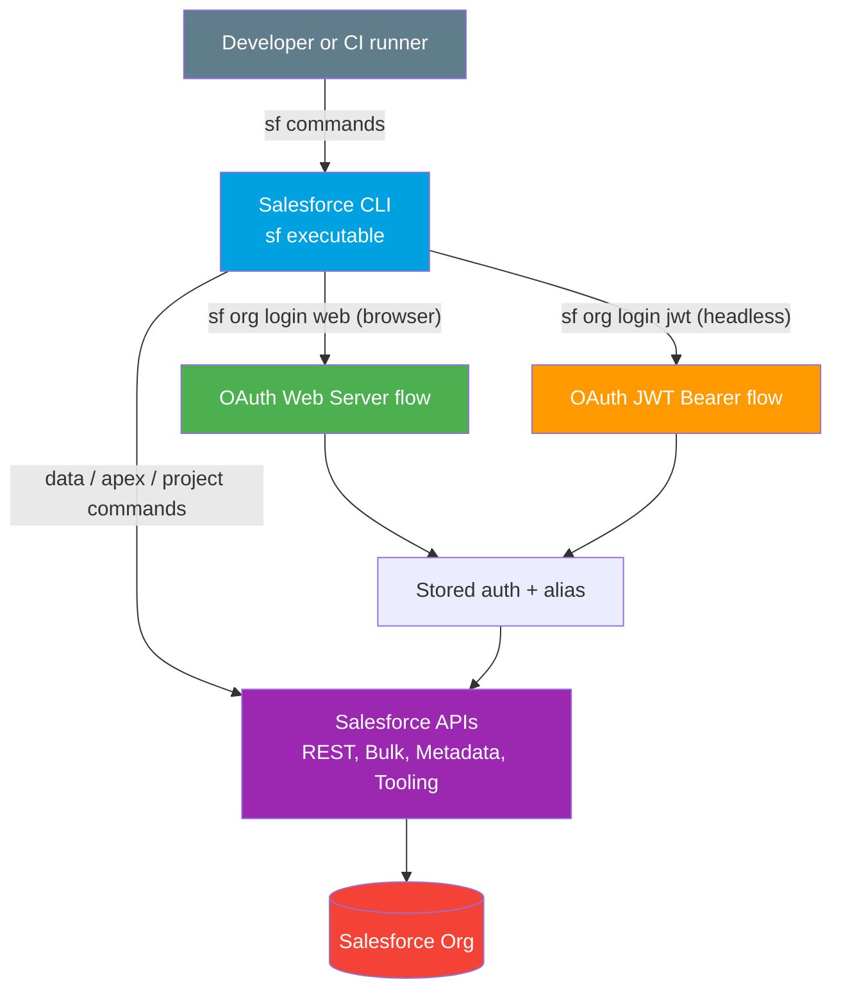

# 03 - Salesforce CLI (`sf`)

> **One-liner**: The official command-line tool for **automating** Salesforce: auth, queries, data loads, Apex, and deployments, all scriptable.
> **Use when**: Dev workflows, deployments, CI/CD pipelines, and any task you want to repeat or script instead of clicking.
> **Note**: The modern command is **`sf`** (the `sfdx` executable is **legacy** and being retired). Examples here pin API **v66.0 (Spring '26)** where versions appear.

This is Module 10, the toolbox. [Postman](01-postman.md) and [Workbench](02-workbench.md) are click-driven. The CLI is where you **automate**. For the auth flows it uses, see [Module 03](../03-Authentication/README.md).

---

## 1. The idea in plain English

The Salesforce CLI is a **remote control for your org from the terminal**. Anything you would do by clicking, like log in, run a query, load a CSV, execute Apex, or deploy code, you can type as a command. Because it is text, you can **save it in a script** and run it the same way every time, in your laptop or in a CI pipeline at 3am with no human watching.

Think of it as the **keyboard shortcut for the whole platform**. Slower to learn than clicking, but once you know it, you move faster and, crucially, **repeatably**. That repeatability is why every serious Salesforce DevOps setup runs on the CLI.

---

## 2. When to use it (and when not)

| Use it when | Use something else when |
|---|---|
| Deploying metadata, especially from source control. | One-off manual REST call to [Postman](01-postman.md). |
| CI/CD pipelines (build, test, deploy) with JWT auth. | Quick browser data fix or describe to [Workbench](02-workbench.md). |
| Scripted or bulk data import/export. | Admin loading a giant CSV with a GUI to [Data Loader](04-data-loader.md). |
| Running Apex tests or anonymous Apex in automation. | Real-time app logic to Apex / middleware. |
| Spinning up scratch orgs for dev. | Pure point-and-click admin work to Setup UI. |

---

## 3. How it works



You authenticate once (interactively with **web login**, or headlessly with **JWT**), the CLI stores the auth under an **alias**, and every later command targets that org with `--target-org` (or `-o`). Under the hood the CLI calls the REST, Bulk, Metadata, and Tooling APIs for you.

---

## 4. Key commands

The command shape is `sf <topic> <command> --flags`. Topics include `org`, `data`, `apex`, and `project`.

**Authentication**

```bash
# Interactive: opens a browser, great for your laptop
sf org login web --alias DevHub --set-default-dev-hub

# Headless: JWT bearer flow for CI/CD (no browser)
sf org login jwt \
  --username ci-user@example.com \
  --jwt-key-file server.key \
  --client-id <CONNECTED_APP_CONSUMER_KEY> \
  --instance-url https://login.salesforce.com \
  --alias prod
```

**Query and search data**

```bash
# Run SOQL
sf data query --query "SELECT Id, Name FROM Account LIMIT 5" --target-org prod

# Run SOSL
sf data search --query "FIND {Acme} IN ALL FIELDS RETURNING Account(Id, Name)" -o prod
```

**Bulk data import/export (Bulk API 2.0)**

```bash
# Import a CSV into an object
sf data import bulk --sobject Contact --file contacts.csv --target-org prod --wait 10

# Export query results to a CSV
sf data export bulk --query "SELECT Id, Email FROM Lead" --output-file leads.csv -o prod --wait 10

# Update existing records from a CSV
sf data update bulk --sobject Account --file updates.csv -o prod --wait 10

# Resume / check a long-running bulk job
sf data resume --job-id <JOB_ID> -o prod
```

> Use `--wait <minutes>` to block until the job finishes. Without it, the command returns a job ID you poll with `sf data resume`.

**Run Apex**

```bash
# Execute anonymous Apex from a file
sf apex run --file ./scripts/fix.apex --target-org prod

# Run Apex tests
sf apex run test --code-coverage --result-format human -o prod
```

**Deploy and retrieve metadata**

```bash
# Validate first (dry run, no changes applied)
sf project deploy start --manifest manifest/package.xml --dry-run -o prod

# Deploy for real, running specified tests
sf project deploy start --manifest manifest/package.xml \
  --test-level RunSpecifiedTests --tests MyTestClass -o prod

# Pull metadata down into the project
sf project retrieve start --manifest manifest/package.xml -o prod
```

> **CI/CD pattern**: store the JWT private key and consumer key as **secret variables**, run `sf org login jwt` at the start of the pipeline, then `sf project deploy start --dry-run` on PRs and a real deploy on merge.

---

## 5. Gotchas

| Gotcha | Fix |
|---|---|
| Using `sfdx` muscle memory. | `sfdx` is legacy. Use `sf`. Old `force:` commands map to new topics like `project deploy start`. |
| Browser login fails in CI. | `sf org login web` needs a browser. Use `sf org login jwt` in pipelines. |
| Forgot which org a command hits. | Set a default with `--set-default`, or always pass `-o <alias>`. Check with `sf org list`. |
| Bulk command returns before the job is done. | Add `--wait <minutes>`, or poll with `sf data resume --job-id`. |
| Deploy blows up in production. | Always `--dry-run` first and set an explicit `--test-level`. |
| API version mismatch. | Set `sourceApiVersion` in `sfdx-project.json` or pass `--api-version 66.0`. |
| JWT login "user hasn't approved this app". | Pre-authorize the connected app for the user, or set the app's policy to admin-approved. |

---

## 6. Interview Q&A

**Q: What is the Salesforce CLI and why `sf` not `sfdx`?**
A: It is the official command-line tool for automating org work: auth, data, Apex, and deployments. `sf` is the modern unified executable; `sfdx` is legacy and being retired. New commands use topics like `org`, `data`, `apex`, and `project`.

**Q: How do you authenticate the CLI in a CI/CD pipeline?**
A: The JWT bearer flow with `sf org login jwt`. It needs a connected app with a digital certificate and uses a private key, so it is fully headless, no browser. Store the key and consumer key as secret CI variables. Interactive `sf org login web` is for local dev.

**Q: How do you deploy metadata safely?**
A: `sf project deploy start` with `--dry-run` to validate first, then the real deploy with an explicit `--test-level`. In a pipeline you validate on the PR and deploy on merge.

**Q: How do you load a large CSV with the CLI?**
A: `sf data import bulk --sobject <Object> --file <csv>`, which uses Bulk API 2.0. Add `--wait` to block, or poll with `sf data resume`. For export use `sf data export bulk` with a SOQL query.

**Q: CLI vs Data Loader for data?**
A: The CLI is scriptable and ideal for CI and dev automation. Data Loader is a desktop GUI (with an optional headless batch mode) aimed at admins and very large or scheduled CSV loads. Both ultimately use Bulk API for big volumes.

**Talking point to explain it to anyone**: "The CLI lets you control Salesforce by typing commands, so you can save the steps in a script and have a robot run the exact same deployment every time."

---

## 7. Key terms

CLI, alias, JWT bearer flow, scratch org, Bulk API 2.0, manifest (package.xml), dry run/validation - defined in [Module 01 vocabulary](../01-Fundamentals/02-core-vocabulary.md) and the [README](README.md).

---

## Sources (Verified June 2026)

- [Salesforce CLI Command Reference (Summer '26)](https://developer.salesforce.com/docs/atlas.en-us.sfdx_cli_reference.meta/sfdx_cli_reference/cli_reference_top.htm)
- [data Commands - CLI Command Reference](https://developer.salesforce.com/docs/atlas.en-us.sfdx_cli_reference.meta/sfdx_cli_reference/cli_reference_data_commands_unified.htm)
- [project Commands - CLI Command Reference](https://developer.salesforce.com/docs/atlas.en-us.sfdx_cli_reference.meta/sfdx_cli_reference/cli_reference_project_commands_unified.htm)
- [Authorize an Org Using the JWT Flow - Salesforce DX Developer Guide](https://developer.salesforce.com/docs/atlas.en-us.sfdx_dev.meta/sfdx_dev/sfdx_dev_auth_jwt_flow.htm)
- [Execute Anonymous Apex - Salesforce DX Developer Guide](https://developer.salesforce.com/docs/atlas.en-us.sfdx_dev.meta/sfdx_dev/sfdx_dev_develop_apex_run_anon.htm)

---

*Next: [04-data-loader.md](04-data-loader.md) - the desktop app for bulk CSV import and export.*
