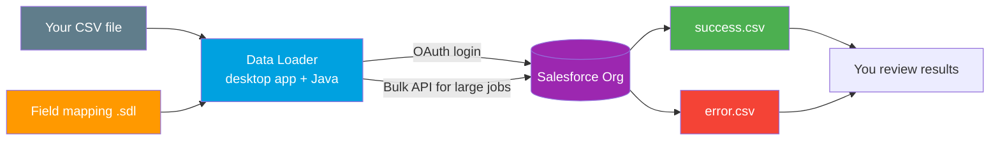

# 04 - Data Loader

> **One-liner**: The official **desktop app** for bulk import and export of Salesforce data via CSV, with a wizard GUI and an optional headless mode.
> **Use when**: Admins or engineers need to load, update, or export **large CSV volumes** (up to 150M records), or schedule recurring loads.
> **Note**: Runs on **Bulk API** under the hood for big jobs. Current guide is **v67.0 (Summer '26)**; examples pin API paths to **v66.0** to match this vault. Requires **Java 17+**.

This is Module 10, the toolbox. [Workbench](02-workbench.md) handles small browser loads and the [Salesforce CLI](03-salesforce-cli.md) handles scripted ones. Data Loader is the heavyweight for **big CSVs and admins**.

---

## 1. The idea in plain English

Data Loader is a **forklift for spreadsheets**. You have a big CSV of records and need to push them into Salesforce, or pull a big set out. The app gives you a **step-by-step wizard**: pick the operation, log in, choose the object, **map your columns to fields**, and run. When it finishes, it hands you **two files**: a `success.csv` and an `error.csv`, so you know exactly what loaded and what failed.

It is a **desktop app** (Windows and macOS), not a website, because it is built to chew through volume reliably. For one-off small fixes you would reach for [Workbench](02-workbench.md); for millions of rows or a nightly scheduled load, Data Loader is the tool.

---

## 2. When to use it (and when not)

| Use it when | Use something else when |
|---|---|
| Loading or exporting large CSVs (tens of thousands to 150M rows). | A quick browser query or tiny load to [Workbench](02-workbench.md). |
| An admin wants a GUI wizard, no code. | A developer scripting data in CI to [Salesforce CLI](03-salesforce-cli.md). |
| Upsert against an external ID key. | A single manual API call to [Postman](01-postman.md). |
| Scheduled/recurring loads via headless command-line mode. | Real-time, record-by-record sync to Apex / middleware. |
| You need a clean success/error CSV audit trail. | Live two-way integration to a platform event or API. |

---

## 3. How it works



You log in via OAuth, choose an operation (insert, update, upsert, delete, hard delete, or export), map CSV columns to fields, and run. For large volumes Data Loader switches to **Bulk API**, which processes records asynchronously in batches. Results come back as **success** and **error** CSVs.

---

## 4. Setup and usage

**Install**: Download from **Setup > Data Loader** in your org, or from the Salesforce Data Loader GitHub releases. It needs **Java Runtime 17 or later**. Supported on Windows 10/11 and recent macOS (Ventura, Sonoma, Sequoia).

**GUI wizard steps (Insert example)**

1. Open Data Loader and click **Insert**.
2. **Log in** via OAuth and confirm the environment.
3. Choose the **object** (e.g. `Account`) and select your **CSV**.
4. **Map** CSV columns to Salesforce fields (save the mapping as an `.sdl` file to reuse).
5. Choose where to write the **success** and **error** CSVs.
6. Click **Finish**. Watch the progress, then review the result files.

**Operations available**: Insert, Update, **Upsert** (match on an external ID), Delete, Hard Delete, and **Export** / Export All (includes archived/soft-deleted).

**Settings worth knowing** (Settings menu):

| Setting | What it controls |
|---|---|
| **Use Bulk API** | Switches large jobs to async Bulk API. Default batch size becomes 2000 (vs 200 on the SOAP-based default). |
| **Enable serial mode for Bulk API** | Processes batches one at a time to avoid lock contention. |
| **Batch size** | Rows per batch. Smaller batches reduce row-lock errors. |

**Headless / command-line (batch) mode** for scheduled loads:

1. **Create an encryption key**, then **encrypt your password** with the bundled `encrypt` utility so no plaintext password sits in a file.
2. Write a **`process-conf.xml`** describing the job: a `<bean>` per process with `sfdc.endpoint`, `sfdc.username`, the **encrypted** `sfdc.password`, the operation, the CSV path, and the field-mapping file.
3. Run the process and schedule it (Windows Task Scheduler or cron):

```bash
# Windows (officially supported for batch mode)
process.bat "C:\dl\conf" myUpsertProcess

# encrypt a password for the config (run once)
encrypt.bat -e "MyPasswordAndToken" "C:\dl\key.txt"
```

> **Heads up**: Salesforce officially supports **command-line batch mode on Windows**. The same Java entry point exists on macOS/Linux, but it is not officially supported there. For cross-platform automation, prefer the [Salesforce CLI](03-salesforce-cli.md).

---

## 5. Gotchas

| Gotcha | Fix |
|---|---|
| Wrong Java version. | Install **JRE 17+**. Older Java will not launch the current Data Loader. |
| Row-lock errors on big loads (`UNABLE_TO_LOCK_ROW`). | Turn on **serial mode**, reduce batch size, or sort the CSV by parent ID. |
| Plaintext password in `process-conf.xml`. | Always use the **encrypt** utility and reference the encrypted value plus key file. |
| Upsert duplicates or fails. | Map the correct **external ID** field and ensure values are unique. |
| Date/number format mismatches. | Match your locale settings, or set them in Data Loader's config. Use ISO dates. |
| Expecting real-time sync. | Data Loader is batch, not live. For event-driven sync use platform events or middleware. |
| Batch-mode automation on Mac/Linux. | Not officially supported. Use the **Salesforce CLI** for cross-platform scripted loads. |

---

## 6. Interview Q&A

**Q: What is Data Loader and what API does it use?**
A: A Salesforce desktop app for bulk CSV import and export. It supports insert, update, upsert, delete, hard delete, and export, and for large volumes it uses **Bulk API** to process records asynchronously in batches. It handles up to 150M records.

**Q: GUI mode vs command-line mode?**
A: The GUI is a wizard for interactive loads. Command-line (batch) mode runs headless from a `process-conf.xml` config with an encrypted password, so you can schedule recurring loads. Batch mode is officially supported on Windows.

**Q: How do you secure credentials in automated Data Loader runs?**
A: Use the bundled **encrypt** utility to create a key and encrypt the password, then reference the encrypted value and key file in `process-conf.xml`. Never store a plaintext password.

**Q: Data Loader vs the Salesforce CLI for data loads?**
A: Data Loader is a GUI tool aimed at admins and very large or scheduled CSV jobs, with cross-platform batch support best on Windows. The CLI (`sf data import bulk`) is scriptable and cross-platform, ideal for developers and CI/CD. Both use Bulk API for volume.

**Q: A 5-million-row insert keeps hitting row-lock errors. What do you do?**
A: Enable **serial mode** so batches run one at a time, reduce the batch size, and sort the file by parent record ID to avoid concurrent locks on the same parent. Confirm Bulk API is enabled.

**Talking point to explain it to anyone**: "Data Loader is a forklift for spreadsheets. Point it at a big CSV, tell it which fields go where, and it loads everything into Salesforce, then hands you a receipt of what worked and what didn't."

---

## 7. Key terms

Bulk API, batch size, serial mode, upsert, external ID, process-conf.xml, headless/batch mode - defined in [Module 01 vocabulary](../01-Fundamentals/02-core-vocabulary.md) and the [README](README.md).

---

## Sources (Verified June 2026)

- [Data Loader Guide (v67.0, Summer '26)](https://developer.salesforce.com/docs/atlas.en-us.dataLoader.meta/dataLoader/data_loader.htm)
- [Data Loader Command Line Introduction](https://developer.salesforce.com/docs/atlas.en-us.dataLoader.meta/dataLoader/command_line_intro.htm)
- [Encrypt from the Command Line - Data Loader Guide](https://developer.salesforce.com/docs/atlas.en-us.dataLoader.meta/dataLoader/loader_encryption.htm)
- [Data Loader Process Configuration Parameters](https://developer.salesforce.com/docs/atlas.en-us.dataLoader.meta/dataLoader/loader_params.htm)
- [Considerations for Installing Data Loader (Java 17+)](https://developer.salesforce.com/docs/atlas.en-us.dataLoader.meta/dataLoader/installing_the_data_loader.htm)

---

*Next: [05-testing-helpers.md](05-testing-helpers.md) - utilities and fake services for practicing callouts.*
