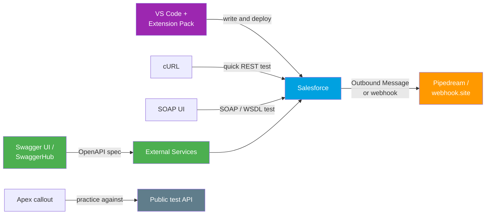

# 05 - Testing Helpers

> **One-liner**: The smaller command-line and web helpers that round out the toolbox for **quick API tests, SOAP calls, OpenAPI specs, webhook capture, and day-to-day Salesforce development**.
> **Use when**: You need a fast one-off check, a free public endpoint to call, a place to catch an Outbound Message, or a proper IDE to write Apex and LWC.

This is Module 10, the toolbox. The heavyweights are [Postman](01-postman.md), [Workbench](02-workbench.md), the [Salesforce CLI](03-salesforce-cli.md), and [Data Loader](04-data-loader.md). This file covers the **supporting cast** you reach for around them.

---

## 1. The idea in plain English

Postman is the main workbench, but a tradesperson carries more than one tool. Sometimes you want the **fastest possible** check, so you type one line in a terminal. Sometimes the thing you are testing speaks **SOAP**, so you need a SOAP-aware client. Sometimes you are **publishing** an API contract, so you need a spec editor. Sometimes you need a **free, throwaway endpoint** to receive a webhook or to practice a callout against. And every day you need a real **code editor** to build on the platform.

Think of these as the **drawer of small tools** next to the big bench. Each does one job well. Knowing which to grab is the skill.

---

## 2. What each one is for

| Tool | What it is | Reach for it when |
|---|---|---|
| **cURL** | Command-line HTTP client, on every Mac and Linux box. | You want the fastest one-line REST test or a snippet to paste into a script or ticket. |
| **SOAP UI** | Desktop client built for **SOAP and WSDL** (also does REST). | You are testing the SOAP API, the Metadata API, or any WSDL-based service. |
| **Swagger UI / SwaggerHub** | Editor and host for **OpenAPI** specs with a try-it-out UI. | You author or browse an OpenAPI contract that will feed Salesforce **External Services**. |
| **Pipedream / webhook.site / RequestBin** | Free, instant **inbound endpoints** that log whatever hits them. | You need to **catch an Outbound Message** or webhook and inspect its payload. |
| **Public test APIs** | Ready-made fake REST APIs on the internet. | You want to practice an Apex callout without standing up your own service. |
| **VS Code + Salesforce Extension Pack** | The IDE plus the official Salesforce dev tooling. | You are writing Apex, LWC, or Aura and running deploys and debugs. |

---

## 3. How they fit around a Salesforce integration



---

## 4. Usage and setup notes

**cURL** ships with macOS and Linux, so there is nothing to install. A token call looks like this:

```
curl https://MyDomain.my.salesforce.com/services/data/v66.0/query \
  --get --data-urlencode "q=SELECT Id, Name FROM Account LIMIT 5" \
  -H "Authorization: Bearer ACCESS_TOKEN"
```

It is perfect for a quick check or for pasting a reproducible command into a bug report. For anything interactive or repeated, [Postman](01-postman.md) is friendlier.

**SOAP UI** is the go-to when the contract is a **WSDL**. Point it at the Salesforce Enterprise or Partner WSDL, or the Metadata WSDL, and it generates request stubs for every operation. Salesforce REST work has largely moved to Postman, but SOAP and Metadata API testing still benefit from a SOAP-native client.

**Swagger UI / SwaggerHub** let you write an **OpenAPI** document (formerly called Swagger) and try the operations in a browser. This pairs directly with **External Services**: Salesforce imports an OpenAPI **2.0 or 3.0** spec, generates an invocable action per operation, and you can then call that service from **Flow, Apex, and bots** with no callout code. Authoring the spec in Swagger first gives you a clean contract to register.

**Pipedream / webhook.site / RequestBin** give you a **public URL in seconds**. Paste that URL into an **Outbound Message** endpoint or a webhook config, fire the event, and the tool shows you the exact headers and body Salesforce sent. This is the fastest way to see what an Outbound Message actually looks like on the wire before you build the real receiver.

**Public test APIs** are free fake REST services for practising callouts:

- **httpbin.org** echoes your request back, so it is ideal for checking headers, methods, and auth.
- **jsonplaceholder.typicode.com** serves fake posts, users, and comments for read and write practice.
- **reqres.in** returns realistic user data and now uses a free **`x-api-key`** header on many endpoints, so register for a key if calls start returning 401.

> **Note**: these are shared public services. Several now **rate-limit** or require a key, so do not lean on them for load tests or anything production-adjacent. For repeatable testing, stand up your own mock or use a captured-endpoint tool above.

**VS Code + Salesforce Extension Pack** is the standard dev environment. The pack bundles the tools that matter:

- **Apex** language support: highlighting, IntelliSense, running tests.
- **Lightning Web Components** and **Aura** tooling.
- **Org Browser**: view and retrieve metadata from the org without editing `package.xml` by hand.
- **Apex Replay Debugger**: replays execution from an Apex **debug log**, so you step through code after the fact instead of live. It works on unmanaged code in any org.

It runs on top of the [Salesforce CLI](03-salesforce-cli.md), which does the actual authentication and deploys under the hood.

---

## 5. Gotchas

| Gotcha | Fix |
|---|---|
| cURL request needs URL-encoding for SOQL | Use `--data-urlencode` so spaces and commas are escaped. |
| SOAP UI feels heavy for a simple REST call | Use cURL or Postman. Keep SOAP UI for genuine SOAP and WSDL work. |
| Public test API returns 401 or 429 | reqres.in now wants a free `x-api-key`. Others rate-limit. Get a key or self-host a mock. |
| Webhook receiver URL went stale | webhook.site and RequestBin URLs expire. Generate a fresh one per test. |
| Outbound Message endpoint must be HTTPS | The capture URL has to be HTTPS, and Salesforce expects a specific ACK response, so a plain receiver may keep retrying. |
| Apex Replay Debugger shows nothing | You need a **debug log** at the right level first. It replays a log, it does not attach live. |
| Swagger spec rejected by External Services | Salesforce supports OpenAPI 2.0 and 3.0 only, with size and operation limits. Trim the spec to the operations you need. |

---

## 6. Interview Q&A

**Q: How do you test a Salesforce REST call from the command line?**
A: cURL. Hit `/services/data/v66.0/...` with an `Authorization: Bearer` header and `--data-urlencode` for the SOQL. It is the fastest one-liner and pastes cleanly into scripts or tickets.

**Q: You need to test a SOAP or Metadata API operation. What do you use?**
A: SOAP UI. Point it at the WSDL and it generates request stubs for every operation. REST work has mostly moved to Postman, but a SOAP-native client is still the cleanest way to drive WSDL services.

**Q: How can you see exactly what an Outbound Message sends without building a receiver?**
A: Use a free capture endpoint like Pipedream, webhook.site, or RequestBin. Drop its HTTPS URL into the Outbound Message config, fire the event, and read the captured headers and body. Note Salesforce expects an ACK or it will retry.

**Q: How do Swagger and External Services relate?**
A: You author an OpenAPI spec in Swagger or SwaggerHub, then register it in External Services. Salesforce turns each operation into an invocable action you can call from Flow, Apex, or bots, no callout code required. It supports OpenAPI 2.0 and 3.0.

**Q: What does the Salesforce Extension Pack give you in VS Code?**
A: Apex language support and test running, LWC and Aura tooling, an Org Browser to retrieve metadata, and the Apex Replay Debugger that steps through a captured debug log. It sits on top of the Salesforce CLI.

**Talking point to explain it to anyone**: "These are the small tools in the drawer next to the big workbench. cURL for a quick poke, SOAP UI for the SOAP stuff, Swagger for the contract, a throwaway URL to catch what Salesforce sends, and VS Code to actually write the code."

---

## 7. Key terms

cURL, SOAP, WSDL, OpenAPI, Swagger, External Services, webhook, Outbound Message, Apex Replay Debugger, Org Browser - defined in [Module 01 vocabulary](../01-Fundamentals/02-core-vocabulary.md) and the [README](README.md).

---

## Sources (Verified June 2026)

- [Salesforce Extensions for VS Code - Salesforce Developers](https://developer.salesforce.com/docs/platform/sfvscode-extensions/guide/vscode-overview.html)
- [Apex Replay Debugger - Salesforce Developers](https://developer.salesforce.com/docs/platform/sfvscode-extensions/guide/replay-debugger.html)
- [External Services OpenAPI 2.0 and 3.0 Support - Salesforce Help](https://help.salesforce.com/s/articleView?id=sf.external_services_intro_openapi_2_3_support.htm&type=5)
- [ReqRes API docs (x-api-key)](https://reqres.in/docs)

---

*Next: [06-middleware-and-ipaas.md](06-middleware-and-ipaas.md) - MuleSoft, API-led connectivity, and the iPaaS lineup.*
