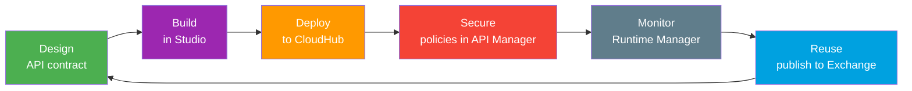
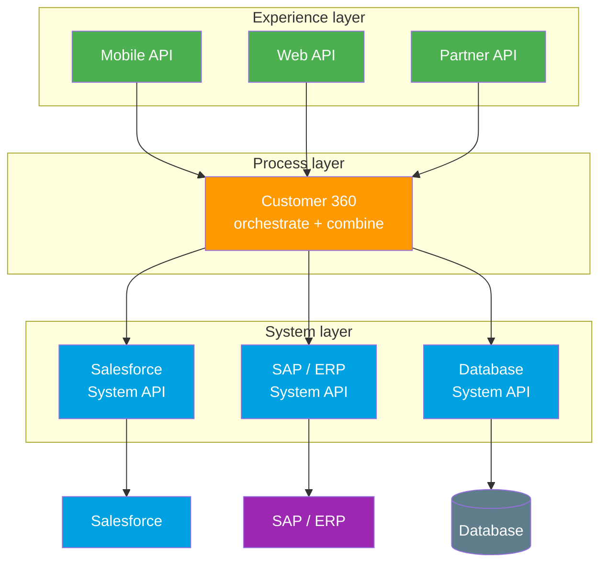

# 06 - Middleware and iPaaS

> **One-liner**: When systems multiply, you stop wiring them directly and put a **hub** in the middle. **MuleSoft Anypoint Platform** is Salesforce's own iPaaS, and **API-led connectivity** is the method it is famous for.
> **Use when**: You need to connect three or more systems, transform data between formats, orchestrate multi-step flows, or manage and reuse APIs centrally.

This is Module 10, the toolbox. For the **concept** of middleware, the switchboard analogy, and the ESB vs iPaaS history, read [01-Fundamentals/08-middleware-and-esb.md](../01-Fundamentals/08-middleware-and-esb.md) first. This file is the **practitioner's view**: the platforms, the layers, and when to pull the trigger.

---

## 1. The idea in plain English

A delivery company does not send every driver to negotiate with every supplier. It runs a **central warehouse**. Goods come in, get sorted and repackaged, and go out shaped for each customer. Nobody talks directly to everybody.

**Middleware is that warehouse for data.** An **iPaaS** (Integration Platform as a Service) is the modern, cloud-hosted version of it: you rent the warehouse instead of building one, and it comes stocked with ready-made **connectors** for common systems plus tools to **manage** the APIs you build.

**MuleSoft** is the leading iPaaS and is **owned by Salesforce** (acquired 2018), so it is the headline answer when an interviewer asks how Salesforce handles enterprise integration at scale.

---

## 2. The lineup

| Platform | Type | Best fit |
|---|---|---|
| **MuleSoft Anypoint Platform** | Full iPaaS plus API management | Enterprise scale, API-led connectivity, the Salesforce-native choice. |
| **Boomi** | Cloud iPaaS | Broad connector library, popular mid-market integration. |
| **Workato** | iPaaS with automation focus | Business-led automation and app integration, strong recipe model. |
| **Informatica** | Data integration and iPaaS | Heavy-duty ETL, data quality, and large data movement. |
| **Zapier / Make** | No-code automation | Low-volume, simple app-to-app triggers. Not for enterprise throughput. |

**Plain version**: MuleSoft, Boomi, Workato, and Informatica are the **enterprise hubs**. Zapier and Make are the **light, no-code** option for hooking up a couple of SaaS apps when volume is low.

---

## 3. MuleSoft Anypoint Platform - what to know

**Anypoint Platform** is a single place to **design, build, deploy, secure, monitor, and reuse** APIs and integrations. The pieces you should be able to name:

- **Anypoint Studio**: the IDE where you build Mule applications and flows with hundreds of pre-built connectors.
- **Anypoint Exchange**: the marketplace of reusable assets, connectors, templates, and your own published APIs.
- **CloudHub**: the fully managed, cloud-hosted runtime where Mule apps run without you provisioning servers.
- **Runtime Manager and API Manager**: deploy and operate apps, then apply security policies, throttling, and monitoring.

The lifecycle is a loop, not a line. You **design** a contract, **build** the implementation, **deploy** it to a runtime, **secure** it with policies, **monitor** it in production, and **reuse** the asset on the next project instead of rebuilding it.

---

## 4. API-led connectivity - the three-layer model

This is MuleSoft's signature methodology and a near-certain interview question. Instead of one-off point-to-point integrations, you build **reusable, purposeful APIs** in **three layers** and compose them. Data flows up from systems of record to the channel, and assets are reused rather than rebuilt.

| Layer | Job | Example |
|---|---|---|
| **System APIs** | Unlock a backend system of record. Shield it from change. | Connect to Salesforce, SAP, or a database and expose its data cleanly. |
| **Process APIs** | Combine and orchestrate data across System APIs into a business capability. | A "Customer 360" API that stitches CRM, billing, and orders together. |
| **Experience APIs** | Reshape that capability for a specific channel or device. | A trimmed, mobile-friendly payload for the iOS app versus the web. |

**The win is reuse.** Build the Salesforce **System API** once, and every Process and Experience API on top of it reuses that single connection. The next project does not re-integrate Salesforce from scratch. This modularity is exactly what point-to-point cannot give you.

---

## 5. When you need middleware

Middleware buys **decoupling and reuse** at the cost of another platform to run and pay for. Justify it with the **shape of the problem**, not because it sounds enterprise-grade. (Full point-to-point comparison lives in [01-Fundamentals/08-middleware-and-esb.md](../01-Fundamentals/08-middleware-and-esb.md).)

| Reach for middleware when... | Point-to-point is fine when... |
|---|---|
| You connect **three or more systems**, not two. | You have one or two simple links. |
| Data needs **transformation** between formats or shapes. | Both sides already speak the same format. |
| You need **orchestration** across several steps or systems. | It is a single request to a single endpoint. |
| You must **throttle or buffer** to protect a slow downstream. | Volume is low and steady. |
| You are **bridging protocols**, e.g. SOAP to REST or HTTP to a queue. | Both sides speak the same protocol. |
| You want **central logging, security, and reuse** of APIs. | The link is one-off and unlikely to grow. |

**Rule of thumb**: count the connections and ask whether you must transform or orchestrate. A single Apex callout to one REST API needs no middleware at all. Zapier or Make can handle a low-volume two-app hookup. MuleSoft earns its keep when the estate is many systems with real transformation, governance, and reuse needs.

---

## 6. Interview Q&A

**Q: What is MuleSoft and how does it relate to Salesforce?**
A: MuleSoft makes the Anypoint Platform, the leading iPaaS, and is famous for API-led connectivity. Salesforce acquired it in 2018, so it is Salesforce's enterprise integration and API management offering. You can invoke MuleSoft APIs and flows directly from Salesforce.

**Q: Explain API-led connectivity and its three layers.**
A: It is MuleSoft's method of building reusable, layered APIs instead of one-off integrations. System APIs unlock backends like Salesforce or SAP. Process APIs combine and orchestrate them into business capabilities. Experience APIs reshape that data for a specific channel. The payoff is reuse: build each System API once and compose on top of it.

**Q: Name the main Anypoint Platform components.**
A: Anypoint Studio is the IDE for building Mule apps, Exchange is the marketplace of reusable assets and connectors, CloudHub is the managed cloud runtime, and Runtime Manager plus API Manager handle deployment, security policies, throttling, and monitoring.

**Q: When would you NOT use middleware?**
A: When you have only one or two simple connections, both sides speak the same protocol and format, and there is no orchestration or throttling needed. A single Apex callout to one API does not need a hub. For a small low-volume app-to-app link, Zapier or Make is enough.

**Q: iPaaS versus a no-code tool like Zapier?**
A: An iPaaS like MuleSoft, Boomi, or Workato is built for enterprise volume, transformation, orchestration, and API governance. Zapier and Make are no-code automation for low-volume, simple SaaS-to-SaaS triggers. They solve very different scales of problem.

**Talking point to explain it to anyone**: "Instead of every system talking directly to every other, you run one central warehouse. Goods come in, get repackaged, and go out shaped for each customer. MuleSoft is that warehouse, and API-led connectivity is how you organise the shelves into three tidy layers so you build each connection once."

---

## 7. Key terms

Middleware, iPaaS, ESB, MuleSoft, Anypoint Platform, API-led connectivity, System API, Process API, Experience API, CloudHub, Anypoint Studio, Anypoint Exchange, orchestration, throttling - defined in [02-core-vocabulary.md](../01-Fundamentals/02-core-vocabulary.md) and the [README](README.md).

---

## Sources (Verified June 2026)

- [What Is API-led Connectivity? - Salesforce](https://www.salesforce.com/blog/api-led-connectivity/)
- [Enterprise Integration - Anypoint Platform - MuleSoft](https://www.mulesoft.com/platform/enterprise-integration)
- [CloudHub Overview - MuleSoft Documentation](https://docs.mulesoft.com/cloudhub/)
- [Understanding API-Led Connectivity Essentials - Trailhead](https://trailhead.salesforce.com/content/learn/modules/application-networks-and-api-led-connectivity-in-mulesoft/explore-api-led-connectivity)

---

*Next: [README.md](README.md) - back to the Module 10 toolbox index.*
