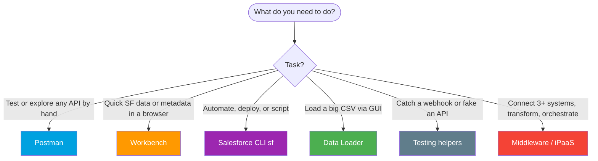
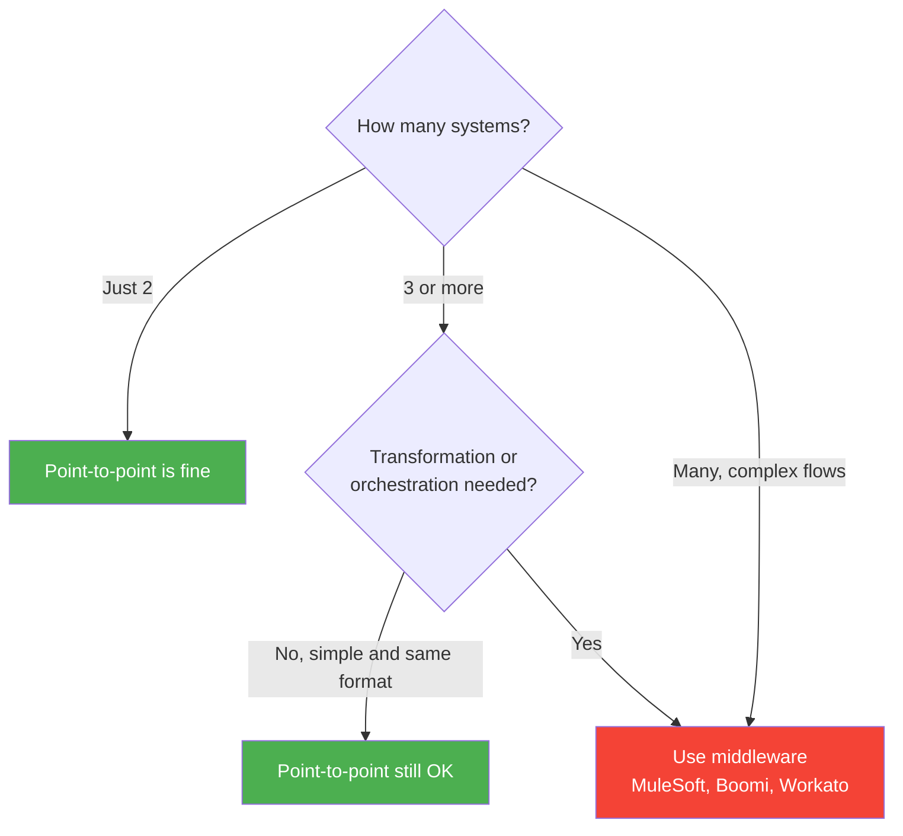

# Module 10 - Tools & Middleware

> **Goal**: Know your toolbox. Pick the right tool to test, explore, move data, and orchestrate.
> **API version**: v66.0 (Spring '26).

Two families: **testing/dev tools** (Postman, Workbench, the CLI, Data Loader, and smaller helpers) for building and debugging integrations, and **middleware/iPaaS** (MuleSoft and friends) for connecting many systems at scale.

---

## Map of this module

| # | File | What it covers |
|---|---|---|
| 01 | [postman](01-postman.md) | The universal API client + Salesforce collection |
| 02 | [workbench](02-workbench.md) | Browser-based REST/SOQL/data/metadata tool |
| 03 | [salesforce-cli](03-salesforce-cli.md) | The `sf` CLI for auth, data, deploy, scripting |
| 04 | [data-loader](04-data-loader.md) | Desktop bulk import/export (GUI + headless) |
| 05 | [testing-helpers](05-testing-helpers.md) | cURL, SOAP UI, Swagger, Pipedream, VS Code |
| 06 | [middleware-and-ipaas](06-middleware-and-ipaas.md) | MuleSoft API-led + the iPaaS landscape |

---

## Which tool? (decision tree)

---

## Tool comparison

| Tool | Type | Best for | Auth |
|---|---|---|---|
| **Postman** | API client | Testing/exploring any endpoint, OAuth flows | OAuth |
| **Workbench** | Web tool | Quick SF REST/SOQL/data/metadata ops | OAuth login |
| **Salesforce CLI (`sf`)** | CLI | Dev, CI/CD, deploys, scripted data | Web or JWT |
| **Data Loader** | Desktop app | Large CSV import/export (uses Bulk API) | OAuth / Bulk |
| **Testing helpers** | Misc | Webhooks, SOAP, OpenAPI, fake APIs | varies |
| **MuleSoft / iPaaS** | Middleware | Many systems, transformation, orchestration | platform |

---

## When do you actually need middleware?

Full reasoning in [06-middleware-and-ipaas.md](06-middleware-and-ipaas.md) and [Module 01](../01-Fundamentals/08-middleware-and-esb.md).

---

## Interview rapid-fire

**Q: Postman vs Workbench?**
→ Postman is the general API client (great for OAuth and collections). Workbench is a Salesforce-specific web tool for quick REST/SOQL/data/metadata. Salesforce now steers people to Postman.

**Q: How do you load 1M records as an admin, no code?**
→ **Data Loader** (it uses the Bulk API), or `sf data import bulk` from the CLI.

**Q: What authenticates the CLI in a CI/CD pipeline?**
→ The **JWT Bearer** flow (`sf org login jwt`), no interactive login. See [Module 03](../03-Authentication/04-jwt-bearer-flow.md).

**Q: When do you reach for MuleSoft?**
→ When you connect many systems, need data transformation/orchestration, or want reusable API-led layers, not for a single point-to-point call.

---

## Sources (Verified June 2026)

- [Salesforce CLI — Developer Tools](https://developer.salesforce.com/tools/salesforcecli)
- [Data Loader — Developer Tools](https://developer.salesforce.com/tools/data-loader)
- [Salesforce Platform APIs — Postman Collection](https://www.postman.com/salesforce-developers/salesforce-developers/collection/b32utmu/salesforce-platform-apis)
- [MuleSoft Anypoint Platform](https://www.mulesoft.com/platform/enterprise-integration)

*Each file has its own Sources section with the specific official doc.*
