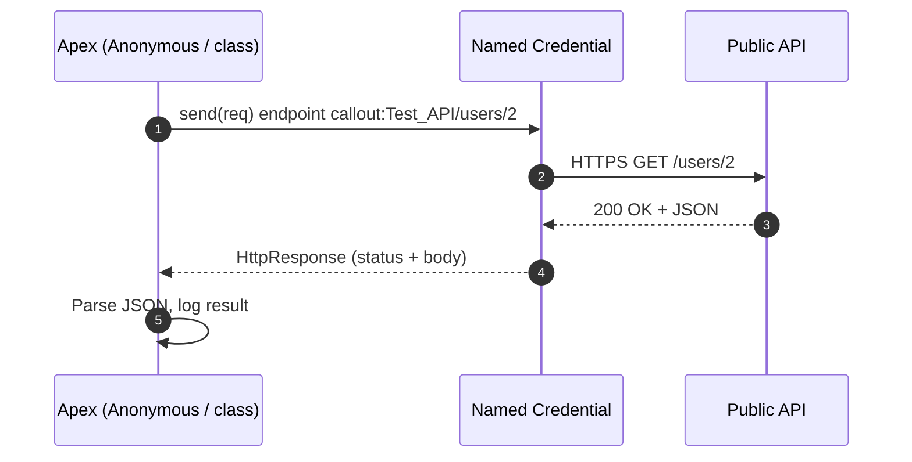

# Project 01 - Apex REST Callout to a Public API

> **Pattern**: [Request and Reply](../02-Integration-Patterns/01-request-and-reply.md) (Salesforce → External, synchronous).
> **Tools**: Apex `HttpRequest` + a **Named Credential** + a public test API.
> **You will learn**: the cleanest way to call out from Apex without hardcoding anything, and how to test it.

This is Module 11, hands-on builds. Each project follows the same shape: problem → architecture → auth → build → test → gotchas → extension. Concepts behind this one live in [Module 05](../05-Outbound-Callouts/01-http-callouts.md).

---

## 1. Business problem

Salesforce needs to fetch live data from an external web service (here, a public test API) and use the response in Apex.

---

## 2. Architecture



---

## 3. Auth setup

The test API needs no credentials, but we still route through a **Named Credential** so the URL isn't hardcoded and the pattern matches real life.

1. Setup → **Named Credentials** → **New** (External Credential + Named Credential, or a legacy Named Credential).
2. **Label/Name**: `Test_API`.
3. **URL**: `https://reqres.in` (or `https://httpbin.org`).
4. **Authentication**: choose **No Authentication** (this public API is open). For an authenticated API you'd pick an External Credential with OAuth/API Key, see [Module 03](../03-Authentication/14-named-credentials-and-external-credentials.md).
5. Save. (No **Remote Site Setting** is needed because a Named Credential registers the host. If you ever call the raw URL instead, add a Remote Site Setting.)

---

## 4. Step-by-step build

Create an Apex class that calls the API and returns the parsed body.

```apex
public with sharing class PublicApiClient {
    public static String getUser(Integer userId) {
        HttpRequest req = new HttpRequest();
        req.setEndpoint('callout:Test_API/api/users/' + userId);
        req.setMethod('GET');
        req.setHeader('Content-Type', 'application/json');
        req.setTimeout(120000);

        HttpResponse res = new Http().send(req);
        if (res.getStatusCode() == 200) {
            Map<String, Object> body =
                (Map<String, Object>) JSON.deserializeUntyped(res.getBody());
            System.debug('User payload: ' + body.get('data'));
            return res.getBody();
        }
        throw new CalloutException('Unexpected status: ' + res.getStatusCode());
    }
}
```

---

## 5. Test

Run **Anonymous Apex** (Developer Console → Debug → Open Execute Anonymous, or `sf apex run`):

```apex
System.debug(PublicApiClient.getUser(2));
```

Open the **debug log** and confirm a `200` and the JSON body. Alternatively, test the public endpoint first in [Postman](../10-Tools-Middleware/01-postman.md) to see the expected shape.

---

## 6. Common gotchas

| Gotcha | Fix |
|---|---|
| `Unauthorized endpoint` | Host not registered. Use a **Named Credential** (`callout:`) or add a Remote Site Setting. |
| `You have uncommitted work pending` | A DML ran before the callout. Call out first, or go async. See [Module 05](../05-Outbound-Callouts/05-asynchronous-callouts.md). |
| Public test API rate-limits or requires a key | Swap to `httpbin.org`, or add the key via an External Credential. |
| Timeout | Set `setTimeout`; if the API is slow, use async/Continuation. |

---

## 7. Extension challenge

- Move the call into a **Queueable** so it can run after DML from a trigger.
- Add a **`HttpCalloutMock`** test class so the callout has unit-test coverage. See [Module 05](../05-Outbound-Callouts/07-callout-limits-and-testing.md).
- Switch the Named Credential to an **API Key** External Credential against an authenticated API.

---

## Interview angle

This project proves you know the **right** way to call out: a **Named Credential** instead of a hardcoded URL/secret, status-code handling, and how callouts interact with DML and governor limits.

---

## Sources (Verified June 2026)

- [Invoking Callouts Using Apex — Apex Developer Guide](https://developer.salesforce.com/docs/atlas.en-us.apexcode.meta/apexcode/apex_callouts.htm)
- [Named Credentials as Callout Endpoints — Apex Developer Guide](https://developer.salesforce.com/docs/atlas.en-us.apexcode.meta/apexcode/apex_callouts_named_credentials.htm)

---

*Next: [02-soap-callout-wsdl2apex.md](02-soap-callout-wsdl2apex.md) - call a SOAP service from generated Apex stubs.*
