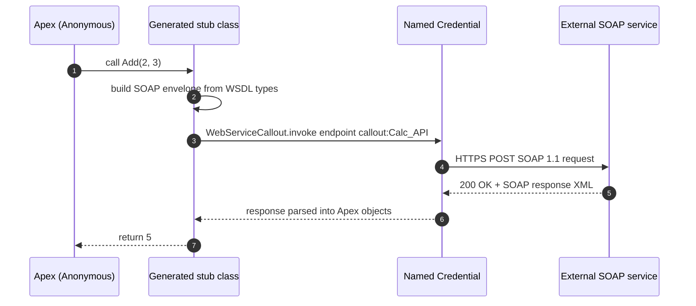

# Project 02 - SOAP Callout via WSDL2Apex

> **Pattern**: [Request and Reply](../02-Integration-Patterns/01-request-and-reply.md) (Salesforce → External, synchronous).
> **Tools**: **Generate from WSDL** (Setup → Apex Classes) + a generated stub class + a **Named Credential** + a public SOAP service.
> **You will learn**: how to turn a SOAP **WSDL** into typed Apex stubs, route the endpoint through a Named Credential, and invoke a real SOAP operation without hand-writing XML.

This is Module 11, hands-on builds. Same shape as Project 01: problem → architecture → auth → build → test → gotchas → extension. The concept behind this one lives in [Module 05](../05-Outbound-Callouts/04-soap-callouts-wsdl2apex.md).

---

## 1. Business problem

A legacy partner only exposes a **SOAP** service (here, a public calculator WSDL) and Salesforce must call one of its operations and use the result in Apex.

---

## 2. Architecture



---

## 3. Auth setup

The sample calculator is open, but we still route the SOAP endpoint through a **Named Credential** so the host is registered and the URL is not hardcoded.

1. Setup → **Named Credentials** → **New**.
2. **Label/Name**: `Calc_API`.
3. **URL**: the SOAP service base, for example `https://www.dneonprism.dev` (or any public calculator/country-info SOAP host you choose).
4. **Authentication**: **No Authentication** for an open service. For an authenticated SOAP partner, attach an External Credential, see [Module 03](../03-Authentication/14-named-credentials-and-external-credentials.md).
5. Save. A Named Credential registers the host, so no **Remote Site Setting** is needed.

---

## 4. Step-by-step build

**Step 1 - Get the WSDL.** Download the service's WSDL file to disk (for a classic calculator service the WSDL exposes operations like `Add`, `Subtract`, `Multiply`, `Divide`). Inspect it first to confirm it is **SOAP 1.1, document/literal** (see gotchas).

**Step 2 - Generate the Apex stubs.** Setup → **Apex Classes** → **Generate from WSDL** → choose the WSDL file → **Parse WSDL**. Salesforce derives an Apex **class name** from the WSDL namespace, which you can rename (for example `CalculatorService`). Click **Generate Apex code**. Salesforce creates **stub** and **type** classes that mirror the SOAP operations.

**Step 3 - Point the stub at the Named Credential.** The generated stub exposes an `endpoint_x` property. Set it to the `callout:` reference so the endpoint and any auth come from the Named Credential instead of the hardcoded URL baked into the WSDL.

```apex
public with sharing class CalculatorClient {
    public static Integer add(Integer a, Integer b) {
        // The exact class/port names come from your generated WSDL2Apex code.
        CalculatorService.CalculatorSoap stub = new CalculatorService.CalculatorSoap();
        stub.endpoint_x = 'callout:Calc_API';   // route via Named Credential, never hardcode
        stub.timeout_x = 120000;                 // optional, ms

        // The stub builds the SOAP envelope, calls WebServiceCallout.invoke, parses the reply.
        Integer result = stub.Add(a, b);
        System.debug('SOAP Add result: ' + result);
        return result;
    }
}
```

The generated method internally calls **`WebServiceCallout.invoke`**, which performs the actual callout. You never touch the XML.

---

## 5. Test

Run **Anonymous Apex** (Developer Console → Debug → Open Execute Anonymous, or `sf apex run`):

```apex
System.debug(CalculatorClient.add(2, 3));   // expect 5
```

Open the **debug log** and confirm the returned value and a successful callout. To see the raw SOAP envelope a service expects, you can also send a request in **SoapUI** (point it at the WSDL, it builds a sample request for each operation) or **Postman** (raw XML body with `Content-Type: text/xml` and the correct `SOAPAction` header).

For unit-test coverage of the stub, implement the built-in **`WebServiceMock`** interface and register it with `Test.setMock(WebServiceMock.class, new MyCalcMock())`. The mock's `doInvoke` method returns a fake response so the test does not make a live callout. See [Module 05](../05-Outbound-Callouts/07-callout-limits-and-testing.md).

---

## 6. Common gotchas

| Gotcha | Fix |
|---|---|
| Parse fails: **unsupported WSDL constructs** | Apex does not support **SOAP 1.2**, **rpc/encoded**, multiple `portType`/`binding`/`service`, or imported external schemas. Trim the WSDL to one SOAP 1.1 document/literal binding, or hand-build the envelope with `HttpRequest`. |
| Generated class exceeds size limit | If the parsed classes exceed the **1,000,000-character** Apex class limit, generation fails. Split the WSDL or remove unused operations. |
| Endpoint hardcoded from WSDL | Always set `stub.endpoint_x = 'callout:NamedCredential'` so the host is registered and secrets stay out of code. |
| Service changes its contract | The stubs are a **snapshot**. Re-download the WSDL and **regenerate**; the old stub will not pick up new operations. Re-apply your `endpoint_x` wiring after regenerating. |
| SOAP **fault** returned | The stub throws a `CalloutException` (or a generated fault type). Wrap the call in try/catch and read the fault detail. |
| Test fails with "callout not allowed" | Tests cannot make live callouts. Use **`WebServiceMock`** + `Test.setMock`. |

---

## 7. Extension challenge

- Add a **`WebServiceMock`** implementation and a test class that asserts `add(2, 3) == 5` with a mocked SOAP response.
- Wrap the stub call in a **Queueable** so it can run after DML from a trigger (SOAP callouts obey the same uncommitted-work rule as REST).
- Swap the calculator for a **country-info** WSDL and surface a country capital on a record page.

---

## Interview angle

This proves you can integrate a **legacy SOAP** partner the supported way: generate typed stubs with **WSDL2Apex**, recognize which WSDL constructs Apex rejects (**SOAP 1.2, rpc/encoded, multiple bindings, schema imports**), route the endpoint through a **Named Credential** via `endpoint_x`, and cover the callout with **`WebServiceMock`**. Bonus signal: knowing the stub is a snapshot that must be **regenerated** when the contract changes.

---

## Sources (Verified June 2026)

- [SOAP Services: Defining a Class from a WSDL Document - Apex Developer Guide](https://developer.salesforce.com/docs/atlas.en-us.apexcode.meta/apexcode/apex_callouts_wsdl2apex.htm)
- [Understanding the Generated Code - Apex Developer Guide](https://developer.salesforce.com/docs/atlas.en-us.apexcode.meta/apexcode/apex_callouts_wsdl2apex_gen_code.htm)
- [Test Web Service Callouts (WebServiceMock) - Apex Developer Guide](https://developer.salesforce.com/docs/atlas.en-us.apexcode.meta/apexcode/apex_callouts_wsdl2apex_testing.htm)

---

*Next: [03-external-creates-account-rest.md](03-external-creates-account-rest.md) - an external system creates an Account via the standard REST API.*
