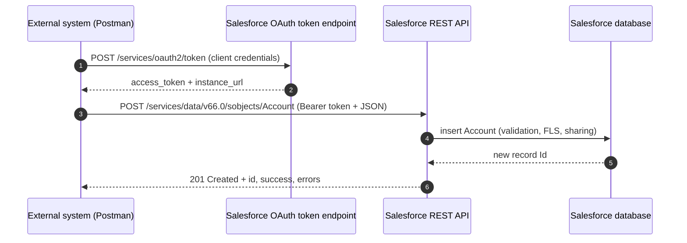

# Project 03 - External System Creates an Account via REST API

> **Pattern**: [Remote Call-In](../02-Integration-Patterns/04-remote-call-in.md) (External → Salesforce, synchronous).
> **Tools**: **Postman** + a **Connected App / External Client App** (OAuth) + the standard **REST API**.
> **You will learn**: how an outside system authenticates to Salesforce and inserts a record with a single `POST`, plus how to make the insert idempotent.

This is Module 11, hands-on builds. Same shape as Project 01: problem → architecture → auth → build → test → gotchas → extension. The concept behind this one lives in [Module 04](../04-Inbound-APIs/01-standard-rest-api.md).

---

## 1. Business problem

An external system needs to create an **Account** in Salesforce without any custom Apex, using only the platform's standard REST API.

---

## 2. Architecture



---

## 3. Auth setup

Use the **OAuth 2.0 client credentials flow** (server-to-server, no user prompt). It needs an app definition and a designated **integration ("run-as") user**.

1. Setup → **App Manager** → **New External Client App** (or **New Connected App**).
2. Enable **OAuth Settings**. Set a callback URL (any valid value, for example `https://login.salesforce.com/services/oauth2/callback`) and add the **api** scope (Manage user data via APIs).
3. Enable the **Client Credentials Flow** and select a low-privilege **integration user** to run as. This flow returns tokens on behalf of that user, so its profile/permission set governs what the API can do.
4. Save, then copy the **Consumer Key** and **Consumer Secret**.
5. In Postman, `POST` to `https://login.salesforce.com/services/oauth2/token` (use `test.salesforce.com` for a sandbox) with `x-www-form-urlencoded` body:

```
grant_type=client_credentials
client_id=<Consumer Key>
client_secret=<Consumer Secret>
```

The response gives an **`access_token`** and an **`instance_url`**. The client credentials flow does **not** issue a refresh token. Never hardcode the secret in code; in Salesforce-to-elsewhere callouts you would store it in a `callout:NamedCredential`.

---

## 4. Step-by-step build

**Step 1 - Set Postman variables.** Save `access_token` and `instance_url` from the token response (a Postman test script can capture them automatically).

**Step 2 - Build the create request.**

- **Method**: `POST`
- **URL**: `{{instance_url}}/services/data/v66.0/sobjects/Account`
- **Headers**: `Authorization: Bearer {{access_token}}` and `Content-Type: application/json`
- **Body** (raw JSON):

```json
{
  "Name": "Acme Inc",
  "Phone": "1234567890",
  "Industry": "Technology"
}
```

**Step 3 - Send.** A successful insert returns **HTTP 201 Created**:

```json
{
  "id": "001XXXXXXXXXXXXAAA",
  "success": true,
  "errors": []
}
```

**Step 4 (recommended) - Make it idempotent with upsert.** A plain `POST` creates a new Account every time it runs, so retries make duplicates. If the Account has an **External Id** field (for example `External_Account_Id__c`), switch to `PATCH` against the external-id resource:

- **Method**: `PATCH`
- **URL**: `{{instance_url}}/services/data/v66.0/sobjects/Account/External_Account_Id__c/A-1001`
- **Body**: the same JSON (omit the external-id field from the body).

Salesforce **creates** the record if the external id is new (**201**) or **updates** the existing one if it matches (**200/204**). This is the standard way to avoid duplicates on retries.

---

## 5. Test

1. In **Postman**, run the token request, then the `POST`. Confirm **201** and copy the returned `id`.
2. Verify in Salesforce: open the Account, or run a quick query in **Workbench** / Developer Console: `SELECT Id, Name, Industry FROM Account WHERE Name = 'Acme Inc'`.
3. Re-send the same `POST` and watch a **duplicate** appear, then repeat with the `PATCH` upsert and confirm only **one** record exists. That contrast is the lesson.

---

## 6. Common gotchas

| Gotcha | Fix |
|---|---|
| `400` with REQUIRED_FIELD_MISSING | Account's only system-required field is **Name**, but admins often add required fields or **validation rules**. Include every required field in the body. |
| `403` INSUFFICIENT_ACCESS / FIELD not writeable | The **integration (run-as) user** lacks object/field permission or **FLS**. Grant create on Account and edit on each field via a permission set. |
| `401` INVALID_SESSION_ID | Token missing, malformed, or expired. Re-run the token request (client credentials has **no refresh token**, just fetch a new one). |
| Duplicate Accounts on retry | A `POST` is **not** idempotent. Use `PATCH` upsert by **External Id** so retries update instead of insert. |
| Wrong API version or host | Use `/services/data/**v66.0**/...` and the **`instance_url`** from the token response, not `login.salesforce.com`. |
| Duplicate rules block insert | Org **duplicate rules** can return a DUPLICATES_DETECTED error. Adjust the rule or include the `Sforce-Duplicate-Rule-Header` to allowSave. |

---

## 7. Extension challenge

- Add a **child Contact** in a second call, then collapse both into one request in [Project 04](04-composite-account-contact.md) with the Composite API.
- Add an **External Id** field and prove idempotency by hammering the upsert in a Postman **collection runner**.
- Lock the integration user down to **least privilege** (only the objects/fields it needs) and confirm the call still succeeds.

---

## Interview angle

This shows you can stand up a **Remote Call-In** with zero custom code: pick the right **OAuth flow** (client credentials for server-to-server, with a designated **run-as user**), hit the standard **`/sobjects`** REST resource, read a **201 + id**, and know that the integration user's **profile/FLS** is the real access boundary. The senior signal is choosing **upsert by External Id** for **idempotency** so retries never create duplicates.

---

## Sources (Verified June 2026)

- [Create a Record - REST API Developer Guide](https://developer.salesforce.com/docs/atlas.en-us.api_rest.meta/api_rest/dome_sobject_create.htm)
- [Upsert Records Using sObject Rows by External ID - REST API Developer Guide](https://developer.salesforce.com/docs/atlas.en-us.api_rest.meta/api_rest/resources_sobject_upsert_patch.htm)
- [OAuth 2.0 Client Credentials Flow for Server-to-Server Integration - Salesforce Help](https://help.salesforce.com/s/articleView?id=xcloud.remoteaccess_oauth_client_credentials_flow.htm&type=5)

---

*Next: [04-composite-account-contact.md](04-composite-account-contact.md) - create an Account and a child Contact in one Composite API call.*
