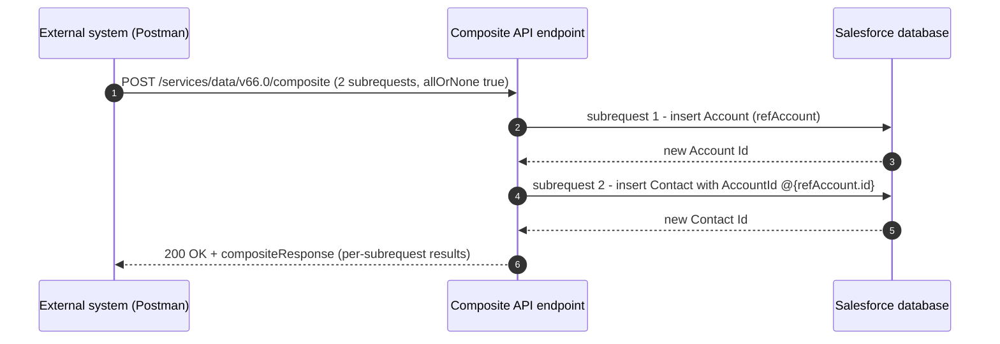

# Project 04 - Account + Contact in One Composite API Call

> **Pattern**: [Remote Call-In](../02-Integration-Patterns/04-remote-call-in.md) (External → Salesforce, synchronous).
> **Tools**: **Postman** + OAuth access token + the **Composite API**.
> **You will learn**: how to chain dependent inserts in a single round trip, reference a record created earlier in the same request, and make the whole thing transactional.

This is Module 11, hands-on builds. Same shape as Project 01: problem → architecture → auth → build → test → gotchas → extension. The concept behind this one lives in [Module 04](../04-Inbound-APIs/05-composite-api.md).

---

## 1. Business problem

An external system must create an **Account and its child Contact together**, in one network call, so they either both succeed or both roll back.

---

## 2. Architecture



---

## 3. Auth setup

Reuse the OAuth setup from [Project 03](03-external-creates-account-rest.md): a **Connected App / External Client App** with the **client credentials flow** and a designated **integration user**. In Postman, fetch the token (`POST {{login}}/services/oauth2/token`, `grant_type=client_credentials`) and store the **`access_token`** and **`instance_url`**. The secret stays out of code; for Salesforce-to-elsewhere callouts you would use a `callout:NamedCredential`.

---

## 4. Step-by-step build

**Step 1 - Build the request.**

- **Method**: `POST`
- **URL**: `{{instance_url}}/services/data/v66.0/composite`
- **Headers**: `Authorization: Bearer {{access_token}}` and `Content-Type: application/json`

**Step 2 - Body.** Each entry in `compositeRequest` has a `method`, a relative `url`, a unique `referenceId`, and a `body`. The Contact subrequest references the Account created above with the **`@{referenceId.id}`** syntax. `allOrNone: true` makes it one transaction.

```json
{
  "allOrNone": true,
  "compositeRequest": [
    {
      "method": "POST",
      "url": "/services/data/v66.0/sobjects/Account",
      "referenceId": "refAccount",
      "body": { "Name": "Acme Inc", "Industry": "Technology" }
    },
    {
      "method": "POST",
      "url": "/services/data/v66.0/sobjects/Contact",
      "referenceId": "refContact",
      "body": {
        "LastName": "Doe",
        "FirstName": "Jane",
        "AccountId": "@{refAccount.id}"
      }
    }
  ]
}
```

**Step 3 - Send.** Subrequests run **sequentially** in order, so `refAccount` exists before the Contact references it. The response wraps each subrequest's result and **HTTP status**:

```json
{
  "compositeResponse": [
    {
      "body": { "id": "001XXXXXXXXXXXXAAA", "success": true, "errors": [] },
      "httpStatusCode": 201,
      "referenceId": "refAccount"
    },
    {
      "body": { "id": "003XXXXXXXXXXXXAAA", "success": true, "errors": [] },
      "httpStatusCode": 201,
      "referenceId": "refContact"
    }
  ]
}
```

**Alternative - sObject Tree.** For purely **parent-with-children inserts** you can instead `POST` to `/services/data/v66.0/composite/tree/Account` with nested `records` and local `referenceId`s. sObject Tree is insert-only and nests children inside the parent; the general **Composite** resource is more flexible (mixed methods, cross-references between any subrequests), which is why it is the primary path here.

---

## 5. Test

1. In **Postman**, run the token request, then the composite `POST`. Expect the **top-level 200** with a `compositeResponse` array of two **201** results, each carrying an `id`.
2. Verify the link in **Workbench** or Developer Console: `SELECT Id, LastName, AccountId, Account.Name FROM Contact WHERE Account.Name = 'Acme Inc'` and confirm `AccountId` matches the Account's `id`.
3. Test rollback: set the Contact's `LastName` to an empty string (required field) and resend with `allOrNone: true`. The whole request **rolls back** and **no Account** is created. Flip `allOrNone` to `false` and observe the Account persisting while the Contact fails.

---

## 6. Common gotchas

| Gotcha | Fix |
|---|---|
| `allOrNone` misunderstood | `true` = any failure **rolls back the whole** request. `false` = independent subrequests still commit and only **dependent** ones are skipped. Choose deliberately. |
| Reference syntax wrong | It is **`@{referenceId.id}`** with the exact `referenceId` you assigned and a dotted field. A typo yields a "cannot resolve reference" error. |
| Order matters | Subrequests run **top to bottom**. The Account must come **before** the Contact that references it. |
| `referenceId` not unique | Each `referenceId` must be **unique** within the request, or references become ambiguous. |
| Too many subrequests | Limit is **25** subrequests per composite call. For more, or for multiple independent transactional groups, use **Composite Graph**. |
| Missing required fields / FLS | Each subrequest still enforces **validation rules**, required fields, and the integration user's **FLS**. A `400`/`403` on one subrequest can roll back the rest when `allOrNone` is true. |

---

## 7. Extension challenge

- Add a **third subrequest** that creates an Opportunity linked to the same Account via `@{refAccount.id}`, and confirm all three commit together.
- Switch the Account insert to an **upsert by External Id** subrequest (`PATCH .../sobjects/Account/External_Account_Id__c/A-1001`) so reruns do not duplicate the parent.
- Rebuild the same parent-children insert with **Composite Graph** and compare the response shape and limits.

---

## Interview angle

This demonstrates the senior move of collapsing **chatty, dependent calls** into **one transactional round trip**: the **`@{refId.id}`** reference passes a freshly created Id between subrequests, **`allOrNone`** controls all-or-nothing commit, and you respect the **25-subrequest** ceiling (escalating to **Composite Graph** beyond it). Knowing when **sObject Tree** suffices versus when you need full **Composite** flexibility is the differentiator.

---

## Sources (Verified June 2026)

- [Composite Request Body - REST API Developer Guide](https://developer.salesforce.com/docs/atlas.en-us.api_rest.meta/api_rest/requests_composite.htm)
- [Update an Account, Create a Contact, and Link Them - REST API Developer Guide](https://developer.salesforce.com/docs/atlas.en-us.api_rest.meta/api_rest/dome_composite_junction_object.htm)
- [Create Nested Records (sObject Tree) - REST API Developer Guide](https://developer.salesforce.com/docs/atlas.en-us.api_rest.meta/api_rest/dome_composite_sobject_tree_create.htm)

---

*Next: [05-apex-rest-custom-inbound.md](05-apex-rest-custom-inbound.md) - expose a custom inbound endpoint with Apex REST.*
