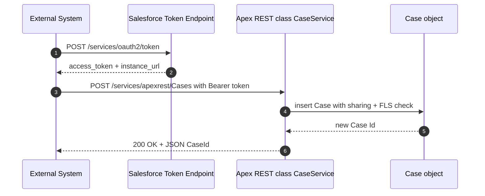

# Project 05 - Custom Apex REST Inbound Endpoint

> **Pattern**: [Remote Call-In](../02-Integration-Patterns/04-remote-call-in.md) (External → Salesforce, synchronous).
> **Tools**: Apex `@RestResource` + `RestContext` + an OAuth token + **Postman**.
> **You will learn**: how to publish your own REST endpoint under `/services/apexrest/`, secure it correctly, and call it from outside.

This is Module 11, hands-on builds. Each project follows the same shape: problem to architecture to auth to build to test to gotchas to extension. Concepts behind this one live in [Apex REST](../04-Inbound-APIs/03-apex-rest.md).

---

## 1. Business problem

An external order system needs to create and read **Cases** in Salesforce using a shape **you** define, not the generic sObject REST API. You want one clean URL, a custom request body, and a custom response, with all the validation living in Apex.

---

## 2. Architecture



---

## 3. Auth setup

Apex REST requires an authenticated session. The cleanest route for a server-to-server caller is an **OAuth 2.0** access token from a Connected App.

1. Setup to **App Manager** to **New Connected App** (or **New External Client App**). Enable **OAuth Settings**.
2. Add the OAuth scopes **Manage user data via APIs (api)** and **Perform requests at any time (refresh_token, offline_access)**.
3. Save, then copy the **Consumer Key** and **Consumer Secret**.
4. In Postman, POST to `https://MyDomain.my.salesforce.com/services/oauth2/token` with `grant_type`, `client_id`, `client_secret`, and (for a user flow) `username` + `password+securitytoken`. Read more in [Module 03](../03-Authentication/12-authorization-code-and-credentials-flow.md).
5. The response gives you `access_token` and `instance_url`. Send the token as `Authorization: Bearer <access_token>` on every call.

---

## 4. Step-by-step build

**1. Write the Apex REST class.** The class is annotated with `@RestResource` and the **urlMapping** registers the path. One method per HTTP verb. Use `RestContext` to read the request and shape the response.

```apex
@RestResource(urlMapping='/Cases/*')
global with sharing class CaseService {

    @HttpPost
    global static Map<String, Object> createCase(String subject, String description) {
        Case c = new Case(Subject = subject, Description = description, Origin = 'API');
        // Apex REST runs in system context, so enforce FLS yourself.
        SObjectAccessDecision d = Security.stripInaccessible(AccessType.CREATABLE,
            new List<Case>{ c });
        insert d.getRecords();
        Case inserted = (Case) d.getRecords()[0];
        return new Map<String, Object>{ 'caseId' => inserted.Id, 'status' => 'created' };
    }

    @HttpGet
    global static Case getCase() {
        // Read the Id from the trailing URL segment via RestContext.
        RestRequest req = RestContext.request;
        String caseId = req.requestURI.substring(req.requestURI.lastIndexOf('/') + 1);
        return [SELECT Id, CaseNumber, Subject, Status FROM Case WHERE Id = :caseId WITH USER_MODE];
    }
}
```

**2. Deploy it.** Use `sf project deploy start` or the Developer Console. The endpoint is live the moment the class saves.

**3. Call POST from Postman.** Method **POST**, URL `{{instance_url}}/services/apexrest/Cases`, header `Authorization: Bearer {{access_token}}` and `Content-Type: application/json`, body:

```json
{ "subject": "Login fails on mobile", "description": "User cannot log in from the app." }
```

**4. Call GET from Postman.** Method **GET**, URL `{{instance_url}}/services/apexrest/Cases/<caseId>`, same Bearer header. The trailing segment is parsed by `RestContext`.

---

## 5. Test

- In Postman, the POST should return `200 OK` with `{ "caseId": "500...", "status": "created" }`.
- Confirm the record in Salesforce (**Service** to **Cases**) or via the GET call.
- Write an Apex unit test that builds a `RestRequest`, assigns it to `RestContext.request`, and invokes `CaseService.createCase(...)` directly, then asserts the Case exists. Apex REST methods are plain static methods, so they unit-test like any other.

---

## 6. Common gotchas

| Gotcha | Fix |
|---|---|
| Two `@HttpPost` methods in one class | Not allowed. **One method per HTTP verb** per class. Split into separate resources. |
| Endpoint returns data the caller should not see | **Apex REST runs in system context.** Add `with sharing` and enforce FLS with `stripInaccessible` or `WITH USER_MODE`. |
| `401 Unauthorized` / `INVALID_SESSION_ID` | Missing or expired token. Re-run the OAuth token request and resend the `Bearer` header. |
| `404` on the URL | Wrong path. It is `/services/apexrest` + your `urlMapping`, case-sensitive. |
| Class will not save | Apex REST classes must be **global** (the class and the methods). |

---

## 7. Extension challenge

- Add an `@HttpPatch` method to update Case Status, and an `@HttpDelete` to close it.
- Return a custom error body with the right status by setting `RestContext.response.statusCode = 400` on bad input.
- Accept the raw JSON body via `RestContext.request.requestBody` and `JSON.deserialize` into a typed wrapper instead of named parameters.

---

## Interview angle

This proves you can build inbound APIs the **Salesforce way**: a `@RestResource` with `urlMapping`, the one-method-per-verb rule, reading requests through `RestContext`, and the security point that matters most. **Apex REST runs in system context**, so `with sharing` plus FLS enforcement is on you, not the platform.

---

## Sources (Verified June 2026)

- [RestResource Annotation - Apex Developer Guide](https://developer.salesforce.com/docs/atlas.en-us.apexcode.meta/apexcode/apex_classes_annotation_rest_resource.htm)
- [Apex REST Methods - Apex Developer Guide](https://developer.salesforce.com/docs/atlas.en-us.apexcode.meta/apexcode/apex_rest_methods.htm)
- [RestContext / RestRequest Class - Apex Reference Guide](https://developer.salesforce.com/docs/atlas.en-us.apexref.meta/apexref/apex_methods_system_restrequest.htm)

---

*Next: [06-soapui-test-apex-soap.md](06-soapui-test-apex-soap.md) - expose an Apex SOAP service and call it from SOAP UI.*
