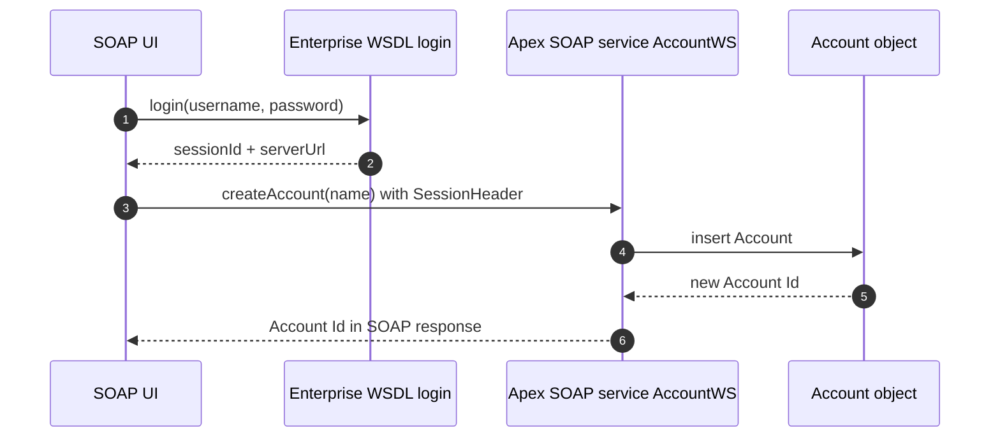

# Project 06 - Apex SOAP Web Service Tested in SOAP UI

> **Pattern**: [Remote Call-In](../02-Integration-Patterns/04-remote-call-in.md) (External to Salesforce, synchronous, SOAP).
> **Tools**: Apex `webservice` method + generated **WSDL** + **SOAP UI** + a session id.
> **You will learn**: how to expose an Apex method over SOAP, generate its contract, and exercise it from a classic SOAP client.

This is Module 11, hands-on builds. Each project follows the same shape: problem to architecture to auth to build to test to gotchas to extension. Concepts behind this one live in [Apex SOAP Web Services](../04-Inbound-APIs/04-apex-soap-web-services.md).

---

## 1. Business problem

A legacy partner integration speaks **SOAP only** and needs a strongly typed contract (a WSDL) to generate its client stubs. You must publish a Salesforce operation that creates an Account and returns its Id, then prove it works from **SOAP UI** before handing the WSDL to the partner.

---

## 2. Architecture



---

## 3. Auth setup

A SOAP call into Salesforce needs a **session id**. You get one by calling `login()` from the **Enterprise WSDL** (or Partner WSDL), then pass that id on the custom call.

1. Setup to **API** to **Generate Enterprise WSDL**, then **Generate** and save the file.
2. In SOAP UI, **File** to **New SOAP Project**, point it at the Enterprise WSDL.
3. Run the **login** operation with your username and `password + security token`. Copy the returned **sessionId** and **serverUrl** from the response.
4. The same session id authenticates the custom Apex service call. (You can also use an OAuth `access_token` as the session id.)

---

## 4. Step-by-step build

**1. Write the Apex SOAP class.** The class must be **global**, and each exposed method uses the **`webservice static`** keywords.

```apex
global with sharing class AccountWS {

    webservice static Id createAccount(String name) {
        Account a = new Account(Name = name);
        insert a;
        return a.Id;
    }

    webservice static Account getAccount(Id accountId) {
        return [SELECT Id, Name, AccountNumber FROM Account WHERE Id = :accountId];
    }
}
```

**2. Deploy** with `sf project deploy start` or the Developer Console.

**3. Generate the class WSDL.** Setup to **Apex Classes**, click **AccountWS**, then **Generate WSDL**. Save it (for example `AccountWS.wsdl`). This WSDL describes only your custom operations and points at `/services/Soap/class/AccountWS`.

**4. Import the WSDL into SOAP UI.** Right-click your existing project to **Add WSDL** and choose `AccountWS.wsdl`. SOAP UI generates a sample request for `createAccount`.

**5. Set the endpoint and session.** Make sure the request endpoint host matches the **serverUrl** instance from login. In the request XML, populate the **SessionHeader** with the session id:

```xml
<soapenv:Header>
   <urn:SessionHeader>
      <urn:sessionId>YOUR_SESSION_ID</urn:sessionId>
   </urn:SessionHeader>
</soapenv:Header>
<soapenv:Body>
   <urn:createAccount>
      <urn:name>Acme via SOAP UI</urn:name>
   </urn:createAccount>
</soapenv:Body>
```

---

## 5. Test

- Submit the `createAccount` request in SOAP UI. The response body returns the new **Account Id** inside a `<result>` element.
- Verify the record in Salesforce (**Sales** to **Accounts**), or call `getAccount` with that Id.
- A `INVALID_SESSION_ID` fault means the session id is stale, re-run **login** and paste the fresh one.

---

## 6. Common gotchas

| Gotcha | Fix |
|---|---|
| Class will not compile | Methods exposed over SOAP must use the **`webservice`** keyword, and the **class must be `global`**. |
| `webservice` on a non-static or inner detail | `webservice` methods must be **static**; they cannot be in a trigger, and the keyword has placement rules. |
| `INVALID_SESSION_ID` fault | No session, or it expired. Get a fresh **sessionId** from the Enterprise WSDL `login` call. |
| Request hits the wrong host | Use the **serverUrl** instance returned by login as the endpoint, not `login.salesforce.com`. |
| Namespace mismatch in the XML | The `urn:` prefix must match the target namespace in the generated class WSDL. Let SOAP UI build the request from the WSDL. |

---

## 7. Extension challenge

- Add a `webservice static` method that accepts a custom Apex wrapper class as a parameter and returns one, then see how it appears as a complex type in the WSDL.
- Generate the **Partner WSDL** instead and compare how it handles sObjects generically.
- Turn the SOAP UI request into an automated **TestCase** with an assertion on the returned Id, the start of a regression suite.

---

## Interview angle

This shows you can still deliver the **SOAP** half of Remote Call-In: the `global class` plus `webservice static` rules, generating a class WSDL versus using the Enterprise WSDL, and the authentication detail interviewers probe, you need a **session id** (from `login` or OAuth) carried in the **SessionHeader**.

---

## Sources (Verified June 2026)

- [Webservice Methods - Apex Developer Guide](https://developer.salesforce.com/docs/atlas.en-us.apexcode.meta/apexcode/apex_web_services_methods.htm)
- [Exposing Apex Classes as SOAP Web Services - Apex Developer Guide](https://developer.salesforce.com/docs/atlas.en-us.apexcode.meta/apexcode/apex_web_services.htm)
- [SessionHeader - SOAP API Developer Guide](https://developer.salesforce.com/docs/atlas.en-us.api.meta/api/sforce_api_header_sessionheader.htm)

---

*Next: [07-bulk-api-load-100k.md](07-bulk-api-load-100k.md) - load 100k records with Bulk API 2.0.*
