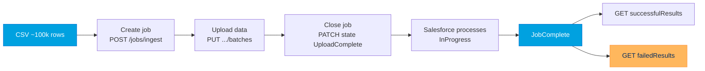

# Project 07 - Load 100k Records with Bulk API 2.0

> **Pattern**: [Batch Data Synchronization](../02-Integration-Patterns/03-batch-data-synchronization.md) (External to Salesforce, asynchronous, high volume).
> **Tools**: **Bulk API 2.0** ingest jobs via the **Salesforce CLI** or raw REST + a CSV.
> **You will learn**: the Bulk API 2.0 job lifecycle, how to load ~100,000 records two ways, and how to make it idempotent and reviewable.

This is Module 11, hands-on builds. Each project follows the same shape: problem to architecture to auth to build to test to gotchas to extension. Concepts behind this one live in [Bulk API 2.0](../07-Bulk-Async/01-bulk-api-2.md).

---

## 1. Business problem

A nightly export from an ERP produces ~100,000 Account rows that must land in Salesforce. Row-by-row REST calls would blow the API limits and take hours. **Bulk API 2.0** is built for exactly this, you hand it a CSV and it processes the rows asynchronously in optimized batches.

---

## 2. Architecture



---

## 3. Auth setup

Bulk API 2.0 is a REST resource, so it uses the same **OAuth access token** as any REST call. The CLI handles auth for you once the org is connected.

1. **CLI route**: run `sf org login web --alias myorg` once. The CLI stores and refreshes the token.
2. **Raw REST route**: get an `access_token` and `instance_url` from `POST /services/oauth2/token` (see [Module 03](../03-Authentication/12-authorization-code-and-credentials-flow.md)). Send `Authorization: Bearer <access_token>` on every Bulk call.

---

## 4. Step-by-step build

### CSV shape

A header row of API field names, then one record per line. For an **upsert**, include the External Id column.

```csv
Name,AccountNumber,Industry,ERP_Id__c
Acme Corp,A-1001,Technology,ERP-1001
Globex,A-1002,Manufacturing,ERP-1002
```

### Route 1 - Salesforce CLI (simplest)

Insert with Bulk API 2.0 and wait for completion:

```bash
sf data import bulk --file accounts.csv --sobject Account --wait 10 --target-org myorg
```

For an **idempotent upsert** keyed on an External Id field, use the upsert command:

```bash
sf data upsert bulk --file accounts.csv --sobject Account --external-id ERP_Id__c --wait 10 --target-org myorg
```

The CLI creates the job, uploads the CSV, closes it, and polls for you. Drop `--wait` to return immediately and track the job later.

### Route 2 - Raw REST (the lifecycle in full)

**1. Create the job.** `POST {{instance_url}}/services/data/v66.0/jobs/ingest`

```json
{ "object": "Account", "operation": "upsert", "externalIdFieldName": "ERP_Id__c", "contentType": "CSV", "lineEnding": "LF" }
```

The response returns a job **id** and `state: Open`.

**2. Upload the CSV.** `PUT {{instance_url}}/services/data/v66.0/jobs/ingest/<jobId>/batches` with header `Content-Type: text/csv` and the raw CSV as the body.

**3. Close the job.** `PATCH {{instance_url}}/services/data/v66.0/jobs/ingest/<jobId>`

```json
{ "state": "UploadComplete" }
```

Salesforce now moves the job through `InProgress` to `JobComplete`.

**4. Poll for status.** `GET {{instance_url}}/services/data/v66.0/jobs/ingest/<jobId>` until `state` is `JobComplete` (or `Failed`). Watch `numberRecordsProcessed` and `numberRecordsFailed`.

**5. Pull the results.** Both return CSV bodies:

- `GET .../jobs/ingest/<jobId>/successfulResults`
- `GET .../jobs/ingest/<jobId>/failedResults` returns each bad row with `sf__Id` and `sf__Error`.

---

## 5. Test and monitor

- Start with a 10-row CSV before the full 100k file.
- Watch progress live in **Setup** to **Bulk Data Load Jobs**, you see records processed, failed, and throughput per job.
- After `JobComplete`, download **failedResults** and read the `sf__Error` column to fix data issues, then reload only those rows.
- Re-run the **same upsert** file, record counts should not double, proving idempotency.

---

## 6. Common gotchas

| Gotcha | Fix |
|---|---|
| Rows silently fail or shift columns | CSV formatting. Match the **header to API field names**, quote fields with commas, and set `lineEnding` (`LF` or `CRLF`) to match the file. |
| Re-running the load creates duplicates | Use **`operation: upsert`** with **`externalIdFieldName`** so existing rows update instead of insert. |
| Job says complete but data looks wrong | Always pull **failedResults**, `sf__Error` tells you exactly which rows and why. |
| `Job size exceeds limits` | A single job allows up to **150 MB** of data, split very large files into multiple jobs. |
| Hitting the daily ceiling | Bulk API 2.0 allows up to **100 million records per rolling 24 hours**, batch your loads accordingly. |

---

## 7. Extension challenge

- Script the **full raw lifecycle** in a shell or Apex `Http` client and add exponential-backoff polling.
- Add a **hard-delete** ingest job (`operation: hardDelete`) to purge test data, note the permission it requires.
- Compare wall-clock time of the CLI insert versus upsert on the same 100k file and reason about why upsert costs more.

---

## Interview angle

This proves you reach for the **right tool at volume**: Bulk API 2.0 over row-by-row REST, and that you know the **job lifecycle** cold (create to upload to UploadComplete to poll to results). The senior signals are **upsert by External Id for idempotency**, always reviewing **failedResults**, and respecting the **150 MB per job** and **100M records / 24h** limits.

---

## Sources (Verified June 2026)

- [Bulk API 2.0 Ingest Jobs - Bulk API 2.0 and Bulk API Developer Guide](https://developer.salesforce.com/docs/atlas.en-us.api_asynch.meta/api_asynch/walkthrough_upload_ingest_records.htm)
- [Bulk API 2.0 Limits and Allocations - Developer Guide](https://developer.salesforce.com/docs/atlas.en-us.api_asynch.meta/api_asynch/asynch_api_concepts_limits.htm)
- [data Commands (sf data import bulk / upsert bulk) - Salesforce CLI Command Reference](https://developer.salesforce.com/docs/atlas.en-us.sfdx_cli_reference.meta/sfdx_cli_reference/cli_reference_data_commands_unified.htm)

---

*Next: [08-outbound-message-pipedream.md](08-outbound-message-pipedream.md) - fire a declarative Outbound Message to an external listener.*
