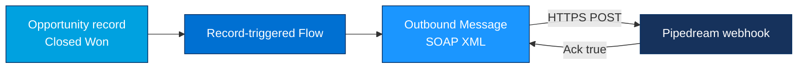

# Project 08 - Outbound Message to a Webhook (Pipedream)

> **Pattern**: [Fire and Forget](../02-Integration-Patterns/02-fire-and-forget.md) (Salesforce → External, asynchronous, no reply consumed).
> **Tools**: a record-triggered **Flow** + an **Outbound Message** (SOAP XML) + a free webhook receiver (**Pipedream** or webhook.site).
> **You will learn**: how Salesforce pushes a SOAP notification to an external endpoint with zero Apex, why it needs an acknowledgment, and why this feature is **legacy**.

This is Module 11, hands-on builds. Each project follows the same shape: problem → architecture → setup → build → test → gotchas → extension. Concepts behind this one live in [Module 06](../06-Event-Driven/05-streaming-api-and-outbound-messages.md).

---

## 1. Business problem

When an **Opportunity** is marked **Closed Won**, an external billing system needs to know immediately so it can raise an invoice. We do not need a response back into Salesforce, just a reliable push of the record data. This is the classic **fire-and-forget** shape: notify and move on.

An **Outbound Message** fits because it is declarative, it sends the field values as a **SOAP XML** notification, and the platform **retries** automatically until the receiver acknowledges.

---

## 2. Architecture



The Outbound Message delivers asynchronously in a separate queue. Salesforce expects the endpoint to reply with an acknowledgment so it knows delivery succeeded.

---

## 3. Setup

**A. Create a free webhook receiver.**

1. Go to **Pipedream** (`pipedream.com`) and create a new **Workflow** with an **HTTP / Webhook** trigger. Copy the generated URL, for example `https://eoxxxxxxxx.m.pipedream.net`. (Or use `webhook.site` and copy its unique URL.)
2. This URL must be **HTTPS** and publicly reachable. Salesforce only sends to valid SSL endpoints.

**B. No Named Credential is required.** The endpoint URL is set directly on the Outbound Message, and Salesforce signs the call with its own org certificate. The receiver can verify the sender via the `OrganizationId` in the payload.

---

## 4. Step-by-step build

**Step 1 - Create the Outbound Message.**

1. Setup → quick find **Outbound Messages** → **New Outbound Message**.
2. **Object**: `Opportunity`.
3. **Name**: `Notify_Billing_Closed_Won`.
4. **Endpoint URL**: paste the Pipedream URL.
5. **User to send as**: pick an integration user (their field-level security governs what is sent).
6. **Fields to send**: select `Id`, `Name`, `Amount`, `StageName`, `CloseDate`. `Id` and `OrganizationId` are always included.
7. (Optional) tick **Send Session ID** if the receiver will call back into Salesforce.
8. Save.

**Step 2 - Build a record-triggered Flow to fire it.**

Workflow Rules are **no longer enhanced** by Salesforce, so use **Flow** as the trigger.

1. Setup → **Flows** → **New Flow** → **Record-Triggered Flow**.
2. **Object**: `Opportunity`. **Trigger**: *A record is updated*.
3. **Entry conditions**: `StageName Equals Closed Won`. Set **Optimize for**: *Actions and Related Records*.
4. Add an **Action** element → search the action type **Outbound Message** → select `Notify_Billing_Closed_Won`.
5. Save and **Activate** the Flow.

**Step 3 - The SOAP payload that leaves the org.**

Salesforce sends a SOAP `notifications` envelope. The receiver sees something like this:

```xml
<soapenv:Envelope xmlns:soapenv="http://schemas.xmlsoap.org/soap/envelope/">
  <soapenv:Body>
    <notifications xmlns="http://soap.sforce.com/2005/09/outbound">
      <OrganizationId>00Dxx0000001gPLEAY</OrganizationId>
      <ActionId>04kxx00000000A1AAI</ActionId>
      <SessionId xsi:nil="true"/>
      <EnterpriseUrl>https://yourorg.my.salesforce.com/services/Soap/c/66.0/00Dxx</EnterpriseUrl>
      <PartnerUrl>https://yourorg.my.salesforce.com/services/Soap/u/66.0/00Dxx</PartnerUrl>
      <Notification>
        <Id>006xx000004TmiQAAS</Id>
        <sObject xsi:type="sf:Opportunity" xmlns:sf="urn:sobject.enterprise.soap.sforce.com">
          <sf:Id>006xx000004TmiQAAS</sf:Id>
          <sf:Amount>50000.0</sf:Amount>
          <sf:CloseDate>2026-06-30</sf:CloseDate>
          <sf:Name>Acme - 500 Widgets</sf:Name>
          <sf:StageName>Closed Won</sf:StageName>
        </sObject>
      </Notification>
    </notifications>
  </soapenv:Body>
</soapenv:Envelope>
```

**Step 4 - Acknowledge.** The endpoint **must** reply with a SOAP body containing `<Ack>true</Ack>`. Pipedream returns HTTP 200 by default, but for a real listener you return:

```xml
<soapenv:Envelope xmlns:soapenv="http://schemas.xmlsoap.org/soap/envelope/">
  <soapenv:Body>
    <notificationsResponse xmlns="http://soap.sforce.com/2005/09/outbound">
      <Ack>true</Ack>
    </notificationsResponse>
  </soapenv:Body>
</soapenv:Envelope>
```

---

## 5. Test

1. Open an **Opportunity** and set **Stage** to **Closed Won**, then save.
2. Switch to the **Pipedream** workflow and watch the **inspector**: a new event appears with the SOAP XML body within a few seconds.
3. Confirm the field values match the record.
4. To see retries, point the endpoint at a URL that returns a 500, change a record, then check Setup → **Outbound Messages** → **View Message Delivery Status** (the **Outbound message delivery status** page) to watch the queued/failed attempts.

---

## 6. Common gotchas

| Gotcha | Fix |
|---|---|
| Receiver gets the message but Salesforce keeps re-sending | The endpoint did not return `<Ack>true</Ack>`. Salesforce retries with **exponential back-off for up to 24 hours**. |
| Endpoint never receives anything | URL must be **HTTPS** with a valid SSL cert and publicly reachable. Check **Outbound message delivery status** for the error. |
| Tried to fire it from a Workflow Rule | **Workflow Rules are no longer enhanced**, build the trigger in **Flow** instead. |
| Field missing from payload | The **send-as user** lacks field-level read access, or the field was not selected on the Outbound Message. |
| Need loose coupling or many subscribers | Outbound Messages are **legacy** and point-to-point. Use **Platform Events** (see [Project 10](10-platform-event-lwc.md)) for the modern pub/sub approach. |

---

## 7. Extension challenge

- Replace the Outbound Message with a **Platform Event** published from the same Flow, then subscribe externally via the **Pub/Sub API**. Compare the developer experience.
- Build a tiny SOAP listener (a Pipedream code step) that parses the XML and returns a proper `<Ack>true</Ack>` envelope so retries stop cleanly.
- Add error handling: log every delivery failure from the **delivery status** page into a custom object for monitoring.

---

## Interview angle

This project shows you know the **declarative** fire-and-forget option and its trade-offs: Outbound Messages need an **acknowledgment**, **auto-retry for 24 hours**, and send **SOAP XML** point-to-point. Crucially, you can say *why you would not pick it today*, it is **legacy**, Workflow Rules are frozen, and **Platform Events** give loose coupling, multiple subscribers, and replay.

---

## Sources (Verified June 2026)

- [Outbound Messaging — Salesforce Help](https://help.salesforce.com/s/articleView?id=platform.workflow_managing_outbound_messages.htm&type=5)
- [Define Outbound Messages — Salesforce Help](https://help.salesforce.com/s/articleView?id=platform.workflow_defining_outbound_messages.htm&type=5)
- [Understanding Outbound Messaging (SOAP Notifications) — SOAP API Developer Guide](https://developer.salesforce.com/docs/atlas.en-us.api.meta/api/sforce_api_om_outboundmessaging_understanding.htm)
- [Send an Outbound Message Action — Flow Builder (Salesforce Help)](https://help.salesforce.com/s/articleView?id=platform.flow_ref_elements_actions_outboundmessage.htm&type=5)

---

*Next: [09-external-services-openapi.md](09-external-services-openapi.md) - generate invocable actions from an OpenAPI 3.0 schema and use one in a Flow.*
