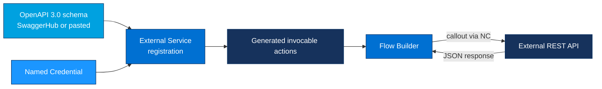

# Project 09 - External Services from an OpenAPI 3.0 Schema

> **Pattern**: [Request and Reply](../02-Integration-Patterns/01-request-and-reply.md) (Salesforce → External, synchronous) done **low-code**.
> **Tools**: an **External Service** registered from an **OpenAPI 3.0** schema + a **Named Credential** + **Flow Builder**.
> **You will learn**: how to turn a REST API into clickable **invocable actions** with no Apex, and use one inside a Flow.

This is Module 11, hands-on builds. Each project follows the same shape: problem → architecture → auth → build → test → gotchas → extension. Concepts behind this one live in [Module 05](../05-Outbound-Callouts/03-external-services.md).

---

## 1. Business problem

The team needs to call an external REST API (here, a simple number-to-words or quotes service) from automation, but the admins do not write Apex. **External Services** lets you register the API's **OpenAPI** specification once, and Salesforce auto-generates **invocable actions** you can drop straight into a **Flow**, all declaratively. Authentication and the endpoint host are handled by a **Named Credential**.

---

## 2. Architecture



The schema describes the operations, Salesforce converts each operation into an action, and the Named Credential supplies the base URL plus auth at run time.

---

## 3. Auth setup

External Services **requires a Named Credential** for the endpoint, you cannot point it at a raw URL.

1. Setup → **Named Credentials** → **New**. Create an **External Credential** first if the API needs auth (OAuth, API Key); for an open API choose **No Authentication**. See [Module 03](../03-Authentication/14-named-credentials-and-external-credentials.md).
2. **Label/Name**: `Numbers_API`.
3. **URL**: the API base host, for example `https://api.example.com`.
4. Save. The host in your OpenAPI `servers` block should match this base so paths resolve cleanly.

---

## 4. Step-by-step build

**Step 1 - Prepare an OpenAPI 3.0 schema.**

Host it on **SwaggerHub** (and copy the public URL) or paste the JSON directly during registration. A minimal **OpenAPI 3.0** spec:

```json
{
  "openapi": "3.0.0",
  "info": { "title": "Numbers API", "version": "1.0.0" },
  "servers": [{ "url": "https://api.example.com" }],
  "paths": {
    "/math/{number}": {
      "get": {
        "operationId": "getMathFact",
        "parameters": [
          {
            "name": "number",
            "in": "path",
            "required": true,
            "schema": { "type": "integer" }
          }
        ],
        "responses": {
          "200": {
            "description": "A math fact",
            "content": {
              "application/json": {
                "schema": {
                  "type": "object",
                  "properties": {
                    "text": { "type": "string" },
                    "number": { "type": "integer" },
                    "found": { "type": "boolean" }
                  }
                }
              }
            }
          }
        }
      }
    }
  }
}
```

The `operationId` (`getMathFact`) becomes the **action name**, so give every operation a clear, unique one.

**Step 2 - Register the External Service.**

1. Setup → quick find **External Services** → **New** (or **Add an External Service**).
2. Choose **From API Specification**.
3. **Service Name**: `NumbersService` (this prefixes the generated action API names).
4. **Service Schema - Named Credential**: select `Numbers_API`.
5. **Schema source**: pick **Service Schema Complete URL** and paste the SwaggerHub URL, or pick **Schema** and paste the JSON above.
6. Click **Save & Next**. Salesforce parses the spec and lists the operations it found.
7. Review the operations and parameters, then **Finish**.

**Step 3 - Confirm the generated actions.**

After registration, each operation appears as an invocable action. In **Flow Builder** you will find it under **Action** → category **External Services** → `NumbersService`, with `getMathFact` available.

**Step 4 - Use the action in a Flow.**

1. Setup → **Flows** → **New Flow** → **Screen Flow** (simplest to test) or an autolaunched flow.
2. (Screen Flow) Add a **Screen** with a **Number** input variable `inputNumber`.
3. Add an **Action** element → **External Services** → `NumbersService` → `getMathFact`.
4. Map the input **number** = `{!inputNumber}`.
5. Store the output, then add a second **Screen** that displays the returned `text` field from the action output.
6. Save and **Activate**.

---

## 5. Test

1. **Run** the Flow (Flow Builder → **Run**, or **Debug** with a sample input).
2. Enter a number, for example `42`, on the first screen.
3. The Flow calls the API through the Named Credential and the second screen shows the returned fact text.
4. If something fails, open **Setup → Debug Logs** (or the Flow **debug** panel) to see the raw request/response and confirm the callout used `callout:Numbers_API`.

---

## 6. Common gotchas

| Gotcha | Fix |
|---|---|
| Registration fails on a large spec | The schema has a **100,000 character maximum**. Trim unused paths/definitions or split the API. |
| Spec rejected as unsupported | External Services supports **OpenAPI 2.0 and 3.0**. Validate the document and confirm the `openapi`/`swagger` version field. |
| Action name or parameter missing | A derived object/property type name must be **under 255 characters** to surface in Apex or Flow, and each operation needs a unique `operationId`. |
| No Named Credential to choose | External Services **requires** a Named Credential, create one first (Section 3). |
| API changed and the action is stale | **Re-register / regenerate** the External Service from the updated schema, the actions do not auto-sync. |
| Callout blocked | The Named Credential registers the host, so no Remote Site Setting is needed, confirm the `servers` URL matches the Named Credential base. |

---

## 7. Extension challenge

- Swap the open API for an **authenticated** one and wire up an **OAuth 2.0** or **API Key** External Credential, no code changes needed in the Flow.
- Call the same generated action from **Apex** (`ExternalService.NumbersService.getMathFact(...)`) to compare low-code vs pro-code invocation.
- Add a `POST` operation with a request body to the schema, regenerate, and pass a structured Apex-defined object from the Flow.

---

## Interview angle

This proves you can deliver an integration **without Apex**: register an **OpenAPI 3.0** spec, let the platform generate **invocable actions**, and consume them in **Flow**. You can speak to the real constraints, the **100,000-character** schema limit, **OpenAPI 2.0/3.0** support, the mandatory **Named Credential**, and the need to **regenerate** when the contract changes, which is exactly what separates a low-code shortcut from a maintainable one.

---

## Sources (Verified June 2026)

- [External Services — Salesforce Help](https://help.salesforce.com/s/articleView?id=platform.external_services.htm&type=5)
- [OpenAPI 2.0 and 3.0 Support — Salesforce Help](https://help.salesforce.com/s/articleView?id=sf.external_services_intro_openapi_2_3_support.htm&type=5)
- [External Services Considerations and Limitations — Salesforce Help](https://help.salesforce.com/s/articleView?id=platform.external_services_considerations.htm&type=5)
- [Learn MOAR: OpenAPI 3.0 Support for External Services — Salesforce Developers Blog](https://developer.salesforce.com/blogs/2022/02/learn-moar-in-spring-22-with-openapi-3-0-support-for-external-services)

---

*Next: [10-platform-event-lwc.md](10-platform-event-lwc.md) - publish a Platform Event from Apex and react to it live in an LWC.*
