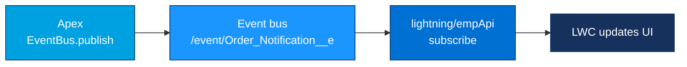

# Project 10 - Platform Event to a Live LWC

> **Pattern**: [Fire and Forget](../02-Integration-Patterns/02-fire-and-forget.md) for the publisher, [UI Update Based on Data Changes](../02-Integration-Patterns/06-ui-update-based-on-data-changes.md) for the subscriber.
> **Tools**: a **Platform Event** (`__e`) + Apex `EventBus.publish()` + an **LWC** using the **`lightning/empApi`** module.
> **You will learn**: how to fire an event from Apex and update a UI in **real time** without polling.

This is Module 11, hands-on builds. Each project follows the same shape: problem → architecture → setup → build → test → gotchas → extension. Concepts behind this one live in [Module 06](../06-Event-Driven/02-platform-events.md) and [the replay deep-dive](../06-Event-Driven/06-publishing-subscribing-and-replay.md).

---

## 1. Business problem

An agent dashboard should light up the moment a back-office process finishes, for example *"Order ORD-1001 shipped"*, without the user refreshing. Polling the database every few seconds is wasteful and laggy.

**Platform Events** decouple the producer from the consumer: Apex publishes an event, and any number of subscribers, including an **LWC** on screen, receive it over the event bus in near real time.

---

## 2. Architecture



`EventBus.publish()` writes to the bus, the channel name is `/event/<EventName>__e`, and the LWC subscribes to that channel through CometD via the `empApi` module.

---

## 3. Setup

No external system or Named Credential is needed, this is **entirely inside the platform**. You need:

1. Permission to create a **Platform Event** (Customize Application).
2. A Lightning page (App, Home, or Record page) where the LWC can be dropped.
3. **Desktop browser** for testing, `empApi` does not run in the Salesforce mobile app (see gotchas).

---

## 4. Step-by-step build

**Step 1 - Define the Platform Event.**

1. Setup → quick find **Platform Events** → **New Platform Event**.
2. **Label**: `Order Notification`. The API name becomes **`Order_Notification__e`** (the `__e` suffix marks a Platform Event).
3. **Publish Behavior**: *Publish After Commit* (fires only if the transaction commits) or *Publish Immediately* (fires regardless). Choose **Publish Immediately** so a failed DML still notifies the UI.
4. Add custom fields:
   - `Order_Number__c` (Text)
   - `Status__c` (Text)
   - `Message__c` (Text)
5. Save.

**Step 2 - Publish from Apex.**

```apex
public with sharing class OrderNotifier {
    public static void notifyShipped(String orderNumber) {
        Order_Notification__e evt = new Order_Notification__e(
            Order_Number__c = orderNumber,
            Status__c       = 'Shipped',
            Message__c      = 'Order ' + orderNumber + ' has shipped.'
        );

        Database.SaveResult sr = EventBus.publish(evt);

        if (!sr.isSuccess()) {
            for (Database.Error err : sr.getErrors()) {
                System.debug('Publish failed: ' + err.getMessage());
            }
        }
    }
}
```

`EventBus.publish()` returns a `Database.SaveResult`, always check `isSuccess()`.

**Step 3 - Build the LWC.**

`orderNotifier.html`:

```html
<template>
    <lightning-card title="Live Order Notifications" icon-name="standard:event">
        <div class="slds-p-around_medium">
            <template if:true={messages.length}>
                <ul class="slds-has-dividers_bottom">
                    <template for:each={messages} for:item="m">
                        <li key={m.id} class="slds-item">
                            <strong>{m.order}</strong> - {m.status}: {m.text}
                        </li>
                    </template>
                </ul>
            </template>
            <template if:false={messages.length}>
                <p>Waiting for events...</p>
            </template>
        </div>
    </lightning-card>
</template>
```

`orderNotifier.js`:

```javascript
import { LightningElement } from 'lwc';
import { subscribe, unsubscribe, onError, isEmpEnabled } from 'lightning/empApi';

export default class OrderNotifier extends LightningElement {
    channelName = '/event/Order_Notification__e';
    subscription = {};
    messages = [];

    async connectedCallback() {
        // empApi runs only in desktop browsers
        const enabled = await isEmpEnabled();
        if (!enabled) {
            console.warn('EMP API is not available in this environment.');
            return;
        }

        onError((error) => {
            console.error('empApi error: ', JSON.stringify(error));
        });

        // -1 = replay only new events from now on
        this.subscription = await subscribe(this.channelName, -1, (response) => {
            const payload = response.data.payload;
            this.messages = [
                {
                    id: response.data.event.replayId,
                    order: payload.Order_Number__c,
                    status: payload.Status__c,
                    text: payload.Message__c
                },
                ...this.messages
            ];
        });
    }

    disconnectedCallback() {
        if (this.subscription && this.subscription.id) {
            unsubscribe(this.subscription, () => {
                this.subscription = {};
            });
        }
    }
}
```

`orderNotifier.js-meta.xml`:

```xml
<?xml version="1.0" encoding="UTF-8"?>
<LightningComponentBundle xmlns="http://soap.sforce.com/2006/04/metadata">
    <apiVersion>66.0</apiVersion>
    <isExposed>true</isExposed>
    <targets>
        <target>lightning__AppPage</target>
        <target>lightning__HomePage</target>
        <target>lightning__RecordPage</target>
    </targets>
</LightningComponentBundle>
```

**Step 4 - Place the component.** Edit a Lightning **App** or **Home** page in the **Lightning App Builder**, drag the `orderNotifier` component onto it, then **Save** and **Activate**.

---

## 5. Test

1. Open the Lightning page with the component, it shows *"Waiting for events..."*.
2. In another tab, open **Developer Console → Debug → Open Execute Anonymous** (or `sf apex run`) and run:

```apex
OrderNotifier.notifyShipped('ORD-1001');
```

3. Within a second or two, the LWC list updates with **ORD-1001 - Shipped** with **no page refresh**.
4. Publish a few more with different order numbers and watch them stack at the top.

---

## 6. Common gotchas

| Gotcha | Fix |
|---|---|
| Component never receives events | `empApi` is supported **only in desktop browsers** with web/shared worker support, it does **not** run in the Salesforce mobile app. Test on desktop. |
| Subscribe fails silently | Check the **channel name** is exactly `/event/Order_Notification__e` (leading `/event/`, `__e` suffix). |
| Component must be a top-level window | You can use `empApi` only on the **main window**, not in a child/popup window. |
| Duplicate or missed processing | Platform Events are **at-least-once delivery**, design subscribers to be **idempotent**. |
| Events fire even on rollback | That is **Publish Immediately** by design. Use **Publish After Commit** if you only want events when the DML succeeds. |
| `isEmpEnabled` returns false in tests | It is a runtime browser check, guard your `subscribe` call behind it (as shown) and skip gracefully. |

---

## 7. Extension challenge

- Subscribe with a **replay ID** of `-2` to receive events from the last 72 hours on load, then study **replay** semantics in [the replay note](../06-Event-Driven/06-publishing-subscribing-and-replay.md).
- Publish the event from a **record-triggered Flow** instead of Apex (the *Create Records* element on a Platform Event), and confirm the same LWC reacts.
- Add an Apex **trigger on the Platform Event** (`Order_Notification__e`) that also writes an audit record server-side when each event fires.

---

## Interview angle

This is the modern, decoupled counterpart to [Project 08](08-outbound-message-pipedream.md): instead of a legacy SOAP push, you **publish to the event bus** with `EventBus.publish()` and **subscribe in the UI** with `lightning/empApi`. Be ready to name the constraints, **desktop-only** empApi, the `/event/...__e` channel, **at-least-once** delivery (so idempotent handlers), and **Publish After Commit vs Immediately**. That shows real-time UI fluency, not just CRUD.

---

## Sources (Verified June 2026)

- [Subscribe to Platform Event Notifications with the empApi Module — Platform Events Developer Guide](https://developer.salesforce.com/docs/atlas.en-us.platform_events.meta/platform_events/platform_events_subscribe_lc.htm)
- [Emp API (lightning/empApi) — Lightning Web Components Developer Guide](https://developer.salesforce.com/docs/component-library/bundle/lightning-emp-api/documentation)
- [Publish Event Messages with Apex — Platform Events Developer Guide](https://developer.salesforce.com/docs/atlas.en-us.platform_events.meta/platform_events/platform_events_publish_apex.htm)
- [Platform Event Fields and Publish Behavior — Platform Events Developer Guide](https://developer.salesforce.com/docs/atlas.en-us.platform_events.meta/platform_events/platform_events_define_ui.htm)

---

*Next: [11-cdc-pubsub-listener.md](11-cdc-pubsub-listener.md) - stream Change Data Capture events to an external Pub/Sub API listener.*
