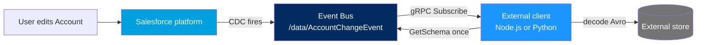

# Project 11 - Change Data Capture Listener via Pub/Sub API

> **Pattern**: [UI Update Based on Data Changes](../02-Integration-Patterns/06-ui-update-based-on-data-changes.md) / external sync (Salesforce → External, near real-time, event-driven).
> **Tools**: **Change Data Capture** + the **Pub/Sub API** (gRPC + HTTP/2 + Avro) and a small external client.
> **You will learn**: how to enable CDC for an object and have an external service subscribe, decode the Avro payload, and track its place in the stream with a **Replay ID**.

This is Module 11, hands-on builds. Each project follows the same shape: problem → architecture → auth → build → test → gotchas → extension. Concepts behind this one live in [Change Data Capture](../06-Event-Driven/03-change-data-capture.md) and [Pub/Sub API](../06-Event-Driven/04-pub-sub-api.md).

---

## 1. Business problem

An external system (a cache, a search index, a data warehouse) must stay in sync with Salesforce **Account** records in near real-time, without polling. Every time an Account is created, updated, deleted, or undeleted, Salesforce should push the change to the external service. **Change Data Capture** fires the event for free, and the **Pub/Sub API** is the modern gRPC channel an external client uses to receive it.

---

## 2. Architecture



The client opens one long-lived gRPC stream, requests a batch of events, decodes each Avro payload, persists it, then requests the next batch.

---

## 3. Auth and setup

**Enable CDC for Account:**

1. Setup → quick-find **Change Data Capture**.
2. Move **Account** from **Available Entities** to **Selected Entities**.
3. Save. Salesforce now publishes to the channel `/data/AccountChangeEvent`.

**Get an access token (the client needs one before gRPC):**

The Pub/Sub API authenticates with a standard Salesforce OAuth access token plus your org's instance URL and org ID, passed as gRPC metadata on every call. Any OAuth flow works; for a headless service the **Client Credentials flow** is the clean choice (see [Project 12](12-oauth-client-credentials.md)). You will send three headers: `accesstoken`, `instanceurl`, and `tenantid` (the org ID).

---

## 4. Step-by-step build

The Pub/Sub API endpoint is **`api.pubsub.salesforce.com:7443`** (gRPC over HTTP/2). Grab the protobuf definition (`pubsub_api.proto`) from the official repo to generate your client stubs. The flow is the same in Node.js or Python; pseudo-steps below.

**Step 1 - Authenticate and build gRPC metadata.**

```text
token, instanceUrl, orgId = oauthClientCredentials()   // see Project 12
metadata = {
  "accesstoken": token,
  "instanceurl": instanceUrl,
  "tenantid":    orgId
}
```

**Step 2 - Open a secure gRPC channel.**

```text
channel = grpc.secureChannel("api.pubsub.salesforce.com:7443", sslCredentials())
stub    = PubSubStub(channel)
```

**Step 3 - Fetch and cache the schema (call once).**

`GetSchema` returns the Avro schema as a JSON string, keyed by `schema_id`. Because the schema rarely changes, call it once and reuse it.

```text
topic     = stub.GetTopic({ topic_name: "/data/AccountChangeEvent" }, metadata)
schemaRes = stub.GetSchema({ schema_id: topic.schema_id }, metadata)
avroSchema = parse(schemaRes.schema_json)
```

**Step 4 - Subscribe with a FetchRequest and a replay preset.**

`Subscribe` is a bidirectional stream. The **first** `FetchRequest` names the topic, the **replay preset**, and `num_requested` (the flow-control batch size, max **100**). Use `LATEST` to receive only new events from now on, `EARLIEST` to read from the start of the 3-day retention window, or `CUSTOM` with a stored `replay_id` to resume exactly where you left off.

```text
firstRequest = {
  topic_name:    "/data/AccountChangeEvent",
  replay_preset: LATEST,        // or CUSTOM + replay_id to resume
  num_requested: 10
}
stream = stub.Subscribe(metadata)
stream.write(firstRequest)
```

**Step 5 - Receive, decode Avro, and re-request to keep the stream flowing.**

Each response carries a list of events. The `event.payload` is **binary Avro** decoded with the cached schema. Every CDC payload includes a `ChangeEventHeader` (entity name, change type, changed fields, record IDs). Save the `replay_id` so you can resume later. When the server has drained your requested batch, it sends an empty keep-alive whose `latest_replay_id` you store; then send another `FetchRequest` to ask for more.

```text
for response in stream:
    for event in response.events:
        record = avroDecode(event.event.payload, avroSchema)
        header = record["ChangeEventHeader"]
        persist(header.changeType, header.recordIds, record)
        save(event.replay_id)          // for CUSTOM resume
    // top up the credit so delivery continues
    stream.write({ num_requested: 10 })
```

---

## 5. Test

1. In the org, open any **Account** and change a field (for example, **Phone**), then Save.
2. Watch your client log. Within a second or two it should print the decoded event: `changeType = UPDATE`, the Account's record ID, and the changed-fields list from the `ChangeEventHeader`.
3. Create a new Account and delete one to see `CREATE` and `DELETE` change types arrive on the same stream.

No connected app on the publish side is needed; CDC publishes automatically. If nothing arrives, confirm Account is in **Selected Entities** and that your token's run-as user can see Account records.

---

## 6. Common gotchas

| Gotcha | Fix |
|---|---|
| Payload looks like garbage bytes | It is **binary Avro**, not JSON. Decode `event.payload` with the schema from `GetSchema`. |
| Schema fetched on every event | Call `GetSchema` **once** and cache it; the schema ID changes only when the object's fields change. |
| Stream goes quiet after the first batch | This is **flow control**. You must send a new `FetchRequest` with `num_requested` to request more; `num_requested` max is **100**. |
| Missed events after downtime | Events live in the bus for **72 hours (3 days)** only. Persist the `replay_id` and resubscribe with `replay_preset: CUSTOM` to backfill within that window. |
| `replay_id` reused after retention | A stored Replay ID older than 72 hours is invalid; you will get an error. Fall back to `EARLIEST` or `LATEST`. |
| Need the changed fields, not the whole record | CDC sends only changed fields plus the `ChangeEventHeader`; read `header.changedFields` to know what moved. |
| Auth errors on the gRPC call | All three metadata headers are required: `accesstoken`, `instanceurl`, `tenantid` (org ID). |

---

## 7. Extension challenge

- Persist the `replay_id` to a datastore and restart the client with `replay_preset: CUSTOM` to prove zero-gap resume.
- Subscribe to a **custom channel** that bundles multiple objects, or to a custom Platform Event, using the same code path.
- Try **Managed Event Subscriptions (Beta)**, where Salesforce tracks the Replay ID server-side so the client carries no replay state.
- Push decoded events into a real sink (a search index or a message queue) instead of logging.

---

## Interview angle

This proves you understand **event-driven sync** end-to-end: CDC publishes for free, the **Pub/Sub API** is the modern gRPC replacement for the CometD Streaming API, payloads are **Avro** (so you decode with a cached schema), and resilience comes from **Replay ID** plus the **72-hour** retention window. Bonus points for explaining **flow control** (`num_requested`) as back-pressure that stops a client being overwhelmed during a publish spike.

---

## Sources (Verified June 2026)

- [Pub/Sub API as a gRPC API — Get Started](https://developer.salesforce.com/docs/platform/pub-sub-api/guide/grpc-api.html)
- [Subscribe RPC Method — Pub/Sub API Reference](https://developer.salesforce.com/docs/platform/pub-sub-api/references/methods/subscribe-rpc.html)
- [GetSchema RPC Method — Pub/Sub API Reference](https://developer.salesforce.com/docs/platform/pub-sub-api/references/methods/getschema-rpc.html)
- [Pull Subscription and Flow Control](https://developer.salesforce.com/docs/platform/pub-sub-api/guide/flow-control.html)
- [Subscribe with Pub/Sub API — Change Data Capture Developer Guide](https://developer.salesforce.com/docs/atlas.en-us.change_data_capture.meta/change_data_capture/cdc_subscribe_pubsub_api.htm)

---

*Next: [12-oauth-client-credentials.md](12-oauth-client-credentials.md) - get a token for a backend integration with no user.*
