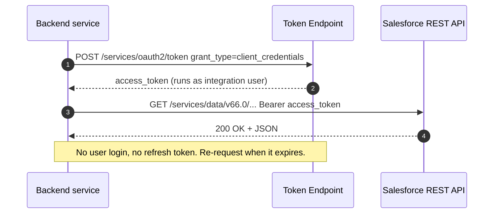

# Project 12 - OAuth 2.0 Client Credentials Flow

> **Pattern**: Server-to-server authentication (external backend → Salesforce, no user present).
> **Tools**: A **Connected App** (or External Client App) with the **Client Credentials Flow** enabled, a **run-as integration user**, and **Postman/cURL**.
> **You will learn**: how a headless backend trades only its client id and secret for an access token, with no login screen and no refresh token.

This is Module 11, hands-on builds. Each project follows the same shape: problem → architecture → auth → build → test → gotchas → extension. The concept behind this one lives in [Client Credentials Flow](../03-Authentication/05-client-credentials-flow.md).

---

## 1. Business problem

A backend service (a nightly job, a middleware connector, a microservice) needs to call the Salesforce API, but **no human is logged in**. You do not want to embed a user's password, and the retiring Username-Password flow is not an option. The **OAuth 2.0 Client Credentials flow** lets the service exchange its **consumer key + consumer secret** for an access token that always runs as one fixed **integration user**.

---

## 2. Architecture



---

## 3. Auth and setup

**Prerequisite: My Domain must be deployed.** The Client Credentials flow only works against your `https://MyDomainName.my.salesforce.com` host, never the generic login URL.

**Create and configure the Connected App:**

1. Setup → **App Manager** → **New Connected App** (choose the classic Connected App form, or use an **External Client App**).
2. Enable **OAuth Settings**. Set any **Callback URL** (it is unused here but required), and add OAuth scopes such as **Manage user data via APIs (api)**.
3. Check **Enable Client Credentials Flow** and accept the security warning. Save.
4. Reopen the app: **Manage** → **Edit Policies**. Under **Client Credentials Flow**, set **Run As** to a dedicated **integration user** (Salesforce recommends a user with **API Only** access). Save.
5. From **Manage Consumer Details**, copy the **Consumer Key** and **Consumer Secret**.

The run-as user is who the token acts as, so its profile, permission sets, and sharing decide what the integration can read and write. Apply **least privilege**.

---

## 4. Step-by-step build

**Step 1 - Request a token.** POST to your My Domain token endpoint with `grant_type=client_credentials`. You can pass the key/secret either in the body or as HTTP **Basic auth**.

cURL, credentials in the body:

```bash
curl -X POST \
  https://MyDomainName.my.salesforce.com/services/oauth2/token \
  -H "Content-Type: application/x-www-form-urlencoded" \
  -d "grant_type=client_credentials" \
  -d "client_id=YOUR_CONSUMER_KEY" \
  -d "client_secret=YOUR_CONSUMER_SECRET"
```

**Step 2 - Read the response.** You get back an `access_token` and the `instance_url`. Note there is **no `refresh_token`** in this flow.

```json
{
  "access_token": "00D...!AQ...",
  "instance_url": "https://MyDomainName.my.salesforce.com",
  "token_type": "Bearer",
  "issued_at": "...",
  "signature": "..."
}
```

**Step 3 - Call an API with the Bearer token.** Use the `instance_url` from the response as the base, and API version **v66.0**.

```bash
curl https://MyDomainName.my.salesforce.com/services/data/v66.0/query?q=SELECT+Id,Name+FROM+Account+LIMIT+5 \
  -H "Authorization: Bearer 00D...!AQ..."
```

---

## 5. Test

Do it in [Postman](../10-Tools-Middleware/01-postman.md):

1. **POST** `https://MyDomainName.my.salesforce.com/services/oauth2/token`. In **Body → x-www-form-urlencoded** add `grant_type=client_credentials`, `client_id`, `client_secret`. Send and confirm a `200` with an `access_token`.
   - Alternative: leave the body with only `grant_type`, and put the key/secret under **Authorization → Basic Auth**.
2. Copy the `access_token`. New request: **GET** `{{instance_url}}/services/data/v66.0/limits`, set **Authorization → Bearer Token**, paste it, send. A `200` with org limits confirms the token works as the integration user.
3. Save the token to a Postman variable so the query request reuses it.

---

## 6. Common gotchas

| Gotcha | Fix |
|---|---|
| `invalid_client` / flow rejected | **My Domain** is required. POST to `https://MyDomainName.my.salesforce.com`, not `login.salesforce.com`. |
| `invalid_grant` after enabling the app | You did not set a **Run As** user under Edit Policies → Client Credentials Flow. Assign the integration user. |
| Token works but API returns no data / `INSUFFICIENT_ACCESS` | The **run-as user** lacks object/field perms or a suitable license. Grant via permission sets; consider an **API Only** integration user. |
| Looking for a refresh token | There **is none** in client credentials. When the token expires, just request a new one. |
| Secret leaked | Anyone with the key + secret can mint tokens. **Rotate the consumer secret** and store it in a secret manager, never in code. |
| Over-privileged integration | Apply **least privilege** to the run-as user; do not reuse an admin. |

---

## 7. Extension challenge

- Wrap step 1 in your backend so it **caches the token** and only re-requests on a `401`/expiry, since there is no refresh token.
- Lock the run-as user down to a single object with a permission set and prove the API can only touch what that user can see.
- Move the same credentials into a Salesforce **Named Credential + External Credential** (Client Credentials type) so Apex callouts reuse them, see [Named Credentials](../03-Authentication/14-named-credentials-and-external-credentials.md).

---

## Interview angle

This proves you can authenticate a **headless server-to-server** integration the modern way: Client Credentials replaces the retiring Username-Password flow, requires **My Domain**, runs as a fixed **integration user** (so security is the user's permissions, not the app's), and issues **no refresh token** (re-request on expiry). The certificate-based alternative is the **JWT Bearer flow**, which signs the request with a private key instead of sending a secret, also issuing no refresh token, and is the better fit when you cannot safely store a shared secret.

---

## Sources (Verified June 2026)

- [OAuth 2.0 Client Credentials Flow for Server-to-Server Integration](https://help.salesforce.com/s/articleView?id=xcloud.remoteaccess_oauth_client_credentials_flow.htm&type=5)
- [Configure a Connected App for the OAuth 2.0 Client Credentials Flow](https://help.salesforce.com/s/articleView?id=xcloud.connected_app_client_credentials_setup.htm&type=5)
- [OAuth 2.0 JWT Bearer Flow for Server-to-Server Integration](https://help.salesforce.com/s/articleView?id=xcloud.remoteaccess_oauth_jwt_flow.htm&type=5)
- [Invoke REST APIs with the Salesforce Integration User and OAuth Client Credentials — Salesforce Developers Blog](https://developer.salesforce.com/blogs/2024/02/invoke-rest-apis-with-the-salesforce-integration-user-and-oauth-client-credentials)

---

*Next: [README.md](README.md) - back to the Module 11 project index.*
