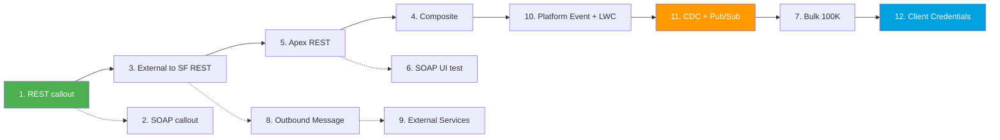

# Module 11 - Hands-On Projects

> **Goal**: Build **12 real integrations** end-to-end. Stop reading, start shipping.
> **API version**: v66.0 (Spring '26). Each project is a standalone build guide you can finish in a Developer org.

This module turns the concepts from Modules 01-09 into working builds. Every project follows the same shape: **business problem → architecture → auth → step-by-step build → test → gotchas → extension → interview angle**. Use a free [Developer Edition org](https://developer.salesforce.com/signup) and the [tools from Module 10](../10-Tools-Middleware/README.md).

---

## The 12 projects

| # | Project | Pattern | Tools |
|---|---|---|---|
| 01 | [REST callout to a public API](01-rest-callout-public-api.md) | Request-Reply | Apex + Named Credential |
| 02 | [SOAP callout via WSDL2Apex](02-soap-callout-wsdl2apex.md) | Request-Reply | WSDL2Apex |
| 03 | [External system creates an Account (REST)](03-external-creates-account-rest.md) | Remote Call-In | Postman + REST API |
| 04 | [Account + Contact in one call (Composite)](04-composite-account-contact.md) | Remote Call-In | Composite API |
| 05 | [Custom inbound Apex REST endpoint](05-apex-rest-custom-inbound.md) | Remote Call-In | `@RestResource` |
| 06 | [Test an Apex SOAP service in SOAP UI](06-soapui-test-apex-soap.md) | Remote Call-In | Apex SOAP + SOAP UI |
| 07 | [Bulk API 2.0 load of 100K records](07-bulk-api-load-100k.md) | Batch Data Sync | Bulk API + CLI/CSV |
| 08 | [Outbound Message to a webhook](08-outbound-message-pipedream.md) | Fire-and-Forget | Flow + Outbound Message |
| 09 | [External Services from an OpenAPI spec](09-external-services-openapi.md) | Request-Reply | External Services + Flow |
| 10 | [Platform Event published to an LWC](10-platform-event-lwc.md) | Fire-and-Forget | Platform Events + empApi |
| 11 | [CDC listener via Pub/Sub API](11-cdc-pubsub-listener.md) | UI Update on Change | CDC + Pub/Sub (gRPC) |
| 12 | [OAuth 2.0 Client Credentials server-to-server](12-oauth-client-credentials.md) | Auth pattern | Connected App / ECA |

---

## Suggested order

Solid line = core path. Dotted = related side quests.

---

## Coverage map (project → pattern → concept module)

| Projects | Pattern | Concept module |
|---|---|---|
| 01, 02, 09 | Request and Reply | [Module 02](../02-Integration-Patterns/01-request-and-reply.md) + [Module 05](../05-Outbound-Callouts/README.md) |
| 03, 04, 05, 06 | Remote Call-In | [Module 02](../02-Integration-Patterns/04-remote-call-in.md) + [Module 04](../04-Inbound-APIs/README.md) |
| 07 | Batch Data Sync | [Module 02](../02-Integration-Patterns/03-batch-data-synchronization.md) + [Module 07](../07-Bulk-Async/01-bulk-api-2.md) |
| 08, 10 | Fire-and-Forget | [Module 06](../06-Event-Driven/02-platform-events.md) |
| 11 | UI Update on Change | [Module 06](../06-Event-Driven/04-pub-sub-api.md) |
| 12 | Auth | [Module 03](../03-Authentication/05-client-credentials-flow.md) |

---

## Outcome

Finish these and you have hands-on proof of every major Salesforce integration pattern: inbound, outbound, bulk, events, and auth. That is a resume-ready portfolio and an interview full of concrete stories.

---

## Sources (Verified June 2026)

- [Salesforce Developer Edition signup](https://developer.salesforce.com/signup)
- [Apex Developer Guide — Integration](https://developer.salesforce.com/docs/atlas.en-us.apexcode.meta/apexcode/apex_callouts.htm)
- [REST API Developer Guide (v66.0)](https://developer.salesforce.com/docs/atlas.en-us.api_rest.meta/api_rest/intro_what_is_rest_api.htm)

*Each project has its own Sources section with the specific official docs.*
