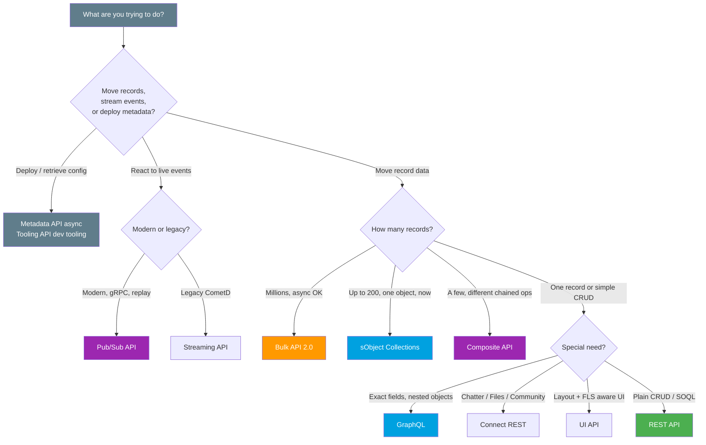

# API Picker One-Pager (Spring '26)

> Which Salesforce API for which job, by purpose, sync vs async, format, and volume. Full detail in **[../08-Modern-APIs/04-modern-api-landscape.md](../08-Modern-APIs/04-modern-api-landscape.md)**.

---

## The full comparison table

| API | Purpose | Sync / Async | Format | Volume | When to use |
|---|---|---|---|---|---|
| **REST API** | General CRUD + SOQL, the workhorse | Sync | JSON / XML | 1 record per call | Default for most app integrations |
| **SOAP API** | Legacy, strongly typed, WSDL contract | Sync | XML | 1-200 per call | Old / enterprise clients needing a WSDL |
| **Bulk API 2.0** | Mass load / extract, job-based | **Async** | CSV / JSON | **Thousands to millions** | Large data loads you can poll |
| **GraphQL** | Pick exact fields across related objects | Sync | JSON | Read-shaped, paged | Avoid over / under-fetching. Dashboards |
| **Composite** | Chain several **different** ops in one trip | Sync | JSON | Up to **25** subrequests | Dependent calls, all-or-none |
| **sObject Collections** | Same op on **many records, one object** | Sync | JSON | Up to **200** records | 50-200 records, need it now |
| **Pub/Sub API** | Publish + subscribe to events over gRPC | Async stream | Avro / gRPC | Event stream | Modern event-driven, CDC, replay |
| **Streaming API** (legacy) | CometD push (PushTopic, generic) | Async stream | JSON | Event stream | Older event subscribers. Being superseded |
| **Connect REST API** | Chatter, Experience Cloud, Files, feeds | Sync | JSON | Feature-scoped | Social, communities, files programmatically |
| **UI API** | Build Salesforce-like UIs, FLS + layout aware | Sync | JSON | UI-scoped | Custom UIs needing layout / FLS metadata |
| **Metadata API** | Deploy / retrieve **config and metadata** | **Async** | XML | Org metadata | CI/CD, deployments, org setup |
| **Tooling API** | Developer tooling, fine-grained metadata | Sync | JSON / XML | Dev artifacts | IDEs, code analysis, debug logs |

---

## What do you need? (decision flowchart)

---

## The three-scale spine (the core of every answer)

| Scale | Records | API | Why |
|---|---|---|---|
| **One** | 1 at a time | **REST API** | Simple, synchronous, one call per record |
| **Some** | up to **200**, one object, sync | **sObject Collections** | One round-trip, one API call, immediate |
| **Many** | **thousands to millions**, async | **Bulk API 2.0** | Job-based, parallelized, poll for results |

Then layer the **shape** exceptions: GraphQL for field selection, Composite for chaining different ops with all-or-none, Pub/Sub for events, Metadata / Tooling for config.

---

## Gotchas

- **Sync vs async first**. It splits the toolbox in two. Async (Bulk, Metadata, Pub/Sub) unlocks scale.
- **API limits**. Every sync call counts against the daily allocation. Batch with Collections / Composite. Offload volume to Bulk. See [../09-Security-Limits/README.md](../09-Security-Limits/README.md).
- **Events: modern over legacy**. Pick **Pub/Sub** for new event work. Streaming API (CometD) is legacy.
- **GraphQL is read-shaped**, not a bulk loader. Use it to shape reads, not mass-writes.
- **Metadata vs data**. Metadata API moves **config**, not rows. Never cross the two.
- **Pin the version**. Use **v66.0** consistently across the integration.

> Note: **Data Cloud APIs** also exist (ingest / query / profile, massive volume) but require a Data Cloud license. See [../08-Modern-APIs/03-data-cloud-apis.md](../08-Modern-APIs/03-data-cloud-apis.md).

*Source: [Which API Do I Use? — REST API Developer Guide](https://developer.salesforce.com/docs/atlas.en-us.api_rest.meta/api_rest/intro_which_api.htm). Full module: [../08-Modern-APIs/04-modern-api-landscape.md](../08-Modern-APIs/04-modern-api-landscape.md). Verified June 2026.*
